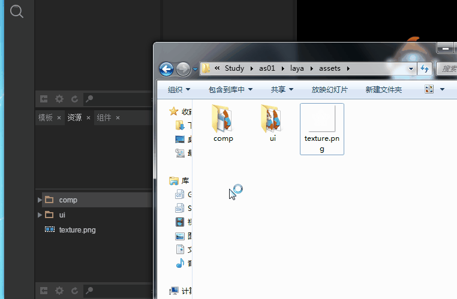

# 资源管理器介绍

リソースマネージャはプロジェクトのリソースをアクセスして管理するための作業領域です。作業を開始するには、リソースを追加する必要があります。この記事では、リソースマネージャの機能使用とリソース命名のルールを紹介します。

##1、インタフェース紹介

リソースマネージャは、プロジェクトのリソースフォルダの内容をツリー構造で示します。図1に示すように、各インターフェース要素を紹介します。

 (図1)

​`资源预览界面`:リソースリストで選択したリソースは直接`资源预览界面`表示されます。

​`资源列表`を選択します`项目根目录/laya/assets/`ディレクトリのリソースは`资源列表`に表示されます。ディレクトリまたはディレクトリのリソースを選択し、右クリックします。`打开所在目录`を選択すると、オペレーティングシステムのディレクトリが直接開きます。

​`常用功能按钮`：リソースマネージャの一番下には、一般的な機能ボタンがあります。ディレクトリのオープン、デフォルトの属性の設定、リソースリストの更新、キーワードフィルタリングなどがあります。

##2、機能紹介

###2.1所在ディレクトリを開く

リソースマネージャ内のすべてのリソースは、IDEで管理されてもよく、直接システムで管理されてもよい。したがって`选中`ディレクトリまたはリソースの場合、`右键菜单`をクリックします`打开所在目录`場所を開いているディレクトリを直接クリックします。`功能按钮`直接に開く。操作は図2に示します。

   (图2)

###2.2作成、削除、リフレッシュ

####リソースとディレクトリを作成

場所ディレクトリを開くと、リソースとディレクトリを作成することができます。例えば、必要なリソースやディレクトリを直接リソースマネージャのルートディレクトリに貼り付け（＊プロジェクトのルートディレクトリ/laya/asets/*）、F 5で更新したら、リソースはIDEで使用できます。

####削除

ディレクトリまたはリソースを削除する場合、2つの方法があります。一つ目はIDEから削除するリソースまたはディレクトリを選択し、右クリックメニューから削除オプションをクリックするか、またはDeleteキーを押して削除します。二つ目は所在ディレクトリを開いて、システムディレクトリ内で直接削除します。両者の違いはIDEで削除すれば自動的に更新され、システムディレクトリから削除するにはIDEでリフレッシュボタンまたはショートカットF 5をクリックしてリフレッシュする必要があります。

####更新

リフレッシュは、リソースマネージャの一般的な動作です。リソースマネージャの下をクリックしてください。`刷新按钮`または`快捷键F7`リソースマネージャのリソースリストを更新し、システムリストと一致させることができます。ショートカットキーF 5を押してリソースマネージャのリストを更新することもできます。

*Tips：F 5ショートカットキーは、リソースマネージャを更新するだけでなく、プロジェクトマネージャも更新します。修正されたリソースがUIプロジェクトで使用される場合、F 5ショートカットキーを押す必要があります。*

リソースとディレクトリの作成、削除、リフレッシュについては図3を参照してください。

 (図3)

###2.3フィルタ資源

リソースが多い場合、リソースはリソースマネージャ検索ボックスにテキストキーを入力してフィルタリングできます。動作は図4に示すようになっています。

  (动图4)

###2.4標準属性の設定

リソースまたはディレクトリを選択すると、デフォルトの属性を右クリックしたり、リソースマネージャの一番下の機能ボタンを直接クリックしたりできます。

 (図5)

クリック`设置默认属性`その後、弾面資源属性設定パネルを図6に示します。

 (図6)

**パネルの紹介を設定します**

`资源名称`：リソースマネージャのリソース名とパスを表示します。

`组件类型`：コンポーネントタイプのドロップダウンオプションは全部のコンポーネントタイプです。（＊全部のコンポーネントタイプはドキュメント「IDEコンポーネント詳細」＊を参照することができます。）IDEデフォルトで認識されているコンポーネントタイプを変更したいなら、他のコンポーネントタイプに指定すると、ここで設定できます。

`设置九宫`：リソースのために九宮格属性を設定します。この機能の効果は属性設定器の九宮格の設定と同じです。具体的な操作は属性設定器の九宮格の設定を参照して説明します。

`默认全局属性`：該当欄も対応です。`属性设置器`の属性設定、たとえばコンポーネントの属性widthを800に設定したいなら、この欄に「width=800」を設定すればいいです。複数の属性をあらかじめ設定する場合は、直接に改行して複数の属性値を設定すればいいです。図7に示すように

 (図7)

**Tips:`设置九宫`を選択します`默认全局属性`設定は、いずれもコンポーネント属性の予め設定されています。同じコンポーネントリソースが複数の場所で使用され、同じ属性を設定する必要がある場合、この設定は多くの重複動作を低減することができる。**

`打包类型`:`默认`プロジェクト設定（F 9）のパッケージルールが採用されます。この他に、ここの機能によって、手動でリソースに設定できます。`打包`または`不打包`。デフォルト以外のオプションを設定すると、指定されたパッケージタイプの優先度が項目設定より高いです。

`图片类型`：IDEの中で2枚の隣接している写真をつなぎ合わせて完全ですが、ブラウザの運転中にスペルギャップ（通常は黒い線）がある場合、ピクチャタイプを設定します。`Repeat`解決します。

###2.5使用資源

リソースを選択したら、図8に示すようにマウスを押しながらシーンエディタにドラッグします。

 (図8)

###2.6参照の検索とテキストの置換

####参照を検索

リソースコンポーネントを選択したら、`右键`クリック`查找引用`をクリックします。`查找`現在選択されているコンポーネントがどの項目のページで参照されているかが分かります。動作は図9に示すようになっています。

 (図9)

####テキストを置換

はい、`查找替换`パネル内をクリックします`替换`を選択します。`查找文本`の値が同じです`skin属性`内容です。図10に示すように。

  (动图10)

###2.7シーンエディタで選択したコンポーネントをキーで置き換えます。

先に選択する`场景编辑器`のセットを`右键`選択`资源管理器`内の代替リソースは、右クリックメニューの`替换选中对象`を選択します。図11に示すように、シーンエディタのコンポーネントをワンタッチで置き換えることができます。位置を調整して他のリソースだけを切り替えたい場合には、この機能がより実用的です。

   (动图11)

 *Tips：同じ種類のコンポーネントだけでなく、異なる種類のコンポーネントを一キーで置き換えることもできます。*

##3、リソース命名規則

リソースマネージャ内のリソースはシーンエディタでコンポーネントとして使用されていると認識され、コンポーネントタイプを識別するデフォルトの方法はリソースの名前付きプレフィックスである。例えばbtnuxxxという名前のものはボタンとして認識され、tabuxxxという名前のものはTabコンポーネントとして識別されます。資源名の詳細ルールを紹介します。開発者は覚えておいてください。コンポーネントについてよく知らない開発者は、まず「IDEコンポーネント詳細」ドキュメントを読んでください。

###3.1ベースコンポーネントの命名規則

LayaAirIDEベースコンポーネントのデフォルトのリソース命名規則を以下に挙げます。

|基礎コンポーネント名|コンポーネント中国語名称|リソースプレフィックス（全書き込み、大文字と小文字を区別しない）|リソースプレフィックス（略語、大文字と小文字を区別する）|
|-----------------------------------------------------------------------|
|Label𞓜テキストボックス𞓜label𞓜--|
|TextInput 124;入力ボックス|textiput𞓜input𞓜
𞓜TextAreaベルトスクロールバーのテキスト領域
124 Buttonボタン𞓜button𞓜btn𞓜
|CheckBox|多選枠check box𞓜check check|
|Radio 124;の単一選択枠124; radio𞓜--124;
124タブラベル124タブ
|Radio Group𞓜ラジオボックスボタンセット
|Vlider垂直スライダー
|HSlider|水平スライダー
|Clip|ビットマップスライス
124プログレスバープログレスバー
𞓜Cobox𞓜プルダウンコンボボックス
|VcrollBar垂直スクロールバー
|HScroll Barレベルスクロールバー
|Image𞓜ビットマップが他のコンポーネントと識別されていないのは、全部Image 124;と見なされています。

**Tips**リソースは、下線を付けずに接頭辞名の全書または略語で直接使用できます。たとえば`textinput.png`和`input.png`。ただし、他の文字をフォローする場合は下線を付ける必要があります。`inputAAA.png`入力ブロックコンポーネントとして認識されません。`input_AAA.png`入力ボックス（TextInput）コンポーネントとして識別されます。

###3.2特殊部品

IDEの特殊なコンポーネントは全部で5つあります。それぞれ垂直スライダーのセットValder、水平スライダーのコンポーネントHSlider、プログレスバーのコンポーネントProgessBar、垂直スクロールバーのコンポーネントVcrollBar、水平スクロールバーのコンポーネントHScrollBarです。

####特殊部品の構成

特殊コンポーネントは一枚の写真ではなく、複数の写真から構成されています。メインリソースのイメージの命名規則は、ベースコンポーネントの命名規則に従い、追加資源は二つの部分から構成されています。`$`記号はつながっています`$`以前はメインリソースの名前で、`$`その後は関連状態の名前です。

`bar`はい、そうです`滑动\移动`状態です。たとえば`ProgressBa$bar.png`名前から分かるように、プログレスバーに所属しており、プログレスバーが発生すると`bar`)を使用します`ProgressBa$bar.png`資源

`down`はい、そうです`向下`状態です。横スクロールバーであれば、`down`通常は`向右`のデフォルト状態またはクリック時の状態です。

`up`はい、そうです`向上`状態です。横スクロールバーであれば、`up`通常は`向左`のデフォルト状態またはクリック時の状態です。

特殊なコンポーネントの命名と構成は、より直感的に理解するためには、図12のリソース名を比較することができる。

 (図12)

**Tips**:*によって`资源管理器`の特別なコンポーネントに対する追加のリソースは単独では表示されません。リストにはメインリソースコンポーネントのみが表示されます。特殊なコンポーネントのリソースを操作するには、`打开所在目录`機能は、システムのファイルディレクトリで管理操作を行います。*

###3.3容器セット

容器のコンポーネントはBox、List、Tab、RadioGroup、View Stock、Panel、HBox、VBox、Tree、Spriteを含む。Tabを除いては、通常はリソースリストには表示されません。`场景编辑器`に変換します。`场景编辑器`内で単一または複数のコンポーネントを選択した場合、ショートカットキーで`Ctrl + B`コンテナに変換できます。コンテナの種類は図13に示すように、プルダウンリストで見られます。

 (図13)

###3.4カスタムコンポーネント識別のプレフィックス

IDEデフォルトのコンポーネントプレフィックスを使用したくない場合、どうやって修正しますか？変更`laya.editorUI.xml`ファイルに対応するコンポーネント構成であればいいです。すべてのIDEはコンポーネント関連情報を持ち込んでファイルに保存します。

`laya.editorUI.xml`位置`LayaAirIDE根目录\resources\app\out\vs\layaEditor\renders\`目次の下。

`resName`の値は、コンポーネントのプレフィックスの略語名（コンポーネントのプレフィックスの全称は変更不可）であり、変更されます。`resName`の値で結構です。たとえば私たちは`Button`コンポーネントの識別プレフィックスは、`resName="btn"`レレスName="bt"に変更します。IDEエディタを再読み込みして保存すると、btnプレフィックスで命名されたButtonリソースがImageリソースとして識別され、btプレフィックスで命名されたリソースがButtonコンポーネントとして識別されることがわかった。図14に示すように。

   (图14)

*Tips：特別な要求がない場合は、デフォルトのプレフィックスは変更しないことを推奨します。*

###3.5識別可能なリソースタイプ（リソース拡張子）

LayaAir IDEで認識される画像リソースフォーマットは、標準的なpngおよびjpgの画像フォーマットのみである。他のタイプの画像リソースや他のタイプのリソースを使用しないでください。

