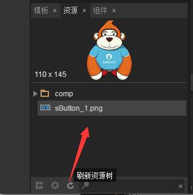
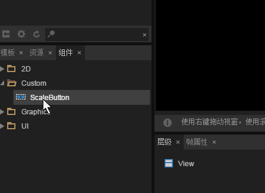
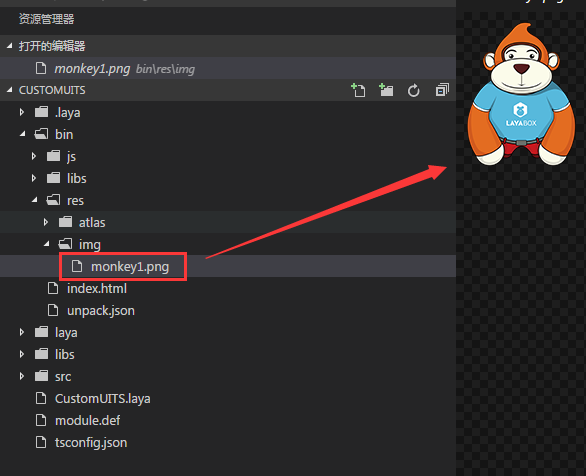

#カスタムコンポーネントの作成と使用
LayaAir IDEは、基本的な需要を満たすために複数の一般的なUIコンポーネントを提供しているが、実際の開発者は、その特殊なニーズを満たすために独自のUIコンポーネントを必要とする傾向がある。LayaAirはカスタムコンポーネントのインターフェースを提供し、開発者は必要に応じてコンポーネントを変更または追加することができ、新しいコンポーネントはLayaAirIDEによって識別、使用することができる。このページでは、ズームボタンを例にとって、どのように新しいコンポーネントを追加するかとLayaAirIDEでこのコンポーネントを使用するかを紹介します。

##1、コンポーネントの構造とルールを理解する

###1.1コンポーネントディレクトリ構造

コンポーネントディレクトリはLayaAirIDEルートディレクトリの「\resource\app\out\vs\layaEditor\renders」ディレクトリ内にあります。図1に示すように、

 <br />

（図1）

**コンポーネントディレクトリ構造紹介**:

「custom」：カスタムコンポーネントのjsとxmlファイルを保存するためのディレクトリです。

「laya.editoUID.js」：LayaAirIDEはコンポーネントの機能を持ってコードを実現します。

「laya.editoUID.xml」：LayaAirIDEのコンポーネントの構成情報。

###1.2コンポーネントのxml配置情報説明

一つの完全なコンポーネントはjsとxmlの二つの部分から構成されています。ここで、jsはコンポーネントの機能実現部分であり、xmlはIDE内のコンポーネント表示と呼び出し部分であり、コンポーネントピクチャリソース名（大文字と小文字を区別する）、属性パネルのオプションとデフォルト値などが含まれています。

laya.editoUID.xmlのTextAreaコンポーネントの例を紹介します。


```xml

<TextArea className="laya.editorUI.TextArea" inherit="TextInput" defaultValue="text='TextArea'" skinLabel="skin" resName="area" icon="TextArea" groups="公用,常用,宽高及位置,旋转及缩放" drag="3">
	<prop name="vScrollBarSkin" tips="垂直滚动条皮肤" type="string" default="" accept="res" group="常用" />
	<prop name="hScrollBarSkin" tips="水平滚动条皮肤" type="string" default="" accept="res" group="常用" />
</TextArea>
```

**コンポーネントXMLの説明**:

「TextArea」：TextAreaマークはコンポーネントの開始と終了とします。TextAreaの名前はカテゴリとは異なるが、IDEのコンポーネント名表示のための記憶を容易に理解することができる。

「className」：このコンポーネントの完全なクラスパス、例えば：laya.editoUID.TextArea；

「inheit」：相続の親類。

「defaultValue」：コンポーネント属性のデフォルト値；

「skinLabel」：プロパティパネルのskin関連設定に使用します。skyinLabelの値はpropのnameフィールド及び関連設定に対応しています。もしpropにないなら、設定は行われません。TextAreaコンポーネント内にはこの設定はありません。

「レスポンスName」：コンポーネントリソースプレフィックス（大文字と小文字を区別する）は、このプレフィックスを有するリソースのみがコンポーネントとして識別され、TextAreaの構成はTextAreaの略語モードであり、IDEのコンポーネントパネルにはTextAreaが表示される。コンポーネント名については、IDEコンポーネントベースの「コンポーネントリソース命名規則」ドキュメントを参照することができます。

「icon」：コンポーネントがIDEに表示されているアイコン名（大文字と小文字を区別する）、アイコンのディレクトリはLayaAirIDEルートディレクトリの下にあります。「reource\app\out\vs\laya Editor\laya\components」ディレクトリ内にあります。ここでは新しいiconアイコンを作成できます。複数のコンポーネントが同じアイコンを使用することもできます。TextAreaは、componentディレクトリ内のTextArea.pngに対応します。

「groups」属性パネルのグループ表示には、カンマ区切りで使用されます。

「drag」：引張りパラメータ：1：二つの点があります。hscrollコンポーネントのように横だけ引張りできます。2：二つの点があります。vscrollコンポーネントのように縦だけ引張りできます。3：8つの点があります。横方向、縦方向、拡大、縮小引張りができます。

「prop」：prop内は属性パネルにおける属性の設定であり、各propはコンポーネント属性に対応するマークを付けている。

「name」：属性の名前は、プロパティパネルに表示されます。

「tips」：マウスが属性名に表示されるtipsヒント情報。

「type」：ボックス内の属性値の種類を入力します。

「default」：この属性のデフォルト値。

「accept」：この属性は、レスポンスとfilesの2つの値を受信する。resは、プロパティバーを表しています。filesは、プロパティバーを表しています。複数のリソースにドラッグできます。

「group」：この属性があるパケット。グループ内のパケットに対応し、存在しないものは「他」パケットに帰属する。


###2、LayaAirIDEコンポーネントライブラリの導入

####2.1 LayaAirIDEコンポーネントライブラリをダウンロードする（本編はTS版）

TS版ダウンロードアドレス：[https://layabox.github.io/layaair-doc/resources/2D/Component/layaeditor.d.zip](https://layabox.github.io/layaair-doc/resources/2D/Component/layaeditor.d.zip)

####2.2プロジェクトを作成し、プロジェクトのディレクトリに導入する

まずLayaAirIDEでTSプロジェクトを作成します。ダウンロードしたzipパッケージを解凍してlayaeditor.d.tsファイルをlibsディレクトリの下に置いてください。図2に示すように、

 <br />

（図2）


###3、カスタムコンポーネントを作る

####3.1コンポーネントクラスを作成する

まず、コンポーネントディレクトリ「component」を作成し、将来の他のコンポーネントの分類を便利にし、その後、componentディレクトリの下でズームボタン類ScaleButton.tsを作成します。図3に示すように、

<br/>
（図3）

作成が完了したら、私達はスケーリングコンポーネントのコードを作成し始めました。


```typescript

import Button = laya.editorUI.Button;
//缩放时间，单位为
var scaleTime:number = 100;
module component{
    //继承editorUI.Button
    export class ScaleButton extends Button {
        constructor(skin:string=null,label:string=""){
            super(skin, label);
            /* 设置按钮为单态按钮
			** 取值：
			** 1：单态。图片不做切割，按钮的皮肤状态只有一种。
			** 2：两态。图片将以竖直方向被等比切割为2部分，从上向下，依次为弹起状态皮肤、按下和经过及选中状态皮肤。
			** 3：三态。图片将以竖直方向被等比切割为2部分，从上向下，依次为弹起状态皮肤、经过状态皮肤、按下和选中状态皮肤
			*/
            this.stateNum = 1;
            //添加鼠标按下事件侦听。按时时缩小按钮。
            this.on(Laya.Event.MOUSE_DOWN, this, this.scaleSmall);
            //添加鼠标抬起事件侦听。抬起时还原按钮。
            this.on(Laya.Event.MOUSE_UP, this, this.scaleBig);
            //添加鼠标离开事件侦听。离开时还原按钮。
            this.on(Laya.Event.MOUSE_OUT, this, this.scaleBig);
        }
        private scaleSmall():void{
            //缩小至0.8的缓动效果
            Laya.Tween.to(this, {scaleX:0.8, scaleY: 0.8}, scaleTime);
        }
        private scaleBig():void{
            //变大还原的缓动效果
            Laya.Tween.to(this, {scaleX:1, scaleY:1}, scaleTime);
        }
    }
}
```


####3.2コンポーネントのxmlプロファイルを作成する

上記のxmlの構成説明に従って、このズームボタンのxml構成を完成します。このカスタムコンポーネントは製作が完了しました。ズームボタンのxml設定情報は以下の通りです。


```xml

<?xml version="1.0" encoding="utf-8" ?>
<uiComp>
	<ScaleButton className="component.ScaleButton" runClass="component.ScaleButton"  inherit="Button" skinLabel="skin" 
	defaultValue="label=''" resName="sButton" icon="Box" groups="公用, 常用, 宽高及位置" drag="3">
		<prop name="scaleTime" tips="缩放使用的时间" type="number" default="100" group="常用" />
	</ScaleButton>
</uiComp>
```


Tips：xmlの構成情報内容説明は、上記の構成要素xmlを参照して説明した。


###4、カスタムコンポーネントの追加と使用

####4.1 IDEのカスタムコンポーネントディレクトリにコンポーネントを追加する

xmlプロファイルの作成が完了したら、直接にカスタムコンポーネントのディレクトリに保存します。コンポーネントxmlの名前はコンポーネントjsと一致しています。ここではScreButton.xmlといいます。そして、私たちは、パケットを分けて作成したScaleButton.js（「プロジェクトのルートディレクトリ/bin/js」ディレクトリの下で、図4を参照して）をカスタムコンポーネントのディレクトリにコピーします。図5に示すように、

<br/>
（図5）

####4.2 IDEコンポーネントパネルに表示する

IDEコンポーネントディレクトリ（LayaAirIDEルートディレクトリ\resource\app\apps\layaEditor\laya\baics）を開いて、カスタムコンポーネントを作成してカタログCustomを保存して、図6に示すように、自己定義のコンポーネントを保存します。

<br/>
（図6）


その後、CustomディレクトリにsButtonという名前のpngアイコン（推奨サイズは16＊16）を配置し、図7に示すように、IDEのコンポーネントパネルに自分たちが作成したズームボタンのコンポーネントを見つけることができます。


<br />

（図7）アイコンの名前は、対応するコンポーネントxmlのレスポンスName属性の値です。


<br/>
（図8）IDEのコンポーネント名に対応するコンポーネントxmlのタグ名

**Tips:**追加の注意点は、コンポーネントのアイコンは「LayaAirIDEルートディレクトリ\resource\app\out\vs\layaEditor\laya\bases\Custom」ディレクトリのs Button.pngではありません。iconアイコンはLayaAirIDEルートディレクトリの「reources\apps\apps\laya Editor\laya\icons\components」ディレクトリ内にあり、xmlのicon属性の値に対応して上記のxml説明を紹介しました。自分のアイコンを作成し、componentsディレクトリ内のiconサイズ表示を参照して作成し、componentsディレクトリ内に置いて、xmlに対応するファイル名を設定すればいいです。


####4.3 IDEリソースパネルに表示する

リソースパネルには、デフォルトでは、compファイルに通常のUIコンポーネントのskinリソースが配置されており、コンポーネント命名規則により、skinリソースをコンポーネントとして識別するのに便利である（リソースは「プロジェクトルートディレクトリ」に保存されなければコンポーネントとして認識されない）。コンポーネントパネルのコンポーネント属性skin値が空であることと違い、リソースパネルのコンポーネント属性skinのデフォルト値は「\laya\asets」ディレクトリの相対パスである。

プロジェクトを便利にするためにskinリソースを持つコンポーネントを使用して、リソースパネルにコンポーネントを表示する方法を紹介し続けます。まず、上記の例のカスタムコンポーネントはズームボタンであるので、skinリソースを用意しておきます。任意の画像をそのままコピーすると、ズームボタンコンポーネントのスケーリング効果を体験できます。画像リソースは、「プロジェクトルートディレクトリ\laya\assets」ディレクトリにコピーすればよく、図9に示すように、xmlのレスポンスNameと命名されたピクチャリソースの属性値s Buttonまたはs Buttonをプレフィックスとする。

<br/>
（図9）


リソースのコピーが完了したら、LayaAirIDEのリソース管理パネルを再度開いて、リソースツリーを更新するボタンをクリックして、先ほどコピーしたs Buttonu 1.pngを見ることができます。この写真をクリックして、画像のプレビューを見ることができます。skinのデフォルト値を持つカスタムコンポーネントがプロジェクトのリソース管理パネルに成功的に追加されたことを示します。


<br/>
（図10）

Tips：リソースパネルに表示されているコンポーネントは現在のプロジェクトのためだけに使用され、コンポーネントパネルに追加されているのがすべてのプロジェクトの共通のコンポーネントです。


####4.4カスタムコンポーネントを使用する

プロジェクト管理パネルでは、私たちがカスタマイズしたズームボタンのコンポーネントを使用したプレゼンテーションページを作成します。

#####4.4.1資源パネルから使用する

リソース管理パネルにsButtonのプレフィックスコンポーネントを見つけて、直接ページにドラッグして、クリックして拡大縮小効果を見ることができます。

<br/>
（図11）

#####4.4.2コンポーネントパネルから使用する

コンポーネントパネルにScaleButtonコンポーネントを見つけて、直接ページにドラッグして、クリックして拡大縮小効果を見ることができます。

<br />

（図12）コンポーネントパネルにはピクチャリソースが含まれていないので、属性skinで設定する必要があります。


###5、コンポーネントの調整

上の内容によって、LayaAirIDEのコンポーネントの作成と使用は全部完了しました。しかし、正式なカスタムコンポーネントのプロセスでは、非常に重要なステップがあります。流れを簡略化するために、できるだけ早くカスタムコンポーネントの目標を実現するためにスキップしました。このステップはコンポーネントのデバッグです。

文書の操作が順調に進むにつれて、デバッグの不足は問題ないですが、実際に開発する過程で、ほとんどの人はコードに間違いがないことを保障できません。間違ったコンポーネントをIDEに追加すると、この文書のようにうまくいかなくなります。IDEではコンポーネントの調整が難しいです。したがって、この小節において、私たちは紛失の手順を補足して、部品を編纂し終わったら、まずデバッグして、それから分割してコンパイルします。

####5.1画像をプロジェクトのリソースパスにコピーする

図13に示すように、1枚の写真をプロジェクトのリソースパス「プロジェクトルートディレクトリ/res/img」ディレクトリにコピーします。

<br/>
（図13）

####5.2コンポーネントのクラス参照を修正する

上記で作成したスケーリングボタンコードScaleButton.tsを開いて、元のコンポーネントライブラリを「import Button=laya.editoUID.Button」に導入し、エンジンのUIライブラリに変更して「import Buton=laya.ui.Button」を導入します。他はそのままです。laya.editoUIはLaya AirIDEのために使われていますが、プロジェクトの実行はエンジンライブラリlaya.uiを参照しなければなりません。図14に示すように、

<br />

（図14）

####5.3エントリクラスを作成します。

プロジェクトのルートディレクトリ/srcでエントリクラスMain.tsを作成します。コードは以下の通りです。


```typescript

class Main {
    constructor() {
        //初始化舞台
        Laya.init(600,400);
        //预加载资源，回调
        Laya.loader.load("res/img/monkey1.png",Laya.Handler.create(this,this.onLoaded),null,Laya.Loader.IMAGE)
    }
    private onLoaded():void{
        var scaleButton:component.ScaleButton = new component.ScaleButton();
        //组件skin的资源路径
        scaleButton.skin = "res/img/monkey1.png";
        //添加到舞台上
        Laya.stage.addChild(scaleButton);
    }
}
new Main();
```


Mainをindex.htmlファイルにスタートクラスとして設定し、図15に示すようにします。ブラウザでクリックしてスケーリング効果が得られる場合は、図16に示すようにします。これは有効なカスタムコンポーネントです。IDEに安心して追加できます。（注意：正常な手順はデバッグがデバッグされる前に、本編で先に紹介したデバッグ操作は直接デバッグするとエラーが発生するので、コンパイルが実行される前に、デバッグ配置ファイルmodule.defを改名または削除する必要があります。）

<br/>
（図15）

<br/>
（図16）Tips：デバッグに成功して、コンポーネントのリリースを準備する時、パケット分割プロファイルmodule.defを回復することを忘れないでください。また、パケット分けのJSコードをリリースする場合は、デバッグ時にimportのlaya.uiもlaya.editorに戻ります。


###6、コンポーネントの登録

コンポーネント登録は、カスタマイズされたコンポーネントとクラス名を関連付けて表示する場合、登録マップに従って例を示します。新しいカスタムコンポーネントは登録が必要です。

コンポーネントScaleButton登録例：


```typescript

View.regComponent("ScaleButton",component.ScaleButton);//注册组件
```


###7、その他の説明

カスタムコンポーネントが容器類のコンポーネントである場合、プロジェクトで使用する必要がある場合は、LayaAir IDEプロジェクトのエディタモードで、F 9でプロジェクト設定パネルを開き、「コンテナリスト」にカスタムコンテナアセンブリ類名（カンマ間隔で）を追加します。

<br />

（図17）

カスタムコンポーネントがページコンポーネントである場合、プロジェクトで使用する必要がある場合は、このLayaAir IDEプロジェクトのエディタモードでプロジェクト設定パネルを開き、「ページリスト」にユーザー定義のページコンポーネントクラス名（カンマ間隔で）を追加します。

<br/>
（図18）

本編はこれで終わります。ご質問があれば、コミュニティにhttp:/ask.layabox.comを提出してください。