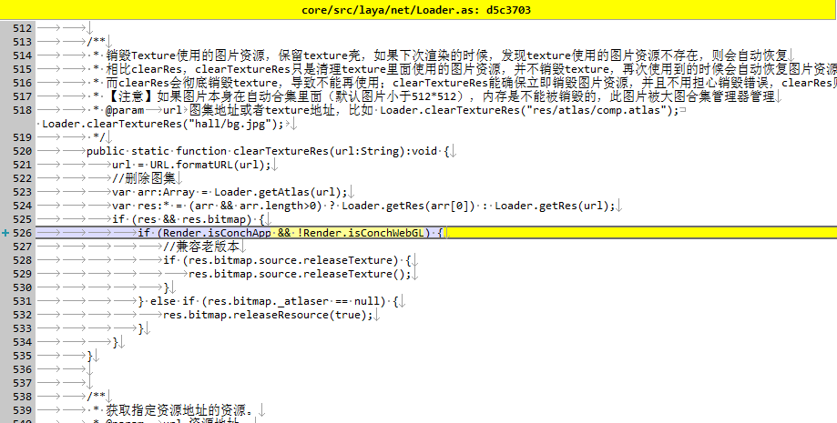

#LayaAir 1.7.19.1ベータコード変更

###1.webGL/src/laya/webgl/atlas/Atlas WebGLONvas.as

    

判断を増やす

```javascript

if (__JS__("bitmap !== ConchTextCanvas")) {
    ...
}
```

###2.core/src/laya/net/Loader.as
   

判断を～に変える

```javascript

if (Render.isConchApp && !Render.isConchWebGL) { 
    ...
}
```

###3.core/src/laya/display/Text.as
   

コードを追加

```javascript

if (Render.isConchApp && measureResult.width === 0 && measureResult.height === 0) {
	measureResult = Browser.context.measureText('W');
}
```

 

###4.core/src/laya/display/Stage.as
   

Render.isConch WebGLを追加すると判断します。
