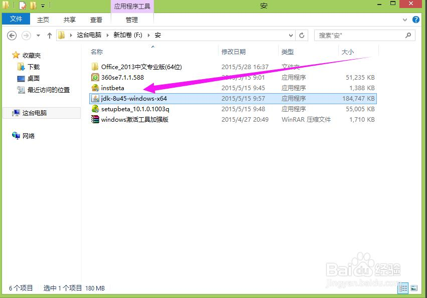
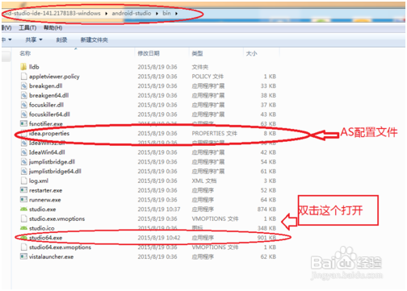
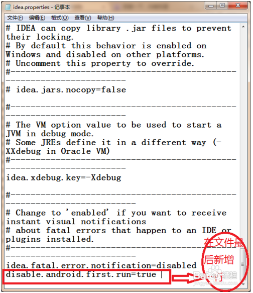
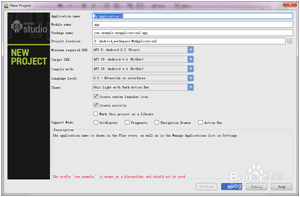
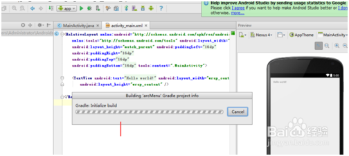

#Android Studioの使用と配置

##1、Android Studioをインストールする準備作業

###1.java JDKをダウンロードする

公式サイトに行ってjava JDKをダウンロードします。具体的な教程は参考できます。[http://jingyan.baidu.com/article/9989c746064d46f648ecfe9a.html](http://jingyan.baidu.com/article/9989c746064d46f648ecfe9a.html)

###1.2 JDKをインストールし、環境変数を設定します。

Javaまたはandroidの学習過程で、JDK環境を構築する必要があります。本編では、jdk-8 u 45-windows-x 64を例に、windows 8.1の64ビットシステムに配置環境を設定します。

####1.2.1 JDKの取り付け

jdkをダブルクリックしてパッケージをインストールし、インストールウィザードに入り、脳のない操作を行い、画像を参照して次のステップをずっと注文すればいいです。

 

 

 

 

 

####1.2.2環境変数の設定

　　**第一歩、私のパソコンを右クリックして、プロパティパネルに入ります。**

　　**第二ステップ、左側の高級システムの設定をクリックして、システムの属性の設定に入ります。**

　　**ステップ3をクリックして環境変数をクリックします。**

　　**第四ステップ、下のシステム変数は、新規作成をクリックします。**

　　`变量名：JAVA_HOME`

　　`变量值：JDK的安装路径（如：E:\Program Files\Java\jdk1.8.0_45）`

　　**第5ステップ、システム変数バーは、再度クリックして新規作成します。**

変数名:`CLASSPATH`

変数値:`.;%JAVA_HOME%\lib;%JAVA_HOME%\lib\tools.jar`)

前の括弧内でコピーできます。前のポイントと中間のセミコロンを忘れないように注意してください。セミコロンは英語の入力方法を覚えてください。

　　**第六ステップ、システム変数にPath(またはpath)変数が見つかりました。**を選択します。Pathをダブルクリックします。元の変数値が既に存在しますので、既存の変数の後に(`;%JAVA_HOME%\bin;%JAVA_HOME%\jre\bin`）かっこ内でコピーできます。

前のセミコロンに注意してください。

　　**第七段階、環境変数の設定が完了しました。**

検証方法：Win＋Rは運転枠を開け、cmd命令を入力して車に返す。

java-versionのリターンを入力して、javaバージョンの情報を表示します。javacを入力して、次の画面が現れたら、構成が成功したと説明します。

*注意事項*

`配置环境变量时记得将原有的和新加的用;隔开，不要出现中文；号`

###1.3 Android Studioをインストールする

GoogleがAndroid StudioがEclipseに取って代わると発表してから、正式に公式統合開発ソフトとなり、後者へのサポートを中止しました。ここではAndroid Studioのインストール（Android Studio 1.4を例にとって、ASを簡単に書く）を紹介します。

1）国内ネットワーク要素の制限のため、特別な手段を利用しないとGoogle公式サイトにアクセスできなくなります。ASをダウンロードします。ですから、他のサイトのダウンロード先は自分で検索できます。本編は作らない

2）ダウンロードが完了したら、解凍します。Android-studio-inde-41.28183-windows\android-studio\binに入って、studio 64.exeをクリックしてAS開発環境に入ることができます。

3）もし運転できないなら、JDKをダウンロードする必要があるというメッセージがあります。JDK環境変数を設定します。

4）android studio初回インストール運転時にカードは更新検査画面にあります。インターネットでは様々な処理方法がありますが、ここでは一つの方法だけを紹介します。ステップ2に進みます。解凍カタログandroid-studio-inde-41.2178183-windows\android-studio\binの下で。

5）idea.propertiesファイルを見つけて、メモ帳で開く（または他のテキストエディタUEなどで）。

ファイルの最後にdisable.android.first.run=trueを追加します。

を選択します。ASを再開します。AS更新チェックをスキップできます。

**注意事項**

・本操作手順はWin 7 64ビットに基づいています。他のオペレーティングシステムはGoogle公式ダウンロードを参照してください。

・ASをインストールする前に、JDKをインストールし、JAVA環境変数を配置してください。

 

#2、Android Studioを使って、新しいプロジェクトを作成するにはどうすればいいですか？

1）インストールが完了したら、私たちはプロジェクトを新規作成します。ポイントはここからです。

2）New Projectをクリックすると出現します。名前を設定しても、脳操作がなくて、ずっとnextをクリックして、終わりまでクリックしてもいいです。でも、この過程は私達が我慢して待つ必要があります。（ちょっと長いです）。

3）その後、我々は我々の開発インターフェースに入ります。画像の中の赤い丸のアイコン（SDK manager）をクリックすると、下の図が現れます。

4）このステップはAndroidのsdkをインストールし、Android d 1.6~Android 4.4.2を全部インストールすることを推奨します。（これは時間がかかります。ネットがよくて、暇な時間に設置してください。インストール中に映画が見られます。）

5）インストールが終わったら、私達のavd（Android Virtual Device）、つまりAndroidの仮想環境を配置し始めます。クリックして、画像の中で赤い丸のアイコンをクリックします。

6）Newをクリックします。（Testは私が配置したものです。）

7）AVD nameを任意に設置し、図のように設置することを提案する。

8）設定が完了したら、下図の三角番号をクリックして私達のプログラムをコンパイルすることができます。

#3、Android Studioはどのようにプロジェクトを導入しますか？

**3.1開発環境：**

>win 7
>
>Android Studio
>

**方法/手順**

1）自分のIDE-Android Studioを開く。

2）「File」のボタンをクリックし、「Import Project」を選択します。

3）導入するプログラムを見つけました。図のように、build.gradleファイルを選んだほうがいいです。

4）「次へ」を選んで図のようにします。

5）「次へ」を選んで図のようにします。

6）導入プロセスを待っています。

7）最後の導入に成功しました。図のように確認できます。

