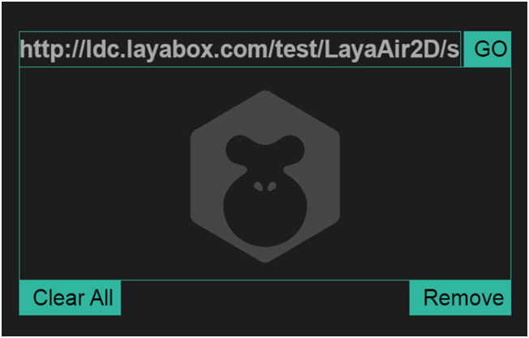

#LayaNativeテストアプリでプロジェクトを実行するにはどうすればいいですか？

###一、ダウンロードとインストール

LayaAirIDEを開いて、「ツール」メニューから「実行器ダウンロード」をクリックして、二次元コードをダウンロードします。

​
図(1)

​
図(2)
**Tips：LayaPlayerはブラウザではありません。アドレスを入力するのは全パスを入力してください。たとえデフォルトで起動しているのがindex.であっても、index.を入力します。**
*http://testgame.layabox.com/index.が正しいです。
*http://192.168.0.100:8899/index.は正しいです。
*http://testgame.layabox.com/エラー
*http://testgame.layabox.comエラー
*http://192.168.0.100:8899/エラー
*http://192.168.0.100:8899エラー

＊Tips：住所を入力した後、画面に何の画面も表示されていないことが判明した場合、プロジェクトのために、水平画面が正しく設定されていない可能性があります。ドキュメントを参照してください。https:/github.com/layabox/layaair-doc/tree/master/Chinese/Layanative/screenyuortion。******

####1.Androidダウンロードとインストール

Androidの携帯電話でコードをスキャンし、アプリをクリックしてインストールすればいいです。
****
**Tips：WeChatスキャンコードを使用すると、WeChatのセキュリティ設定のため、コードをスキャンした後、リンク先を携帯ブラウザにコピーしてダウンロードする必要があります。**    ****

####2.iOSのダウンロードとインストール

WeChatでコードをスキャンした後、「Safariで開く」をクリックし、Safariブラウザで開いたらInstallボタンをクリックし、インストールをクリックしてください。
****
**ステップ1:******

​	 
図(3)
****

 

**ステップ2:******

​ 

図(4)
****

 

**ステップ3:******

​ 
図(5)
****

  **Tips**:****

点击安装后，这里没有自动跳转功能，需要手动去系统桌面上看一下，是否存在Layabox的应用正在安装，如果正在安装，就等待安装结束后进行下一步操作。

インストールが成功したら、実行をクリックすると「信頼されていない企業開発者」が表示されます。この時は開発者自身で設定してください。「設定」－>「汎用」－>「機器管理」－「LayaBox Network Technologyをクリックして」－「信頼をクリックして」をクリックしてLayaBoxアプリケーションを開くと、次の図のように使えます。
****
**ステップ4:******

​ 
図（6）
****

 

**ステップ5:******

​	 
図（7）
****

 

**ステップ6:******

​	 
図（8）
****

 

**ステップ7:******

​ 

図(9)
****

 

**ステップ8:*

​ 

図（10）

 

####3.アプリケーションを開く

アプリケーションを開くと、図11のようなインターフェースが見えます。

​	 
図（11）

デフォルトのアドレスはLayaBoxが提供する性能テストの例です。「GO」ボタンをクリックして性能テストに入ることができます。もちろん開発者は自分のプロジェクトアドレスを入力してテストすることができます。

​ 
図（12）

プロジェクトの中でAsistive Touchをクリックして、後退をクリックしてトップページに戻ります。

​ 
図（13）

2回目のアプリを開くと、前回入力した住所が自動的に記録されます。

​ 
図（14）

 

####4.注意事項

テキストフォーマットのファイル（例えば、ini、xml、）、json、jsなど）は、すべてutf 8符号化フォーマットである必要があります。IOSデバイスは、現在、非utf 8フォーマット符号化のファイルをサポートしていません。

####5.アドバイス

開発者にandroidとiosの開発の基本的な知識を学ぶように提案します。使用中にモバイル機器をパソコンに接続して、いつでもロゴを確認してください。ロゴの中には重要な情報がたくさんあります。開発者の位置付けを助けることができます。例えば、非utf 8フォーマットでエンコードされたファイル名、ネットワークエラー、ダウンロードエラーなどです。