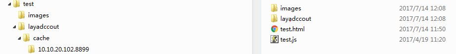

# android文件扩展机制
LayaPlayer-00.97のバージョン以前は、エンジンは資源をastesディレクトリにのみ包装することができます。LayaPlayer-00.97以降のバージョンは、資源をzipファイルにパッケージ化し、任意のファイルパスに置くことができます。LayaPlayerファイルシステムは、最初にastesディレクトリの下でファイルが存在するかどうかを検索します。見つけられなかったら、指定されたzipパスの下で検索します。このzip方式によって、googlePlayerがAPKを規定するsizeが100 MBを超えることができます。拡張パッケージの追加を要求します。

##1.メカニズムの詳細
###1.DCCを生成する
testプロジェクトはDCCツールで資源を包装します。
    

###2.圧縮ファイル
拡張ファイルにリソースパッケージを入れ、cacheファイルを圧縮し、zipフォーマットを要求します。ファイル構造はDCCツールが生成する構造と同じでなければなりません。
  

###3.zipファイルをデバイスディレクトリにコピーする
Android携帯にディレクトリ/storge/emulated/0/Android/test/comp.layabox.co nch 5を作成して、test.zipをこのディレクトリの下にアップロードします。
###4.コード内の拡張パスを変更する
RuntimeProxy.javaの中のを修正します。`getExpansionMainPath`関数を使用して、正しいzipパスを設定します。

```

    public String getExpansionMainPath()
    {
        return "/storage/emulated/0/Android/test/com.layabox.conch5/test.zip";
    }
    public String getExpansionPatchPath()
    {
        return "";
    } 
```

###5.外部メモリ権限をオープンする
Android 6.0以上のマシンは外部メモリを読み込めないかもしれません。自動的に権限を要求する必要があります。以下のコードまたはGoogle関連ソリューションを追加してください。

```

    public static boolean isGrantExternalRW(Activity activity) {
        if (Build.VERSION.SDK_INT >= Build.VERSION_CODES.M && activity.checkSelfPermission(
                Manifest.permission.WRITE_EXTERNAL_STORAGE) != PackageManager.PERMISSION_GRANTED) {
            activity.requestPermissions(new String[]{
                    Manifest.permission.READ_EXTERNAL_STORAGE,
                    Manifest.permission.WRITE_EXTERNAL_STORAGE
            }, 1);
            return false;
        }
        return true;
    }
```

**TIPS：LayaPlayerでは最大2つのzipファイルをサポートしています。2番目のzip修正・get Expansion PatPatPatPatPath・この関数**

###5.試験の実行
APPを実行して、次のログを見て、メイン拡張パッケージからリソースファイルを読み込むことに成功しました。
  

##2.Google Play APK拡張ファイルメカニズム
（https://developer.android.com/google/Play/expanion-files）
