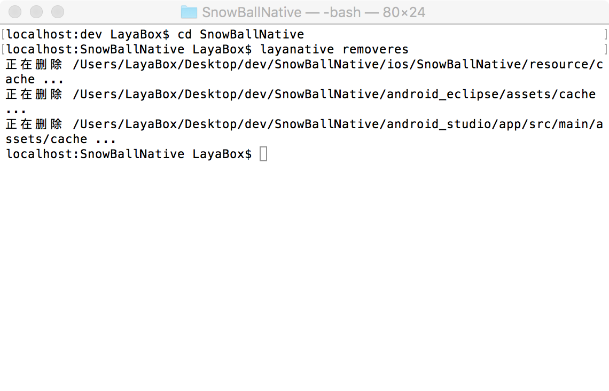

# LayaNative命令行工具
layanativeコマンドラインツールは、AndroidとiOSの元のプロジェクトを生成するために使用され、プロジェクトのリソース更新機能を利用して、プロジェクトの反復中のリソース更新を容易にします。
生成項目の機能はIDEの`工具/app构建`。
##1.命令の詳細
###1.layanativeをインストールする
windows

```

$ npm install -g layanative  
```

mac

```

$ sudo npm install -g layanative  
```

###1.SDKバージョンの情報を確認する
SDKは、nativeプロジェクトのテンプレートです。listversionコマンドは、現在使用可能なすべてのSDKバージョンの情報を一覧表示します。以下でnativeプロジェクトを作成するときは、パラメータで必要なバージョンを指定できます。

```

$ layanative listversions  
```

###2.nativeプロジェクトの作成
createapコマンドは、nativeプロジェクトを作成するために使用します。
まず次の命令でクリアーアプリのヘルプ情報を確認してください。

```

$ layanative createapp --help
```

####使い方:
layanative createap[-f rescuplath][--path output uplath][-s sdkuplath-v version][-p all𞓜ios]]“-p clipse and roidu and rodtudio]”[-t 0ギproject-0ӡӡӡ

####パラメータの説明:

|キーワードの説明
|--------------------------
𞓜`--folder,-f`|リソースパス：ゲームリソースをクライアントにパッケージして、ネットワークのダウンロードを減らすために、ローカルのゲームディレクトリを選択します。例えば、indexを起動してd:/game/index.で、そのリソースパスはd:/gameです。tが0の場合は記入しないでください
𞓜`--path`|native項目出力ディレクトリ[デフォルト値:“.”]
𞓜`--version，-v`|SDKバージョン：特定のバージョンのSDKが自動的に使用され、システムはサーバからSDKをダウンロードして特定の場所に保存される。--versionと--sdkは互いに矛盾しているので同時に指定することはできません。すべて指定しない場合は最新バージョンのSDKをデフォルトで使用します。
𞓜`--platform, -p`|プロジェクトプラットフォーム[オプション値:all，ios，android Uueclipse，android_studio][デフォルト値:all]
𞓜`--type, -t`|作成タイプ[0:リソースパックをしない1:リソースパックをする2:マシンバージョン][デフォルト値:0]
𞓜`--url, -u`|ゲームの住所[tが0か1の場合は、必ず記入してください。tが2の場合は記入しないでください。]
𞓜`--name, -n`|プロジェクト名：nativeプロジェクト名[デフォルト値:LayaBox]
𞓜`--app_name, -a`|アプリケーション名：アプリを携帯にインストールして表示する名前［デフォルト値：LayaBox］
𞓜`--package_name`|包名[デフォルト値：comp.layabox.game]
𞓜`--sdk,-s`|SDKローカルディレクトリ：カスタムSDKディレクトリ、オプションパラメータ。ネットを切断する場合に使用しますが、一般的にはパラメータ-versionを使用することを勧めます。
𞓜`--demension,-d`|プロジェクトタイプは2 Dですか？それとも3 Dですか？バージョン1.2.13は［オプション値：2 D，3 D］［デフォルト値：2 D］を追加します。
typeが1または2の場合は、リソースを使ってnativeプロジェクトに包み、0の場合はしません。パッキングリソースの下には実際にdccを呼び出す方法があります。包装資源dcc関連、参考[LayaDcc工具](https://github.com/layabox/layaair-doc/tree/master/Chinese/LayaNative/LayaDcc_Tool)。
プロジェクトの出力パスは、デフォルトで現在のパスに出力されます。

vによってv 0.9.5バージョンのSDKを使用します。

```

$ layanative createapp -f SnowBallH5 -t 1 -n SnowBallNative -u http://10.10.20.102:8899/index.html -v v0.9.5
```


指定-vも指定していません。最新バージョンのSDKを使います。

```

$ layanative createapp -f SnowBallH5 -t 1 -n SnowBallNative -u http://10.10.20.102:8899/index.html
```

を使用します。バージョンを指定するにはネットワーク環境が必要です。ネットワークを切断する場合は--sdkまたは-sでSDKディレクトリを指定できます。[SDK下载地址](https://ldc.layabox.com/layadownload/?type=layaairnative-LayaAir%20Native%20SDK%200.9.6)

```

$ layanative createapp -f SnowBallH5 -t 1 -n SnowBallNative -u http://10.10.20.102:8899/index.html -s D:/v0.9.6
```

###3.nativeプロジェクトのリソースパッケージを更新する
refreshresコマンドは、nativeプロジェクトのリソースパッケージを更新するために使用します。
プロジェクトの反復中、h 5プロジェクトは修正されました。refreshresコマンドを使って、リフレッシュリソースとコードを新たに包装して、nativeプロジェクトに入れます。
####使い方:
layanative refreshres[-p all𞓜ios]“-u url”

####パラメータの説明:

|キーワードの説明
|--------------------------
𞓜`--platform, -p`|プロジェクトプラットフォーム[オプション値:all，ios，android Uueclipse，android_studio][デフォルト値:all]
𞓜`--path`|nativeプロジェクトパス[デフォルト値:“.”]
𞓜`--url, -u`ゲームの住所


作成したアイテムがシングル版であれば、refreshresの場合はurlを入力する必要はありません。インターネット版urlを入力すると、インターネット版のリソースパッケージになります。プロジェクトコードを変更してから、ネット版のプロジェクトになります。
作成した項目がネット版であれば、refreshresはurlを入力しなければなりません。新しい住所を入力すると、項目の中にurlを設定するコードを変更しなければなりません。もしシングル版の住所を入力したら、シングル版の資源パッケージになります。項目コードを変更しなければならないので、単独版の項目になりません。
手動切り替えのタブレット版とネット版は関連しています。参考にしてください。[LayaBox 构建工具](https://github.com/layabox/layaair-doc/tree/master/Chinese/LayaNative/build_Tool)。

createapでは、生成したnativeプロジェクトディレクトリのnative.jsonファイルにリソースパスを書き込みます。後にリソースが他のところに移ったら、リソースディレクトリが見つかりません。createapの場合、-tパラメータが0に指定されている場合は、リソースを使わずに、リソースパスパラメータを指定しなくてもいいです。native.jsonに書いてあるリソースパスは空です。このようなプロジェクトはrefreshresの時にリソースパスが空です。上記の2つの場合は、手動でnative.jsonファイルを修正し、正しいリソースパスを指定することができます。
###4.nativeプロジェクトのリソースパッケージを削除する
removeresコマンドは、nativeプロジェクトのリソースパッケージを削除するために使用します。
####使い方:
layanative removeres[--path path]
####パラメータの説明:

|キーワードの説明
|--------------------------
𞓜`--path`|nativeプロジェクトパス[デフォルト値:“.”]

##3.アプリケーションの例
1.まず下図のようなディレクトリ構造を作成します。SnowBallH 5はhttml 5プロジェクトの資源目録です。

  

2.SDKバージョンの情報を確認する
  

3.nativeプロジェクトの作成
  

4.下図のようなディレクトリ構造を生成します。
  

5.いつでも資源パッケージを更新する
devディレクトリの下で、--pathでnativeプロジェクトのディレクトリを指定します。
       

nativeプロジェクトディレクトリに入ると、指定-pathパラメータは不要です。
   

5.リソースパッケージが必要でない場合は、削除します。
devディレクトリの下で、--pathでnativeプロジェクトのディレクトリを指定します。
    

nativeプロジェクトディレクトリに入ると、指定-pathパラメータは不要です。
  


注意：Mac上でコマンドラインを実行すると、ウィンドウが灰色になります。原因は不明です。ただし、コマンドプロンプトが出たら命令実行完了となり、命令入力を継続することができます。