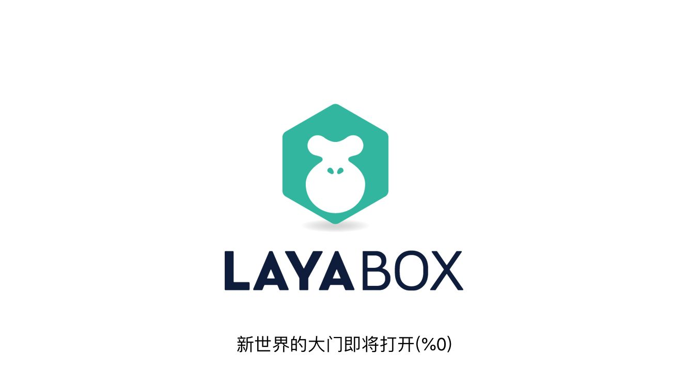

#インターフェースを読み込む
開発者を便利にするために、LoadingViewをカスタマイズして、1.0バージョンは原生機能を使って実現した新しいLoadingView。
アプリケーションが起動する時、必要なhtml、js、画像をロードする必要があります。この時、ロードインターフェースを通じて進捗を表示します。LayaPlayerはプロジェクトを実行する時、デフォルトではLoadingViewインターフェースがあります。しばらくの間、ゲームに入ることができます。


​<br/>
##1.進捗バー制御

開発者はconfig.jsでLoadingViewの背景色、フォント色、Tipsなどを制御することができます。

config.jsの位置:

```

Android: 工程目录下的assets/scripts/config.js  
IOS:工程目录下的resources/scripts/config.js  
```


config.jsの内容は以下の通りです。開発者は自分のニーズに応じて修正できます。


```javascript

window.loadingView = new loadingView();
if(window.loadingView)
{
    window.loadingView.loadingAutoClose=true;//true代表引擎控制关闭时机。false为开发者手动控制
    window.loadingView.bgColor("#FFFFFF");//设置背景颜色
    window.loadingView.setFontColor("#000000");//设置字体颜色
    window.loadingView.setTips(["新世界的大门即将打开","敌军还有30秒抵达战场","妈妈说，心急吃不了热豆腐"]);//设置tips数组，会随机出现
}
```


##2.進捗バー制御例

実際の開発過程では、LoadingViewの隠蔽と表示を正確に制御することが一般的であるが、開発者はconfig.jsのようにloadingView.loadingAutoClooseの値をfalseとすることができる。
そしてプロジェクトでは、ロード完了状況に応じて、プログレスバーの表示進捗を設定します。呼び出し関数は以下の通りです。
`loadingView.loading(nPercent);//参数为0-100的整数值，当值为100的时候LoadingView自动关闭`  

プロジェクトの疑似コードは以下の通りです。

```javascript

var nPercent=0;
var image1 = document.createElement('img');
image1.onload=function()
{
    if(window.loadingView){
        nPercent+=33;
        window.loadingView.loading(nPercent);
    }
}
image1.src = "a.png";

var image2 = document.createElement('img');
image2.onload=function()
{
    if(window.loadingView){
        nPercent+=33;
        window.loadingView.loading(nPercent);
    }
}
image2.src = "b.png";

var image3 = document.createElement('img');
image3.onload=function()
{
    if(window.loadingView){
        nPercent+=33;
        window.loadingView.loading(nPercent);
    }
}
image3.src = "c.png";
```


##3.すべてのテキスト表示を削除します。

すべての文字の表示を削除できます。tipsとロードパーセンテージを含めて、config.jsを修正して、show TextInfoをfalseに設定すればいいです。

```javascript

loadingView.showTextInfo=true;//改成false
```

##4.カスタムインターフェースと機能
すべてのコードが公開されていますので、開発者は必要に応じてコードを変更して任意のユーザー定義機能を実現できます。

