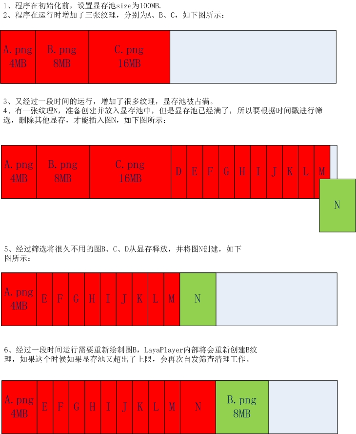
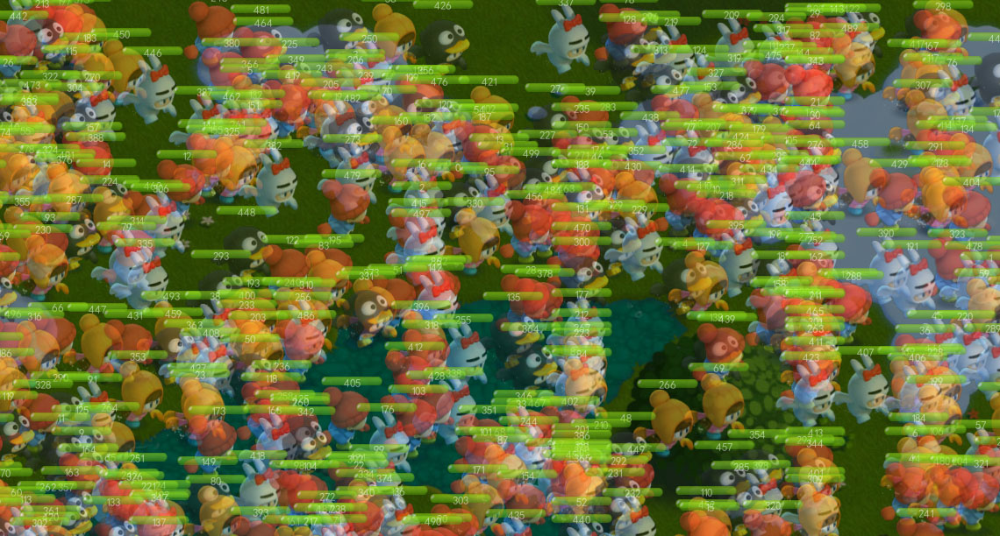

# 显存池管理

表示が大きすぎたり、開発者が現存を解放し忘れたりすることによって、アプリケーションがシステムによって直接的にキルルされるリスクを回避するために、LayaPlayerに表示管理機構があり、原理は図1に示す通りである。


  


**なぜ自動現存管理が必要なのか、初期のios機器（iphone 4 S、iPad 2）や初期のAndroid機器は、メモリが512 MHzしかないため、アプリケーションメモリが270 MBに達すると、アプリケーションがシステムによって直接に機能しなくなり、ユーザーの体験が非常に悪く、ゲームの中で最も多く使われているのが写真リソースです。**

###1.どのように配置するか


####1.1.標準設定

現存池のsizeは、開発者がアプリケーションの実行を開始する前に設定する必要があります。開発者が未設定の場合、LayaPlayer内部はデバイスのメモリ状況に応じてデフォルト値を設定しています。コードは以下の通りです。

```javascript

var nMem = conchConfig.getTotalMem();
if (nMem <= 524288) {
    conchConfig.maxTextureMemSize = 64 * 1024 * 1024;
}
else if (nMem > 524288 && nMem <= 1048576) {
    conchConfig.maxTextureMemSize = 84 * 1024 * 1024;
}
else if (nMem > 1048576) {
    conchConfig.maxTextureMemSize = 128 * 1024 * 1024;
}
```


####1.2.開発者設定
開発者も自分のニーズに合わせて設定できます。config.jsで設定する必要があります。コードは以下の通りです。


```javascript

var loadingView= window.loadingView;
if(loadingView)
{
    loadingView.loadingAutoClose=true;
    loadingView.bgColor("#ffffff");
    loadingView.setFontColor("#000000");
    loadingView.setTips(["新世界的大门即将打开", "敌军还有30秒抵达战场", "妈妈说，心急吃不了热豆腐"]);
}
//在这进行设定
var nMem = conchConfig.getTotalMem();
if (nMem <= 524288) {
    conchConfig.maxTextureMemSize = 80 * 1024 * 1024;
}
else if (nMem > 524288 && nMem <= 1048576) {
    conchConfig.maxTextureMemSize = 128 * 1024 * 1024;
}
else if (nMem > 1048576) {
    conchConfig.maxTextureMemSize = 200 * 1024 * 1024;
}
```


**Tips：この現存池sizeの設定はアプリケーションが起動し始めたところに置かなければならないので、プログラム中はダイナミックに設定できません。config.jsはLayaPlayerが起動したらすぐに実行するjsですので、ここに置くのが一番安全です。**


####1.3.config.jsはどこにありますか

iosバージョン：プロジェクトディレクトリの下のresource\scripts\config.js
androidバージョン：工程目録の下のクラスメイト\scripts\config.js


###2.深刻なカートン、画面の点滅現象が発生しました。

LayaPlayerの下でプロジェクトを実行して、もし深刻なカートンが現れたら、あるいはスクリーンが点滅します。この時設備をパソコンに接続してロゴを確認できます。もしロゴの中で頻繁に印刷されているなら、次のような内容です。


```verilog

freeRes(0):Total:8,left:5,clearedMem:115620
```


次の図2に示すように：
  


このような状況が発生した原因は、現在の画面で描かれている画像の現存数がすでに現存池の最大sizeを超えており、現存池は常に整理関数をトリガしており、同時に点滅現象が発生する可能性があるからです。


###3.どう解決するか

####3.1.現存池の大きさを拡大する

まず1.2の方法によって、現存池のsizeを大きく設定して、再度テスト項目は、頻繁にfreeResのロゴを印刷しないと、カートン、スクリーンの点滅現象も存在しなくなります。現存問題による問題を証明します。この時、気持ちがいいかもしれません。

####3.2.根本的に問題を解決する

根本的に問題を解決するには、開発者が画像のライフサイクル、現存の大きさ、残存の有無を厳しくコントロールする必要があります。
#####3.2.1.どのように画像の現存を計算しますか？
（1）、一枚`1024*1024`画像のサイズ:`1024 * 1024 * 4 = 4MB`。
（2）一枚`768*890`画像のサイズ:`1024 * 1024 * 4 = 4MB`一部のグラフィックカードのハードウェア制限によりテクスチャを作成するサイズは2のn乗でなければなりません。`768*890`の画像は、グラフィックスカードの中で`1024*1024`を選択します。
（3）美術は、ピクチャを作成する際に、幅が512ピクセル以上の場合、画像のサイズが2のn乗であることを強く示唆し、513、1025のようなサイズが出現しないように注意してください。512以下のピクチャLayaPlayerエンジンは、自動的に統合マップを処理します。
#####3.2.3.画像メモリ、グラフィックカードの関係
  


**図解:**
（1）、1枚のpng画像、サイズは`768*890`を選択します。ファイルサイズは420 KBです。
（2）、loader関数によるネットワーク負荷で、消費流量は420 KBである。
（3）、pngでImageBitmapDataに復号し、メモリを占有する`768*890*4=2.73MB`。
（4）この画像をスクリーンに描画するには、まずグラフィックカードにテクスチャを作成する必要があります。このテクスチャの大きさは2のn乗を必要としますので、1枚作成しました。`1024*1024`のテクスチャを使い、ImageBitmapDataデータをグラフィックカードにアップロードし、メモリを現存のコピーにします。
（5）、この時占用する`1024*1024*4=4MB`グラフィック、画像データをメモリからグラフィックカードにコピーすると、メモリのBitmapDataが、エンジンから自動的に解放されます。
（6）、一枚の画像をプリロードしたが、長い間絵を描いていないと、メモリをずっと使っています。LayaPlayerエンジンはデフォルトでは、画像を20秒ロードした後、その画像のメモリをリリースします。描画が必要な時は、ハードディスクから再ロードします。

#####3.2.3.事前に画像をロードする
多くのアプリケーションはプリロード機能を使って、事前に多くの画像をメモリにプリロードしますが、これらの画像は描きません。この時はメモリが緊張します。LayaPlayerエンジンはデフォルトでは画像に20秒載せてから、これらの資源をクリアします。画像のプリロード量は必ずコントロールしてください。
プロジェクトの需要があるなら、画像を先に現地にダウンロードしたいだけで、まず使用しないでください。このような場合は資源パッケージ方式またはLayaDCC方式を使うことができます。
とりあえず画像の量をロードするのは慎重です。
メモリの画像を削除する時間は以下のコードで設定できます。


```javascript

conch.config.setImageReleaseSpaceTime(15000);//单位为毫秒，默认是20000
```

ロゴ出力が見えます`JCImageManager::setReleaseSpaceTime=15000`代表設定が成功しました

**Tips：setImageRelease Space Time関数は、config.jsにも書いて呼び出してください。**

#####3.2.4.一部のノードが削除されていないための現存問題

多くの項目の中で、ゲームの最初の画面に入るのは正常ですが、何回かのインターフェースを切り替えたり、何回かのシーンに入ってから戻ってきたりします。ファーストスクリーンの画面にはスクリーンが点滅しています。ロゴはずっとフリーをプリントしています。
このような状況のほとんどは、一部のノードが削除されていないため、画面は実際にはまだレンダリングされており、メインインターフェースによって遮られているだけで、この時点で、あなたのアプリケーションがノードの削除、隠しメカニズムを制御することを確認します。


###4.デバッグ手段

プロジェクトで3.2.4の現象が発生した場合、LayaPlayerエンジンはすべての画面を半透明に設定することができます。これらのノードの画面が隠れていないか、削除されていないかを見つけることができます。


```javascript

if( window.conch )
{
    window.conch.config.setTransparentMode();
}
```

**Tips**  
*1、conchはLayaPlayerの環境でしか呼び出しできません。ウェブページのバージョンにはconchの定義がありません。存在するかどうかを判断する必要があります。＊
*2、as言語を使って開発する場合は、`Browser.window['conch'] `このようにしてconchオブジェクトを取得します。*

図4に示すように、

  

