#IOSパッケージリリースAPPのすべての詳細プロセス

他のいい参考：[点击打开链接：ios开发者证书申请及xcode5应用上线发布](https://www.lvtao.net/ios/558.html)

##一、アップル開発者のアカウントを申請する

まず、アップル開発者のアカウントを申請してから、アプリストアでアプリケーションをリリースすることができます。

開発者アカウントは、（1）個人開発者アカウント（2）企業開発者アカウントに分けられます。

主な違いは：[点击打开链接](http://www.zhihu.com/question/20308474)

###1.個人開発者及び企業開発アカウント申請

　　[**クリックしてリンクを開く**](http://jingyan.baidu.com/article/676629976d12aa54d51b841f.html)

その中で企業が申請する時は鄧白氏コードが必要です。

####1.1会社の鄧白氏コード

アップルにメールを送る（またはアップル開発者サービスホットラインに直接電話する：4006 701 855）。彼はあなたに無料で登録した鄧白氏のウェブサイトを提供します。直接登録すればいいです

   [https://developer.apple.com/ios/enroll/dunsLookupForm.action](https://developer.apple.com/ios/enroll/dunsLookupForm.action)

####1.2会社の営業許可証の写しと会社中英文名の照合証明

あなたの会社の英語名を証明する手紙（これは一言で言えばいいです。例えば、この手紙を書いて、わが社の英語名がXXXXであればOKです。）を捺印します。

多くの国内会社は海外にファックスできません。この時はネットファックスを使ってもいいです。[http://faxzero.com/](http://faxzero.com/) 

####1.3 VISAまたはMASTERを開通するクレジットカード

個人のものでもいいです。アカウントを提出してAppleに代わって差し引きします。（$99米ドル）

###2、ステップ

####2.1鄧白氏コードの申請

まず鄧白氏番号を申請したいです。申請の翌日に電話とメールがあります。そのメールは鄧白氏ではありません。あなたの申請コードです。残したほうがいいですよね。十人の番号です。昼ごろに中国の鄧白氏から電話があります。あなたと資料を確認することです。夜ぐらいには新しいメールを受け取ります。それこそ鄧白氏です。この鄧白氏コードは無効です。少なくとも14日後に使えます。

14日後に、会社の開発者のアカウントを申請します。もし鄧白氏のコードが無効であれば、アップル開発者センターに電話して、鄧白氏の無効を教えてください。彼女は処理します。（おそらく鄧白氏と連絡します。）何日間後（具体的には何日間のカスタマーサービスで教えてくれます。）鄧白氏の番号は使えます。

その後、会社の情報を記入する時、会社の情報とアップルデータベースの情報が一致していないというヒントに出会うかもしれません。焦らずに電話してください。アップルデータベースの会社情報を教えてくれます。それから、鄧白氏の連絡メールアドレス（このメールは鄧白氏がアップルの開発者アカウントを申請するために専用です）を教えます。アップルデータベースの会社情報を鄧白氏に送って変更してください。あと14日待って、申請すれば大丈夫です。このような状況は誰にでもありません。情報が一致すれば、それが一番いいです。もう14日間待たなくてもいいです。

  

*Tips：辛抱強く14日後に登録してください。鄧白氏コードには試行回数が制限されています。*

####2.2情報登録

鄧白氏コードを申請したら、iOSの開発者アカウントを登録します。[http://developer.apple.com/programs/ios/](http://developer.apple.com/programs/ios/)この開発者アカウントは入り口に登録して、enroll（登録）を開始します。既にアプリの個人アカウントを持っているなら、あなたの個人アカウントを開発者アカウントとして使えます。そうでないと新しいアカウントを申請します。

あなたが個人または会社に登録されている場合は、会社を選択してください。登録するのは情報を記入するので、必ず注意してください。むやみに記入しないでください。あなたがその開発プラットフォームを選ぶと聞きましたが、iosを選択します。

個人アプリのアカウントを登録したら、会社の情報を記入します。会社の情報も真実に記入してください。これはあなたの会社の営業許可証と連結します。後で審査して使います。登録情報は英語だけですので、英語名のない会社や住所については、まずこれらのものを処理します。会社の情報を記入し終わったら、次はメールを作成します。（この後期はアプリ開発者センターと連絡します。）と代表人（あなたは自分またはあなたの社長の名前を選んでもいいです。）次は相手の審査を待っています。これは普通1～2日待っています。もし審査が終わったら、向こうからメールが来ます。

PS：代表者及びlegal entityフィールドは、鄧白氏コードを申請する時に記入したのと一致しなければいけません。そうでなければ通過できません。これは上記のデータベース情報と一致しないフィールドです。

####2.3ファックス資料

apple側があなたの会社の情報を通過すると、メールで資料を送ってくれます。[devenroll@apple.com](mailto:devenroll@apple.com)このメール。あなたはあなたの会社の営業許可証を送りたいです。あなたの会社の英語名を証明する手紙（これは実は一言で言えばいいです。例えば、この手紙を書いて我が社の英語名はXXXXでOKです。）を書いて、会社の捺印してください。そしてファックスします。多くの国内会社は海外にファックスできません。この時はネットファックスを使ってもいいです。[http://faxzero.com/](http://faxzero.com/) 

　　**このステップは一番面倒です。3-4日間の審査期間を待たなければなりません。**

*Tips：アジアのアップルにファックスして、アップル開発者チームに伝えてもらえませんか？でもリンゴはこのようにすることを勧めません。*

####2.4電話検証

あなたのファックスが通じたら、向こうからメールを送ります。電話で確認してください。中には中国語圏の電話がありますので、この電話をかけてください。

####2.5支払い

電話で確認したら、普通何分間でメールをもらってあなたにお金を支払うようにします。appleは国内のオンライン決済を開通しないので、purrhaseformを記入してください。多国籍のクレジットカード（visaやmastercardなど）を準備して、あなたのクレジットカードの情報を記入してください。基本的には2日後に、もし相手があなたの支払いを通じて、正式に開通します。

####2.6アカウントをアクティブにする

決済後、アカウントは基本的にオープンしました。アップルはアカウントをアクティブにするメールを送ります。メールにはアクティブコードがあります。直接にアクティブコードを注文してアクティブにします。

ここで開発者のアカウントを申請しました。

##二、APPIDの申請

###1.BundeleIDを追加する

​ 
図(1)

**クリックして追加した後**

​ 
図(2)

**リリースする店舗を選択します。**

​ 
図(3)

最後に提出すればいいです。

###2.iTunectを接続する

アクティブになったばかりのアカウントはiTunectにログインできません。登録できるメールをアップルから送ってからログインする必要があります。そうでないと権限がないと言います。 
図(4)

###3.新規アプリケーションの作成

**3.1 iTunes Connectに登録したら、「あなたのアプリケーションを管理する」をクリックして管理ページに入ります。**

​ 
図(5)

 **3.2「新しいアプリケーションを追加する」ボタンをクリックします。**

​ 
図（6）

前の二つは言いません。第三のSKUNumberはどういう意味ですか？私も分かりません。唯一を保つために、覚えやすいです。BundeleIDと同じです。第四のBundeleIDは選択すると変更できないので、慎重に選択してください。

**3.3発効時間と価格を設定する**

​ 
図（7）

ここの価格は等級によって来ます。具体的な金額ではなく、Tier 1ドルです。中国の商店では6元の人民元に相当します。

下にもう一つのあなたのアプリが発表されているお店があります。デフォルトはすべての店舗が発表します。

​       

図（8）

 **3.4 APP情報の設定**

バージョン番号、所有権を含む

​       
図(9)

​

APPの内容説明もあります。デフォルトではNoneを選択して、自分のAPPの実際状況によって。

​ 
図（10）

その後、いくつかのメタデータが、APPについての記述を、APPStorに表示するために使用される。キーワードはユーザーがこれらのキーワードを使ってあなたのAPPを検索することができます。Support URLは、あなたのアプリに問題が発生した場合、ユーザーが連絡できる住所です。

​ 
図（11）

続いてAPPStorが審査したフィードバック情報で、連絡先情報とAPPのテストアカウントを含みます。

​ 
図（12）

最後にIcon、スクリーンショットをアップロードします。スクリーンショットは5枚を超えません。

​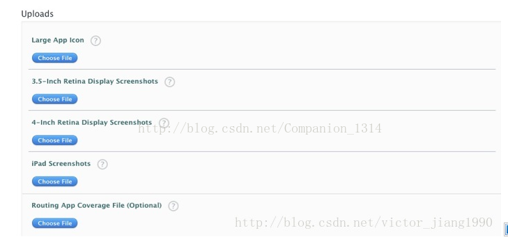 
図（13）

提出すれば、APP IDがあります。

​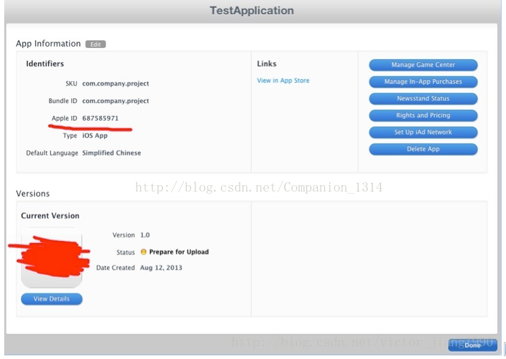 

図（14）

### 

**Tips:**

注意現在の状態はPreparefor Uploadで、View Detailsをクリックして、入ったら「Readyto Upload Binary」をクリックしてください。

​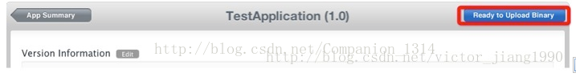 
図（15）

次に、暗号化機能を使っているかどうか聞いて、選択して保存します。

​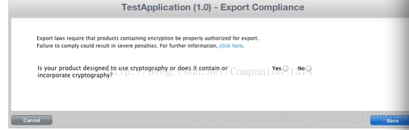 
図（16）

現在の状態は「WaitingFor Upload」です。

##三、アップロードアプリケーション

###1 CSRファイルを作成する

1.1コンピュータの中のキーホルダーを開けて、アプリケーションで見つけます。

​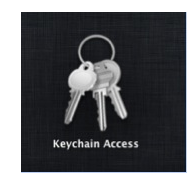 
図（17）

1.2ナビゲーションバーの下のオプションを選択します。

​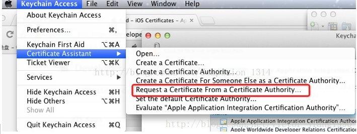 
図（18）

1.3その後、ユーザーのメールボックスを入力し、名前をハードディスクに保存することを選択します。

​ 
図（19）

 **注意：ユーザーのメールは開発者アカウントのメールボックスです。CAメールは記入しなくてもいいです。前提はハードディスクに保存することです。**

このときローカルでこのようなファイルが生成されました。

​ 
図（20）（このファイルは開発者センターで証明書を発行するときに必要です。）

###2リリース証明書の作成

2.1 App Storeを選択する

​       
図（21）

2.2作成したばかりのCSRファイルをアップロードする

​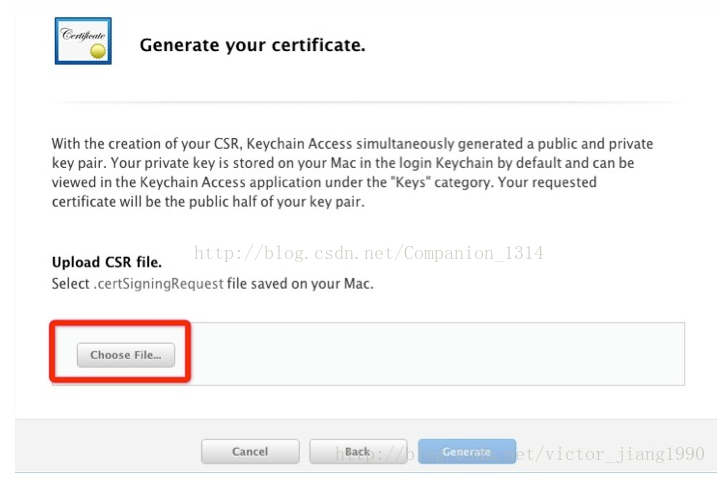 
図（22）

2.3アップロード後に証明書が作成され、ローカルにダウンロードされました。

​ 
図(23)

2.4このファイルをダブルクリックして、キーホルダーに追加します。

​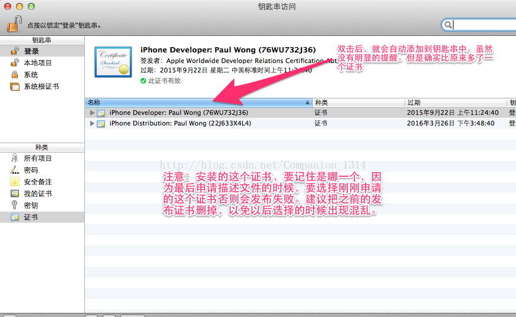 

図（24）

**このようにする目的はあなたのコンピュータのためにライセンスをインストールして発行することです。このようにしてこそ、あなたのコンピュータがプログラムを発表することができます。**

###3 Provisioning Profilesを作成します。

####3.1 APP Storeを選択する

​ 
図（25）

####3.2 App IDを選択する

​ 
図（26）

####3.3証明書を選択する

​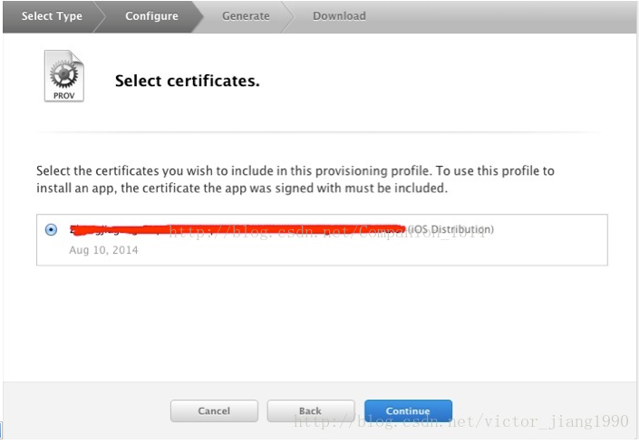 
図（27）

この証明書はつまり先ほど作成した証明書です。ここで遭遇した一つのエラーは二つの証明書があります。私は間違ったものを選んでしまいました。結果としてパッケージ化された説明ファイルに問題があり、発表に失敗しました。

####3.4命名

​ 
図（28）

選択した名前は、Xcodeに取り付けた時に見えます。

3.5最後に提出した後、Provisioning Profilesファイルをダウンロードして、ダブルクリックして開けてXcodeに追加します。

###4.Xcodeの設定

####4.1タレットの設定

ここのBunndleIdentiferは前の出願のBundeleIDと一致していなければなりません。バージョン番号も前のアプリID申請時のバージョン番号と一致していなければなりません。

​ 

図（29）
​ 
図（30）

####4.2署名ファイルを修正する

前に作成したProvisioning Profilesファイルを選択しなければなりません。

 
図（31）

  

####4.3投稿プロファイルを追加する

もし一つ追加していないなら

​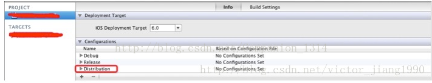 
図(32)

次は包装のプログラムです。

私たちのxcodeの中に包装のボタンがあります。

​       
図（33）

カバンを作ったら自動的にはじけます。orignizeでも確認できます。

​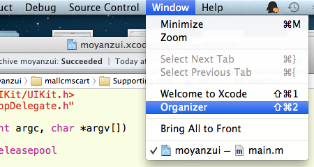 
図(34)

​ 
図（35）

その後は検証情報です。上の図のValidateをクリックして検証して、問題ないと確認して提出しています。検証しなくてもいいですが、検証しないと問題があるので、先に検証して提出するのが良い習慣を身につけたほうがいいです。

クリックして検証した後に、図の枠が現れて、ここで開発者のアカウントとパスワードを入力して、nextをつけます。

​ 
図（36）

証明書を発行する記述ファイルを選択します。

​ 
図（37）

このインターフェイスはあなたのアプリが大丈夫だと説明しています。問題があれば、エラーや警告を提示します。間違いがあったらもう一度パッキングして検証してください。一部の警告は修正せずに直接提出してもいいです。これは完全主義かどうかだけです。

​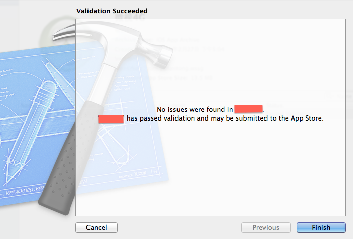 
図（38）

##四、アプリケーションをap storeに提出する

アップルはxcodeが持参したappication loaderで私達のアプリケーションを提出することを推奨しますが、これ以外にも他のものを使って、それぞれ紹介します。

###第一種類：直接にアプリをap storeに送ります。

*（この方法は勧められない）*

distributeをクリックしてください

​ 
図（39）

選択

​ 
図（40）

​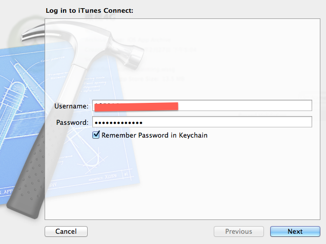 
図（41）

​ 
図(42)

submitをクリックして提出できます。

###第二種類：xcodeが持参するappication loaderで私達のアプリケーションを提出します。

(推奨)

上記の方法の第一歩と同じdistributeをクリックしますが、第二のオプションを選択します。

​       
図（43）

ここでipadを生成します。地元に保存します。

​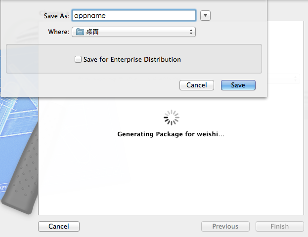 
図(44)

保存後、xcode-open developを選択します。

r tool—aplication loader

​ 
図（45）

下の写真を見て、情報を記入したら、アップロードできます。

​ 
図（46）

​ 
図（47）

​ 
図（48）

ここで「選択」をクリックして、私達を現地に存在させたばかりです。ipadファイルをアップロードすればいいです。

​ 
図（49）

​ 
図（50）

​ 
図（51）

アップロードに成功しました。この時、あなたのアプリの状態がウオッチfor reviewに変わりました。アップロードが完了した後の5、6日間は私達のアプリケーションの状態が変化しているかどうかを確認してもいいです。変えていなくても大丈夫です。アップルが審査する時、状態はインレスビューになります。次に、あなたのアプリケーションが成功したか、それとも拒否されたかを知ることができます。