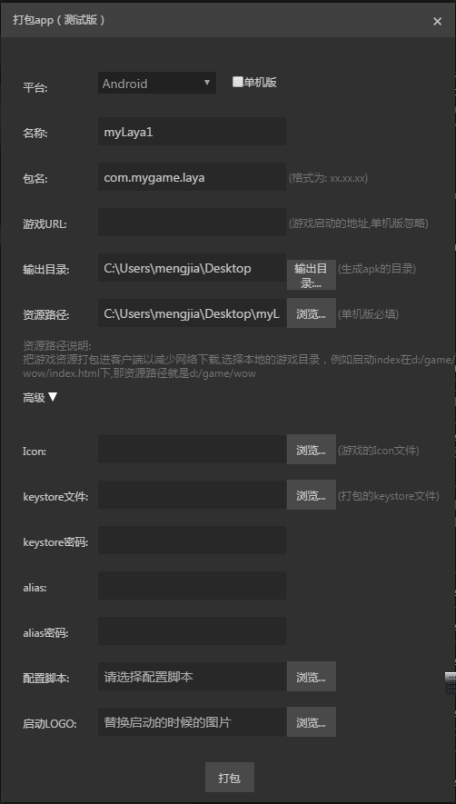
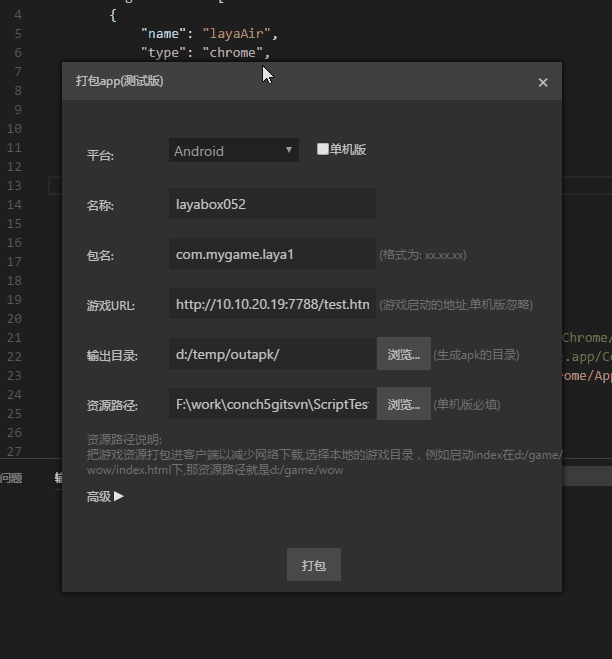

# LayaBox打包工具

LayaAir IDEを使って作成したプロジェクトは、h 5ページを生成してサイト上で実行するだけでなく、Appにパッケージ化してモバイル端末にインストールして実行することもできます。ただし、現在はAndoridバージョンのパッケージ化のみがサポートされています。IOSシステムはAppleのXCodeのみでパッケージ化できますので、他の第三者のツールを使ってパッケージ化することはできません。IOSを構築するXCodeプロジェクトプロジェクトについては、「構築プロジェクト」のドキュメントを参照することができます。

パッケージ機能はクイックテストとデモンストレーションのみに使用されます。本当にリリースするなら、プロジェクトを構築する方法をお勧めします。


##1、役割：

既存のlayaboxのカバンを外し、アイコンや起動ページなどのパラメータを修正して、新たなアプリを作成します。このアプリは直接インストールして実行してもいいし、各大平台に直接配布してもいいです。

##2、運行ニーズ：
1.すでに1.7（含む）以上のjdkをインストールしている必要があります。インストールしていない場合は、
   [这里](http://www.oracle.com/technetwork/java/javase/downloads/jdk8-downloads-2133151.html)ダウンロードします。

（今問題があります。macシステムで1.8をインストールしたら、包装ミスを引き起こすかもしれません。）

##3、使い方：
メニューのツール/パッケージアプリ（テスト版）をクリックして、次の図のようになります。
  

パラメータを記入してから、包装してください。**包装時間が長いです**したがって、進捗ヒントがあります。何の間違いもなければ、進捗は100%に達します。
後でディレクトリを出力すると最後のパッケージ結果が生成されます。

具体的なパラメータの意味は以下の説明を参照してください。


##4、Android App包装
###4.1メインインターフェース：



###4.2界面パラメータの意味：

####4.2.1パーソナル版アプリ

チェックすると、単独版を包装します。そうでなければオンライン版を包装します。
シングル版はネットワークが必要ではなく、対応するurlがありません。だからurlを提供しなくてもいいですが、ゲームの資源を提供しなければなりません。スタートページは資源パスのindex.と固定されています。プロジェクトの起動ページがindex.ではない場合、appが起動した時にネットワークエラーを報告します。
オンライン版はurlが必要です。資源を梱包するかどうかは自分で決められます。

　　<br/>
　　**Tips：単独版でもXMLHttpRequestまたはwebsocketでネットワーク操作ができますが、動的な更新リソースはサポートされていません。**


####4.2.2名称

アプリの名前です。インストールしてアプリのアイコンの下に表示される名前です。
たとえば:
    

 `猎刃2`ここに記入する名前です。
＊Tips：現在は中国語システムの名称しか修正できません。＊


####4.2.3パッケージ名

Androidアプリケーションのパッケージ名は、この通常の状況では見られません。一般的には反ドメイン名命名規則を採用しています。
例えば、comp.layabox.runtime.demo
パッケージ名はxxx.yy.zzz形式でなければなりません。少なくとも2つのレベルがあります。包装が失敗します。


####4.2.4ゲームurl

パッケージの応用はオンラインプロジェクトなので、スタートurlを提供して、一つのhtmlページを指して、アプリケーションの入り口です。LayaAirによって生成されたプロジェクトであれば、二次元コードの中にindex.があります。テストの時、このアドレスを便利に直接使うことができます。ただし、アンロックを適用するには、本物のwebserverのアドレスが必要です。たとえば:
*LANアドレス:*


```

    http://10.10.20.19:8888/index.html
```

*実際の住所:*

```

    http://layaair.ldc.layabox.com/layaplayer/index.html
```


####4.2.5出力ディレクトリ

包装の結果です。間違いがなければ、このカタログの下に新たに包装されたファイルが生成されます。今は名前がgame.appkと固定されています。実際に使う時は改名できます。
ファイル名の変更は、アプリのインストール後に表示される名前に影響しません。
　　*Tips：もし包装中に問題が発生して中断したら、このディレクトリに一時ディレクトリが残ります。この場合、直接にこれらのディレクトリを削除すればいいです。*


####4.2.6資源経路

リソースは実際のゲームリソースです。例えば、スクリプト、画像、音声などです。オンラインゲームについては、ゲームのurlがあれば正常に動作しますが、リソースを直接カバンに入れれば、ダウンロードを避けてリソースのロード速度を速められます。シングルゲームであれば、ゲームurlは提供されていませんので、リソースディレクトリに必要なリソースを全部appkに包装しなければなりません。注意してappkに包装した資源は依然として私達のdccツール（資源キャッシュ管理）で更新できます。

　　*Tips：パッケージリソースのオンラインゲームは、Serverの端でdccを打つ必要があります。そうしないと、パッケージの利点がなくなります。依然としてすべてのリソースをダウンロードします。どのようにdccを打ちますか？参考にしてください。[LayaDcc打包工具](https://github.com/layabox/layaair-doc/tree/master/Chinese/LayaNative/LayaDcc_Tool)*


####4.2.7 ICON

APPのアイコンファイルは、このファイルによって、androidが必要とするサイズ別のアイコンを作成します。したがって、このアイコンは、Androidの最大アイコンの大きさ、例えば144×144に最適で、元の画像が小さすぎると、作成したアイコンの効果が悪くなります。アイコンファイルのフォーマットはjpgまたはpngでなければなりません。角があれば、png形式であり、角が透明である必要があります。


####4.2.8 keystore、keystoreパスワード、alias、aliasパスワード

これらはkeystoreに関するパラメータです。keystoreは、生成したappleに署名するために使用されます。もし記入しないなら、包装道具は自分で持っているkeystoreファイルを使ってサインします。しかし、安全のために、自分のkeystoreファイルを使うことをオススメします。もしまだkeystoreファイルがないなら、javaが持っているkeytoolで一つを生成してもいいです。具体的な生成方法はkeytoolを探してください。

なぜkeystoreパスワードとaliasパスワードの二つが必要ですか？大まかに説明すれば、keystoreは集合だと考えられます。多くの証明書を含めることができます。彼の中の証明書には別名があります。aliasです。ある証明書を取り出して使うなら、まずkeystoreに入るべきです。そこでkeystoreのパスワードが必要です。そして中のあるaliasの証明書を取り出して、またこのaliasのパスワードが必要です。


####4.2.9配置スクリプト：

スクリプトの設定については、下記を参照してください。[打包相关的其它设置综述](https://ldc.layabox.com/doc/?nav=ch-as-5-1-4)


####4.2.10 LOGOを起動する：

起動ページのロゴを自分のデザインの画像に置き換えることができます。

　　*Tips：LayaNativeパッケージサービスを利用します。スタートページにはLayaboxを含むLOGO図が必要です。ここではLOGOを起動するためのデザインが変更されています。つまりLayaboxのLOGO図と製品LOGOを結合するという方法が採用されています。*


####4.2.11包装：

各パラメータを記入してクリックしてください。`打包`ボタンを押して包装作業を実行します。梱包時間が長いので、エラーがなければ、進捗度が100%に達したら、出力ディレクトリで最後の包装結果が発生します。パッケージが完了すると、出力ディレクトリの下にgame.appkファイルが生成されます。

