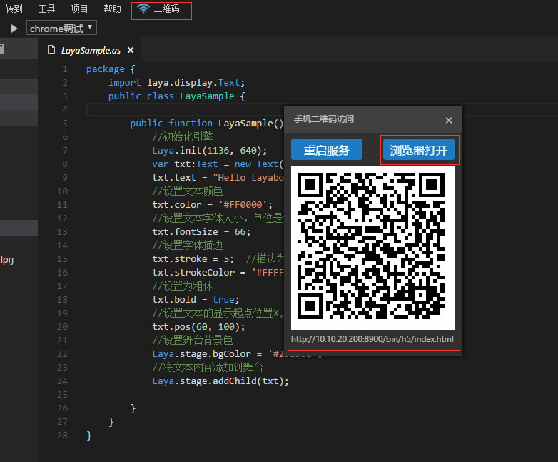
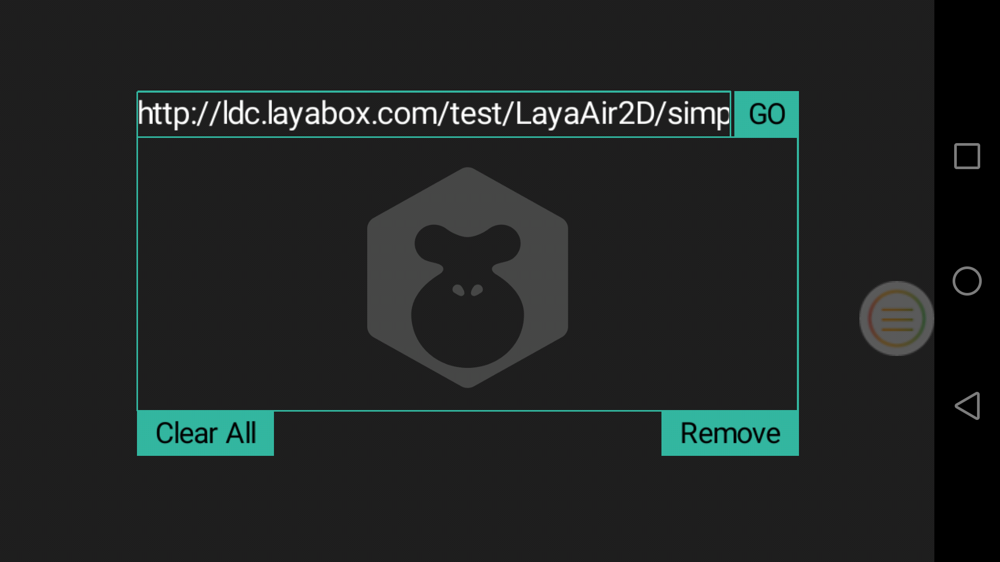

#  使用LayaNative运行LayaAir项目

この文書を見ていると、LayaAirまたはLayaAirについてある程度知っています。LayaAirの文書でLayaIDEを使って最初のプログラム「Hello LayaBox」を作成する方法を詳しく紹介しました。

＊Tips：プロジェクトのアドレスを入力した後、画面に何も表示されていないことが判明した場合、プロジェクトのために、水平画面が正しく設定されていない可能性があります。ドキュメントを参照してください。https:/github.com/layabox/layaair-doc/tree/master/Chinese/Layanative/screenmotion*。

ステップ1：Hello LayaBoxの簡単なプロジェクトを作成しました。図1に示すように、

運転効果は図2に示す通りです。

ステップ2：LayaIDE右上の「二次元コード」メニューキーをクリックすると、二次元コードインターフェースが現れます。画面の下にhttpアドレスが表示されます。例のアドレスは以下の通りです。`http://10.10.20.200:8900/bin/h5/index.html`を選択します

ステップ3：二次元コード画面の「ブラウザ開き」ボタンをクリックすると、ブラウザで`http://10.10.20.200:8900/bin/h5/index.html`モードで開き、開くと図4に示すように、

ステップ4：既に携帯電話にインストールされているLayaBoxテストアプリを開き、図5に示すように開く。

ステップ5：入力アドレス欄をクリックして入力し、`http://10.10.20.200:8900/bin/h5/index.html`を選択します

ステップ6：「GO」ボタンをクリックして、図7に示すように、

ステップ7：LayaNativeは、図8に示すように、このHello LayaBoxのプロジェクト例をロードする。

