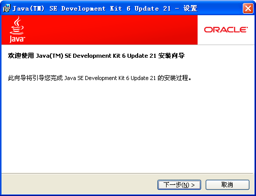
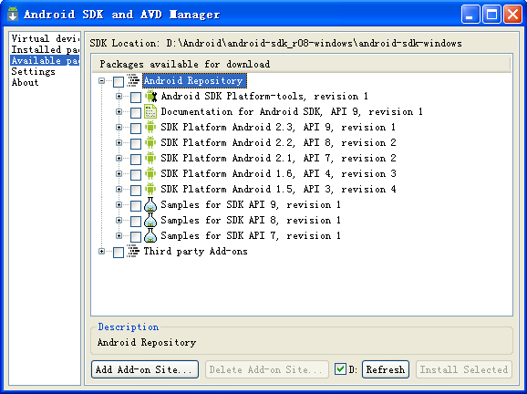
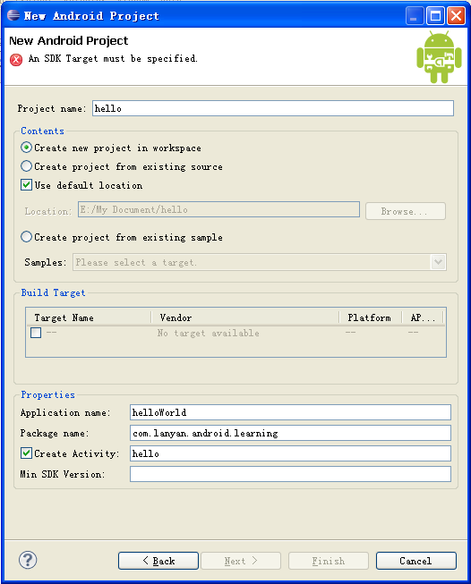
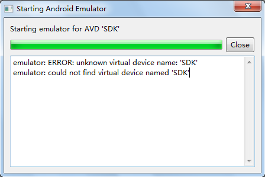
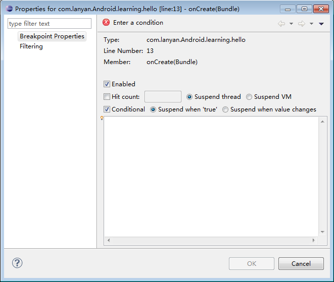
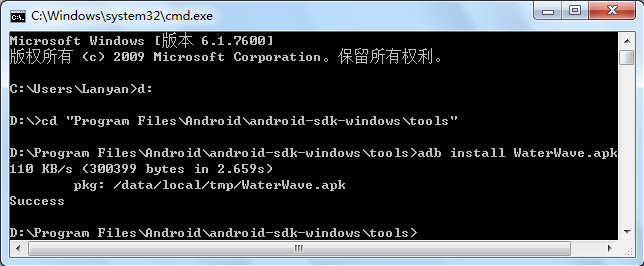

#Eclipse構築android環境

##一、JDKの取り付け

###1、JDKダウンロード

サイトを開く[http://www.oracle.com/technetwork/java/javase/downloads/jdk8-downloads-2133151.html](http://www.oracle.com/technetwork/java/javase/downloads/jdk8-downloads-2133151.html)「Java SE」のダウンロードページが見えます。図1-1のように、windows x 86バージョンをクリックしてダウンロードすればいいです。

**図1-1 Java SEダウンロードページ**

###2、JDKの取り付け

jdk-8 u 121-windows-586.exeをダブルクリックして、図1-2インターフェースのようになります。

**図1-2 Java SDK設定画面**

「次へ」をクリックして、インストール経路を変更して確認します。（D:\Java\jdk 1.6.0_21\、パスを変更したらJava\jdk 1.6.0_21\、インストールファイルとDディスクファイルが混在するのを防止します。）「次へ」をクリックしてください。

**図1-3 Javaターゲットフォルダインストール画面**

パスを変更して次のステップをクリックして完了します。

###3、環境変数の設定

XP：「マイコンピュータ」-->右ボタンのプロパティ-->「高度」－>「環境変数」－>システム変数（WIN 7：「マイコンピュータ」-->右ボタンのプロパティ-->「高度システム設定」－>「環境変数」－>システム変数）。

**次の3つの属性とその値を設定します。**

`java_home：D:\Program Files\Java\jdk1.6.0_21`

JDKのインストール経路を指しています。この経路でbin、libなどのディレクトリを見つけることができます。JDKのインストールパスは任意のディスクディレクトリを選択できますが、ディレクトリのレベルが浅いことをお勧めします。

`path：%java_home%\bin;%java_home%\jre\bin`

JDKを指すbinディレクトリには、さまざまなコンパイル実行コマンドが格納されています。システムは、任意の経路でJavaコマンドを識別でき、コンソールコンパイルが実行されるときに、大きな列を入力する必要はありません。さもなければ、javaプログラムを実行するたびに、まずそのclassファイルを%java Home%\binディレクトリの下に移動し、DOSを開いて経路をこのパスの下に変更して実行します。クラスファイル。

JDKをインストールすると、このディレクトリの下に二つの仮想マシン（JDKの下のJREとJRE）がありますので、二つの仮想マシンの下のbinフォルダが必要です。

パスに「jdk 1.6.0_21\bin」が追加されていない場合、図1-4に示すような状況が発生する。

**図1-4 javac問題**

`classpath：.;%java_home%\lib\dt.jar;`

Javaプログラムコンパイル実行時のクラスファイル検索パスを指して、JVMが使用または実行するクラスをどの経路に置くかを教えてくれます。JVMがclassファイルをロードするのに便利です。目的はユーザーがimport*、「.」という意味で、コンパイル運転時に現在のディレクトリのclassファイルを先に検索します。dt.jar作用は環境ライブラリを実行します。Java Swingで表示するサポートを提供します。WinRARで開くことができます。見てください。jarとzipフォーマットは同じです。拡張子だけが違っています。tools.jar役割はツールクラスとユーティリティを提供する非コアクラスです。libは開発ツールのファイルを提供します。

スタート-->「運転」を開き、「cmd」を打ち込み、dosシステムインターフェースに入ります。その後、「javac」を入力します。インストールが成功すれば、javacコマンドに関する一連のパラメータと使い方が表示されます。

特に注意してください。java＿Homeの後ろには「;」はつけられません。パス名はJDKの経路であり、JREではなく変数名には大文字と小文字は区別されません。

####追加：dt.jar、rt.jar、tools.jar

dt.jarとtools.jarは二つのjavaの最も基本的なカバンです。中にはjavaの中で最も重要なlangバッグから可視化のような各種の高級機能までが含まれています。

|jar包𞓜分類𞓜備考説明書
|--------------------------------------------------------------------|
|tools.jar|ツールクラスライブラリをコンパイルして実行するには、クラスsun.tools.java.*、sun.tools.javac.*|は通常javacの時にのみ使用されます。java xX.javaはjava-classis=%java Huhomes/lib/tools.clxjavas.xjavas.xjavas.comに相当します。アプリケーションサーバはJSPファイルをコンパイルします。アプリケーションサーバは自分でロードします。自分で設定する必要はありません。𞓜
ルートクラスのローディングパスの中で、classpathに追加する必要はなく、同じjre/libの下のほとんどのjarはこのパスにあります。検出方法：classpathの中のrt.jarを削除して、java-verboseコマンドで検出します。𞓜
|dt.jar|の運行環境の種類は主にswingバッグをswingに使う時が一番いいです。Eclipse開発環境はデフォルトではJREですので、設定が必要です。𞓜

**参照リソース:**

3つのjarパッケージの役割：[http://blog.csdn.net/hlw881008/article/details/5505251](http://blog.csdn.net/hlw881008/article/details/5505251)

Eclipseで3つのカバンの役割を見ます。[http://blog.csdn.net/dy_paradise/article/details/3909212](http://blog.csdn.net/dy_paradise/article/details/3909212)

JDK各フォルダの役割：[http://blog.csdn.net/qcontriver/archive/2010/03/09/5360975.aspx](http://blog.csdn.net/qcontriver/archive/2010/03/09/5360975.aspx)

##二、Eclipseの取り付け

###1、Eclipseダウンロード

公式サイトを開く[www.eclipse.org](http://www.eclipse.org/)をクリックして、Windows 32 Bit下のEclipse Class ic 3.6.1ダウンロードを選択します。[http://www.eclipse.org/downloads/download.php?file=/eclipse/downloads/drops/R-3.6.1-201009090800/eclipse-SDK-3.6.1-win32.zip](http://www.eclipse.org/downloads/download.php?file=/eclipse/downloads/drops/R-3.6.1-201009090800/eclipse-SDK-3.6.1-win32.zip)。D:\にダウンロードします。

###2、Eclipseの取り付け

ダウンロードしたzip圧縮パッケージを解凍して、eclipse.exe図をデスクトップのショートカット方式（右クリックチャート-->「送信」-->「デスクトップショートカット」）を作成して、起動しやすくします。

SDKはjavaのJDKのようです。ADTはただeclipseのプラグインなので、両者のインストール手順は厳密な要求がありません。

##三、SDKの設置

###1、SDKをダウンロードする

サイトを開く[http://www.onlinedown.net/softdown/32289_2.htm](http://www.onlinedown.net/softdown/32289_2.htm)AndroidにAndroidをダウンロードします。

###2、SDK取付

実行フォルダD:\Android\android-sdkcuur 08-windows\android-sdk-windowsのSDK Manager.exeが表示されます。図3-1が表示されます。インストールするファイルを選択してから、「Install」はlong long longの時間を待ちます。

**図3-1 SDKインストール画面**

メッセージがあったら「Failed to fetch URL…」エラーメッセージを表示するには、HTTPS方式をHTTP方式に変更し、「Android SDK and AVD Manager」画面の左側から「Settings」を選択し、「Force tps:/...」を選択し、「Save&Apple」をクリックして、SDK Setup.exeを再実行します。

ここで長い時間をかけましたが、古いファイルがダウンロードされていることに気づきましたので、注意が必要です。Available packagesをクリックして、高いバージョンのSDKを選択します。

**図3-2 Available packages**

**図3-3 Installed Packages**

注意：利用者に長い待ち時間を減らすために、ここでダウンロードしたディレクトリを圧縮ファイルにパッケージ化して、ステップSDKのインストールを実行する必要がなく、直接に解凍して使用することができます。ソフトウェアディレクトリのAndroid-sdk-windows.rar圧縮パッケージを参照してください。

インストール完了後のファイルリストは以下の通りです。一部は余分かもしれません。

add-ons：いくつかの拡張ライブラリ、例えばGoogle API Add-On

docs:APIドキュメントなど

各バージョンのプラットフォームコンポーネント

samples:いくつかのインスタンスプログラム

tools：各種補助工具

usbudriver:windowsの下のいくつかusbドライバ

temp:ダウンロードプラットフォームコンポーネントの一時ファイルを保存します。

###3、SDK配置

toolsのフォルダパス（私のパスはD:\Program Files\Android\android-sdk-windows\toolsです。）をpathの環境変数に加えると、環境変数の設定方法と同じです。

注意してください。この時はAndroid SDKを完全にしなければなりません。具体的な操作は以下の通りです。

1）SDK Location向けandroidディレクトリ

Windows preferencesのAndroidオプションは、SDK Locationの内容はAndroid SDKのインストール経路であるべきです。

補足：「SDKインストール」の過程で、直接解凍android-sdk-windows.rar圧縮パッケージであれば、まずSDK配置を行う必要があり、SDKのインストールを完全にすることができます。

**図3-4 Android SDKパス構成**

SDK Locationの値を設定しないと、図3-5エラーが発生します。

**図35 SDKパス未追加エラー**

2）eclipseのSDKを更新する。

「Window」-->「Android SDK and AVD Manager」-->「Installed packages」-->「Update All」-->「Accept All」－「Install Acceptted」詳細は図3-6を参照してください。すべてのインストール時間は約45分で、「ADB Restart」ダイアログが表示されます。「Yes」をクリックして、最後にeclipse以外のダイアログを閉じます。ADTのインストールが成功しました。

「Install Acctepted」の後に「Failed to fetp URL http:/dl-ssl.google.com/android/repository/repository.xml」が現れます。

多くの資料を検索しましたが、方法は以下の通りです。

1）「Android SDK and AVD Manager」左側の「Setting」を選択し、「Force https:/…」を選択します。このオプション;

2）「Ask before restretating ADB 4」の選択をキャンセルし、設定を保存します。このSDKダウンロード器には、「Save and Appley」がありません。設定を変更した後、自動的に指定された住所にrepository.xmlをダウンロードします。私は初めてバージョンを変えましたが、使用できません。以前のr 05バージョンで設定を修正してから、r 06のダウンロード機をスムーズに使えます。）

3）接続が成功したら、OKと説明します。次はダウンロードインストールです。

問題：左側には「セッティング」の選択肢がありませんが、実践的にはこの状況が現れても問題はありません。

必要なカバンを選択:

a.Android 2.0 Emullatorを試してみたら、「SDK Platform Android 2.0.API 5、revision 1」だけを選んでインストールすればいいです。

b.ここでSDK上開発のアプリケーションとゲームアプリケーションを行うなら、すべての許可内容を受け入れて遵守する必要があります。

**図36 SDK更新画面**

SDKを更新しないと、図3-7のようにAndroid Projectを作成する際に「An SDK Target must be specified」というエラーが発生します。

**図3-7 An SDK Target must be specifiedインターフェース**

##四、ADTの配置

Eclipseを開きます。Help->Install New Softwareは図4-1のダイアログを開きます。

**図4-1 ADTダウンロードURL設定**

「Location」に書き込み[http://dl-ssl.google.com/android/eclipse](http://dl-ssl.google.com/android/eclipse)赤枠の内容で記入し、最後にOKをクリックすると、図4-2画面が表示されます。「Select All」をクリックした後、赤枠のあるキー部分を同じように修正し、異なるページの下の「Next」を2回クリックしてから、「I accept the terms of license agreement」と「Finish」を選択して、約20分間を忍耐強く待って、システムInstall Software，Soft。意味この時、「Security Warning」が現れるかもしれません。主にADTは署名されていない内容を含み、有効性と真実性を持っていないので、引き続きインストールするかどうかを尋ねます。関係は大きくないです。「OK」をクリックして、最後にeclipseはADTを有効にし、「Restat Now」をクリックすればいいです。

**図4-2 ADT実装**

##五、シミュレータの作成（AVD）

Windows-->Android SDK and AVD Manager->Virtual devices->Newは図5-1で記入し、最後にCreate AVDをクリックすればいいです。

注意：左パネルのVirtual Devicesをクリックして、右側でNewをクリックしてください。そして、targetプルダウンリストにオプションがない場合、左パネルのAvailable Packagesをクリックして、右側でhttps://dl.google.com/android/repository/repository.xmlをクリックして、Install Sectledボタンを押してください。

**図5-1新しいシミュレータを作成する**

説明：Targetはシミュレータの利用可能なプラットフォームです。SDカードはメモリーカード、つまり携帯のメモリカードです。Skinはシミュレータが表示する画面サイズです。具体的なパラメータは以下の通りです。

>WVGA：800*480
>
>QVGA：320＊240
>
>VGA:640*480
>
>HVGA：480＊320
>
>WQVGA 400:240*400
>
>WQVGA 432:240*432
>
>WVGA 800:800*480
>
>WVGA 854:854*480

またはResolutionを選択してシミュレータ画面サイズを自由に設定することもできます。Hardware（AVDに必要な特殊設備）の値：Abstracted LCD density（解像度）の値は選択されたSkinによって自動的に設定されるなど。

**図5-2シミュレータを実行する**

SDK Android 2.2を選択して、Start-->Launchをクリックして、図3-3のシミュレータが現れます。

**図5-3シミュレータを起動する**

**図5-4未知の仮想デバイス**

androidシミュレータが間違っています。emulator:ERROR:unknown virtual device name

私の文書のデフォルトの位置が変更されました。作成されたファイルパスの参照が間違っていたためです。

法一：「F:\Users\username」\androidのファイルを「C:\Users\username」/.androidにコピーしてこの問題を解決しますが、このような解決策には明らかな欠点があります。それは新しくAVDを設立したら、また新たにコピーしなければなりません。

法二：「マイコンピュータ」-->右クリックのプロパティ-->「高度」－>「環境変数」-->「システム変数」-->「新規作成」の変数名は「ANDROIDUSDKuHOME」です。）変数の値をAVDの「.android」フォルダの位置に変更します。例えば、「F:\Android Emultor」です。ここでAndroid SDKバッグに入れます。値は「D:\Program Files\Android\android-sdk-winds」です。

##六、ハロルドプログラム

###1、Android Projectを作成する

「File」－>「New」－>「Other」－「Android」－「Android Project」が表示され、図3-1画面が表示され、必要に応じてProject name、Apple name、Package name、Create Activityコンテンツを記入し、Build Targetを選択すればいいです。

**その中:**

プロジェクト名は、実際に1つのフォルダに対応します。

Build Target：アプリケーションで使用されるSDKバージョンを選択します。

アプリname：プログラムの名前は、一般的にアプリケーションのタイトルバーに表示されます。

Pakcage name：この名前は理論的には自由にできますが、Pakcageには一定の命名規範があります。すなわち、第一目は組織タイプを指定します。たとえば、comは一般的に会社を指します。orgは組織、eduは教育部分を指します。

Creak Activity：ActivityはAndriodプログラムの実行エンティティであり、C言語のmain関数に似ています。Androidプログラムは、main関数と似た複数のエンティティがあります。

Min SDK Version：この項は一般にBuild Targetに対応しており、特に指摘する必要はない。

**図61 New Android Project**

###2、AVD設備の作成

5節目に会います。AVDデバイスを作成していないなら、大丈夫です。プロジェクトを右クリックしてください。「Run Configrations」-->「Android Application」-->「Android」出たダイアログで「Launch a new Android Virtual Device」を選択し、SDKを選択してOKをクリックしてください。

###3、コンパイル運転プログラム

ハロー.javaファイルを開きます。その内容は図6-2に示されています。

**図62ハロー.javaファイルの内容**

**図63 Java Build Path設定**

Project-->Propertiesは、図6-3のダイアログボックスが表示され、Android 2.2をチェックし、OKをクリックします。Run-->Run（Ctrl+F 11）->Yes-->SDKを選択し、Start->Launch-->OKをクリックして、2分後に図6-4の結果画面が表示されます。成功を示します。

注意：運転するjavaファイル-->「Run As」－「Run Configrations」-->「Androidアプリ」-->「Android」（実行する工事名を記入）を右クリックします。「Target」（配備装置の選択をMannulとして設定し、複数の配置機器がある場合の混乱を防止します。）「Run」

**図64運転結果画面**

ソースを参照:[http://blog.csdn.net/zhq56030207/archive/2010/08/31/5852130.aspx](http://blog.csdn.net/zhq56030207/archive/2010/08/31/5852130.aspx)

###4、デバッグプログラム

####DDMSでプログラムをデバッグする:

（1）Eclipse開発ツールの作業画面をDDMSタグに切り替えます。図6-5と図6-6に示すように。

**図65ビューレイアウト表示動作を開く**

**図6-6ビューレイアウト選択ボックス**

（2）「DDMS」画面で「Devices」タブを選択し、メニュー機能を確認する：Debug Process（デバッグプロセス）、Update Threads（更新スレッド）、Update Heap（更新ヒープ）、Cause GC（ゴミ回収の原因）、Stop Process（停止スレッド）、Screen Capture（スクリーンショット）、Resbude buidge（再起動）メニュー。

####DDMSの「Logcat」でプログラムをデバッグする

（1）「Logcat」は、「andrdoi.util.Log」類の静的な方法によりエラーと印刷システムログメッセージを検索する。

andrdoi.util.Logでよく使われる方法は、以下の5つがあります。

Log.v(String msg);VERRBOSE

Log.d(String msg);DEBUG

Log.i(String msg)INFO

Log.w(String msg);WARN

Log.e（Stering msg）；ERRORは、「ブレークポイント」方式のデバッグプログラムに適用されます。

Log.v、Log.d情報は開発過程にのみ存在するべきで、最終バージョンはLog.i、Log.w、Log.eの三つのログ情報のみを含むことができる。

（2）「Run」-->「Debug」メニューコマンドをクリックして、デバッグモードに入ります。

（3）「DDMS」画面に切り替え、「Logcat」タブをクリックして、私たちがプログラムに印刷したばかりのログ情報を確認します。異なる色でレベル別の情報を表示し、フォローしやすいです。

(4)デバッグ方法

1）ブレークポイントを設定し、シングルステップで実行します。ある行のマークバーをダブルクリックします。

2）条件のブレークポイントを宣言し、終了をトリガします。ブレークポイントは式の値が変化した時にトリガされます。ブレークポイントを設定した後、右クリックしてブレークポイントを選択し、「Breakpoint Prperties」をチェックして「Enbale」、「Condational」をクリックして、ボックスに表式変数を記入します。満足するとプログラムが保留されます。また、条件式を入力する時にコードヘルプを使用することもできます。コンテキストメニューでは、Ctrl+Shift+Iまたは右クリックで変数を選択し、結果を表示します。

**図67デバッグ画面の設定**

##七、既存プロジェクトを導入する

###非Androidプロジェクトの導入方法：

「File」-->「Import」-->「General」-->「Existing Project into Workspace」-->「Next」-->「Select root directory」-->「Browse」は、導入するプロジェクトの位置を選択します。

注意：Androidのカバンがない場合は、「Build Path」を再設定する必要があります。

###Androidプロジェクトの導入方法：

「File」-->「New」-->「Project」-->「Android」-->「Android Project」-->「Next」-->「Contensts」-->「Project name」（別名），「Create project from existing source」——「Location」――「Browse.」フォルダが選択されている。擬器プラットフォームバージョン>「Finish」。

##八、APKソフトのインストール

###1、シミュレータにAPKソフトをインストールする

まずAndroid SDKのところに入ると、シミュレータの起動に数分の時間がかかりますので、まずコマンドでシミュレータを起動します。その後、plotform-toolsの下のファイルをAndroid SDKフォルダの下のtoolsにコピーします。tform-toolsの環境変数）を開いて、cmdを入力し、「確定」をクリックし、「adb install」を入力して、実行するappkをcmdに引いてEnterを押すと、図8-1のインターフェースが表示されます。Success！

**図8-1コマンドプロンプト画面**

注意：plntform-toolsの下のファイルをtoolsにコピーするか、またはplntform-toolsのパスをpathの環境変数に加える必要があります。adbコマンドはplotform-toolsにtoolsにないので、この操作をしないと図8-2のエラーが発生します。

**図8−2‘adb’は、内部または外部コマンドインターフェースではない。**

appkファイル名に中国語が含まれている場合、図8-3のエラーが発生します。中国語を英語と数字に変更すればいいです。

**図8-3「Segmentation fault」エラー画面**

**図8-4 appkインストール効果画面**

インストールが成功するとシミュレータパネルに赤い枠のアイコンが表示されます。クリックして実行します。

###2、シミュレータでAPKソフトをアンインストールする

「Setting（図8-4のSettingアイコンのように）」「Application」（アプリケーションプログラム）－「Manage Application」（管理アプリケーション）－「WaterWave」－「Unistall」（アンインストール）－「OK」（確認）。このとき、アンインストール成功パネルの「WaterWave」アイコンが消えます。

**図8-5 APKアンインストール成功**

###3、実機にAPKソフトをインストールする

まず「設定」-->「アプリケーション」-->「未知のソース」-->「戻り」-->「開発」にチェックを付けて、「USBデバッグ」を選択します。

####3.1方法一

91の携帯電話アシスタントfor Androidをダウンロードしてインストールします。携帯電話とパソコンをUSBで接続し、図8-6のように91アシスタントを開く。

**図8-6 91携帯アシスタント開始画面**

「手動接続」－>「USB接続」－>「？」-->「システム保守」－>「ファイル管理」－>「クイックエントリ」－>「メモリカード」－「デバイスにアップロード」－「ファイル」（インストールするものを選択します。appkファイル）>>インストールするアプリケーションファイルをダブルクリックして、図8-7が現れたら、インストールをクリックして完了します。

**図8-7アプリインストール画面**

簡単な方法：直接ダブルクリックして、アプリを携帯にインストールします。

####3.2方法2

http://www.hiappk.com/bs/thread-4541-1.にHAPK Installerをダウンロードして、直接ダブルクリックしてインストールできます。このソフトウェアは自動的にあなたのAPKプログラムに関連しています。APKプログラムをダブルクリックすれば自動的に携帯電話にインストールできます。

**図8 HiAPK Installerインストール成功インターフェース**

####3.3方法3

ASTRO（ファイルマネージャ）をインストールします。ASTRO.appkを携帯電話のSDにセットして、携帯電話のファイルマネージャの中のSDカードにこのappkファイルをポイントしてから、パネルにASTROのアイコンが表示されます。今後ソフトウェアをインストールする時に、appkファイルをSDカードに拷問すれば、携帯電話のAPKインストーラでソフトウェアのインストールとアンインストールができます。

####3.4方法四

携帯電話の内蔵APKインストーラをダウンロードし、SDカードにアプリファイルを拷問し、携帯電話で操作してインストールすればいいです。

補足：ファイルマネージャの機能：ファイルビュー、ファイル管理、ファイル検索、プログラムのアンインストールとバックアップ、プロセス管理、SDカードの状態。

APKインストーラ：appkファイルをインストールするプロセスを簡略化し、パソコンで操作すればアプリを携帯電話にインストールすることができます。

注意：携帯電話でパソコンに接続するときは、ドライバやAPKのインストーラをダウンロードします。そうでなければ、携帯のメモリーカードだけがパソコンに接続されています。携帯は接続されていません。