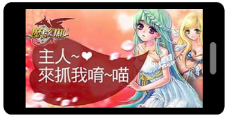

#Layaboxエンジンのゲーム事例

Layaboxは2011年にHTML 5のゲームエンジンの開発を開始して以来、非オープンHTML 5のエンジンLAYAを経て、初代HTML 5のエンジンLayaFlash、第二世代のオープンソースHTML 5のエンジンLayaAir、三つの段階があります。

##LAYA非オープンエンジン

**JS言語開発に基づいて、キャンバスレンダリングモードを採用し、主なオンライン代表作品は全部で3種類あります。**

###第一号「クレイジー雪だるま」

HTML 5業界初のマルチ人同スクリーンオンラインのレジャー対戦型大型ゲームで、オンライン時間は2012年で、2017年まで同じ水準のHTML 5ゲーム競合品が現れていないので、LAYAエンジンの技術力を明らかにしています。

このゲームはすでにHTML 5バージョンとAndroid APKバージョンを発表しました。HTML 5バージョンは2016年末までQQゲームホールのPCクライアントで運営されています。

QQゲームホールの《狂おしい雪のボール》ゲームの住所は：[http://qqgame.qq.com/app/gamedetail_10434.shtml](http://qqgame.qq.com/app/gamedetail_10434.shtml) 

​ 
図（1）『狂雪球』

###第二項「上吧主公」

（曾用名三国ミニャース）は業界初のカード戦略類HTML 5の大型ゲームで、オンライン時間は2013年、HTML 5版台湾の版権金は300万元に達し、APP版は台湾地区ランキングTOP 10に登録した。2015年、HTML 5版はAndroidのQQブラウザでオンラインし、月水の最高時は百万を超えます。現在はまだオンライン運営状態ですが、Layabox公式サイトの事例では二次元コードをスキャンして直接体験することができます。

​ 

図（2）『上吧殿』（曾用名三国ニャース）

###第三項「猟師2」

業界初の重度動作類HTML 5の大型ゲームで、2015年にAndroid QQブラウザでオンラインし、APP級の精美な画質と滑らかで美しい動作効果で、HTML 5ゲーム業界が立ち上がりたばかりの段階で、HTML 5技術がAPPゲームの重度ゲームの品質と効果を実現できることを証明しました。LAYAエンジンは製品の表現力でエンジンのピークの実力を証明しています。

​	 
図（3）『猟師2』

##Layabox初代オープンエンジンLayaFlash

AS 3言語開発に基づいて、Canvasレンダリングモードを採用して、HTML 5業界で唯一Flash AS 3言語及びAS 3原生API開発HTML 5ゲームを全面的にサポートするエンジンです。2015年に発表された後、一年間でこのエンジンに基づく製品はQQブラウザで十数種類以上オンラインされています。第二世代エンジンのLayaAirがより強い性能と言語サポートにより、第一世代エンジンのLayaFlashは更新メンテナンスを停止しました。

###LayaFlash代表作品「酔西遊」、

ForgameグループのPC端末の総流水は6億元を超えるトップクラスのMMORPGページで、LayaFlashエンジンを採用した移植作品で、HTML 5業界初のAPP級MMORPGの大型ゲームです。2016年に初めてQQブラウザで発行されました。

​	 
図（4）『酔西遊』（符号を掃けば体験できる）

###LayaFlash代表作「モカファンタジー」

有名な携帯ゲームの研究開発者の憧れとネットの千万級の月水の手遊びの逸品です。LayaFlashを通じてHTML 5製品に移植されました。慕とネットの会社の変事のため、後でこのゲームはQQブラウザーがオンラインに行った後に間もなく維持しております。

​ 
図（5）『モカ幻想』

###LayaFlash代表作「ミニハンター」

日本の人気マンガ「ハンターフルタイム」を原作としたRPGカードゲームで、AS 3のStaringフレームを使って開発され、LayaFlashエンジンを通じてHTML 5ゲームが発表されました。

​	 

図（6）「ミニハンター」（コードをスキャンして体験できます）

##Layabox第二世代オープンエンジンLayaAir

　　**アクションScript 3、Type Script、JavaScriptの3つの言語開発をサポートし、Canvas、WebGLの2つのレンダリングモードをサポートし、2 D、3 D、AR、VRのゲームの開発をサポートします。Flash、HTML 5、APP（AndroidとIOS）の多様なバージョンを同時にリリースすることができます。**Runtimeを必要としないブラウザの裸走行環境では、LayaAirゲームの性能はAPPゲームに匹敵する。LayaAirは2016年4月にソースを発表しました。このエンジンはテンセント、仙海、蝶々インタラクティブ、ハッピーネット、三七インタラクティブ、フィート、91 wan、相互愛インタラクティブなど有名な研究開発会社に採用されました。

###LayaAir代表作「エンドレスナイト3 D」

HTML 5業界初の商業化となる置類ARPGの大型3 Dゲームです。無限騎士の誕生とその流暢な性能表現はHTML 5がAPP級の大型3 Dゲーム逸品を実現できると証明しました。

​ 
図（7）『エンドレスナイト3 D』（スキャンコードで体験できます）

###LayaAir代表作『QQ花藤』

QQ空間の有名なIP製品で、QQ空間の携帯電話版の中で盛んな社交種類の大型のレジャーゲームです。携帯電話のQQ空間APPをインストールした仲間はコードをスキャンして直接体験できます。

​	 

図（8）『QQ花藤』（符号を掃くだけで体験できる）

###LayaAir代表作「至高のトランプ」

は、ボードコミュニティゲームで、このゲームは、釣りゲーム、地主のチェスゲームなどの統合されています。

​	 
図（9）『至尊のトランプ』（符号を掃けば体験できる）

もっと多いLayaAir代表作品はLayabox公式サイトの判例欄に行ってください。体験：http:/www.layabox.com/html/game-list/