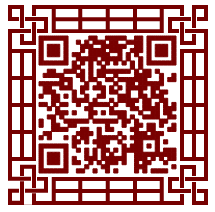

#Layaboxのエンジンはゲーム以外のケースです。

Layabox傘下の第二世代エンジンLayaAirは、HTML 5契約に基づく世界初の万能オープンエンジンです。世界唯一のFlash AS 3、JavaScript、Type Scriptの3つの開発言語をサポートし、同時にAPP、HTML 5、Flashの3つのバージョンをリリースするゲームエンジンです。2 D\3 D\VR\ARのゲーム開発に対応するほか、エンジンはアプリケーション、広告、マーケティング、教育など多くの分野に利用され、APPエンジンに匹敵する性能を持っています。

多くのゲーム以外の事例の中から、いくつかの有名な代表作品を選んで、開発者の友達に展示します。

##一、LayaAir IDE

LayaAir IDEはLayaAirエンジンによって開発されたもので、LayaAir UIシステムに基づいて、可視化編集機能と適応効果を実現します。オリジナルデスクトップソフトとは違いがないように見えます。
​ 
図（1）はLayabox公式サイトでダウンロードできます。

##二、バーバリーの微信H 5広告

上海の彼の町はLayaAirエンジンを使って開発した贅沢なブランドのBurberryの新年広告が微信の友達の輪に現れて、一時的に話題になりました。H 5全体はプライベートオーダー、商品展示、呉亦凡拝などの要素を融合させ、精美な画質、流暢な体験、優れたビデオ再生性能を融合させ、Burberryの英風優雅さを表現しました。

​ 
図(2)

​ 
図(3)

##三、深セン地下鉄路線図

2016年、深セン地下鉄は市民の旅を便利にするために、LayaAirエンジンを使ってオンライン地下鉄運営ネットワーク路線図を作成しました。市民が各駅間の往来と乗り換えをリアルタイムで調べて、市民が旅行路線を明確に計画することができます。

​ 
図（5）は深セン地下鉄の公式サイトで体験できます。

##四、美団マーケティング広告

 

（図6-1）美団H 5マーケティング広告のスクリーンショット

 

（図6-2）美団H 5マーケティング広告体験二次元コード

##五、楽視マーケティング広告

 

（図7-1）楽視マーケティング広告のスクリーンショット

 

（図7-2）楽視マーケティング広告体験二次元コード