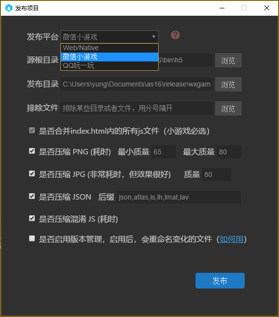

新しいリリースパネル（テストバージョン）を追加し、古いリリース機能に代わります。

主に以下の新機能を更新しています。

##-QQを増加して遊んでサポートを発表して、普通のプロジェクトがQQに発表して遊んでみてください。微信小ゲームのリリースサポートを充実させ、TSとJSプロジェクトで使うjsファイルをワンタッチで統合します。
##-古い発表プロセスを改善し、png、jpg圧縮を改善し、json圧縮を増加し、js混淆を増加する。新しいリソースバージョンの管理メカニズムを追加し、リソースの変化を自動的に維持し、対応するマッピングテーブルを生成します。

また、古いリリースシステムもプロジェクトメニューに移行し、今後はよりスマートに機能を最適化します。

教程を発表します。https://ldc.layabox.com/doc/？nav=zh-as-2-4

QQはシミュレータの効果を遊んでみます。

