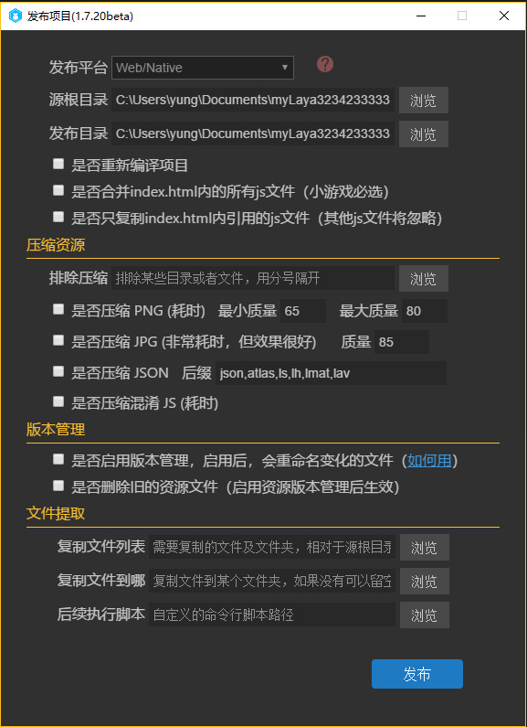
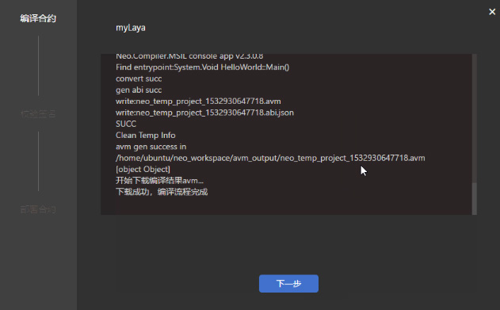

を選択します。**小さいゲームの発表の流れを完備させます。**

再コンパイルするかどうかのオプションを追加します。

古いリソースファイルを削除するかどうかのオプションを追加します。

リソースツリーのフィルタ方式を改善し、ファイルとフォルダの形式をサポートします。

   

​

を選択します。**ETH、NEOブロックチェーンプロジェクトのサポートを追加し、ブロックチェーンプロジェクトの作成、コンパイル、配置などの機能を提供します。**

ETH、NEOブロックチェーン応用開発へのサポートを追加しました。

統合知能契約の開発、コンパイル、署名、配置などの流れ

を選択します。**View Stockの編集挙動を改善し、ノードコントローラによる表示隠しにより、より便利に使用できます。**

を選択します。**1.5.20.1バグを修正する**

フレーム属性パネル特定の場合に表示されない不具合を修正します。

mac圧縮pngとjpgのエラーを修正します。

​

を選択します。**1.9.0.2バグを修正する**

リリースパネルを修復し、圧縮不良のバグを排除する。

macを修正して、layanativeが間違っているバグをリリースします。