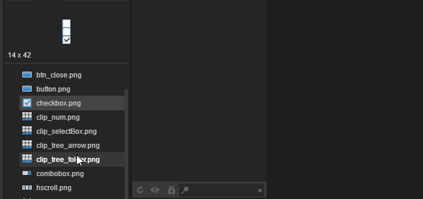

###新しい特性

エディタのツリーコンポーネントをツリーの上と下にドラッグすると自動的にスクロールします。

プロパティパネルの数字入力ボックスは、キーボードの上下キーの値変更をサポートします。

動画パネルにCtrl+C Ctrl+Vを追加して貼り付けフレームをコピーします。

アニメーションファイルを開くと、エラーデータがあるかどうかを自動的に検出し、エラーデータを削除します。

アニメーションKフレームのショートカットキーをKに変更します。クイックKフレームが便利です。

リソースパネルに複数のリソースを追加し、パッケージ化できるかどうかを設定します。

相対レイアウト属性を削除する場合は、その時のxy座標を保存します。

貼り付け時にvarを削除し、var値を変更した時に同じ値が存在したことを検出した時に現在の変化の値を削除します。

###修復Bug

入力ボックスctrl+Aを修正するとテキストボックスが選択できなくなります。

検索置換時に、粒子ページが開いているとエラーが発生します。

キーフレームの削除時に正確に更新されていない問題を修正します。

動画パネルのスクロール不良を修正します。

