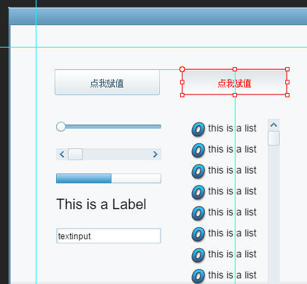
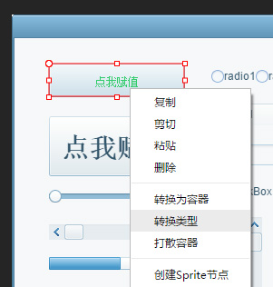

###新しい特性

参照線を追加します。使用方法：ルーラーを開けてルーラーからドラッグします。（テストバージョン）

吸着配置機能を追加します。使用方法：コンポーネントをドラッグしながらCtrlキー（テストバージョン）を押します。

Ctrl+T変換コンポーネントの種類を追加します（またはコンポーネントを選択して、マウスの右ボタンで「変換タイプ」を選択します）。

Spine変換ツールでサポートされているバージョンを更新します。

###修復Bug

asプロジェクトを解決するには、runclassのコンポーネントのエクスポート結果が間違っている問題があります。

オブジェクトをドラッグすると幅が高く0になる問題を解決します。

