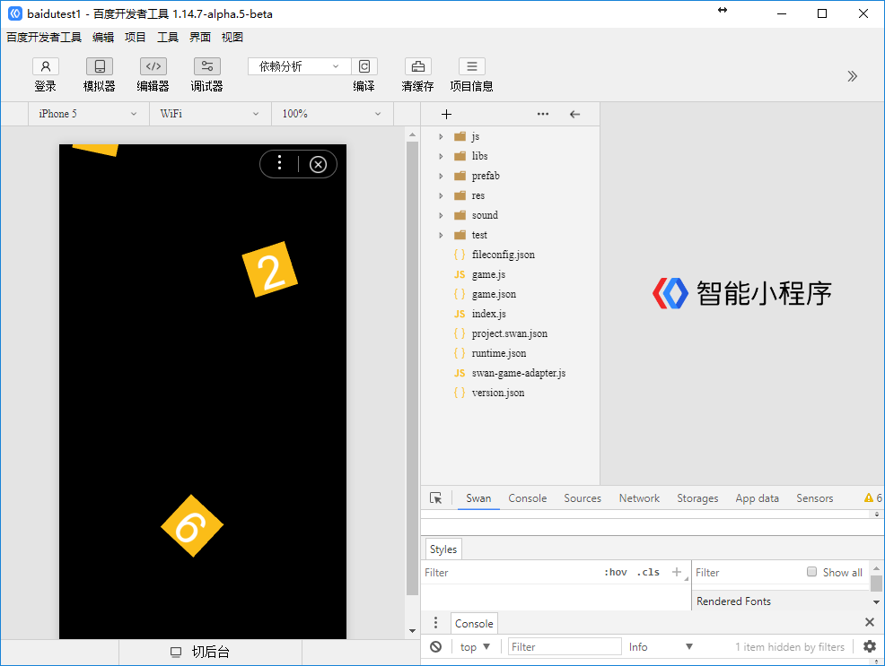

#百度の最初のゲームを作成します。

>*author:charley version:LayaAir 2.0 udate:2018-10-27*

###一、開発環境を整える

####1、LayaAirIDE統合開発環境をダウンロードしてインストールする

LayaAirIDEはLayaAirエンジンの集積開発環境であり、LayaAirエンジンとサンプルプロジェクト、UI、アニメーションなどの可視化編集、プロジェクトコードの作成と管理などの開発ツールを集積しています。**beta 5以降の開発者はLayaAirIDEを直接採用してBaiduのゲームプロジェクトを作成し、リリースすることができます。**

**公式サイトのダウンロード**:[http://ldc2.layabox.com/layadownload/?type=layaairide](http://ldc2.layabox.com/layadownload/?type=layaairide)

####2、百度開発者ツールをダウンロードしてインストールする

Baiduの開発ツールは主に、ミニゲーム製品のプレビューとデバッグ、実機テスト、アップロード提出などに使います。ミニゲーム開発に必要なツールです。

**開発ツールのダウンロード先**:
[まだ開放されていません。提携は私達のビジネスと連絡して取得できます。]

  

####3、開発者ID（AppID）を取得する

アプリIDがなくてもデバッグは開発できますが、機能は制限されます。

開発者IDはまだ登録されていません。もし必要があれば、私達のビジネス協力に連絡してください。

###

###二、LayaAirIDEでBaiduのミニゲームプロジェクトを作成し、発表します。

####1、LayaAirIDEでBaiduのミニゲームの例を発表します。

2.0はもう適格な操作は必要ないです。発表する時にBaiduのミニゲームを選択すればいいです。

ファイルの抽出が重要です。Baidu 5 Mパッケージのアップロードの制限のためです。ファイル抽出機能により、指定されたBaiduのミニゲームプロジェクトディレクトリに5 Mパッケージのファイルのみをコピーすることができます。この機能はWeChatゲームと一致します。下図のように。

>パッケージ制限は、10 Mまで可能です。関連内容は他のドキュメントで紹介されています。この記事は初心者向けの、簡単なゲームリリースの流れを把握しています。

 

（図：ファイル抽出機能は、クリックして閲覧した後、選別できます。チェックした5 Mパッケージファイルだけをコピーします。）

**Tips**:

>リリースプラットフォームの右側の疑問符アイコンをクリックすると、各オプションの詳細な説明が表示されます。

リリースに必要な内容を設定してから。最終クリックでリリースします。Baiduのゲームプロジェクトを生成することができます。

###三、百度の開発者ツールでミニゲームプロジェクトを作成する

####1、作成項目

Baiduの開発ツールを開きます。ポップアップパネルで左側のプラス記号をクリックして作成します。

 

  

`项目目录`抽出機能でコピーしたばかりのローカルパッケージを選択した方がいいです。この機能についてはまだ詳しくないです。フローを実行するために、LayaAirIDEがリリースしたばかりのゲームのカタログ（通常はプロジェクトのルートディレクトリの下のrelease\bdgame）を一時的に選択することもできます。

`AppID`Baiduの開発IDを入力すればいいです。（登録をまだしていません。ビジネスに連絡する必要があれば）、入力しなくてもデバッグを開発してミニゲームをクリックする体験ができますが、機能は制限されます。だからAppIDを入力したほうがいいです。

####3、百度開発ツールのコンパイル

ゲームアイテムの作成が完了したら、ツール内で効果とデバッグをプレビューできます。

 

