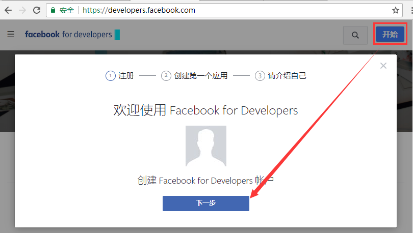
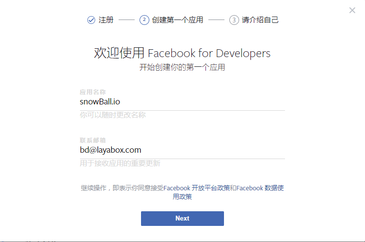

#Facebook開発者ヘルプガイド

###一、壁を乗り越える（VPN）

入る必要があります[https://www.facebook.com/](https://www.facebook.com/)公式サイトの登録、登録、テストなどは壁を越える必要があります。

壁を越えるには何を使いますか？みんなは自分で百度を選んだり、友達を探して比較を聞いたりすることができます。ここでよく使うものを二つ紹介します。

無料で有名な壁を開ける道具は青ランプで、無料版は流量制限があります。

青ランプ:[https://github.com/getlantern/forum](https://github.com/getlantern/forum)

有料のオススメのmonoloudは、長い時間の検証を経て、まだ安定しています。しかも高くないです。一ヶ月10元で、一年99元です。公式サイトには各種のコースがあります。

Monocloud:[https://monocloud.net/](https://monocloud.net/)

具体的にはVPNはどう使いますか？ここで詳しく話しません。（PS：無料広告で、何の利益もありません＾＾）

###二、フェイスブックの開発者となり、アプリケーションを作成する。

####1、開く[facebook官网](https://www.facebook.com/)を選択して、Facebookアカウントを作成します。アカウントがあれば、このステップをスキップしてください。

  

名前、携帯電話またはメールボックス、パスワードなどを入力して、アカウントを作成することをクリックします。細かいことは多く言いません。

####2、開発者に登録する

アカウント登録が完了したら、リンクhttps:/developers.facebook.com/を入力して、Facebook開発者センターに入ります。右上にあります`开始`ボタンをクリックします**開始**開発者アカウントを作成するプロセスに入ります。

  

作成画面では、登録したら直接にFacebook for Developersアカウント作成の流れに入ります。直接に次のボタンをクリックすると、開発者アカウントのバインディングと作成が完了します。**適用**作成プロセス。ログインしていないユーザーはログインウィンドウをイジェクトして、先にログインさせます。

####3、最初のFacebookアプリケーションを作成する（ゲーム）

登録プロセスの画面でクリックします。**次のステップ**後弾後は、アプリケーション作成の流れに入ります。

 

アプリケーション名と連絡先のメールボックスを入力し、クリックします。**次のテキスト**(次のステップ)最初のアプリケーションの基礎情報を初期化します。

####4、開発者の機能

開発者アカウントとアプリケーションの基礎情報を結びつけ終わった後の流れは自分を紹介します。インタフェースにはエンジニア、製品マネージャーなどのオプションがあります。この流れはクリックして飛ばしてもいいです。記入しないでください。

 

5、

