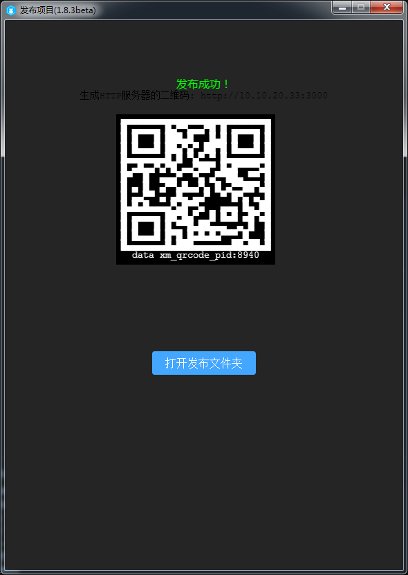

#ミニゲームのリリースとデバッグガイド

>udate：2019-05-15
>
>ミニゲームのリリースはLayaAirIDEを使用しなければなりません。IDEのダウンロード使用については、関連文書を確認してください。本編の紹介の範囲内ではありません。

##1、ミニゲームのリリース、デバッグ環境の準備

1、小米ブランドの携帯電話（MIUI 8.5または以上のバージョンが必要です。）

2、小米のテストアプリをダウンロードして、ページをダウンロードする：[[https://dev.mi.com/console/doc/detail?pId=1738](https://dev.mi.com/console/doc/detail?pId=1738)」（https://dev.mi.com/consolie/doc/detail？pId=1704）

ページに入ったら、ダウンロードしたクイックゲームのデバッターをクリックしてください。インストールができます。どのようにテストアプリをインストールするかについては、ここでは紹介しません。

3、PCのchromeブラウザと携帯電話のデータ接続線。

4、nodejsを設置する環境[node官网：[https://nodejs.org/en/](https://nodejs.org/en/)」

インストールをダウンロードするということです。簡単です。詳しく紹介してくれません。コマンドラインでnpmコマンドをセットできたら成功です。

5、LayaAirIDE集中開発環境、LayaAir 1.8.2または以上のバージョン[ 官网下载: [https://ldc.layabox.com/layadownload/?type=layaairide](https://ldc.layabox.com/layadownload/?type=layaairide)

6、ADBの取り付け

ADBの設置を提案します。授権や他の理由がわからない場合がありますので。正常に起動できなくなります。chrome聯真機のデバッグができません。したがって、ADBをインストールすると、携帯電話とPCの接続許可を確認したり、助けたりすることができます。USBデバッグのライセンスがないことを確認すれば、インストールしなくてもいいです。

 [ ADB官网下载:  [http://adbshell.com/downloads](http://adbshell.com/downloads)」

簡単にヒントを与えると、ADB Kitsをダウンロードして、ダウンロードした後の圧縮パッケージは、一つの経路で簡単にいくつかのディレクトリに展開することを提案します。`D:\adb`を選択します。環境変数を追加することを覚えてください。

##2、ミニゲームのリリースとアクセスの完全な流れ

###1、ミニゲームパッケージ（X.rpk）をリリースする。

LayaAirIDEのリリース機能には、ミニゲームのリリース機能が内蔵されています。まずLayaAirエンジンの項目を、リリース機能により.rpkのサフィックスのパッケージにする必要があります。リリース機能の使用について。ここでは重複しないように紹介します。いいえ、公式文書で確認できます。

リリース前に必ずエンジン初期化を確認する必要があります。コード：ts、jsはLaya.KGMiniAdapter.init（）です。

asはKGMinia dapter.init（）である。

リンク:[[https://ldc.layabox.com/doc/?nav=zh-as-2-0-4](https://ldc.layabox.com/doc/?nav=zh-as-2-0-4)」（https://ldc 2.layabox.com/doc/？nav=zh-ts-2-6）

###2、保留して二次元コードインターフェースをリリースします。

リリースが完了すると、図1に示すように二次元コードの画面があります。このインターフェイスは消さないでください。後ろの携帯はコードスキャンをして使います。

 

（図1）

###3、リリースフォルダを開き、コマンドラインモードを起動する

図1をクリックします`打开发布文件夹`ボタンを押して、発表後のミニゲームのカタログに入ります。を押します`Shift + 右键`現在のディレクトリでは、図2-1または2-2に示すように、shellまたはコマンドウィンドウモードに素早く入ることができます。

 

（図2-1）

 

（図2-2）

もちろん、Gitを介してコマンドライン（Git Bash Here）に入るか、または他の方法でコマンドラインに入ることもできます。そして、ミニゲームのカタログに入ると、このステップが完了します。

このコーナーは主に開発者に命令ラインモードで現在のリリースディレクトリにどうやって入るかを教えます。chromeデバッグを起動するデバッグコマンドは、ミニゲームのリリースディレクトリで操作しなければなりません。ここでまず簡単に理解して、コマンドラインを保持するのは開けます。後で使います。

###4、スタートchromeデバッグ環境

####4.1クイックアプリケーションにインストールして、試験器に入る

パソコンPCのchromeデバッグ環境を起動するには、まずミニゲームのデバッグアプリ（クイックアプリデバッグ）をインストールして、図3に示すようにします。をクリックして入力します。

 

（図3）

####4.2クイックアプリケーションのインタフェースでコードをスキャンしてミニゲームのrpkパッケージをインストールする

クイックアプリケーションのコーディネーターに入ると、図4に示すようなAPP操作インターフェースが見られます。

 

（図4）

この時、図4のスキャンコードのインストールをクリックして、LayaAir IDEの画面上の二次元コードをスキャンします。携帯電話は本物の環境で運行できます。

>ここで提示したいのは、携帯電話のネットワークはPCと同じローカルエリアのネットワークセグメントであることです。

配布カタログ下/distディレクトリ内のrpkバッグを携帯電話に送れば、ポイントを通過します。`本地安装`ボタンを押してインストールしてもいいです。しかし、スイープコードのインストールは、スイープコードのステップがより速くて便利です。

####4.3物理回線接続及び授権を保持する

経験のある開発者に対しては、USBケーブルの物理回線が接続されていることを確認し、USBデバッグのライセンスも大丈夫です。このステップをスキップすることができます。

#####関連操作は以下の通りです。

1、まず携帯電話の接続線で携帯電話とPCを物理的に接続します。携帯電話の開発者モードを開き、Usbを開いてデバッグします。

この時、私達は携帯端末に注目して、図5-1に示すような提示があるかどうか、もしあれば、ポイントはデバッグを許可することを確定します。

 

（図5-1）

2、認証。

USBデバッグモードのライセンスが成功したら、adb devicesを入力します。図5-3に示すように。

 

（図5-2）

つまり、この段階では、PCはこの携帯機器をデバッグする権限があることを保障します。

####4.4スタートchromeデバッグ環境

パソコンにはツールの開発とデバッグ環境がなく、USB接続で携帯機器に接続し、PCコマンドラインモードで`npm run debug`コマンドはChrome調整器（前提として、PCはchromeブラウザがインストールされていることを保証する）を調整し、携帯電話の真機環境を調整するrpkバッグを図6に示す。

 

（図6）

私たちが見える時`Debugger URL opened in Chrome.`このヒントは、chromeが正常にチューニングされており、真機の画面と一致しています。図7に示すように。真機の中の各種の操作は完全にPCというchromeに同期します。chromeのデバッグ方法によって小米快ゲームプロジェクトをデバッグすればいいです。

 

（図7）

これで、ミニゲームのリリースからスタートまでのchromeデバッグまでの完全な流れが紹介されました。

最終的に具体的なデバッグ方式。本編で詳しくは話しません。

##この文章は賞賛します

本論文があなたのために役立つと思ったら、スキャンコードの作者への賞賛を歓迎します。激励は私たちがより多くの優れた文書を書くための動力です。

