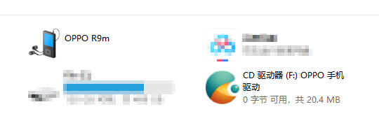
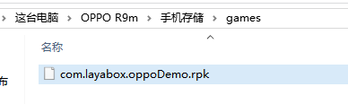

#OPOミニゲームのリリースとデバッグガイド

>udate：2019-07-06
>

##1、OPOミニゲームのリリース、デバッグ環境の準備

1、OPOブランドの携帯電話。

2、OPOの実機をダウンロードしてAPP「クイックアプリケーション」をテストする（OPOミニゲームの調合器）

OPO公式文書に行きます。[https://cdofs.oppomobile.com/cdo-activity/static/201810/26/quickgame/documentation/games/use.html](https://cdofs.oppomobile.com/cdo-activity/static/201810/26/quickgame/documentation/games/use.html)）見つけました`安装 runtime.apk 包到 OPPO 手机上`この欄は通常、新しいバージョンを選んでダウンロードします。

注意すべきは、調合器のバージョン、ドキュメントには最小プラットフォームのバージョン番号が記載されています。LayaAirIDEがリリースされる時は、ここの最小プラットフォームのバージョン番号に対応します。

3、PCのchromeブラウザと携帯電話のデータ接続線。

4、nodejs環境をインストールして、8.x安定バージョンをインストールすることを提案します。[node官网：[https://nodejs.org/en/](https://nodejs.org/en/)」

インストールをダウンロードするということです。簡単です。詳しく紹介してくれません。コマンドラインでnpmコマンドをセットできたら成功です。

5、LayaAirIDE集中開発環境、LayaAir 1.8.3 betaまたは以上のバージョン[ 官网下载: [https://ldc.layabox.com/layadownload/?type=layaairide](https://ldc.layabox.com/layadownload/?type=layaairide)」

6、ADBの取り付け

OPOがリリースされる時は、ADBを通じてrpkパッケージを携帯電話のgamesディレクトリに押すので、これは必須です。


 [ ADB官网下载:  [http://adbshell.com/downloads](http://adbshell.com/downloads)」

>ADB Kitsをダウンロードして、ダウンロードした後の圧縮パッケージは、一つの経路で簡単にいくつかのディレクトリに解凍することを提案します。`D:\adb`を選択します。環境変数を追加することを覚えてください。
>

##2、OPOミニゲームのリリースとアクセスの完全な流れ

###1、発表前の準備作業検査。

OPOのリリースをスムーズにするために、いくつかの検査があります。

第一に、PCでは、node環境、ADB、Chromeなどをインストールしなければなりません。

第二に、OPOの携帯に、入る。`设置-> 其它设置-> 开发者选项`開発者オプションとUSBデバッグは図1に示すように必ず開いてください。

 


（図1）

また、OPOミニゲームのデバッグ環境を確保するための「クイックアプリケーション」を図2に示します。

 


（図2）

第三に、PCと携帯電話をUSBケーブルで接続して、コンピュータの中で、図3のような画面が現れます。例えば、図3の左上のOPO R 9 mをクリックすると、携帯電話のメモリーに入ることができます。

 


（図3）

携帯電話で注意したいのは、画面が点灯しているまま開いて、PCのIDEがOPOミニゲームをリリースしている場合、携帯電話にライセンス情報が要求された場合は、必ずポイントを決めて許可してください。図4に示すように。

 


（図4）

###2、OPOミニゲームパッケージをリリースする（X.rpk）

LayaAirIDEのリリース機能には、OPOミニゲームのリリース機能が内蔵されています。まずLayaAirエンジンの項目をリリース機能により.rpk拡張パッケージにします。リリース機能の使用について。ここでは重複しないように紹介します。いいえ、公式文書で確認できます。

リンク:[[https://ldc.layabox.com/doc/?nav=zh-as-2-0-4](https://ldc.layabox.com/doc/?nav=zh-as-2-0-4)」（https://ldc 2.layabox.com/doc/？nav=zh-ts-2-6）

###3、実機デバッグとChrome出力

OPOのデバッグは本物のマシンに基づいてデバッグしなければなりません。PCのchromeは情報だけを出力して、画面が見えません。

準備作業に問題がなければ、通常の場合、LayaAirIDEでOPOミニゲームを成功裏にリリースした後、rpkのパッケージが自動的にクイックゲームのOPOミニゲームリストに表示されます（IDEはADBを呼び出して指定されたディレクトリに押します）。

 


（図5）

図5の`OPPO测试`私たちが発表する時に作成したゲームの名前です。自分の対応するゲーム名を見たら、正常にリリースされました。秒をクリックして開けば、私達が発表したゲームを開くことができます。

デバッグ情報を見たいなら。この時はchromeブラウザを開く必要があります。入力欄に入力します。


```

chrome-devtools://devtools/bundled/inspector.html?v8only=true&ws=10.10.82.111:12345/00010002-0003-4004-8005-000600070008
```


上記の例のIPアドレス`10.10.82.111`自分の携帯のIPに置き換えればいいです。IPアドレスはどうやって調べますか？ここでポイントとして提示されているのは、PCは携帯と同じネットワーク環境にある必要があります。

問題がなければ、効果は図6に示します。

 


（図6）

リリースとデバッグ、順調にいけばこれで完成です。

###5、未成功の処理経験を発表する。

文書を公開する時は機能だけを話して使います。上の文書は順調な場合の流れです。しかし、開発者はそんなにうまくいかないかもしれません。ここで経験を話してみます。

####デバッグリストにはゲームがありません。どんな状況ですか？

もし私達が発表した時にrpkを自動的に速いゲームのディレクトリ内に送れなかったら、図5のリストの中で、発表したばかりのゲームを直接見ることができません。

この時はadbを使って環境を確認することができます。

ideの端末またはcmdに入力する`adb devices`コマンド

#####1.接続が正常でない場合：

  


（図7-1）

開発者は携帯電話の接続と権限が正しいかどうかを確認する必要があります。

#####2.接続が正常である場合：

  


（図7-2）

この時は携帯電話の接続が成功したと説明し、開発者モードとUSbのデバッグを開始しました。このときは、oppoのアプリを再起動して、リスト情報を確認してみてください。

**接続が正常な場合**また問題があれば。windowsの権限と関係があるかもしれません。管理者権限を確保してLayaAirIDEを起動する必要があります。

adbに関する問題や、携帯電話の権限に関する問題については、開発者自身が知ることができます。

------

もう一つの方法は、ハンドメイドモードを採用して、rpkバッグを携帯電話に保存されているgamesディレクトリにコピーして、gamesディレクトリがない場合は自分で手作りで作成します。

rpkパケットは、プロジェクトのrelease/oppogame/quickgame/distディレクトリの下にあり、図8に示すように。

  


（図8）

生成したrpkファイルを配信し、携帯電話に保存されているgamesディレクトリにコピーします。

  


（図9）

この方法はより安定性が高い。

はい、`.rpk`ファイル生成に成功した場合、実際のリリースフローは終了しました。

パッケージプロセスに問題があれば、Layabox公式チームに問題をフィードバックし、LayaboxはOPOチームと共同で処理します。

最後に注意してください。この文書はLayaAir 2.xエンジンとIDEのリリースフローに適用されます。

もし1.xエンジンであれば、

まず手作業で適応ライブラリを導入し、手作業で初期化する必要があります。これは2.xとは違っています。


```typescript

//TS或JS初始化
Laya['QGMiniAdapter'].init();//需要引入aya.quickgamemini.js

//as3初始化
QGMiniAdapter.init();//需要 import laya.qg.mini.QGMiniAdapter;
```


他に注意すべき点があります。細かい処理もあります。OPOアクセスの無料動画をご覧ください。

動画のアドレス:[https://ke.qq.com/course/409332](https://ke.qq.com/course/409332)

##この文章は賞賛します

本論文があなたのために役立つと思ったら、スキャンコードの作者への賞賛を歓迎します。激励は私たちがより多くの優れた文書を書くための動力です。


