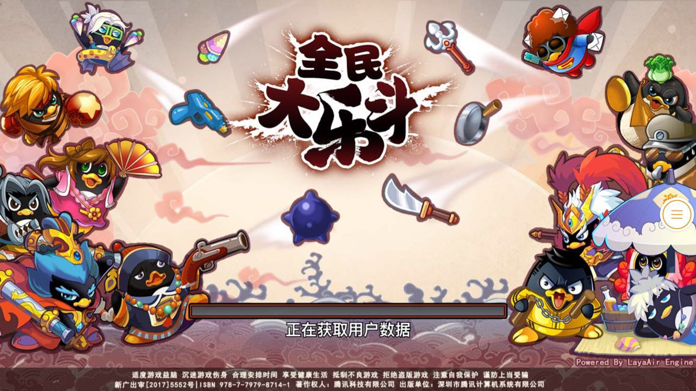

##テンセントの第1項は自らHTML 5ゲームを研究します。

8月3日、騰訊自研の格闘系HTML 5ゲーム「全民大楽闘」は微信、携帯電話QQの大平台のAndroid版で公開されました。このゲームはLayaAirエンジンを採用し、テンセント・マジック・ミラースタジオで開発されました。テンセント傘下の初オンラインの自己研HTML 5ラウンド制ゲームとして、「全国民大楽闘」が登場し、テンセントの自己研チームが正式にHTML 5のゲーム領域に入ったことを示しています。

（図1）微信ゲーム『全民大楽闘H 5』（アンドロイド版のみ）

###騰訊自研チームは正式にHTML 5ゲームに足を踏み入れました。

ルービックキューブスタジオ群は騰訊IEG（インタラクティブ娯楽事業群）の四大スタジオ群の一つで、長年にわたって、ページ遊びと手遊びの二大製品ラインを作ってきました。ページ遊び「NARUTO ONLINE」、手遊び「仙剣奇侠伝」など多くの有名な製品を持っています。

ルービックスタジオはルービックキューブスタジオ群の中核工房の一つとして機能します。『全民水滸』、『全民農場』を手遊びして、『縦横九州』、『QQ水滸』、『QQ農場』、『Q宠大楽斗』などの有名な製品は全部魔鏡工房に出ています。豊富な研究開発実力を持っています。

（図2）「全民大楽闘」は、ページ遊IP「Q宠大楽斗」に移植されました。

LayaAirエンジンを採用している「QQ農場」、「QQ花藤」などのHTML 5製品はすでに携帯電話のQQ空間で遊んでいます。しかし、いずれも騰訊IPを使う提携製品です。今回、魔鏡スタジオではDAUが2000万ページを超えています。「Q宠大楽斗」をHTML 5の手遊び市場に移植しました。騰訊自研チームが正式にHTML 5のゲーム領域に足を踏み入れました。

###WeChatと携帯QQのHTML 5ゲームの入り口

8月3日、「全民大楽闘H 5」はアンドロイドシステムの微信と携帯QQの同期オンラインで公開測定します。

WeChatのゲームチャンネルで「より多くの逸品ゲーム」を点けば、「H 5ゲームをダウンロードしない」という分類の中で、「全民大楽闘H 5」を見ることができます。「起動」をクリックしてから入ることができます。

（図3）ウィーチャットゲーム初のラウンドH 5ゲーム『全民大楽斗』入口

「全民大楽斗」は携帯QQの入り口で、携帯電話QQゲームセンターのH 5分類にあります。

（図4）携帯QQの初回ラウンドH 5ゲーム『全民大楽斗』入口

WeChatとは違って、友達同士のリンクを通じて、「全民大楽闘」のiOS版の携帯QQユーザーも正常にゲームに入ることができます。

###HTML 5ゲームの品質は絶えず向上しています。

画質が美しく、体験もスムーズで、ゲーム全体の品質は間違いなくS級の逸品です。テンセントは研究チームの加入から、位置はHTML 5ゲーム業界の品質向上を助けます。

（図5）『全民大楽闘』戦闘シーンのスクリーンショット

「全国民大楽闘」のほか、同じくLayaAirエンジンを採用した有名なIP大作「大天使の剣H 5」も8月3日にテストラインを開始した。37ゲームの初の自己研HTML 5製品として、HTML 5市場だけではなく、未来はHTML 5とAPP双端同発の戦略を採用し、同時にHTML 5とAPPゲーム市場に進出します。ちなみに、「大天使の剣H 5」アプリはLayabox傘下のLayaNativeパッケージ方式を採用しています。直接HTML 5ゲームをNativeアプリに包装します。

（図6）37ゲームの最初のHTML 5ゲーム『大天使の剣H 5』

7月末にテンセントでプレイしましょう。オンラインのLayaAirエンジンの3 D製品でも、テンセントと37ゲームの自己研のページで、IP移植の大作です。APPの品質のHTML 5ゲームの逸品はしきりに現れて、正大にHTML 5ゲームの業界の全体の品質を引き延ばして、プレーヤーのHTML 5ゲームに対する認知をも変えています。

2017年、逸品が絶えず出現して沈殿した一年、HTML 5ゲームの品質は絶えずしっかりと固められた一年。