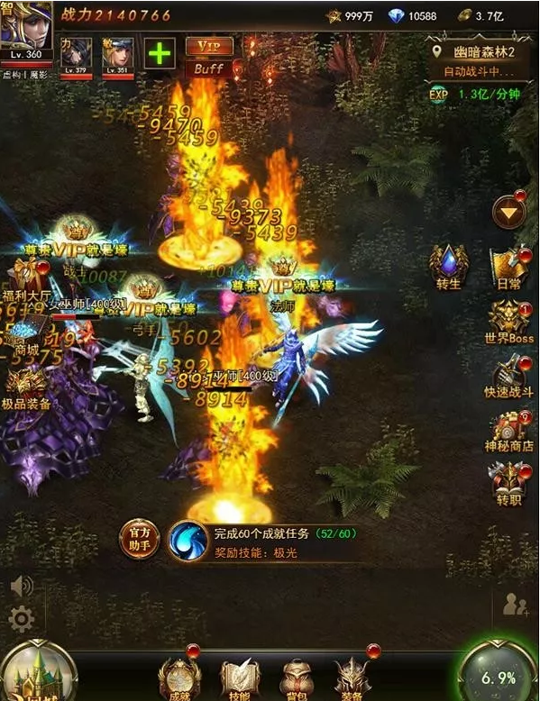

##最も金を儲けるH 5ゲーム《大天使の剣H 5》は24日間の流水を測って億を突破します！

H 5ゲームは2016年の『伝奇世界』が初めて千万月の流水を突破して以来、記録が更新され、公開報道によると『伝奇世界』の月水は3000万を超え、『決戦砂城』の月水は2000万を超えています。今は数億円を突破したH 5ゲームが2017年10月に誕生しました。

10月22日、オンライン24日間の『大天使の剣H 5』が流水億円を宣言しました。このゲームは上場会社の三七相互娯楽（0025555.SZ）によって作られ、同時に三七の相互娯楽と指の多彩な共同発行によって、H 5ゲームはついに億元の月の流水の時代に突入しました。

###大きなIPは多端と同発し、「大研究開発」は最大の受益者となる。

“伝奇”IPの成功から、産業にHTML 5ゲームに対する大きなIPの重要性を認識させました。しかし、水の流れを超えたアプリゲームとは比較にならない。Layaboxなどのエンジン側の推進のもと、HTML 5の技術は急速に発展しています。HTML 5の性能表現はNative APPと同じです。また、H 5バージョンはAPPバージョン（AndroidとiOS）と同時にリリースされます。発行者に同時に携帯電話H 5チャネル、APPチャネル、買い取りルート、PCページチャネルで同時に発表させることができる。エンジン技術はゲーム業界の発売に新たな機会を与えた。

このような技術背景の下で、三七の相互娯楽傘下の金メダル研究開発チーム江蘇オーロラネットはLayabox傘下のLayaAirエンジンを選択し、ページツアーで成功した有名なIP「大天使の剣」をH 5の手遊びとして新たに開発し、H 5のバージョンとAPPのマイクロパッケージを発表しました。今回の「大天使の剣H 5」はH 5ゲームの記録を更新した後、オーロラネットワークも業界初のページツアー、ハンドツアー、H 5ゲームの分野を横断する「マルチ栖」の研究開発者となりました。

###H 5ルートが急増し、「大発行」が発揮された。

“キラークラス”の応用の誕生はよく研究開発と発行、運営の一環として力を合わせて運営した結果で、『大天使の剣H 5』は9月29日に公開測定され、10月22日に水の流れが億円を超えたケースで、優れた研究開発品質要因のほかに、H 5ゲーム産業チェーンの上下の反哺加速、生態が徐々に健全化されている事実を反映しています。

今年の上半期から、業界内では大平台のH 5ゲームレイアウトのニュースが絶えず流れています。テンセントはWeChatと携帯QQの二つの戦略プラットフォームでチャネル側としてH 5ゲームの入口を開拓しました。フェイスブックもコードを入れ続けてH 5ゲームプラットフォームInstant Gamesを作りました。正式なレイアウトはH 5ゲームです。

精選品の供給量の拡充である一方、チャネル生態の急速な発展であり、H 5ゲーム産業チェーンの上流下流の健全さは、発行者にH 5ゲーム事業に切り込む好機をもたらしており、業界トップの「大発行」にとっては大きな利益に違いない。

「大天使の剣H 5」の発行元である三七は互いに楽しみ、業界でも称される「大発行」の一つである。国内のページ旅行市場でのシェアは騰訊に次ぐもので、艾媒諮問の『2017上半期携帯ゲーム市場研究報告』によると、『タワーオブアイオン』などの逸品ゲームによって、上半期の三七相互娯楽はモバイルゲームの発売市場で5.1%を占め、騰訊と網易の第三位にとどまった。

パイプライン事業者との提携を開拓し、発行した製品のために多くの流量資源を獲得することは、このような「大発行」企業の強みです。先発に合わせて、今日のトップ、網易ニュース、UCトップ、微信友達圏などの大流量チャンネルには『大天使の剣H 5』の情報流出広告が出てきました。騰訊動画、QQ空間などのアクセス数が多いプラットフォームも目立つところに『大天使の剣H 5』のゲーム入口を設けました。

単一のH 5ゲームの製品はユーザー市場で『大天使の剣H 5』と同じ規模の普及資源の傾きを獲得したことがない。その中には製品自身の品質が厳しい重みがあり、また、第一線の発行元としての三七相互娯楽の市場影響力も見られ、第一弾H 5ゲームの発売は多くの第一線プラットフォームの信頼と強力な支持を得た。

韓国のネット禅の『奇跡MU』の正式版から許可して、PC、携帯電話はすべて運行してしかも双端のデータが互いに通じ合うことができて、これも《大天使の剣H 5》がプレーヤーにとっての強大な吸引力のありかです。「大天使の剣」の成熟した経験がある前に、「大天使の剣H 5」はH 5プレーヤーの需要に合わせて、新しいゲームを発売しました。製品レベルが前の研究開発の品質に前例のない発行力を重ねて、このH 5ゲームの商業価値は肩よりも高くて、今の市場をリードする大部分のゲーム製品を超えます。

###結尾語

「大天使の剣H 5」の後、有名なハンドボールチームはH 5ゲームの分野にもっと関心を持っています。これからはもっと多くのゲームチームが多端同発の技術製品と発行戦略を採用し、大規模な研究開発者と中小CPが収入格差を加速させる馬太効果もH 5ゲーム市場で再び上演されるかもしれません。これはH 5業界にとってチャンスです。H 5の現在の大多数の中小研究開発チームにとっても危険かもしれません。