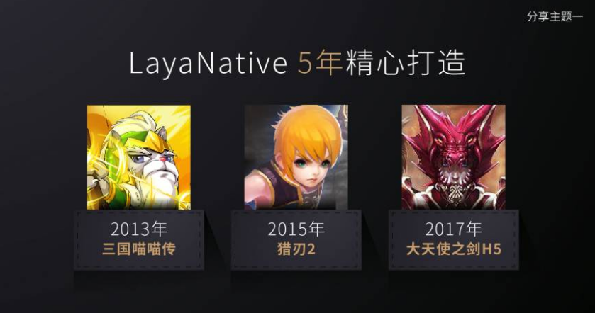

# Layabox谢成鸿出席TFC，公布智能优化方案可提升性能2倍！

2017第15回TFCは初めてアモイに移りました。Layabox創始者の謝成鴻はTFCと5ゲーム主催の第6回HTML 5ゲームサミットフォーラムに招待されました。そして「最高のゲーム技術プロバイダを作る」というテーマで共有しました。

###Layabox企業位置づけ

会議で、謝成鴻はLayaboxの企業位置づけを初めて公開し、ゲームのハイエンド技術の研究開発に専念し、ゲームのハイエンド技術サービスを提供しました。Layaboxの戦略的な重点をはっきりと描き出すのは、ハイエンドの技術開発に集中し、最強性能エンジンを構築し、使いやすさの高い開発ツールと製品の枠組みを構築し、Layaboxは最も難しい技術を負担し、より多くの製品開発チームの技術コストを低減し、ゲームのハイエンドの技術サービスを提供することによって、生産をより良い助けます。製品研究開発団は基礎的な支持をしっかりと行い、将来はハイエンドの技術サービスで企業価値を表し、企業収益を実現する。

###LayaAirエンジン、3 Dこの林で唯一果実の木を熟しました。

LayaAirエンジンは大天使の剣、全国民大楽闘、クレイジー雪だるま、QQ花藤、QQ農場など多くの有名な2 Dゲーム製品を持っています。まだ3 D市場の中で唯一オンラインで製品を運営する3 Dエンジンを持っています。現在すでにラインアップされている3 D製品は無尽蔵の騎士、雪鷹領主、蜀山です。研究開発中の3 D製品は、テイドラゴンナイト、英雄戦場、魚をとってきました。無双などです。

###LayaNative助力マルチプラットフォーム同時発売

10月22日、オンライン24日間の『大天使の剣H 5』が流水億円を宣言しました。昨日は友達圏で広く伝播され、業界のホットスポットとなりました。これは業界の月間水記録を更新する製品です。LayaAirエンジンを採用し、LayaNativeを使ってAPPのマイクロエンドパッケージに包装して全プラットフォームで普及しています。現在H 5のバージョンを発表すると同時に、An卓微端包、iOS微端包が発売され、ゲーム業界では新たな発行戦略となっています。

LayaNativeは2013年にすでに応用され始めています。その時H 5は携帯ブラウザの性能が悪く、ゲームの発行に認められませんでした。ですから、「三国ニャース」は相次いでページツアーの代理店によって発行されました。その後、LayaNative技術でAndroidとiOSパッケージを包装して、台湾市場で代理発行されました。

長年の蓄積と丹念な製造を経て、LayaNativeは数年前よりもっと成熟してきました。将来は業界のページ観光ルート、携帯電話H 5チャネル、APPチャネル、買い取りルートなどの全面市場を同時に発行します。

###スマート最適化はエンジン性能を数倍に向上させる。

今までLayaboxは性能の優位性でいくつかの研究開発チームを感動させました。しかし、性能の極致を追求しているLayaAirエンジンチームはこれに満足しておらず、引き続き最適化を進めています。例えばUIやゲームシーンについては、LayaAirエンジンチームが新たなスマート最適化プログラムを発表します。

LayaAir 1.0のバージョンでは、パフォーマンスの最適化は、手作りでスプライトを減少させ、drawcallを減少させ、cacheAsなどを最適化する必要があります。特にcacheAsの最適化は、異なるアプリケーションシーンを区別する必要があります。「normal」と「bitmap」のパラメータ設定が間違っていると、逆に新しい性能問題が発生します。

また、ゲームUI、ゲームシーンなどの表示対象階層のネストが多い場合、cacheAs設定を手動で最適化しても最適化可能なすべての表示オブジェクトを位置決めできない、またはテストを繰り返してこそ最適化可能な表示モジュールを選別して最適化することができます。この時、性能の最適化は豊富な研究開発経験を持つハイエンドの人材が必要で、製品の最適化には敷居があります。

LayaAirの新しい最適化方式を採用したAutoFastはcacheAsの最適化設定を行う必要がなく、直接にグローバルのスイッチを通して、知能と自動最適化の目標を達成します。性能は異なる機種でテストし、いずれも2倍以上向上しました。そして開発者の最適化作業量を大幅に削減しました。

AutoFastスマート最適化に加え、今後発売されるLayaAir 2.0は、エンジン全体の性能を50%向上させるwebAsssemble技術を採用する。HTML 5の製品性能はエンジン側の集中の中で大きく前進しています。

###結尾語

今回の講演のテーマのように、Layaboxは最高のゲーム技術提供者になります。Layaboxはハイエンドの技術を基礎にして、ゲームチームのために大量の下地技術、開発ツール、製品フレームワーク、共同開発サービス、ハイエンド技術サポートサービスなどを提供します。ゲーム産業の開発プロセスのためにコストを削減し、製品のオンラインを加速し、技術開発のハードルを下げるために絶えず努力しています。

QRコードをスキャンして、Layabox公衆番号に注目します。