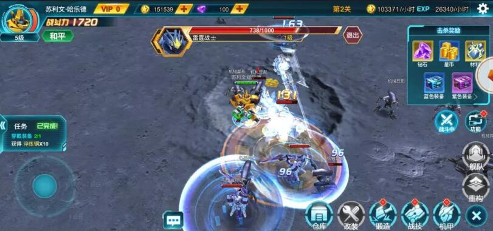

##SFの題材の高清の自由な視角の3 D H 5ゲーム

1月26日午前11時、LayaAirエンジンの研究開発を採用し、ファイアツリーゲームの独占代理となる初のSF題材3 D HTML 5ゲーム「宇宙マシン甲」が正式にスタートしました。

このゲームのモデルは高解像度の3 Dレンダリング、高テクスチャの高精細スタンプを採用しており、2 Kスクリーンでも4 Kスクリーンでも、すべて高清無傷のキャラクター品質を示しています。360度の水平回転自由画角機能を追加し、真の3 D立体映像を復元するのはH 5業界初となる。超人的なSFマシンの世界を造り出して、プレーヤーに比類がない視覚の盛大な宴会を持ちます。

>左下をクリックして原文を読むと直接体験できます。

####極致の効果は非常に強いです。

「宇宙飛行機甲」は横画面操作戦闘モードを採用しており、複数人のオンライン戦闘をサポートしているだけでなく、画面の表現も素晴らしい。映画級の画面はフレームレートを放送して、行雲流水の類の動作の表現。最新のHTML 5の純3 D粒子技術を駆使して、極めて衝撃的な戦闘打撃感、華麗でクールな技能効果を表現しています。スイングはキャラクターの動きの方向をコントロールしており、通常攻撃でもリリースでもスムーズに動きます。

戦闘スクリーンショット

####3 D HTML 5ゲームの技術表現は絶えず強化されています。

2016年にLayaAirエンジンに基づいて開発された3 D HTML 5のゲームが発売されて以来、LayaAirエンジンを使って開発ラインを展開する3 D HTML 5の製品が増えてきました。オンラインQQ空間などの公開ルートがあるだけでなく、在自の運営プラットフォームにオンラインで接続されている3 D捕角類の製品もあります。

LayaAir 3 Dエンジンが成熟するにつれて。3 D特効と機能表現においても、ますます大胆になってきました。例えば、最近オンラインQQ空間で遊んでみましょう。プラットフォームの「蜀山3 D」は、仙侠類3 D HTML 5の先河を開拓しただけでなく、ゲームの中で海の量の3 D粒子効果を使って、3 Dリアルタイムの換装技術と、HTML 5 3 Dエンジン技術の発展速度に驚嘆させます。

「蜀山3 D」ゲームのスクリーンショット

今のところ、「宇宙飛行機甲」は高精細モデルとスタンプ、または360度水平角度から回転する機能に関係なく、3 Dゲーム体験をよりリアルにしています。HTML 5の3 D表現力も業界に見せるようになりつつある。

「ポケットモンスター」、「無双」、「鳳凰無双」、「The last in wildland」など、LayaAirエンジンによる3 D HTML 5の製品はすでに最適化調査段階に入っており、春節後には続々とオープンするかもしれません。プレイヤーにもっと違った感じを与えてくれる目立ちたがりの表現です。

####最後に書く

端游、ページ游、手游の発展の歴史から见れば、HTML 5 3 Dは発展の必然的な成り行きです。多くの3 Dの成熟した経験を持つ研究開発チームはすでにLayaAirエンジンを採用して3 D HTML 5の研究開発陣営に参加しています。既知の3 D HTML 5研究開発チームは数十社に達しています。優れた3 D開発メーカーの進出により、将来的には3 D分野での優れたゲームが増え、3 D爆発も近くなると信じています。