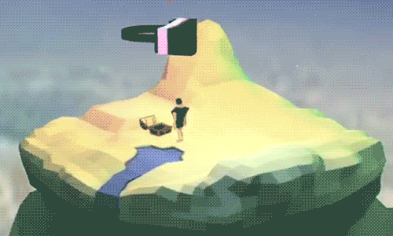
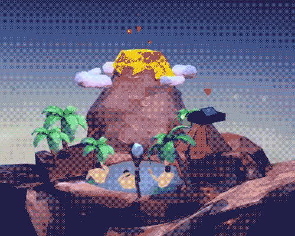
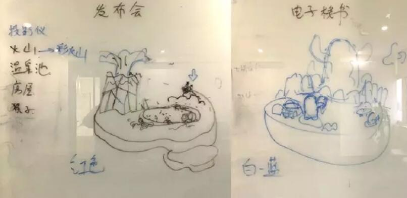
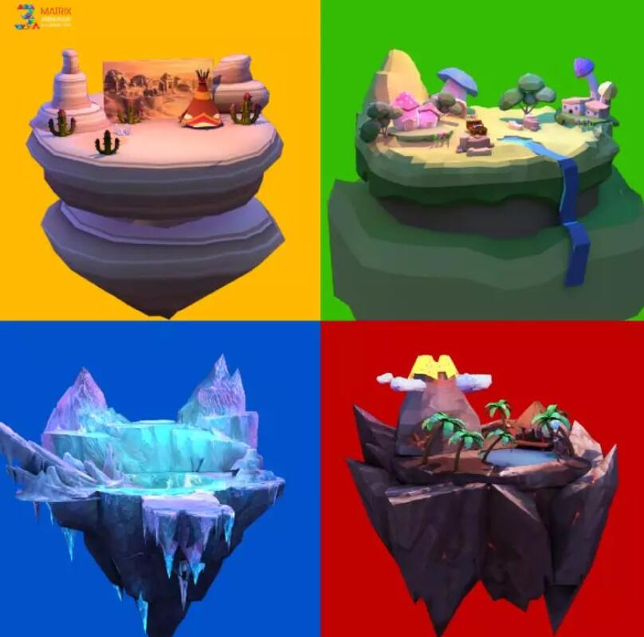
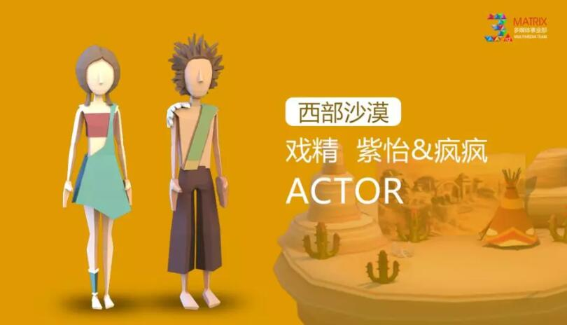

##天に逆らう！3 Dウェブサイトの展示は意外にもこのようにすることができます。

以前、LayaAirエンジンの3 Dクールゲームを紹介しました。今日はLayaAirエンジンを採用した3 Dウェブサイトの展示商品「不思議列島」を紹介します。

これはゲーム以外のHTML 5ページで、3次元の間隙技術をベースに、異なる浮遊小島間で切り替えられます。GOをクリックすることによって、各シーンに入ることができます。360度の全角度で島の様子を見ることができます。簡単なインタラクティブ操作もできます。例えば、VRメガネをかけて世界が変わったり、火山をクリックして噴火するアクションがあるなど、ウェブサイトの展示にゲーム型のインタラクティブ体験ができます。

直接に識別図の二次元コードを押したり、左下のテキストを読んでリンク体験を開くことができます。

 

**「不思議列島」の創作起源と創作過程**

「ふしぎな群島」はマトリックスインタラクティブMatrixマルチメディア事業部創立三周年の部門慶作品で、甲の各種要求の束縛がなく、手を動かすともっと大胆で自由です。

「明るく楽しい雰囲気の中で紹介してください」というのは、この作品の最初の単純な動機です。

いくつかの業務をはっきり説明しなければならないので、「群島」の概念は嵐の中で誕生しました。

4つの特色の鮮明な世界はそれぞれ4つの業務プレートを表しています。それぞれの「島」の中の風景を通して、直感的に理解し、連想させます。

▲黄色の砂漠、緑の雨林、青い氷河、赤い火山

次にスタイル設定です。3周年のお祝いはもちろんにぎやかにします。元素は最終的に簡潔で清新なマスクのシンプルなスタイルを選びました。

人物は情景を構成するために必要な要素です。だから、各シーンに個性的な人物を設計しました。

インタラクションは重点で、ユーザーにくっついてみんなに“ゲーム”の効果があるようにします。伝統的な三次元シーケンスとビデオを放棄して、LayaAir 3 Dエンジンをカーネルとして使って、すべての環節がリアルタイムで対話できるようにします。リアルタイムでレンダリングする効果により、ユーザーはH 5のウェブページを見ているのではなく、三次元ゲームをしているのをほとんど忘れさせられました。

 

大きな場面の転換と360度の閲覧は明らかに足りないです。私たちはそれぞれの「島」のために小さなインタラクティブなプロットを設計しました。VRメガネをかけると世界が変わります。火山をクリックすると噴火動作などがあります。

**マトリックスインタラクティブMatrixについて**

行列インタラクティブMatrixはブランドのインタラクティブ広告とネット全体のマーケティングを統合した運送業者であり、ブランドのためにトップのインターネットイメージを形成することに専念し、企業のマーケティング戦略にインタラクティブ解決策を提供する。所属マルチメディア事業部は専門的かつ全面的な技術創作チームで、ビデオ放送の後期、VR&AR、APP応用開発、舞台舞美包装など複数の業務プレートをカバーしています。