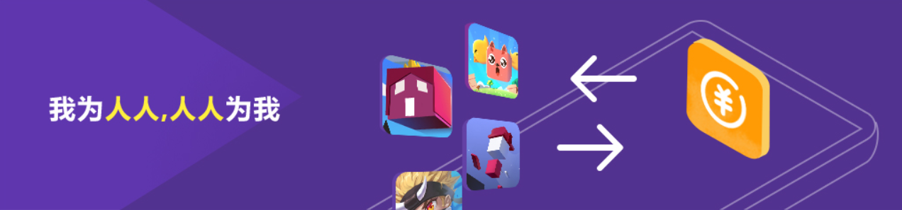

## Layabox推出小游戏流量共享平台，开发者可免费获得游戏流量！

>*author：charley udate：2018-11-1*

 

この概念を共有するのは今はよく知らないですが、本当の意味の共有はあまり多くないです。今、多くのいわゆる共有経済はプラットフォーム側が大量の新資源を取り出して、共有の実で費用を徴収します。したがって、いくつかの新たな実体資源は実際の使用需要を超えると、都市ゴミをもたらし、資源と資本の浪費を招く。Charleyは、良い共有は社会資源の有効な再統合であり、自分の休眠資源を貢献し、他の社会資源の共有の利益を享受できると考えています。「私は人として、誰もが私のために」という目標を達成します。Layaboxが発売したミニゲームの流量共有プラットフォームは、まさにその通りです。

###微信長尾小遊びの現状

微信小ゲームの初期段階では、微信関チェーンを利用して様々な強制や誘導を共有しています。これは小ゲームの野蛮な成長の流量配当段階であり、微信生態も不健康な発展の影響を受けています。WeChat関連の運営規約の規定により、WeChatの生態に悪影響を及ぼす要因が除去されつつありますが、ゲームの流れ（ユーザー）の取得が難しくなってきています。ほんの少しの頭の小さいゲームの製品だけあって、内を通じて(通って)利益を買ってあるいは広告を買うことを通じて(通って)流量が現れることができます。ほとんどの小さいゲームにとっては、箱（小さいゲームのプラットフォーム）の代理店に自動的または受動的に任せて運営しています。購買流量は絶対いくらの損失を買う商売です。

一定の流量保証がある有名なケースの流量主は、通常ゲームの品質に対して一定の要求があります。それは代行されていないし、購買能力もないミニゲームの開発者は少数ではありません。これらの数が多い長尾小ゲームは、どうやって行けばいいですか？

微信小ゲーム産業は10月から、すでに冷え込み始めています。小さいゲームのアウトソーシングの需要は急激に減衰して、一つまたはいくつかの長尾のゲームを握っている研究開発者達は失望して場を離れて、あるものはまだ焦慮していますか？それとも彷徨っています。

###いかなる費用と分断された流量共有プラットフォームを支払う必要はありません。

微信小ゲーム産業は10月から、すでに冷え込み始めています。無条件で流量を購入したり、流量のある箱に代行されないミニゲームに対して、失望して場を離れたり、焦慮したり、迷ったりしています。

Layaboxは現在50万人近くの開発者を持つゲームエンジンの提供者として、ミニゲームの開発メンバーとして、開発者の痛みをいち早く深く理解し、理解しています。流量を購入する能力がない多くの開発者が流量を得るのを助けるために、ミニゲームの流量共有プラットフォームを開発しました。LayaAirIDE内に流量共有プールのコンポーネントを集積し、開発者がドラッグするだけで技術的なドッキングを実現し、簡単にゲーム情報を提出することで、自分でミニゲームの流量共有プラットフォームに参加することができ、無料で流量を得ることができます。

Layaboxは流量共有プラットフォームの運営者と発信者として、流量共有プラットフォームの開発者に参加するいかなる費用と分割払いを受けません。「私はみんなのために、誰もが私のために」という生態を無料で共有することを目指しています。

 

プラットフォームURL：http://share.layabox.com/

###流量共有プラットフォームは何ですか？

流量共有プラットフォームとは、当然のことながらゲームユーザーが共有するものです。この概念を理解する前に、私たちはまず別の量の話をします。

関係チェーンの共有転化、名称キーワードの検索最適化、ミニゲームの交換量は、いくつかの重要な無料流量源と運営戦略です。サイズ変更とは、ミニゲームとミニゲームの間でビジネスを通じて対等に交換することで、ゲーム内ではアイコンをクリックして別のゲームにジャンプする行為です。最終的には双方がピアのユーザーと交換を追加することになります。

例えばA、Bゲームは5万ぐらいの日活ユーザーがいます。AゲームはBゲームに1万台の追加をもたらします。BゲームもAゲームに対して1万台の追加が必要です。双方は各自が合意した新規条件を達成した後、相次いで入り口を閉鎖し、対等なユーザー交換を達成する。

このような協力モードは現在ではよく見られます。自分のゲームに属する忠実なユーザーは必ず戻ってきます。自分の忠実なユーザーが流出しているのではなく、新たに増えてきます。したがって、交換モデルも主流の無料獲得モデルの一つである。

しかし、このようなモードも一定の制限条件があります。例えば、Aゲームは1万日しか生きられません。Bゲームは10万日が生きています。Aゲームは一日にBゲームのために何百人のユーザーしか持っていけません。Bゲームは一日にAゲームのために何千人のユーザーを連れていけます。このような差はAゲームと交換したくないことになります。また、どのようにして同じレベルのゲームをもっと見つけて交換するということですか？これは大きなビジネス資源と人脈が必要で、しかも大きなエネルギーが必要です。特に1万日の生活もない長尾小ゲームはどうやって変えますか？

Layaboxの流量共有プラットフォームの原理は交換量と似ています。ビジネスの連絡は必要ありません。日本の生活条件の制限がなく、いかなる費用や分断も受けられません。開発者は直接流量共有プラットフォームに登録して自分でゲームを提出します。プラットフォーム側は流量共有コンポーネントの技術が実現されたかどうかだけを確認します。日本では数千円しか生きていません。また、共有プラットフォームには数十円の追加や百桁のクリックしか貢献できません。共有プラットフォームのピアや予想以上のリターンも得られます。

###流量共有プラットフォームの流量取得原理

すべての共有プラットフォームの長尾ゲームは、まずトラフィック共有のコンポーネントにアクセスする必要があります。このコンポーネントを通して、一部のプレイヤーは同じ共有流量プールにジャンプできます。**星ゲームベスト**）共有流量プールでは、ユーザーがプラットフォーム内の露出推奨位置と自分の好みによって、他のゲームに入る。共有流量池の流量の二次分布に相当します。

最初の共有流量プールでは、Layaboxは自己研の逸品と深さのパートナーのミニゲーム逸品を共有プラットフォームに入れ、流量プールの主要な貢献者となり、多くの新しくプラットフォームに参加した長尾ゲームと新オンラインのミニゲームに初期ユーザー源をもたらします。さらに、Layaboxはより多くの精選された品質の自己研鑽ゲームを増やし、優れた製品を加えて、参加した開発者に福祉をもたらし、特に早期に加入した開発者には、超価値のある共有リターンを享受します。

プラットフォームの長尾小ゲームが増えるにつれて、Layabox流量共有プラットフォームの大データアルゴリズムとAIアルゴリズムが働き始めます。システムは重いものを取り除いた後のシングルユーザークリックをもとに、ミニゲームのプラットフォームの流量を計算することによって貢献と流量を獲得します。流れの支払いを，最終的には相対均衡に達するようにした。例えば、あるゲームがプラットフォームに参加した後に、ゲームからプラットフォームの有効クリック（重量除去後）までは500しかないです。プラットフォームの流量プールはこのゲームの中の有効なクリックのユーザーに入って1000に達します。そのゲームの純貢献値はマイナスで、展示の重み付けはAIアルゴリズムによって自動的に下がり、追加またはクリックして減衰し始めます。展示位置の変化などによって純貢献値の負の値が減少したり、純貢献値が増加したりすれば、展示露出の重み付けが自動的に増加し、ゲームによる追加やクリックも自動的に向上します。したがって、ゲーム内の重みの中心的要素を示すのは、貢献と得られた純寄与値に依存する。

###流量共有プラットフォームのデータクエリ

流量共有プラットフォームのデータは、小さなプログラムで表されています。プラットフォームの運営データを開くと、バックグラウンドと自動的に結合された小さなプログラムコードが生成され、開発者はコードをスキャンしてLayaboxを開いてデータアシスタントを共有し、データヘルパーで自分のゲームのプラットフォーム内のトラフィックの合計貢献、流量の合計、および利用可能な流量を調べて、単一ゲームの総貢献と総獲得などのキーデータを得ることができます。

###流量共有プラットフォームの基礎サポート

Layabox流量共有プラットフォームはプラットフォーム登録後の関連技術ガイドを除きます。Layaboxの関係者はドッキングに関する技術サポートを提供します。開発者のドッキングと共有プラットフォームへの参加の円滑性を保証する。

上質な長尾のミニゲームについては、流量共有プラットフォームに加入した後、Layaboxは公式公式アカウント、QQ群、公式サイトなどで、厳選したミニゲームを不定期に無料で展開します。

卓越したデータを持つ逸品のミニゲームやヘッドゲームについては、流れを積極的に貢献したいなら、長尾小ゲームの発展をサポートします。Layaboxエンジンの公式は特殊な貢献をしたミニゲーム開発者に対して、ゲーム開発の過程で無料で一対の技術サポートを提供します。

最初のプラットフォームに参加した開発者を迎えるために、Layaboxは既に率先して数種類の良質なミニゲーム製品を流量共有池に投入しました。**星ゲームベスト**)第一陣の流量共有に参加した開発者に基礎的な流量保証を提供します。

 

**小さいプログラムのQRコードをスキャンして、星のゲームの選りすぐりの中の小さいゲームを体験します。**

 