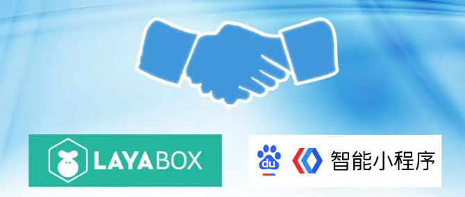

## 百度即将推出智能小游戏，Layabox率先完成引擎适配支持！

 

最近では、有名なインターネット企業のBaiduは、"スマートミニゲーム"の内部テストアクセスを低调に完了しており、間もなく"Baiduのスマートミニゲーム"（以下、Baiduのミニゲームと略称する）プラットフォーム業務を開始します。聞くところによると、Baiduのミニゲームはまず1.6億人のユーザーの流量を持つ携帯のBaiduアプリをカバーし、本格的にゲーム産業に力を入れている。これは小さなゲーム産業に大きなニュースをもたらすだろう。流量の大きい工場の参加、小さいゲームの研究開発メーカーを代表の小さいゲームの生態にすることを促進して、更に多くの流量の配当金と資源の現われる道を持ちます。

####百度は大量の資源を投入して、小さいゲームの生態の繁栄を助力します。

周知のように、2018年はゲーム版の審査が困難な年であり、各種類のCP生活は“水の深さ”であり、千万級の月の流水に伴うカジュアルゲームが次々と公開されている。ミニゲームの広告のデモンストレーション能力はすでに実証されており、迷いの中のゲーム開発メーカーに新たな生気を提供しており、2018年は必ずミニゲームブームの年となります。

現在、各主流の流量チャネルの入口はすでに発売されていますか？もうすぐミニゲームのプラットフォームが発売されます。トラフィックは巨大なものが続々と入場します。レジャーゲームには膨大な市場が累計されています。

盛んな生態は優秀な下地構造の支持に不足しないで、百度会社は業界の模範として、生態の建設について、生態の健康な発展が特に関心を持つことを保証します。現在、膨大な資源を投入し、有料でミニゲームの底辺のエンジン側をプラットフォームの構築に参加させ、ミニゲームの基礎となるエンジンプラットフォームを期待し、本格的な長期安定的な協力関係を形成し、最終的には開発者と消費者にサービスを提供し、真の生態閉ループを形成する。

####Layaboxが率先してエンジンを完成させるのはサポートにぴったりです。

Layaboxは技術をリードするエンジンメーカーとして、先に百度のミニゲームに対するエンジンの適応を完成しました。LayaAirIDEに百度のミニゲームのリリースを集めました。現在50万を超えるLayaAirエンジンの開発者に先駆けて、新しいプラットフォームの配当を提供しました。また、Layaboxは百度会社の優れたコンテンツ提携先として、Baiduのミニゲームプラットフォームのために精選されたミニゲームコンテンツを提供し、紹介するサービスも担当しています。

 

（図）LayaAirIDEのBaiduのミニゲームはインターフェイスショットをリリースします。

####Layaboxの公式サービスは、Baiduのミニゲームのサポートサービスを提供します。

Baiduのミニゲームはまだ正式に発表されていないので、Layaboxは開発者にBaiduのミニゲームプラットフォームへの提供と推薦のための逸品を提供してくれます。Layaboxの開発者が意図的にレジャーゲームや優良品質の大型ゲームをBaiduのスマートフォンのプラットフォームに提出すれば、Layaboxビジネスと連絡することができます。

ビジネス連絡メール：bd@layabox.com

 

（図）ビジネスウィーチャットの二次元コードをスキャンして追加する。

