## LayaAir引擎3D小游戏再曝光60款，小游戏引擎11月占比超93%

8月です。小编は多くの3 Dミニゲームの中から15种类を精选しています。[原来微信里有这么多好玩的3D小游戏了](http://mp.weixin.qq.com/s?__biz=MzAxMjI4NjA1OA==&mid=2650584197&idx=1&sn=f9f23eb6ca11eda7b2e2039854a042db&chksm=83bc3580b4cbbc963e0f735bc6bf494151b14f384c691de6f82710f90580decff796adf05f95&scene=21%3Ch1%3Ewechat_redirect)」一文で業界を爆発させました。今は数ヶ月が経っていますが、自分の微信の友達が熱いうちに作った1000種類の製品の中で、200種類近くの3 Dゲームが発見されました。3 Dゲームの総量はまだ2 Dゲームより低いですが、3 Dミニゲームの成長速度は2 Dゲームの爆発的な増加傾向を示しています。これらの3 Dミニゲームのほとんどは、LayaAirエンジンの製品で、ミニゲームの3 Dエンジンの比率は93%を超えています。多くの3 Dミニゲームからオススメの、重複や粗い商品を取り除き、ゲーム業界の人やユーザーに体験してもらう60のアイテムを紹介します。

>以下のゲームはLayaAirエンジンを使って開発されています。小プログラムコードを提供していない場合は、ゲーム名を検索して体験することができます。紹介順は小編で任意に並べられていますが、順位には根拠がありません。

####1、絶世武神3 D

 

ゲームのスクリーンショット

**小編集の評論**:

「絶世武神3 D」は有名なIPを持つ3 D ARPGゲームで、3 Dシーンは唯美絶倫で、山水縦躍の間には仙侠の風格があります。ハンガー+ハンド操のインタラクティブ体験は、ゲームが重すぎず、ゲームの楽しさを十分に体験できるようになります。唯一の残念なことに、他のカジュアルゲームと比べて、ロードされるコンテンツが多く、ロード時間が比較的長いかもしれません。しかし、このような珍しい3 Dミニゲームのジャンルには、やはり期待が必要です。

>このような大型のARPG 3 Dミニゲーム以外にも、QQにLayaAirエンジン3 D MOBAタイプの手Qライトゲームがあります。Android版の携帯QQでAUを検索する計画があり、試遊体験ができます。WeChatのゲームではないので、ここでは単独で紹介しません。

####2、ドキドキ練習生

 

『ときめき練習生』ゲームのスクリーンショット

**小編集の評論**:

『心動練習生』は衣替え養成ゲームで、美術が美しく、ゲームの主役は3 Dのバーチャルセクシー少女で、衣替え、養成、金儲けなど多くの成長任務の主軸があり、プレーヤーはこれに付き添って心動的な女性の食事、入浴、娯楽、着替えができます。他のプレイヤーのイメージショーも見られます。心が動く子供靴は直接コードを識別して体験できます。

####3 D戦警

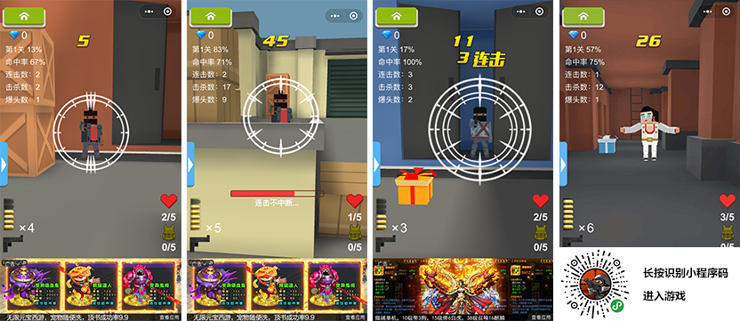

ゲームのスクリーンショット

**小編集の評論**:

「3 Dファイター」はFPSゲームで、ゲームはデフォルトで狙撃の視角を与えています。ゲームの中の強盗をクリックして狙撃射撃を実現して、銃の爆発の快感を体験することができます。でも、ゲーム中に人質を通して、誤射してはいけません。このゲームには、レベルストーリーの体験もあります。非常に優れた軽度のFPSミニゲームです。

####4、エース狙撃OL

エース狙撃OL

**小編集の評論**:

「エース狙撃OL」は対戦競技のシューティングゲームで、ゲーム中の体験はとてもリアルで、相手のPKと勝利した後に強いゲームの快感があります。銃や弾丸、狙撃鏡、護手の弓矢などを購入して、射撃の過程を安定させます。このゲームはLayaAirの比較的早い段階の製品で、8月に小編で紹介したいと思います。サーバーBUGのために臨時に下に置いて最適化しました。今回は多くの射撃ゲーム愛好者に体験してもらいたいです。

####5、親指矢を射る

ゲームのスクリーンショット

**小編集の評論**:

「親指アーチェリー」は対戦競技のアーチェリーゲームです。このゲームの核心的な遊び方は「エース狙撃OL」とほぼ同じです。銃と弓矢の直感的な感覚の違い以外に、「親指アーチェリー」は通関システムとWeChat友達との対戦を誘う機能があります。ですから、体験して遊ぶのもオススメです。

####6、戦車萌え

 

ゲームのスクリーンショット

**小編集の評論**:

「萌え戦車」は射撃種類のゲームで、ゲームの画質は精巧で、戦車は主に萌えの擬人戦車で、ヘリコプターの皮膚を見ます。このゲームは戦車の皮を着ていますが、実際には飛行射撃ゲームの遊び方で、画面を移動して敵の射撃弾幕を避けます。

####7、鶏を食べる城3 D

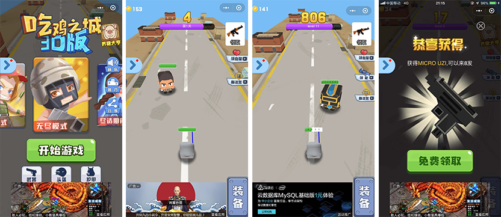

ゲームのスクリーンショット

**小編集の評論**:

「ニワトリを食べる城3 D」はラウンド式の壁を突破する射撃ゲームで、このゲーム内の美術は決して派手ではなくて、視角の問題のためかも知れなくて、美術が主役の銃が見えないことを心配するので、やはり射撃しやすいために照準を合わせて、銃管の前から1つの白い棒のようなものを延長します。小编は长い间研究しましたが、まだ分かりません。幸いにもゲームの面白さはあります。角度を調整して、敵に命中すれば、一発で飛んだら、次の関所に入ることができます。でないと、敵に反撃されます。

####8、鶏を食べるニャン

ゲームのスクリーンショット

**小編集の評論**:

「にわとりを食べるニャン」は物理的な動力に基づいたジャンプゲームで、ゲーム名の中ではにわとりを食べることと人気のシューティングゲームは一銭の関係もなく、本当ににわとりを食べるニャンコ先生です。ゲームの主人公ニャンは、プレイヤーがクリックしてジャンプしながら進んでチキンを食べます。鶏肉を食べる過程で、どの物体（雲を含む）も力を借りてジャンプできるスプリングボードです。ちょっとドキドキしないと、パワーがないところでゲームは終わります。小编にはゲームが简単な感じがします。ある程度の游び性がありますが、学生や女性に向いているかもしれません。

####9、全人民の鉄

 

ゲームのスクリーンショット

**小編集の評論**:

「全民頭鉄」はクリックして反応するカジュアルゲームで、ゲームの絵柄は清新で可愛いです。操作は簡単です。クリックのリズムをよく把握して、ゲームの主人公を前に進めて、大きなモンスターと小さなモンスターをぶつけるだけです。宝箱を食べたら、ランダムにアイテムを獲得します。例えば、ダーツや槍など、モンスターを撃って殺せます。

####10、ワイルドフライOL

「ワイルドフライOL」のスクリーンショット

**小編集の評論**:

「ワイルドフライOL」は、障害を避けるショートボールのクールなゲームで、非常に魔性があり、プレイヤーの手の速さと反応力を試します。そして、ボール同士の競速はレースのような視覚的な衝撃感があります。小编が8月にオススメした「ボールダッシュ」もこのタイプです。このようなAPPゲーム「Balls Race」のようなゲームが相次いで発见されました。体験があまり良くないというのは触れません。中には「狂ったボール冲撃」「激情球」「狂ったボール正版」もとてもいいゲームです。ここで重点として紹介している「ワイルドフライOL」の原因は、このゲームにはいくつかの小さな革新があります。基礎的な競速と障害防止のほかに、現在のボールのスピードを表示して、加速帯を踏んで加速するように注意するだけではなく、加速度を踏むたびにダッシュのエネルギーを蓄積します。ラストスパートのエネルギーがいっぱいになったら、自動的にしばらくの無敵モードがアクティブになります。障害を突き抜けることができます。

####11、ボールのスポーツカーゲーム

ゲームのスクリーンショット

**小編集の評論**:

"ボールのクールレーシングゲーム"も障害を回避するための小さなボールのクールなゲームですが、コアプレーは"Balls Race"を参照してくださいが、色の滑らかな遷移から、遠景の光の効果と霧の効果、操作フィードバックと3 Dレンズの視覚処理などの詳細は、APPゲーム"Balls Race"のいくつかの通りをオフに体験します。他の似たようなゲームとは明らかに違った形のバリケードや道路の床を模した滑走路の皮膚など、大量の種類の「Balls Race」を体験した後、やや目の前が明るくなり、質の高いスピードゲームといえます。

####12、狂ったボール2

  

ゲームのスクリーンショット

**小編集の評論**:

「狂ったボール2」の基礎操作は前に紹介した2つのゲームと同じで、障害を避けるための小さいボールのクールなゲームでもあります。左右のスライドを通して障害を避けますが、滑走路はまっすぐで、曲がりや登りなどの感じがありません。このゲームはAPPゲームの「Catch Up」の遊び方の簡略化版と言えますが、ゲーム体験は「Catch Up」に劣らず、ゲームの難易度も低くなり、より快適にプレイできるようになりました。

####13、ジャンプボール

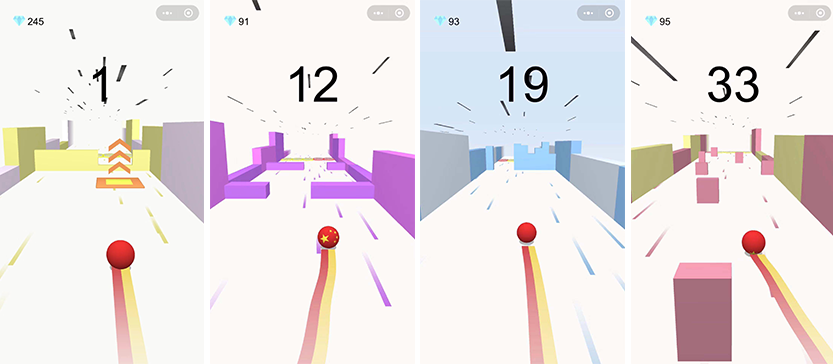 

ジャンプボール

**小編集の評論**:

「ジャンプボール」も「キャッチUp」の遊び方の簡略化版ですが、「狂ったボール2」で採用されているバリケードとは違います。ゲーム全体のスタイルと体験感はやはり「キャッチUp」に似ていますが、ゲーム中の存在加速帯（黄色）と減速帯（赤）は「キャッチャーUp」にはなく、スプリングボードには3次元のヒントがあり、ジャンプ体験をより友好的にしてくれます。プレイヤーは体験できます。

####14、ボールは止めないでください

 

ゲームのスクリーンショット

**小編集の評論**:

「ボールは止めないでください」のコアプレーは前に紹介したいくつかのゲームとほぼ同じですが、ゲームの美術的背景は精巧で多様で、バリケードも豊富です。ダッシュを加速して、坂を越えたり、ジャンプしたり、障害を避けるなどの体験がスムーズです。全体のスタイルはもう小编にいくつかのAPPゲームを连想させなくなりました。

####15、クールボール

クールボールゲームのスクリーンショット

**小編集の評論**:

「クールドリブル」は、障害を避けるための小さなボールのクールなゲームですが、これまでのオススメのゲームとは違って、360度の時空シャトル3 Dホールを走ります。唯一足りないのは、クールな主人公のボールの立体感が強くないことです。

####16、板をかける

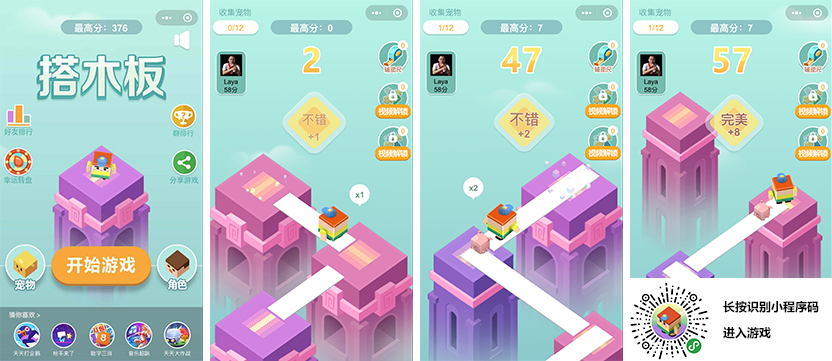 

ゲームのスクリーンショット

**小編集の評論**:

「木の板をかける」はレジャークリックゲームです。コントロールボードの長さを押しながら、向こうの橋脚にかけて通ることができます。そうしないと短くなります。あるいは長くなります。いずれも深淵に落ちます。ゲームの原型はAPPゲーム「Plank」に由来しているのかもしれません。「ボードをかける」はミニゲームでの表現が元のアプリレベルに達しています。プレイ性が高いので、体験をオススメします。

####17、旅行に行くのが夢です

 

「夢は旅行に行く」ゲームのスクリーンショット

**小編集の評論**:

「Plank」のゲームを参考にして、「スーパー救援」「ロードヒーロー」「ボードを組んで」「ボードを組んで西遊」など、各ゲームの表現はとてもいいですが、革新性はあまり足りないです。このゲームは関所式を採用して、異なった都市の標識性建築を目標にして、前進する過程の中で、リアルタイムで目標まであと何歩ありますか？目標を達成すると、美しい三次元建築が見られます。このゲームを世界中にお供しましょう。

####18、リズムボール

 

リズムのスクロールボール

**小編集の評論**:

『リズムボール』はクールなゲームで、ゲームのキャラクターは萌えのペットイメージで、ゲームの中で走ったり、ジャンプしたり、避けたりできます。また、ステージとステージの難易度を調整して、通関過程の障害があります。最後に突っ込みます。ゲームとボールは半角の関係がありません。

####19、クッシヒヨコ

 

『クックヒヨコ』ゲームのスクリーンショット

**小編集の評論**:

「クッキングひよこ」は5月にミニゲームをオンラインする3 Dクッキングタイプのゲームで、3 Dクッキングゲームの中では比較的早いものです。豚侠などの逸品に比べて、このゲームは比較的簡単ですので、8月の小編はオススメしません。この間、研究開発によって明らかにされたデータによると、これは一人で開発しただけで、ボタンを共有していません。広告もないし、英語のインターフェースの3 Dミニゲームもあります。半年ぶりにまだ生きています。そこで今回は体験にオススメします。

####20、クール走英雄

  

「クール走英雄」ゲームのスクリーンショット

**小編集の評論**:

「クール走英雄」はクールなゲームで、ゲームのフルネームは「クッシンは英雄ゲームを走って、クッシンはおばあさんとゲームをします」です。でも、ゲームの質はいいです。美術と手触りもいいです。

####21、喜羊羊快走正版

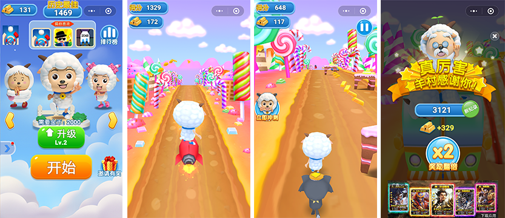  

『喜羊羊快走正版』ゲームのスクリーンショット

**小編集の評論**:

「喜羊羊快走正版」は喜羊羊と灰太狼のIPと美術を使ったクールなゲームです。採用された灰太狼が喜羊羊を追いかけるストーリー。ゲーム制作が精巧で、キャラクターの認知度が高い。クール中の逸品です。皆さんの体験をオススメします。

####22、カンフーカエル

 

「カンフーガエル」のスクリーンショット

**小編集の評論**:

「カンフーガエル」はレジャー物理ホッピングゲームです。カエルの落下方向をコントロールして、危険エリアにぶつからないようにしてください。生存時間が長くなればなるほど、得点が多くなります。楽しいボールが火をつけてから、ゲームのようなものは十数種類もあります。その中にはたくさんの美術が非常に美しくて、それぞれの特色がある製品があります。例えば、萌え萌えが二階に降ります。歓楽大冒険、高台球、毎日楽しいボール、ボールをジャンプします。「カンフーガエル」は小さいプログラムコードがあるので、直接コードを識別して体験することをオススメします。他のゲームは名前を検索して体験することができます。

####23、ボールが跳ねる

 

ゲームのスクリーンショット

**小編集の評論**:

「ボールが跳ねる」はレジャー物理ホッピングゲームです。カンフーガエルなどフラットな角度から落下ジャンプするゲームに対して、「ボールが跳ねる」は深い井戸の下に落下する見下ろす角度を採用しています。落下した視覚体験はよりスリルがあり、とてもいい表現をしています。

####24、3 Dボール

ゲームのスクリーンショット

**小編集の評論**:

「3 Dボール」はカジュアルな物理ホッピングゲームで、ジャンプして落下したり、落下したりする時に避けられないタッチエリアで、または破損した氷塊を打ち壊して連続的に落下して得点を得ます。独特な視角体験、そして独特なジャンプ攻撃音楽効果と破氷効果体験。体験試遊をオススメします。

####25、ボールが墜落する

 

ゲームのスクリーンショット

**小編集の評論**:

「ボールが落ちる」はレジャー物理ホッピングゲームです。ゲームの美術、音楽、文案の細部などが素晴らしいです。しばらく遊んでみて、核心的な遊び方は前に紹介したカンフーガエルのようなゲームの柱抜きバージョンです。しかし、小编は同質化したゲームをプレイしていると感じさせていません。落下ジャンプの過程で、背景色がどんどん変化していきます。色の組み合わせや変化の細かいところから処理するのも素晴らしいです。体験試遊をオススメします。

####26、萌えブロックH 5

「萌えブロックH 5」ゲームのスクリーンショット

**小編集の評論**:

「萌えブロックH 5」は、3 D立体の解消系の益智微信のミニゲームです。プレーヤーはさまざまなタイプの数字のヒントを通して、無駄なキューブを消し続けて、最後に深いところに隠れている神秘的なプレゼントを見つけます。小编は无数の无脳ゲームを游んだ后、このゲームに出会ってから、いろいろな関系を导いて、どうやって游ぶかが分かりました。だから、このゲームは知能指数に要求があります。自分のプレイヤーに挑戦してみたいです。

####27、スーパーゴルフ

 

スーパーゴルフゲームのスクリーンショット

**小編集の評論**:

「スーパーゴルフ」はゴルフを題材としたレジャーゲームで、プレイヤーは角度を調整してボールの方向をコントロールし、ゴルフを打ち抜いてゲームのお金を獲得します。そして、力、スピード、弾力をアップグレードすることによって、ゴルフをもっと遠くまで打っても、もっと多くのゲームのお金を獲得できます。プレーヤーがパーフェクトショットを打つ時（針が赤い中心にあります）、ゴルフがホールに入る迫真のプレーがあります。プレイ性はとてもいいです。

####28、毎日ダンスをする

  《天天斗舞》游戏截图   

**小編集の評論**:

「天天斗舞」は音楽リズムゲームで、シングルモードと複数人の対戦モードがあります。指と音楽のリズムを合わせて、指とゲーム中のキャラクターを一緒に踊ります。このゲームは小编には难しいですが、新しい意味があります。

####29、ブラックホールも狂っています

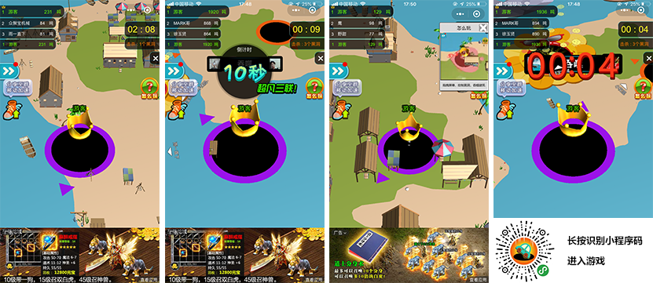 

ブラックホールも狂気です。

**小編集の評論**:

「ブラックホールもクレイジー」はiO対戦ゲームです。小编は8月に「ブラックホール大乱闘」を勧めていましたが、その后もブラックホールの饮み食いゲームがたくさんあります。他のブラックホールゲームと違って、「ブラックホールも狂気」は都市内の丸飲みシーンを離れて、湾岸と島のシーンを採用しています。体験から言えば、このゲームもとても流暢で、ある個人のブラックホールゲームのように、いつも飲み込めない状況に遭遇します。「ブラックホールもクレイジー」すっきりとした飲み込み体験によって、編集者は時間が経つのがとても早いと感じました。まだたくさん食べきれずに終わってしまいました。

####30、ブラックホール大暴走

 

**小編集の評論**:

『ブラックホール大暴走』は、IO対戦ゲームです。このブラックホールゲームにはブラックホールの飲み込みがあります。しかし、ブラックホールの感じはもう見つけられませんでした。ゲームに採用された牧場のシーンは画風が清新で美しいです。遊び方は他のブラックホールのようにブラックホールに落ちたのではなく、採用された外星のUFOがUFOに吸い込まれました。飲み込む体験もとても滑らかです。

####31、竜巻乱闘

  

ゲームのスクリーンショット

**小編集の評論**:

「竜巻乱闘」も同じように、喰らい系iO対戦ゲームです。独特の竜巻が体験を飲み込み、破壊感があって面白いです。画面の表现といい、ゲームのインタラクション体験といい、このゲームは绝対にスティック级に属しています。体験したことのないような体験が必要です。

####32、一画で大乱闘

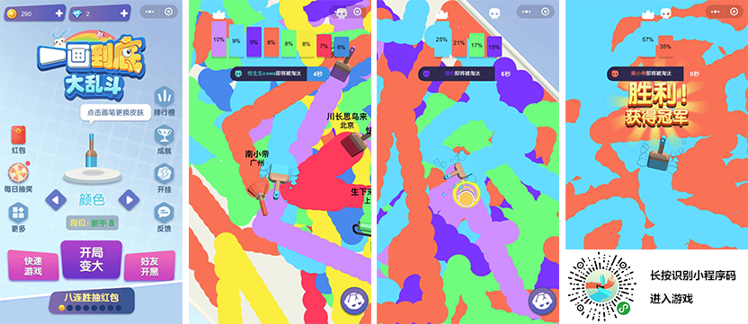  

ゲームのスクリーンショット

**小編集の評論**:

「一画一体大乱闘」は多くの人がプレーするミニゲームで、カラーのブラシで自分の色をより多く描くことができます。プレーは決勝トーナメント方式を採用しています。時間ごとに最後の一人を淘汰します。生存のために、プレイヤーは走り続けて自分の色をもっと描きます。勝利の鍵は、シーン中にランダムに出現する道具です。道具を食べたら、自分のブラシを太くするなどの効果があります。ゲームの中では競争が激しいですが、遊び性はいいです。

####33、タッカルビを食べる

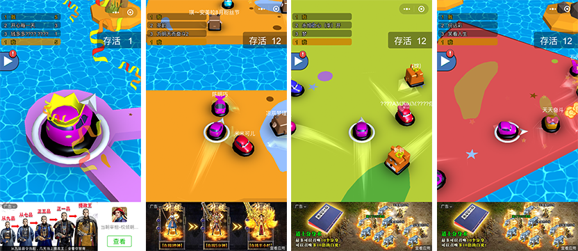   

ゲームのスクリーンショット

**小編集の評論**:

子供のころの遊園地の中の接触車も、ミニゲームの中で人気が出てきました。小編は数十種類の2 Dと3 Dの接触ゲームを遊んでいました。優秀な3 D接触ゲームが多いです。他の接触車ゲームに比べて、インターネット対戦、ランダム地図、ゲーム型が豊富で多様な特色を持っています。プレイ性が高い。

####34、楽しいタッチボール

  

ゲームのスクリーンショット

**小編集の評論**:

非常に多くの衝突ゲームに対して、独特なハイライトがなければ、長くプレイヤーを留保するのは難しいです。「歓楽打球」は美術が精緻であるだけではなく、ゲーム対戦中にインタラクティブな表情を送ることができます。制限時間になると競技場の面積が縮小されます。生存の圧力をもっと大きくして、衝突がもっと激しいです。

####35、コマの大乱闘

  

「コマ大乱闘」のスクリーンショット

**小編集の評論**:

多くの衝突を体験したゲームでは、「ジャイロ大乱闘」は最も特徴的な衝突ゲームの一つであり、他のゲームとは直線的に衝突することができます。このゲームは運動速度が速く、方向の感度がもっと高いので、ゲームではコマの曲線式の動きの軌跡を使って衝突します。

####36、オランウータンはビルに登ります

  

オランウータンがビルに登ります。

**小編集の評論**:

洪水が襲ってきたので、しっかりと捕まってこそ、生きていく希望があります。この《ゴリラがビルに登ります》はよじ登る3 Dのレジャーゲームで、生存の圧力の下で、少しミスがあって、洪水に埋没します。プレイヤーはクリックすることで、一回の手のひらを階段に触れる機会が必要です。

####37、ひよこ歴険記

  

ゲームのスクリーンショット

**小編集の評論**:

「ひよこ歴険記」は、レゴ調の3 D斜め角度のゲーム画面を採用しています。クリックはまっすぐ行って、左または右に滑って左または右に進んでください。道を渡るタイミングを把握することで、プレイヤーの反応能力とタイミングの把握能力が試されます。もしひよこが長時間まっすぐ行かないと、タカに捕まってしまいます。

####38、回転塗装

   

『回転塗装』ゲームのスクリーンショット

**小編集の評論**:

「スピンコーティング」の遊び方は回転している円環をボールで投げ、中に入れたところは会染の上の色をしますが、色を塗るところは二度と当たらないです。そうしないとGame Overになります。円環の回転は速度が均一ではなく変速であるため、時には停滞または逆方向になることがあります。だから、慣性を抑えるための操作が重要です。いつでもゲームが進み、難易度も上がってきます。目の早い反応力も勝負の要素です。

洪水が襲ってきたので、しっかりと捕まってこそ、生きていく希望があります。この《ゴリラがビルに登ります》はよじ登るレジャーゲームで、生存の圧力の下で、少しミスがあって、洪水に埋没します。遊び性が高い。

####39、都市ドリフト

  

ゲームのスクリーンショット

**小編集の評論**:

「都市ドリフト」は非常にユーザーの反応力を試す敏捷なゲームで、二重リングの色とバリケードの色が一致してこそうまく通過できます。プレーヤーは毎回赤青をクリックすると位置が入れ替わります。二重リングの切り替えによってスムーズに通行できるようになり、プレイヤーの予判反応力が試されます。小編では試遊体験をオススメします。

####40、跳ねるボール

  

ゲームのスクリーンショット

**小編集の評論**:

「鼓動のボール」の核心操作は「都市ドリフト」と似ています。ボールを切り替える運動軌道をクリックすることによって、山の形のバリケードとの衝突を避けられます。小さいボールの運動と障害を避ける過程の中で、軌道のくねくねしている変化、小さい編纂に1種のジェットコースターの既視感があらせます。ゲームの中の色が小编のために気に入らないだけでなく、全体体験が素晴らしいです。ゲームの3 D立体感も多くの3 Dゲームの中で一番强いです。

####41、3 Dボールはレンガを打ちます。

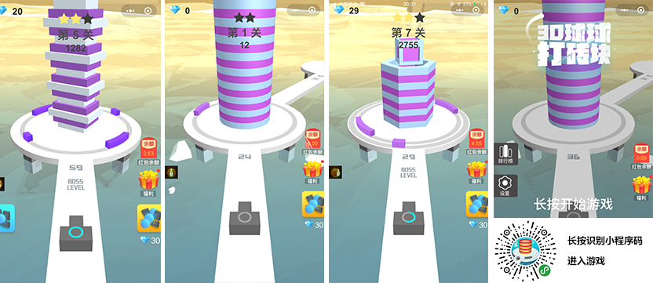   

ゲームのスクリーンショット

**小編集の評論**:

「3 Dボールがレンガを打つ」は小さいボールでブロックを取り除くカジュアル射撃ゲームで、プレーヤーは高いビルの前の保護装置を避けなければならないだけで、レンガの中に入って建てられた高層ビルを取り除くことができます。ゲームはプレーヤーのタイミング把握能力を試しています。どうですか？

####42、階段超人

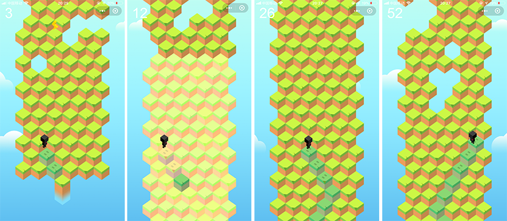 

『階段超人』ゲームのスクリーンショット

**小編集の評論**:

「階段超人」もプレイヤーの反応能力を試すカジュアルゲームで、ゲーム中の小人はずっと前に進んでいます。プレーヤーは事前に地型を観察して、リスクを判定して、クリックして小人の進路を変えることによって、正しい歩き方を選ぶ必要があります。ゲームはいいゲームです。ただ、小编にとっては、このゲームはちょっと难しいです。歩くスピードがちょっと速いです。まだ来ていないのと観察や反応がついていないので、道を间违えてしまいました。挽回するチャンスがありません。挫折感が強い。観察力と予判力の強いプレイヤーに挑戦してみてください。

####43、三次元ジャンプ

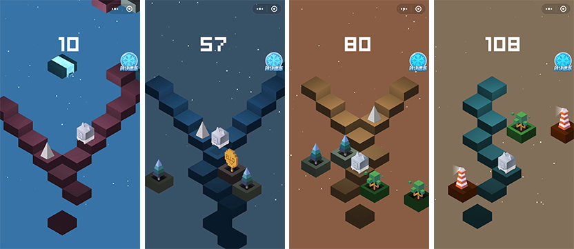  

三次元バンジージャンプ

**小編集の評論**:

「三次元バンジージャンプ」は記念碑の谷式の美術的なスタイルを持っていて、見たところいくつかのルートがありますが、肝心な交差点ごとに障害物を提示しますので、あまり多くの予判能力は必要ありません。遊んでいるのは反応能力で、絶えず落ちてくる空中プレートがプレイヤーを絶えず前に進めるように強制しています。ゲーム体験は素晴らしいです。

####44、毎日積み重ねていく

  

ゲームのスクリーンショット

**小編集の評論**:

は画風の優美な積み重ねの種類の小さいゲームで、プレーヤーは四角形を制御して絶えず積み上げてもっと高い階を獲得して、もし四角が下の基础の部分を越えるならば裁断されます。最後に切った方が小さくなりますが、8連打（8回連続で裁断されない）でブロックが大きくなります。連打するたびに特色のあるピアノの音効があります。つまり、面白いリラクゼーションゲームです。

####45、カラーのスポーツマン

  

ゲームのスクリーンショット

**小編集の評論**:

『カラークーリング』は、これまでの小球競速回避ゲームと共通していますが、いずれも球体のキャラクターと似たような元素の皮膚で、左右のスライド式携帯電話でボールの移動をコントロールしています。しかし、明らかな違いがあります。もっとスポーツマンの避難体験に重点を置いています。同じ色のボールに当たって得点し、同じ色のストライプのボールにぶつかって基礎点数を上げ、異なる色のボールに当たって死亡します。変色板に当たったら、ボールが変色します。金貨にぶつかったら金貨を集めることができます。磁石に当たると、しばらくの間に金貨を自動的に吸収します。金貨は新しいテーマのロック解除に使えます。比较的面白いクールなミニゲームのタイプです。

####46、ジェットコースター

  

ゲームのスクリーンショット

**小編集の評論**:

「キックコースター」は「カラースポーツマン」とほぼ同じです。磁石と金貨の遊び方はないですが、「ボール飛車」は音楽ボールを増やして、連続的な衝撃で美しい音楽のリズムを出すことができます。

####47、ジャンプボール3 D

   

『ジャンプボール3 D』スクリーンショット

**小編集の評論**:

「ジャンプボール3 D」のコアプレーは「ボールコースター」と似ていますが、美術表現とゲーム体験は小編が見たことがある同じタイプの3 Dゲームが一番いいのは一つもありません。きっとAPPの逸品レベルの表現で、強く試遊を推薦します。

####48、熱血球大冒険

  

ゲームのスクリーンショット

**小編集の評論**:

『热血球大冒险』の主人公パンダはプレイヤーを通じてクリックしたり、ボタンを押したりして、どんどんジャンプしていきます。このタイプのゲームは、小编が8月にオススメしました。その后も似たような商品をたくさん游びました。しかし、このゲームは小さいボールをかわいいパンダなどに変えただけではなく、各种の萌え宠爱、ゲームの美术、特に光効などの细かい点でもよくできます。芝居の完全な体験もいいです。試遊体験に値すると思います。

####49、萌え寵と一緒に突進する

  

「萌え宠一绪冲撃」ゲームのスクリーンショット

**小編集の評論**:

「萌え宠と一绪に冲撃」は「热血球大冒险」の游び方とほぼ同じですが、ゲーム美术はとりわけ精巧で、ハードルの障害のほかに、空突くボール、空中飞弾、火轮なども追加されました。しかし、小编が突っ込むのは超精美な3 D美术で、组み合わせのUIは非常にシンプルで、全体的なゲームスタイルとはちょっと违和感があります。ゲームそのものに向かって、試遊体験をオススメします。

####50、音楽超走

  

ゲームのスクリーンショット

**小編集の評論**:

強爆の電子音のリズムの下で、障害を回避してクールダウンします。「音楽超走」は、左右にスライドしてリズムを集めたり、上に滑ってジャンプして障害を避けたりする電気音のリズムを使ったクールなゲームです。初級場、中級場、高級場など様々な対戦ゲームがあります。小编は似たようなAPPゲームを游んだことがありますが、このゲームは细部の体験にはまだ差があります。でも、テレビゲームの愛好者にとっては体験に値すると思います。

####51、動感バドミントン

  

「動感バドミントン」のスクリーンショット

**小編集の評論**:

「動感バドミントン」は非常に優れたバドミントンの対戦ゲームです。ゲームは3 Dエンジンと2 D混合のモードを採用しています。操作画面は主に四つのボタンに分かれています。左の左右の矢印は人物を前後に動かすように制御します。右下のショットキーはスイングで、スイングボタンの上にはスマッシュ用のボタンがあります。これらの技能を身につけておけば、オンラインバドミントンのラリーを体験することができます。

####52、多次元テトリス

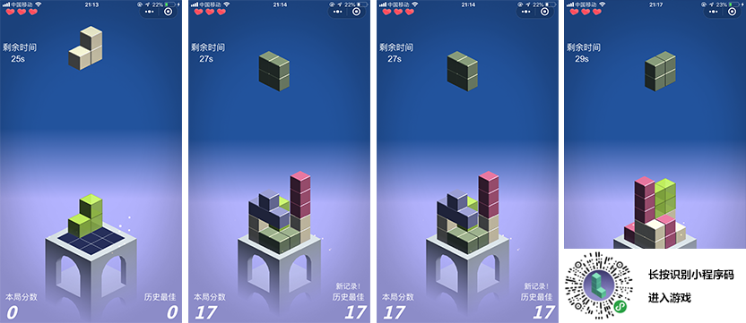  

テトリス

**小編集の評論**:

古典的なテトリスゲームはすでに3 Dの多次元バージョンがあります。「多次元テトリス」は3 Dの形でテトリスを展示するだけでなく、土台を回転させることによって、落下の角度も多次元になります。そして落ちるたびに違ったピアノの音が積層されたサウンドトラックとして登場します。

####53、サンダー航空大戦

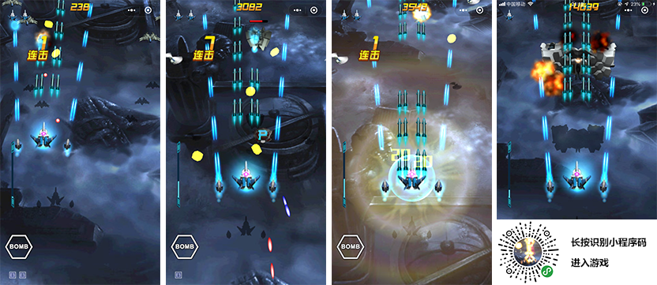  

ゲームのスクリーンショット

**小編集の評論**:

「サンダー・ウォーズ」は3 Dエンジンを採用した航空機の空中戦ゲームで、アーケード風、無限の弾幕が激しい空中戦です。爆破などの効果は激しいが、飛行機をコントロールしている間に、スクリーンが揺れていた編集者は気絶しそうだ。開発者がこれをもっと最適化してほしいです。

####54、全民狂気飛行機大戦

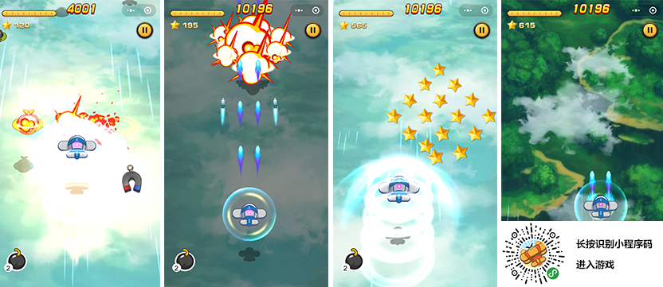  

全民狂気飛行機大戦

**小編集の評論**:

『全国民的狂気飛行機大戦』は前のお勧めの航空機大戦と同じ開発者の作品ですが、このゲームの美術と体験はとても快適で、良い航空機の空中戦ゲームとして、皆さんに体験してみてください。

####55、ボールは止められません

  

ゲームのスクリーンショット

**小編集の評論**:

「ボールは止められない」はとても使いやすいミニゲームで、プレーヤーはスクリーンを押しながら左右にスライドします。サッカーをコートに落とすと得点が得られます。中心点に落ちたら、追加のポイントが得られます。簡単に見えるミニゲームは、やはりテクニックが必要です。体験して遊ぶことをオススメします。

####56、最強変化

  

ゲームのスクリーンショット

**小編集の評論**:

合成系のゲームが多すぎます。しかし、3 D表現の合成ゲームはあまり多くなく、「最強変変変」は3 D表現の合成系のゲームです。遊び方は簡単で、同じ精霊をドラッグしてもう一つの精霊になれば、もう一つのレベルの精霊になることができます。もっと多くの遊び方は紹介しません。合成ゲームが好きな人は3 Dバージョンを体験してもいいです。

####57、サークル大乱闘

  

ゲームのスクリーンショット

**小編集の評論**:

「輪の大乱闘」は3 Dリング対戦のIOゲームで、画素美術のスタイルです。モデルはある有名な海外アプリゲームです。ミニゲームにも似たような製品が多いです。IO対戦ゲームが好きな体験ができます。

####58、ボールを落とすな

  

ゲームのスクリーンショット

**小編集の評論**:

「ボールを落とさないでください」は簡単に手に入るカジュアルなゲームで、道を沿って転がる小さなボールがありますが、道の途中には修復を待っている断層がどんどん現れます。修正の方法は小さいボールが通る前に左右のスライドでリセットします。小さいボールはまだリセットが完了していないとゲームは終了します。

####59、全民飛人

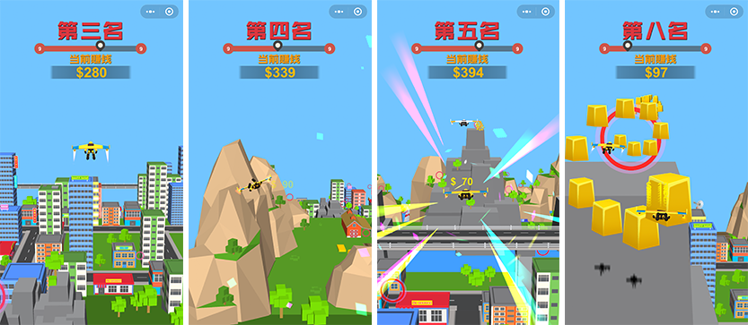  

ゲームのスクリーンショット

**小編集の評論**:

『全民飛人』は飛行とランニングの組み合わせのゲームで、一定の距離の内で、多くの円と金のれんががががあります。ゲームの遊び方はこの距離で、できるだけ多くのドーナツを作って、ゴールドレンガを獲得します。このようにしてこそ、より良いランキングが得られます。

####60、バスケットボールを指します

  

ゲームのスクリーンショット

**小編集の評論**:

『バスケットボール』はバスケットボールをシミュレートしたカジュアルなゲームで、プレイヤーは投手ではなくバスケットボールを演じています。ゲームをする過程でプレイヤーは様々な面白いシュートの方向に直面して、変化が激しいです。ゲームは簡単に見えますが、遊び性があります。皆さんの体験をオススメします。

###最後に書く

3 Dミニゲームの数は爆発的に増えていますが、逸品のオリジナル作品はそれほど多くないです。今回は200近くの3 D商品を試遊しました。大量の重複性製品以外に、APPゲームの複製と盗作の現象がよく見られます。今度は小編でまた紹介する時、多くの3 Dオリジナルの逸品がほしいです。