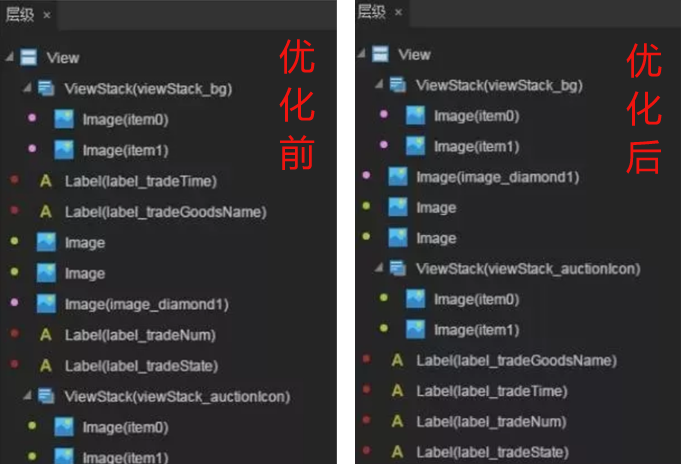
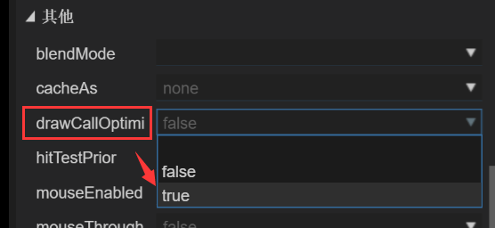

#LayaAir 2.0正式版が発表されました。重要な特性を全面的に紹介します。

>author：charley Date：2019-11-19

9月15日にLayaAir 2.0エンジンテスト版を初めて発表して以来（[点此查看2.0引擎新特性](http://mp.weixin.qq.com/s?__biz=MzAxMjI4NjA1OA==&mid=2650584322&idx=1&sn=375e3dceaaf2b405e728bcba8f174d1e&chksm=83bc3407b4cbbd11c76ea98a032c328e253b80163cd4e68f3ebe5ced75b36beeccf511e87132&scene=21%3Ch1%3Ewechat_redirect)）を継続する`4`ヶ月以上、発売します`4`つの2.0 betaバージョンは、バグを修復し、2 DエンジンとIDEの最適化と追加機能を備えています。`39`項目、3 Dエンジンとプラグインの最適化と機能追加`22`エントリエンジンチームのたゆまない努力のもとで、ついに開発者に2.0の安定した正式版を持ってきました。ここでは、BUGの開発者を大量にテストし、フィードバックしてくれてありがとうございます。

まず、今回の公式版の核心となるいくつかの更新を紹介します。

###1、2 DエンジンのdrawCall最適化機能を追加する（drawCallOptimize）

2 Dエンジンでは、DrawCallの数が多いと必然的に性能が低下します。LayaAirエンジンは写真のレンダリングにおいて多くの最適化を行いました。例えば隣の同じ図集がレンダリングされた時、自動的に結合してレンダリングされます。DrawCallの数を減らすことができます。しかし、UIが使用されている場合、異なる画集またはテキストが挿入されると、画集のマージレンダリングを中断することになる。開発者の不適切な使用による不必要な性能オーバーヘッドが発生し、性能上のカートンが発生する可能性がある。

従来のLayaAirIDE最適化方式では、開発者が同じ色のマップリソースを隣の位置に並べば、エンジンは自動的に結合レンダリングを行い、性能を最適化します。最適化方式は図1に示します。

 

（図1）

マップリソースは色順に最適化されているが、少数の複雑なシーンにおいては、避けられない少量のテキストの補間現象が現れ、より高度な性能の最適化を追求している。LayaAir 2.0の正式版では、IDEにドラフトCallOptimize最適化パラメータが追加されました。デフォルト値はfalseです。図2に示すように、ドラフトCallOptimizeパラメータがtrueに設定されると、エンジンは自動的にテキストマージ最適化を有効にして、すべてのテキストを最上層に抽出します。最適化はよりいっそ徹底的に。今回の最適化は、究極の性能最適化の目標を達成するだけでなく、ユーザーの使いやすさを向上させ、最適化された操作のハードルを低減しました。

 

（図2）

>注意が必要なのは、drawCallOptimize最適化スキームは、テキストを自動的にレベルを上げて表示するため、テキストを半遮蔽しなければならない特殊な要求には適用されません。もちろん、ほとんどの場合はテキストは全文表示されますが、全非表示の場合は隠し属性を直接設定できます。そのため、開発者はこの最適化案を開くことを提案します。

###2、新たなプロジェクト発表機能を追加する（プロジェクトは3.0版を発表する）

LayaAir IDE 2.0の正式版には、新たなプロジェクト発表機能3.0バージョンが追加されています。圧縮、バージョン管理、及びミニゲーム抽出などの機能をより充実させ、柔軟にして、開発者は各機能の使用に対してカスタマイズしてコントロールし、機能をより自由にし、製品の発表機能の使いやすさを大幅に向上させました。

この機能は紹介する内容が多いので、事前に独立文書を発表しました。[《LayaAir IDE项目发布3.0详解》](https://mp.weixin.qq.com/s/AMS7xEqVbLpbfo2F5li3vw)開発者は本文を読んでから、文書リンクをクリックして、プロジェクトを詳しく読んで、3.0の機能紹介を発表します。

###3 D性能統計パネルの最適化

####レンダリングロット統計パラメータRenderBatchを追加

2 D性能は通常drawCallの数、つまり1つのdrwacallが1つのロットです。3 D性能はdrawCallを見ても正確ではないです。3 Dエンジンはレンダリングバッチの統合処理を行うので、drawCallの数を見ると性能の問題を判断するのは難しいです。したがって、2.0の正式版は、より専門的かつ正確なパラメータRenderBatch（レンダリングロット）概念を導入し始めた。図3に示すように。開発者はRenderBatchの数値を見ました。実際にレンダリングした提出ロットです。数値はビジネスのニーズを満たすほど低いほうがいいです。

 

（図3）

####分離CPUとGPUメモリの統計表示

以前は、メモリの表示はまとめて統計しました。実際にはメモリの占有問題の調査にあまり有利ではないです。2.0の正式版からCPUとGPUのメモリ統計をそれぞれ表示します。CPUメモリとGPUMEMoryの数値を直接確認すればいいです。図3に示すように。

###4、GPUテクスチャ圧縮を追加する

LayaAir 2.0エンジンの正式版では、GPUテクスチャ圧縮機能を追加し、スタンプの現存占有率を大幅に低減し、少なくとも75%に達する。つまり、もとは100 Mを占用する必要があったら、今は20 m以上を占めます。これはプログラム管理のメモリコストを大幅に削減し、美術が発揮する空間を増大させ、ゲームの画質をより美しくします。

また、Layaboxの後押しで、WeChat 7.0版からは、ミニゲームの底辺でもGPUテクスチャの圧縮をサポートしています。開発者たちのミニゲームの画面の品質はもっと素晴らしいです。

###5、Meshファイル圧縮を追加する

LayaAir 2.0エンジンの正式版では、Meshファイルの圧縮機能も追加されています。これはMeshファイルのサイズを約60%減らし、3 Dモデルファイルのダウンロード負担を半分以上減らすことになります。つまり、同等の品質の3 Dゲームは、ゲームをロードする速度をさらに高めることができます。ご存知のように、ゲームのロード速度はユーザーの転化データに直接的な影響を与えるので、開発者たちは早くこの機能を使うことができます。

###6、無駄な資源を解放するインターフェースdestroyUnusedResourceを追加します。

以前のエンジンバージョンでは、開発者はリストを通してリソースを管理し、リリースする必要があります。開発者が頭を抱えている問題です。特に3 Dでは、資源の種類が多く、共有問題にも関連しています。LayaAir 2.0エンジンの正式版では、簡単で使いやすい不要な資源を放出するインターフェースを追加しました。`Laya.Resource.destroyUnusedResources();`）を大幅に向上させ、2 Dと3 Dの資源管理の使いやすさを向上させた。

###7、専属会員機能を追加する

LayaAir 2.0の正式版から、一般開発者の日常開発に影響しない上に、会員専用エンジン機能を導入します。1024元でエンジンとなる年会費会員を購入することができ、ハイエンドの会員専用機能（例えば今回のGPUテクスチャ圧縮とMeshファイル圧縮は会員機能になります）を楽しむことができ、エンジンの専属会員機能も一定の頻度で新機能を導入しますが、価格はそのまま維持されます。また、エンジンの専属機能に基づく会員料収入はすべてLayaAirエンジン自体の発展に利用されますので、LayaAirエンジンの自立の起点となります。

以上が今回の正式版の中の重点で機能を追加する以外。

####この4ヶ月間に、2 DエンジンとIDEが追加され、最適化された機能があります。

1.物理エンジンの補助線の設定を追加する
2.物理エンジンRigidBodyはgetWorld Centerインターフェースを増加し、剛体の中心点を取得しやすいです。
3.物理エンジンPhiysics類は剛体数、関節数、衝突数を増加し、インターフェースを獲得する。
4.物理エンジンの衝突イベントによる衝突点情報の取得方法
5.物理エンジンRigidBodyのラインナップVelocity属性を変更するのはobjectタイプです。
6.エンジンLoader sk、aniなどのファイルの拡張子の自動識別を追加します。
7.エンジンSchene類open方法paramパラメータを追加する
8.エンジンSchene類追加単例のサポート
9.ハンドQライトのサポートを追加します。
10.エンジンByte類追加readArayBuffer方法
11.エンジン増骨格動画はデータが取れない異常処理があります。
12.エンジンの増加百度のミニゲームが似合います。
13.エンジンScene類にprogressフィードバックを追加し、シーンローディング進捗情報を入手しやすくする
14.エンジンSceneはloadingページ設定を追加し、set LoadingPage方法によってロードページを設定し、シーン切り替え時にloadingページを表示し、loadingページは現在のシーンのprogressイベントを自動的に受信する。
15.エンジンSceneはshow LoadingPageとhideLoadingPageを追加して手動でloadingページの表示を制御します。
16.エンジンSceneのclose方法でtypeの属性を増加し、閉じる原因を知ることができます。
17.エンジンSprite loadImage方法urlを空にする保護を追加します。
18.エンジンSchene Loaderがskファイルをプリロードする時に自動的にプリロードされます。pngファイル
19.エンジン適応ライブラリはWeChatとBaiduのミニゲーム入力ボックスの正規使用サポートを追加します。
20.ミニゲームに適応するために、IDEにシーンなどのファイルをJsonにエクスポートできるスイッチを追加します。
21.IDEのgraphicsプロパティパネルにrendetypeの設定を追加します。
22.IDEにWeChatオープンデータドメイン展示コンポーネントを追加する
23.IDEに微信小遊戯流量共有コンポーネントを追加する。
24.UI倉庫は肌のコンポーネントを動的にロードし、ロードが完了したらレシオイベントの配布を増加する。
25.IDEに同型ノードを追加し、本タイプのより多くの属性機能を表示する
26.IDEにstyleファイル（リソースのデフォルト属性）の変化検出機能を追加し、styleが変化しているとIDEが自動的に更新を提示し、効果の表示が間違っていることを効果的に防ぐ。
27.IDEに九宮格設定画面の入力枠tab切替機能を追加する。
28.IDEにテクスチャ画像変換ツールを追加し、Androidとiosファイルのメモリ占有サイズ（VIP機能）を大幅に減らすことができます。
29.IDEシーンページ右クリックで検索参照機能を追加します。
30.IDEシーン導出キャッシュの最適化を追加し、ファイルが変わらない時はエクスポートせず、コンパイルの効率を向上させる。
31.IDEは監聴類のファイルの修正を最適化し、変更せずにコンパイルをやめ、コンパイルの効率を向上させる。
32.IDEブロックチェーン項目を追加する（ETH、NEO、HPB）
33.関連する物理類の注釈を最適化し、詳細な説明を追加する。
34.音効解放策を最適化し、より合理的にする
35.DRawCirl drawlineなどのベクトルインターフェースを最適化する
36.物理コンポーネントを最適化し、オブジェクトの作成オーバーヘッドを低減する
37.物理エンジンのマウス関節を最適化し、制御点をオプションに設定し、設定しない場合は、マウスのクリック位置に応じて制御点とします。

####この4ヶ月間に3 DエンジンとUnity導出プラグインが追加され、最適化された機能があります。

1.CompundCollider Shape clearChild Shapeを追加する方法
2.ShnnedMesh RendererのrootBone関連機構を調整し、rootBoneがないと骨格ノード同期行列に関連しない。
3.アニメイトポケモンのactive属性サポートを追加します。
4.Rigidbod3 Dコンポーネントの増加は、睡眠状態の属性isSleepingにあるかどうか
5.Rigidbody 3 Dコンポーネントは、sleep LinerVelocityとsleep AnglarVelocityの属性を追加します。
6.物理コンポーネントのactivateを除去する方法と、Rigidbody 3 DコンポーネントのwakeUpを追加する方法
7.Trail Sprite 3 D精霊を再構築し、いくつかのBUGを修復する。詳細はAPI文の大部分を参照してください。
8.PixelLine Sprite 3 D精霊を再構築し、API強化の使いやすさを最適化し、APIドキュメントを参照してください。
9.Vector 3 SetValue方法を追加する
10.TrailRender TransformZモードを追加
11.カメラのrender関数はreplaccementagパラメータを増加します。
12.1 ShaderフレームにSub Shader概念を追加する
13.プログラム化空の材質を追加する
14.カスタムのShader配置パラメータを簡素化し、使いやすさを向上させる
15.アニメイトアニメは、倒順再生機能がサポートされています。
16.モデルファイル圧縮機能を追加する
17.Primitive Mesh関連のサブクラスをMesh通用類に調整し、作成方式を静的工場式Primitive Mesh.creat XX（）方法に変更し、グリッド類を簡素化する。
18.3 DモードRotationOverLifeTimeモジュールの関連機能を完備する
19.Unityプラグインにアカウント管理ページを追加する
20.UnityプラグインMeshファイル圧縮機能を追加する
21.ユニティプラグインにblinphong材質の頂点色を追加します。
22.ユニティプラグイン調整ユニティのLayaShaderにおける出力色の価値範囲
23.Unityプラグイン修復法線スタンプ導出BUG
24.UnityプラグインはAndroidプラットフォームのテクスチャ圧縮速度を最適化する。
25.ユニティプラグインLayaAirRun機能を最適化し、cmdウィンドウを削除する
26.Unityプラグインがリソースのエクスポート速度を大幅に最適化しました。

###また開発者がLaya 2.0の新しい特性について知らない場合があります。引き続き見てもいいです。9月15日の公開テストではエンジンの新しい特性について全面的に紹介します。

リンクは以下の通りです

[9月15日LayaAir 2.0 开始测试，引擎新特性全面介绍](http://mp.weixin.qq.com/s?__biz=MzAxMjI4NjA1OA==&mid=2650584322&idx=1&sn=375e3dceaaf2b405e728bcba8f174d1e&chksm=83bc3407b4cbbd11c76ea98a032c328e253b80163cd4e68f3ebe5ced75b36beeccf511e87132&scene=21%3Ch1%3Ewechat_redirect)

