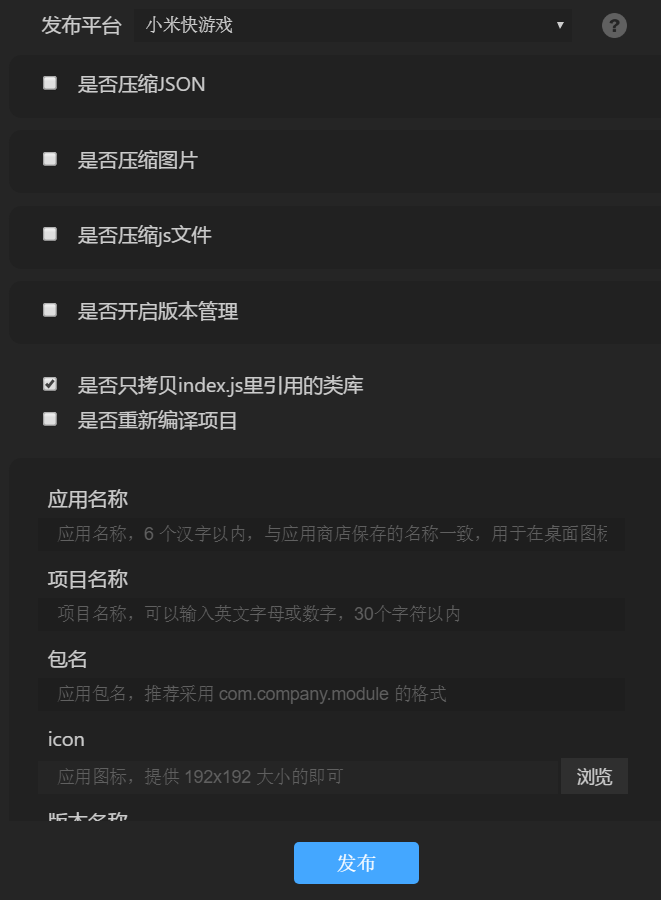
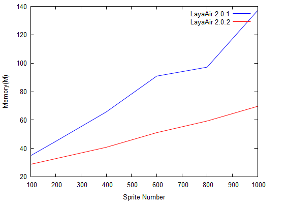

##Layaboxは先に小米の速いゲームを支持して、LayaAir 2.02バージョンは大幅に3 D性能、spineの性能とメモリの最適化を高めて、スクリーンを新たに増加して設定に適します！

>udate：2019-04-15

前回LayaAir 2.0 betaから3 Dアニメファイルの圧縮、メモリと性能の最適化、オープンドメインプロジェクトの作成などの機能が追加されました。この期間に、公式サイトにLayaAir 2.0 3 D文書を大量に追加しました。一部の2 D文書を最適化しました。全面的に公式サイトの3 D例を更新しました。今日発表されたLayaAir 2.02ベータ版では、2.0エンジンを中心に開発された「性能、使いやすさ、3 D」というコアポイントを大量に更新し、さらに先駆けてミニゲームのエンジン適合とLayaAir IDEにミニゲームのリリースをまとめました。

###小米の速いゲームの背景は紹介します。

TEF 2019アプリケーション開発者大会は3月20日に北京で幕を閉じ、海信携帯と中国移動端末会社が快速応用生態プラットフォームに加入すると発表しました。メーカー連盟は12社に拡大しました。高速応用はコストが低く、体験がよく、保存が高いという特徴を持っています。機能と体験面ではすでにオリジナルAPPに匹敵しています。ユーザーの使用コストはもっと軽いです。今まで発展してきた、高速の応用は累計で全ネットの10億の設備をカバーして、月活は2億を超えます。クイックアプリケーションの開設回数は20億を超えて、1億個のデスクトップのアイコンを超えて保存して、7日の保存率は18%です。

ファーストアプリケーションメーカー連盟の一員として知られる携帯電話メーカーのアワさんは、エンジンメーカーに公開されると、多くのゲームのCPを素早く導入し、良質な製品を提供することに道を開く。Layaboxは最初の作品として適格に完成し、公開されたミニゲームのエンジンとして、完全なリリースとアクセスプロセスを備えています。特にLayaAir IDE内ではエンジンのキーリリースツールを提供しています。開発者は速やかにLayaAirエンジンに基づくゲーム項目を小米快ゲームとして発表できます。そしてアクセスプロセス全体が非常に便利で、開発者のアクセスコストを大幅に低減しました。

速いゲームの入り口は典型的な原生の応用を含んで、豊富なシステム級の入り口のシーンがもあります：ブラウザー、応用の店、ゲームセンター、デスクトップの検索/大域の捜索、マイナスの1ついたて、ロックスクリーン、音声の助手、高速の応用センター、Push、カレンダー。ユーザーがスクリーンを点灯すれば、いつでもどこでも早くミニゲームに入ることができます。未来の億級のユーザーが資源を露出して支えます下に、速いゲームは速い応用の生態の未来になるだけではなくて、あります全体のゲームの業界の1つの全く新しい増加点になることを望みます。

###LayaAir 2.02ベータバージョンのポイント

**共通部分**

1、エンジンは画面物理解像度適合スイッチを追加しました。有効にすると、適応モードは自動的にスクリーンの物理解像度に調整でき、ゲーム画面をより高清にします。

2、IDEはより強力なバージョン機能を強制的にアップグレードし、ミニゲームのリリースを追加しました。

**2 D方面**

1、エンジンはspineの効率（性能、メモリ）を大幅に向上させました。

2、IDEはバイナリファイルの合併機能を追加し、ファイル合併と図集圧縮の使い勝手を最適化しました。

3、IDEはwavオーディオのコンポーネント識別を追加します。

4、IDEは全面的に自身のUIコンポーネント資源を更新しました。

**3 Dについて**

1、エンジンは同じ材質でMesh Sprite 3 D性能を大幅に向上させます。

2、エンジンは骨格アニメの性能を最適化し、15%アップする。

3、エンジンの性能統計情報は、savedRenderBatchを増加し、開発者が省ロット数を確認しやすい。

4、エンジンShaderPassはStateMap機能を追加し、レンダリング状態の設定がより柔軟であり、ShaderPassを追うこともできるし、材質を追うこともできます。

5、Laya U3 Dプラグインは大幅に最適化され、蒙皮Meshの導出性能を向上させ、100倍向上した。

###物理分解能スイッチの追加

私達は通常スクリーンの適応を行う時、考慮する重要な要素の一つはサイズを設計することです。`750*1334`。ゲームのサイズは画面の解像度に影響するだけでなく、画像ファイルのサイズ、GPU、メモリにも影響を与えます。デザインサイズが大きいのは設計サイズより小さいのです。画像資源サイズが大きく、GPUレンダリング圧力が大きく、メモリ占有が大きいです。ですから、画面の精緻度に対する要求はあまり高くないです。或いは性能などの原因で、デザインする時にゲームの写真のサイズを小さくします。`960 * 640`。引き伸ばして拡大することによって高得点画面にフィットします。このようにして、ハイビジョンの画面が不鮮明になり、画像や文字にモザイクがある（ギザギザ感が強い）という結果になります。だから開発者はあまりにもサイズを小さくしてはいけません。主流の機種を考慮してバランスを考えてください。

ウィーンAndroidの7.0.3バージョンの前に、Android版のウィーチャットのゲームの下の階は強制的にスクリーンのCanvasの幅の高さをスクリーンの物理的な解像度によって設定します。つまり、開発者がゲームの画像のサイズを低くしても、最終的な画面の表現ははっきりしています。もちろん、これは性能に影響します。また、ハイビジョン表示が不要なゲームもありますので、性能の消耗を抑えたいCPもあります。ゲームの最下層にあたると開発者の選択権が奪われます。ただし、7.0.3からは、ゲームの最下層は強制的にCanvasを物理的な解像度に設定しなくなり、性能を向上させると同時に、デザインサイズに問題があるミニゲーム（デザインサイズが小さい）を露出していないことが多く、ハイビジョンの携帯電話では不鮮明になっていることや、軽いモザイク感があることが分かります。LayaAirエンジンは7.0.3のバージョン互換BUGが存在しないため、これらの問題に直面するのは基本的にスクリーンの適合に対する理解が深くなく、適応経験が足りないためです。

适合のハードルを低くするためにも、既存の古いゲームを解决するためには、デザインのサイズを変えない前提で、自动的にハイビジョンの物理解像度モードに适応することができます。したがって、LayaAir 2.0.beta版から、useRetinalCanvasという強制的な設定を追加しました。`Laya.stage.useRetinalCanvas=true`の場合、どのLayaAirを使っても適応モードで、どのデザインサイズのcanvasも物理解像度の大きさで設定されます。利点は、小さいサイズのゲームは、画像のサイズを調整する必要はありません。メモリの占有率が増加することを心配しないでください。また、ハイビジョンモードに戻ることができます。欠点は、高解像度を強制すると必ずGPUレンダリング圧力をもたらします。つまり、この機能をオンにすると、いくつかの性能を犠牲にする必要があります。このため、デフォルトではエンジンをオフにしています。開発者がこの製品の性能がより重要であると考えるなら、LayaAirの標準適合方案を採用してゲームのサイズを設計することができます。

####最適化とミニゲームのサポートを発表します。

LayaAirIDEのリリース機能については、2.0の正式版が新版のリリース機能を発表したため、リリースバージョンの3.0と呼ばれ、一部の開発者がエンジンバージョンと機能バージョン番号との混同や疑問を引き起こしたことがある。このため、LayaAir 2.0.betaからは、小機能のバージョン番号概念があいまいになり、リリースボタンの旧版の指向をなくし、元のリリースボタンはそのまま新版のリリースに向けられています。旧バージョンのリリース機能が必要な場合は、メニューバーの項目オプションで開くことができます。私たちは新しいバージョンを使って発表することを勧めます。機能に関する質問があれば、リリース機能の画面を開いて、疑問符アイコンをクリックして説明文書を調べます。

また、最初にBaiduのスマート・ゲームをサポートした後、LayaAirエンジンは再度率先してミニゲームのエンジン適合とIDEのサポートを完成しました。流量の大きい工場の参加、開発者にまた1つの新しいプラットフォームの流量の配当の機会を多くさせました。

 

もちろん、アクセスの早期には、開発者がミニゲームのアクセス業務についてよく知らないなら、Layaboxのビジネスに連絡して、より多くの技術とサポートを得ることもできます。

**ビジネス連携連絡メール：**bd@layabox.com

####Spineの効率を大幅に向上させました。

LayaAir 2.02ベータ版ではSpineの効率が大幅に向上しました。三七.オーロラ傘下の大天使プロジェクトグループが提供するスピンオフモデルをテストケース素材として、各モデル155の骨格と845の三角形を小米6の内蔵ブラウザでテストします。前のエンジンに対して、性能とメモリの両方からデータを比較しました。

 

**性能比較：**

赤い糸は2.0.2ベータ版、青い線は2.0.1ベータ版X軸はスプライト数、Y軸はスプライト数に対応するFPSフレーム速度です。

  

性能データの比較により，直感的に見ることができた。100個の精霊（sprite）は2.02フレームで、2.0.1は40フレームぐらいしかないです。引き続き精霊数を増加させる過程でFPS（フレーム速度）は低下しているが、2.0.

**メモリの比較:**

赤い糸は2.0.2ベータ版、青い線は2.0.1ベータ版X軸はスプライト数、Y軸はスプライト数に対応するメモリが使用量を占めています。

 

メモリ占有データの比較により、直感的に見ることができます。同じ精霊数の場合、LayaAir 2.02に基づくテストケース占有メモリはLayaAir 2.0.1バージョンによるものよりもかなり減少しているだけでなく、精霊の数がどんどん増加している場合、メモリ占有成長曲線も非常に緩やかである。

####VIP機能の増加と最適化

VIP機能では、LayaAir 2.02ベータバージョンからバイナリファイルの統合が追加されました。このように、いくつかの細かいファイルについては、json形式のファイルだけでなく、バイナリファイルも統合できます。ファイル統合機能はファイルダウンロードのインタラクティブ数を大幅に削減し、ゲームのロード効率を向上させることができます。

  

バイナリファイル統合が追加されたため、ファイル統合のための操作フローと仕様を統一するために、テキスト（json）ファイルの統合の使い方も調整されました。また、図セットのテクスチャ圧縮IDEの操作フローも最適化され、開発者がマニュアルで図セットのテキスト情報を作成する必要がなくなり、開発者が直接に図セットのatlasまたはpng画像をツールバーにドラッグすると自動的に認識でき、機能の使い勝手がさらに強化されます。以上の詳細な機能使用紹介については、VIP機能の紹介と使用説明を確認してください。

文書リンク:

https://ldc 2.layabox.com/doc/？nav=zh-ts-3-3

 

 

####IDEの他の最適化

IDEとエンジンの使いやすさは私たちが常に努力しているところです。今回のバージョンは、IDEのデフォルトUIコンポーネントのリソースを使用して数年にわたって全面的に入れ替えます。新版のUIコンポーネントのリソース画像は美術的なスタイルだけでなく、モバイルデバイスに向けて美術適応を行い、開発者がDEMOを作る時にコンポーネント資源がより使いやすくなり、UIがより美しくなります。

  

IDEのもう一つの改良は、wavオーディオフォーマットコンポーネントの識別をサポートしています。LayaAir 2.02前に、IDEはmp 3形式のファイルをオーディオコンポーネントとして認識し、可視化のためのシーントリガとして使用しています。今はwavサウンドのサポートが多くなり、LayaAir IDEの可視化編集と創作プロセスをより快適にします。

 

####3 D性能分析機能の追加

3 Dゲーム制作は、バッチ最適化が重要な機能の一つですが、バッチ最適化を開始した後、どれぐらいのRenderBatchが節約されたのか、開発者は直感的に分かりにくいです。したがって、LayaAir 2.0.2 beta版から、エンジンは性能統計情報パネルにsavedRenderBatchパラメータを追加しました。このパラメータ値は最適化操作を行った後、節約できるロット数です。パラメータの値を見ると、どれぐらい最適化されていますか？どのように最適化を開くかは、savedRenderBatchのパラメータ値に影響を与えます。

#####1、静的結合：

LayaboxのUnityプラグインに静的なラベルをチェックして、エンジンはシーンをロードする時静的な物体をマージして処理して、RenderBatchを減らすことができて、シーンの性能を大幅に高めて、原則は同じ材質のモデルです。だから開発者はシーンの模型を編集する時にできるだけ同じ材質を使います。

#####2、動態的合併：

この最適化は開発者がいかなる設定を行う必要がなく、また物体の動態移動は制限されないが、マージ原則は比較的厳格であり、Meshと同材質の二重条件を満たす必要があるが、三次元シーンにおいてもこのモデルは依然として大量に存在し、RenderBatchを大幅に低減することができる。

#####3、ダイナミック頂点マージ：

この最適化は開発者による任意の設定が必要ではなく、物体の動きが制限されず、結合原則は同じ材質であり、モデルの頂点は10個以下であり、比較的厳しいが、現在はいくつかの偽の影と特殊効果のモデルにおいて依然として発揮空間があり、少量のRenderBatchを減らすことができる。

以上のいくつかの点で最適化された優先度は静的合併>ダイナミック頂点合併であり、総合的に開発者の最適化原則は簡単であり、シーンモデルの材質がMeshと同じである限り、シーンの動かない物体は静的にチェックして、レンダリングロットを節約することができます。

 

####3 D性能を大幅に向上

究極の性能はLayaAirエンジンの重要なラベルの一つです。だから、エンジン性能の極致の最適化の追求も私達のエンジンの発展の重点です。三次元シーンでは通常存在する同じ材質と同じMeshモデル、例えばシーンの森、街灯などの違いは位置と大きさだけであり、今回のエンジンバージョンから、上記の特徴のモデルに対して深さ最適化を行い、同じ材質とMeshのモデルを大量にロットに結合させることで、シーンのレンダリング性能を大幅に向上させることができる。もちろん、開発者が注意するのは、同じMeshとMaterialを使うために、重複したモデルをできるだけ保障することです。またこの最適化は物体の移動変換に影響を与えず、このような場合にはエンジンを動的に統合して最適化し、性能を大幅に向上させることができる。

Surface Pro 6というテスト機種で、いくつかの比較テストをしました。CPUはIntel i 5 8250 U、GPUはIntel UHD Graphics 620で、テストケースのモデルは12つの三角面を採用している。データコントラスト図は開発者に直感的な効果を与えてほしい。

  

上の図のテストケースの効果から、LayaAir 2.0.2 betaのバージョンは2万以上の精霊の時、フルフレームに達することができますが、2.0.1 betaのバージョンは20以上のフレームしかなく、精霊の増加と同じ条件で、2.2.0 betaはずっと優勢を維持しています。

アニメイトアニメーションはLayaAir 3 Dのアニメーションコンポーネントであり、骨格アニメーションは最も一般的な機能であるため、骨格アニメーションの性能とメモリの最適化もLaya Air 3 Dの重点最適化任務としており、LayaAir 2.0のリリース以来、アニメイトの動画モジュールの性能はすでに最適化されており、今回のLayaAir 2.02版も同様に骨格アニメーション性能を最適化し、再度15%向上させた。また、LayaboxのUnity導出プラグインは骨格アニメーションのリソースフォーマットを最適化しており、新版Unityプラグインを使用して資源を導出することで、モデルのレンダリングロットの性能を低減する可能性もある。

最後にLayaboxのUnityプラグインの最適化を進めなければなりません。今回のバージョンのプラグインは、大幅な最適化により、蒙皮Meshの性能を向上させ、エクスポート時間を大幅に短縮し、効率を100倍に向上させます。300秒でできることなら、3秒でできます。

 

####今回追加した3 Dエンジン機能

今回のLayaAir 2.0 betaバージョンの追加機能において、3 DエンジンShaderPassはStteMap機能を追加しました。これにより、レンダリング状態の設定がより柔軟になり、ShaderPassごとに設定できます。材質ごとに設定することもできます。

また、3 Dエンジンの一般的な機能も追加されました。たとえば:

Texture 2 Dはset SubPixelsインターフェーステクスチャを増加させ、mipmapCount属性を増加させ、Laya.Loader.create一括ローディング・コール・イベントパラメータを増加させ、MeshクローンインターフェースはBLENDu ENABLESHITE混合モードを増加させる。

###最後に書く

エンジンはこの一ヶ月でたくさんのことをしました。ここまで書きました。長い間文字を書いて、リリースに関するものは全部書きました。ここの開発者を見ることができるのも、Layaboxの真の愛です。あなた達のサポートに感謝します。また、この多くの更新をより多くの開発者にお知らせします。未来はエンジンにおいて、もっと大きな動きがあります。エンジン自体だけでなく、公式サイトの学習文書についても、みんながずっとツッコミを入れていましたが、私たちは一年後に改善されていることが明らかになりました。

