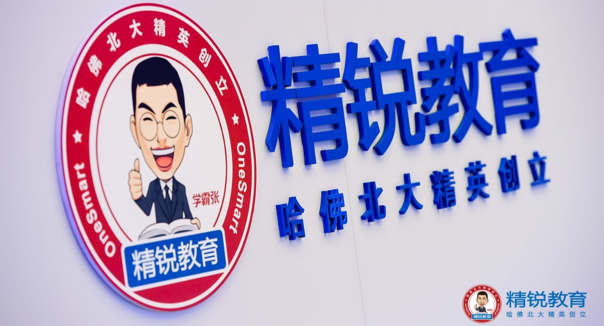

##Layaboxはプログラミングなしの3 D制作ツール「LayaMaker」を発売し、精鋭教育グループと連携して新たな分野に進出します。

udate：2019-04-26

今日、Layaboxは教育分野のリーダーである精鋭教育UUUbbcと戦略提携協議を締結し、傘下の製品LayaMakerを携えて教育業界のインタラクティブ教育分野に本格的に進出すると発表しました。Layaboxは精鋭教育グループを重点サービス対象とし、双方は教育プラットフォームの構築、インタラクティブ授業の制作、育成などの面で全面的に深い協力を行い、それぞれの優位を通じて、インタラクティブ教育体験を高め、オンライン教育ビジネスモデルを新たに定義する。

 

Layaboxは精鋭教育現場と戦略提携協議を契約する。

周知のように、モバイルインターネットの発展に伴って、オンライン教育の形式は日増しに変化し、製品の更新は迅速に行われ、学習の強いインタラクティブ性、高い面白さは教育機関、教師及び学生の切実な必要性である。Layamakerプロジェクトはまさにこの背景の下でLayaboxが孵化したものです。Layaboxの長年の技術優勢の蓄積と3 Dエンジンの分野での絶対的なリードのおかげで、Layamakerは最初から比類のない特徴を備えています。

####1、プログラミングする必要がなく、内容の生産パターンを変える

三回の重大な再構成を通じて、50万＋行のコードの反復と各年齢層のボランティアの協力、Layamakerは使いやすい転覆性の突破を実現しました。プログラミングの技能を身につける必要はなく、計画やアイデアの能力があれば、ゼロプログラミングの基礎があれば、精緻でダイナミックな3 Dインタラクティブシーンの教育内容を迅速に作ることができます。一労永逸の解決教育機関は現在、上質なコンテンツの創作生産などの段階の高い敷居の痛みにあり、動的なインタラクティブコンテンツの創意工夫によるプログラミング担当者への依存を取り除き、業界のコンテンツ生産パターンを徹底的に変えました。

####2、全プラットフォームで発表し、顧客獲得コストを低減する。

LayaMakerプラットフォーム自体とリリースされた製品はPC、モバイルAPP及びミニゲームプラットフォームの運行を同時にサポートしています。ユーザーはいつでもどこでもコンテンツを作成して実行しています。時間と設備の制限を受けません。同時に、クラウドサービスの優勢によって、直接にWeChat、Baidu、小米などの各主流の配布ルートの中で流暢に運行できます。モバイルインターネットの社交関係が分裂して、教育機関の普及方式を革新しました。製品の獲得効率は十倍以上になります。ステップダウンして顧客コストを得る。流量ボーナスが失われた後のインターネット時代に、教育機関の核心的な痛みを本当に解決します。

####3、ツールすなわちコミュニティ

Layamakerはツールだけではなく、コミュニケーション、協力、作品取引を一体にしたコミュニティプラットフォームでもあります。製品素材（モデル、キャラクター、道具）と教育内容（教程、生放送など）の取得、または遠隔共同開発チームの設立、製品の配布普及までは、このプラットフォームで快速に完成し、完璧なコンテンツ生産が可能です。閉ループをかける。

LayaMakerプラットフォームの誕生は、オンライン教育企業にとって画期的な革新的な意義を持っており、教育の未来に影響を与え、決して世紀初頭のFlashに劣らない。

精鋭教育グループとの戦略的提携は、Layaboxがオンライン教育の分野に切り込む第一歩であり、その上で、未来はより多くの教育企業と協力し、相互作用のある教育分野の成長を助力する。これもLayaBoxがゲームエンジンの提供者から「ゲームエンジン＋インタラクティブコンテンツ解決方案」の提供者へのステップであり、今後、LayaBoxはLayaMakerの応用領域をさらに拡大し、教育、ゲーム、ショートビデオ、広告などの伝統的な業界によりよりより多くの優れた解決策を提供する。

 

モバイルインターネット時代、内容は王で、直観表現力、優れたインタラクティブ性などの特徴を兼ね備えたコンテンツ形式は、産業発展の大勢の赴くところであり、LayaBoxとLayamakerプラットフォームは新たなコンテンツ形態の芽と発展繁栄の揺籃と推進手となり、産業の新時代の製品特性と商業生態の構築を助力する。

モバイルインターネット時代、内容は王で、直観表現力、優れたインタラクティブ性などの特徴を兼ね備えたコンテンツ形式は、産業発展の大勢の赴くところであり、LayaBoxとLayamakerプラットフォームは新たなコンテンツ形態の芽と発展繁栄の揺籃と推進手となり、産業の新時代の製品特性と商業生態の構築を助力する。