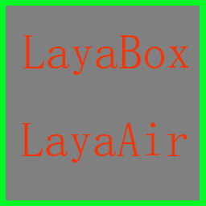
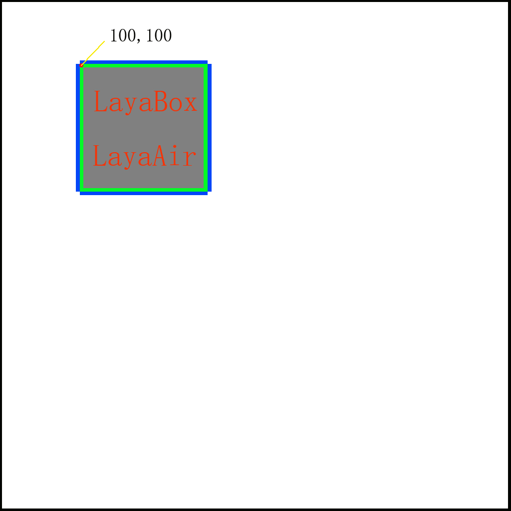

#WebGL 맞춤법 그림에 틈이 생기는 문제

**Layaiair 엔진에서 렌더링 모드로 WebGL 을 사용하면 그림 맞춤처에 틈이 자주 발생한다.그림 아래에 제시한 것처럼:**


 (그림 1)

###틈이 나타난 이유:

1) 3D 세계에서 반의 픽셀 문제, WebGL 은 디스플레이 하드웨어를 사용하여 카탈로그 를 가속화시켜 UV 와 그림의 픽셀 수치 대위를 그릴 수 있는 방법, WebGL의 주소 찾기 방법 등을 그린다.(본 글에서 반픽셀 자료를 더 이상 해석하지 않고, 흥미가 있는 사람은 google 을 찾아볼 수 있다)

2) 2D의 자원은 축소되거나 축소될 때 정교한 문제로 인해 이 틈이 더욱 뚜렷하게 나타날 수 있다.

###엔진에서 화면 처리 방식:

Layair 엔진에 두 가지 패키지 그래프가 있다.UI 편집 모드에서 직접 자원을 내보내는 것은 도구막대 속의 도집 클러치 도구를 사용합니다.그러나 이 두 가지 기능은 모두 같은 일을 하고 작은 그림을 그림으로 합병할 때 모두 보호변을 늘렸고, 그림이 제시한 것처럼:


(2)

**(초록색 부분은 가장 가장자리를 대표하는 픽셀)**

사진 한 장에 합병된 위치는 100, 100.커다란 그림에 합병할 때 자동으로 최변의 픽셀을 확장하지만, 진정으로 그릴 때는 100, 100.이렇게 하면 틈을 피할 수 있다. 그림 아래에 제시한 것처럼.


 (그림 3)

**(파란 부분은 확장된 변두리, 이 변화소 수치는 복사도 2중의 가장자리)**

###맞춤법 지도는 어떻게 수정합니까?

위에서 설명하는 원리를 통해 모두 이해할 것이다.하지만 여러 장면은 제3자 도구를 통해 맞춤으로 연결된 것이며, 예를 들어 Tiled-Map 사용했습니다.

**Tiled-Map 은 이런 보호변을 하지 않았는데 어떻게 처리해야 하나요?**

가장 간단한 방법은 샘플을 채점할 때 픽셀 값을 줄여 예를 들어 장면 원소는 64*64의 체크입니다. 그리면 다음과 같이 그리는 코드:


```typescript

drawImage(image,sx,sy,sw,sh,dx,dy,dw,dh);
```


원래는 다음으로 썼어요:


```typescript

drawImage(image,128,256,64,64,100,100,64,64);//这种写法就可能会出现缝隙
```


현재 변경 사항:


```typescript

drawImage(image,128+1,256+1,64-1,64-1,100,100,64,64);
```


샘플을 채택할 때 자원을 한 바퀴 줄였지만 그릴 때는 64만큼 크다.대부분의 이런 처리법은 알 수 없는 것이다.

하지만 더 좋은 효과를 원한다면 미술에 약간의 시간을 들여야 한다. 예를 들면 그림의 요소를 그릴 때는 이미 보호변을 잘 그린다.


