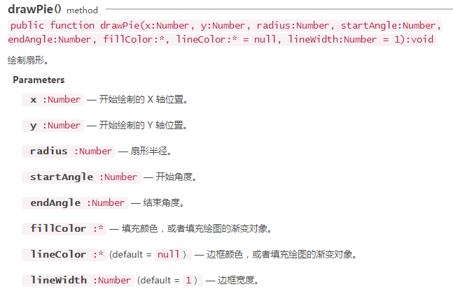
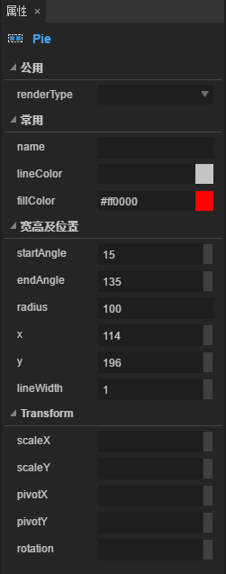

#원형과 부채형을 그리다


###원형을 그리다

원형 그리기 는 비교적 간단하다. 원형 중심점 좌표와 반경 을 통해 쉽게 Layair 엔진 laya.display.Graphics 이 API'drawcle()'을 통해 실현할 수 있다.이 방법의 상세한 설명은 그림 아래에 제시한 것과 같다:

​< br >>
(그림 1)

다음은 Layair 엔진으로 원형을 그립니다. 예를 들어 코드:


```javascript

package
{
    import laya.display.Sprite;
    import laya.display.Stage;
      
    public class Sprite_DrawShapes
    {
        private var sp:Sprite;
          
        public function Sprite_DrawShapes()
        {
            Laya.init(500, 300);
            drawSomething();
        }
  
        private function drawSomething():void
        {
            sp = new Sprite();
            Laya.stage.addChild(sp);
            //画圆
            sp.graphics.drawCircle(80,80,50,"#ff0000");
              
        }
    }
}
```


코드 실행 효과 아래 그림 표시:

​< br >>
(2)

원형 그린은 비교적 간단하다. 80, 80 ’ 은 원형 중심점 좌표이다.50은 반경, "#f8000 "원형 충전 색상 값입니다.


###부채 모양을 그리다

아래로 계속 늘려줍니다. 원형보다 좀 복잡한 부채형 그리기 방법 "drawpie () 를 설명합니다. 이 방법의 상세한 설명은 아래그림에 표시됩니다:

​< br >>
(그림 3)

다음은 Layair 엔진으로 부채 모양을 그립니다. 예를 들어 코드:


```javascript

package
{
    import laya.display.Sprite;
    import laya.display.Stage;
      
    public class Sprite_DrawShapes
    {
        private var sp:Sprite;
          
        public function Sprite_DrawShapes()
        {
            Laya.init(500, 300);
            drawSomething();
        }
  
        private function drawSomething():void
        {
            sp = new Sprite();
            Laya.stage.addChild(sp);
            //画扇形
            sp.graphics.drawPie(80,80,50,90,180,"#ff0000");
              
        }
    }
}
```


코드 실행 효과 아래 그림 표시:

​< br >>
(그림 4)
부채 모양과 동그란 모양을 그리는 것과 비슷하고, 전 세 개의 인자 사용법도 마찬가지로 그릴뿐 시작과 종료 각도를 늘렸다.더 잘 이해하기 위해 부채형의 코드와 인자 변수 연용 원형 코드 사례, 방법 이름의 변화 외에 90과 180두 각도 증가.모두 인코딩 과정에서 인자를 조정하여 깊이 이해할 수 있다.


###3, LayaiairIDE 드래그 컨트롤을 통해 원형을 그립니다

**절차 1**Google LayairIDE, 클릭 모드, View 페이지를 새로 만들기

​< br >>
(그림 5)

**절차 2**구성 요소의 곡선 구성 요소를 View 페이지에 끌면 자동으로 기본 원형을 생성할 수 있습니다

​< br >>
(그림 6)

**절차 3**수정 (더하기 / 감소) Circle 구성 요소 속성 중 수치, 원형의 크기, 색, 상자 등을 변경합니다.

​< br >>
(그림 7)

​< br >>
(그림 8)


###4, LayairierIDE 드래그 컨트롤을 통해 부채 모양을 그립니다

**절차 1**Google LayairIDE, 클릭 모드, View 페이지를 새로 만들기

​< br >>
(그림 9)

**절차 2**구성 요소 중 곡선 구성 요소를 View 페이지에 끌면 자동으로 기본 섹터로 생성됩니다

​< br >>
(그림 10)

**절차 3**Pie 구성 요소 속성 수치 수정, 부채형, 크기, 색상 등을 변경합니다.

​< br >>
(도 11)

​< br >>
(그림 12)

이로써 LayairierID에서 원형과 부채형을 그리면 완성됩니다.