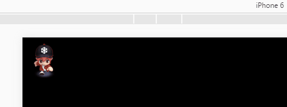

#그림 애니메이션

###1. 그림 애니메이션 개요

게임 개발에서 애니메이션의 운용은 기본적으로 부재되지 않고, Layaiair 엔진은 기능이 강한 애니메이션 애니메이션 종류를 제공해 다양한 애니메이션 자원을 사용하여 게임 애니메이션을 만들 수 있다.

Layair IDE 시간축 애니메이션을 생성할 수 있습니다.`.ani`"애니메이션 자원도 그림으로 애니메이션 프레임 그림을 만드는 방식으로 접미사 이름을 만들 수 있습니다."`.atlas`"도집 자원, 그리고 애니메이션 클래스에 적용.

이 편은 그림 애니메이션의 제작 방식에 대해 소개할 것이며, 그림 1개와 같은 시례에서 그림 애니메이션에서 상용되는 조작을 이룩했다.

< br / > (그림 1)


###2. 그림 애니메이션 재생

####2.1 도집 자원 준비

애니메이션 도집 자원은 일부 상황에 주의해야 한다. 캐릭터 유형화 같은 애니메이션이 많기 때문에 일반적으로 캐릭터 그림 한 세트의 자원, 이름에 동작 이름에 따라 프레임 번호 이름 (도 2).

< br / >2)

**Tips**：

##- IDE 의 그림 패키지 도구는 모든 디렉터리를 1개의 그림으로 포장하고, 상세한 내용은 문서 < 도집 제작 및 사용 자세한 해석 >특효형 애니메이션은 특효 프레임 수량이 많지 않기 때문에 여러 가지 특효 조합이 도집 자원으로 되어 있기 때문이다.

아이디를 통해 세 개의 파일을 생성하고, 각각 '.json' '(png)' 파일이 생성될 것이다.애니메이션 종류 애니메이션은 '.atlas' 또는'.json '파일로 이미지 자원을 얻었다.'.atlas' 파일 (* 사용할 때 종류 설정 코드 *) 를 추가할 필요가 없습니다.

< br / > (그림 3)


####2.2 애니메이션 도집 자원

통과하다`laya.display.Animation`클래스`loadAtlas()`캐릭터의 도화 애니메이션 자원을 가재할 수 있는 방법의 기초 설명은 그림 4개와 같다.

< br / > (그림 4)

#####예시 코드:

입구 문서 클래스 AtlasAniDemo.as 를 만들기, 다음과 같습니다:


```java

package
{
	import laya.display.Animation;
	import laya.utils.Handler;
	import laya.webgl.WebGL;

	public class AtlasAniDemo
	{
		private var roleAni:Animation; 
		public function AtlasAniDemo()
		{
			//初始化舞台
			Laya.init(1334, 750, WebGL);
			
			//创建动画实例
			roleAni = new Animation();
			// 加载动画图集,加载成功后执行回调方法
			roleAni.loadAtlas("res/atlas/role.atlas",Handler.create(this,onLoaded));	
		}
		
		private function onLoaded():void
		{
			//添加到舞台
			Laya.stage.addChild(roleAni);
		}
	}
}
```


부호 실행, 그림 5개처럼.애니메이션은 이미 무대에 가재되어 있어서 기본적으로 재생되지 않은 상태이다.

 


(그림 5)

####2.3 그림 재생

그래픽 애니메이션은 loadAtlas () 방법을 사용한 후 play () 방법을 사용해야 재생할 수 있습니다.play () 방법의 API 인자 설명은 그림 6개와 같다.

< br / > (그림 6)

Google은 기존 예시를 그대로 사용하여 onLoaded 방법에 플래y를 추가합니다.

onLoaded 방법 중 코드 다음과 같습니다


```java

private function onLoaded():void
{
  //添加到舞台
  Laya.stage.addChild(roleAni);
  //播放动画
  roleAni.play();	
}
```


완전한 코드를 실행하는 것은 동영상 7개 시사와 같다

 


(동도 7)

####2.4 createFrames 로 애니메이션 템플릿을 만들기 위해 그림이 집중된 애니메이션을 재생한다.

그림이 독립된 서열 프레임 애니메이션이 집중되면 플래이 바로 사용된다.그러나 여러 개의 애니메이션을 한 그림에 싸서 지정한 애니메이션을 재생하려면 애니메이션 템플릿을 만들어야 한다.애니메이션 템플릿의 방법은`Animation.createFrames()`8 시에 제시한 바와 같다.

< br / > (그림 8)

#####애니메이션 템플릿 만들기

우리 한번 돌아보자.`play()`방법의 세 번째 인자`name`.애니메이션 모듈을 애니메이션 모듈로 만들며 템플릿을 이름한 후`play()`방법의 name 인자가 애니메이션 모듈의 이름을 사용하여 애니메이션 템플릿의 이름을 지정하여 지정한 애니메이션의 방영을 실현할 수 있다.

다음은 애니메이션 템플릿만 생성하는 아찔한 효과를 계속한다.

코드 편집:


```java

package
{
	import laya.display.Animation;
	import laya.utils.Handler;
	import laya.webgl.WebGL;

	public class AtlasAniDemo
	{
		private var roleAni:Animation; 
		public function AtlasAniDemo()
		{
			//初始化舞台
			Laya.init(1334, 750, WebGL);
			
			//创建动画实例
			roleAni = new Animation();
			// 加载动画图集,加载成功后执行回调方法
			roleAni.loadAtlas("res/atlas/role.atlas",Handler.create(this,onLoaded));	

		}
		
		private function onLoaded():void
		{
			//添加到舞台
			Laya.stage.addChild(roleAni);
			
			//创建动画模板dizziness
			Animation.createFrames(aniUrls("die",6),"dizziness");
			//循环播放动画
			roleAni.play(0,true,"dizziness");	
		}
		
		
		/**
		 * 创建一组动画的url数组（美术资源地址数组）
		 * @param aniName  动作的名称，用于生成url
		 * @param length   动画最后一帧的索引值，
		 */		
		private function aniUrls(aniName:String,length:int):Array
		{
			var urls:Array=[];
			for(var i:int=0;i<length;i++)
			{
				//动画资源路径要和动画图集打包前的资源命名对应起来
				urls.push("role/" + aniName + i + ".png")
			}
			return urls;
		}
	}
}
```


코드 실행 효과는 동영상 9개처럼 보이며 그림만 집중해서 애니메이션 템플릿을 설치했다.

 


(동도 9)

Tips: 모든 동작을 단독으로 도화로 포장해도 바로 재생할 수 있다.하지만 동작이 적은 애니메이션 자원을 도집으로 단독으로 치면 자원 가재량과 게임 성능을 증가시키는 데 소모된다.그래서 프레임수가 많지 않은 여러 팀 애니메이션을 한 포토그래픽에 싸서 각각 추천하는 방식으로 호출한다.


####2.5 loadImages 직접 재생 그래픽 집중 지정된 애니메이션

정적 방법 말고.`createFrames()`애니메이션 템플릿 만들기 외에도 loadImages () 방법으로 재생도가 집중된 아찔한 애니메이션 효과를 실현할 수 있다.일단 한번 볼게요.`loadImages()`방법의 인자 설명은 그림 10개와 같다.

 


(그림 10)

loadImages () 가 애니메이션 템플릿을 생성하기 때문에, urls 는 그림 주소로 집합되기 때문에 Laya.loader.loader.load () 을 먼저 불러올 것입니다.다음은 예례 코드 및 주석을 직접 본다.


```java

package
{
	import laya.display.Animation;
	import laya.utils.Handler;
	import laya.webgl.WebGL;


	public class AtlasAniDemo
	{
		private var roleAni:Animation; 
		public function AtlasAniDemo()
		{
			//初始化舞台
			Laya.init(1334, 750, WebGL);		
			//加载完动画的图集后执行回调方法onLoaded
			Laya.loader.load("res/atlas/role.atlas", Handler.create(this,onLoaded));

		}
		
		private function onLoaded():void
		{		
            //创建动画实例	
			roleAni = new Animation();
			//添加到舞台
			Laya.stage.addChild(roleAni);
			
			//通过数组加载动画资源，然后用play方法直接播放。由于loadImages方法返回的是Animation对象本身，可以直接使用“loadImages(...).play(...);”语法。
			roleAni.loadImages(aniUrls("move",6)).play();
		}
		
		
		/**
		 * 创建一组动画的url数组（美术资源地址数组）
		 * @param aniName  动作的名称，用于生成url
		 * @param length   动画最后一帧的索引值，
		 */		
		private function aniUrls(aniName:String,length:int):Array
		{
			var urls:Array=[];
			for(var i:int=0;i<length;i++)
			{
				//动画资源路径要和动画图集打包前的资源命名对应起来
				urls.push("role/" + aniName + i + ".png")
			}
			return urls;
		}
	}
}
```


코드 실행 효과

 


(동도 11)

**Tips**：

##- loadImage 방법도 애니메이션 템플릿을 만들 수 있습니다. 예를 들어 위와 재생 재생`roleAni.loadImages(aniUrls("move",6),"walk").play();`두 번째 인자의 값은 'walk' 바로 애니메이션 템플릿의 이름 (* key *) 이다.여러 번 사용될 때 애니메이션 템플릿을 사용하면 CPU 지출을 절약할 수 있지만, 가끔 혹은 한 번 사용하면 애니메이션 템플릿을 사용하지 마세요. CPU 지출을 절약하는 것은 일정한 메모리 지출을 대가로 합니다.


###3, 기타 설명

####3.1 API

애니메이션 애니메이션 속성 소개는 API 본편으로 소개합니다. 다른 애니메이션 속성 소개는 API 문서를 볼 수 있습니다.

애니메이션 재생 기본:

[https://layaair.ldc.layabox.com/api/?category=Core&class=laya.display.AnimationPlayerBase](https://layaair.ldc.layabox.com/api/?category=Core&class=laya.display.AnimationPlayerBase)

애니메이션 종류:

[https://layaair.ldc.layabox.com/api/?category=Core&class=laya.display.Animation](https://layaair.ldc.layabox.com/api/?category=Core&class=laya.display.Animation)


####3.2 IDE 그림 만들기

그래픽 애니메이션에 대한 IDE 디자인 UI 에 대해서는 애니메이션 구성 요소를 직접 사용해 제작할 수 있다.이렇게 하면 시화할 수 있는 부분은 더욱 직관적이다.그림 애니메이션에 대한 IDE 제작 부분은 볼 수 있다`Animation组件属性详解`그리고`用LayaAirIDE制作图集动画`이 문서 두 편.