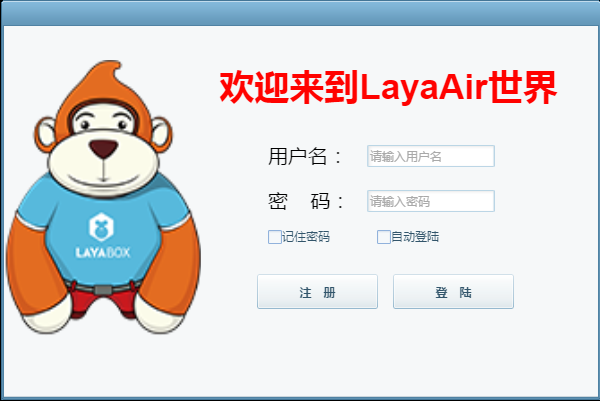
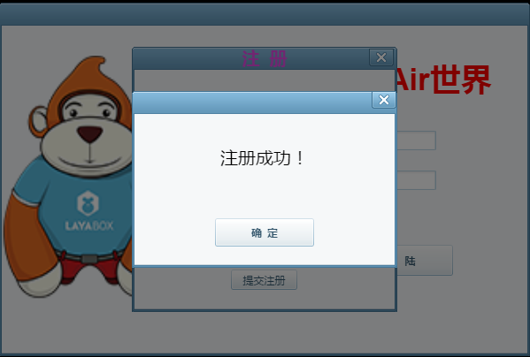
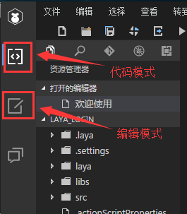
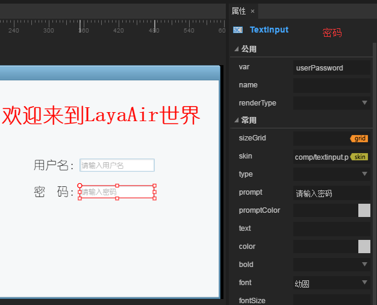
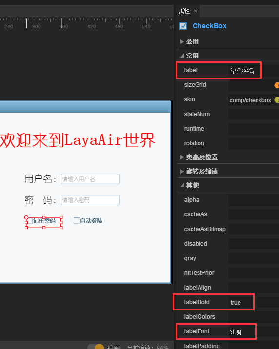
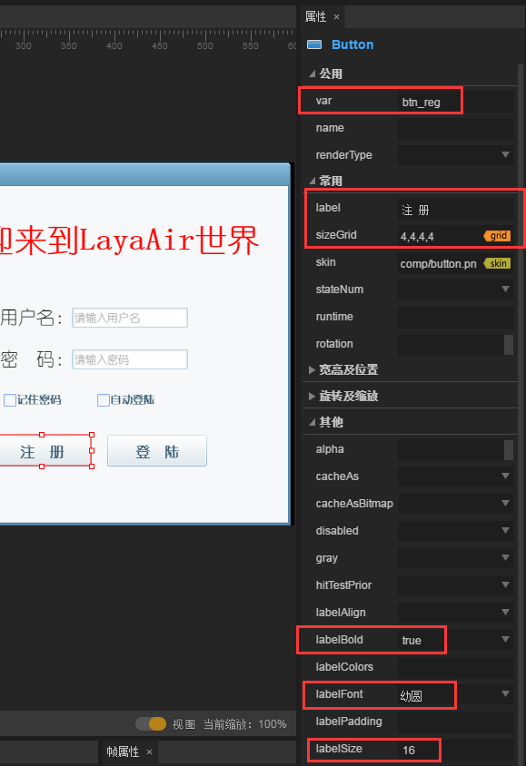
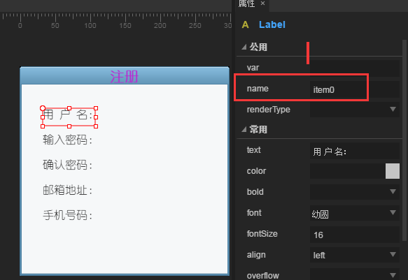
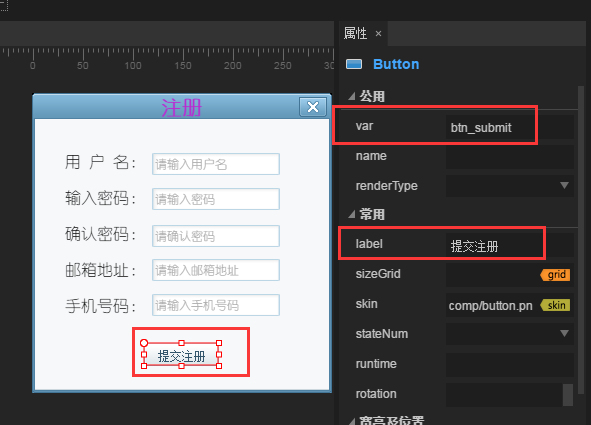

#Layaiair IDE 제작 게임의 로그인 인터페이스 사용

게임개발자라면 게임의 상륙, 등록페이지가 낯설지 않다고 믿습니다.LayairIDE 등록 페이지를 어떻게 사용합니까?그럼 이 교정을 참을성 있게 읽으세요~~(주: 이 문서는 단지 디스플레이 뿐 실제 데이터가 없습니다)

**최종 실현의 효과를 먼저 보자.그림 1, 2, 그림 3, 그림 4**


(그림 1) IDE 에서 인터페이스를 맞춘 후 코드에 로그인할 수 있는 로그인, 무대에 등록 단추를 누르면 등록 패널 (그림 2) 을 팝니다.


(그림 2) 등록 힌트 등록 성공한 페이지 (그림 3 시) 클릭 단추를 누르면 등록 페이지를 닫습니다.


(그림 3) 클릭하거나 오른쪽 위 모서리 닫기 단추를 누르면 등록 성공 힌트 페이지 닫기


(그림 4) 로그인 패널 상륙 단추를 누르면 로그인 성공한 페이지 (주: 로그인 성공과 등록 성공한 패널을 사용하여 전수된 데이터가 다르다.

##1, 새 프로젝트

설치된 LayaiarIDE 열기, 빈 항목을 만들기 (본편은 AS 버전) 입니다.항목 이름, 경로 선택 항목 종류, 마지막 클릭 클릭 생성.그림 5개


(그림 5) 항목 구조는 여기에서 자세히 설명하지 않으니, 관련 문서 페이지로 전환하십시오

##2, 로그인 페이지 생성 및 로그인 UI 맞춤법 완료

###2.1 자원 추가

현재 있는 IDE 페이지가 편집 모드가 아니라면 편집 모드로 전환해야 합니다.그림 6 개



(그림 6)

Layaiairide를 사용하여 만든 프로젝트는 편집 모드 — 자원 목록 아래 모두 하나의 이름으로 comp 의 자원 파일을 포함하고 있으며, 안에 자주 사용하는 UI 구성 요소 자원을 저장합니다.이 문서에서 많은 자원을 사용할 수 없으므로 자원을 삭제하고 새로운 자원을 추가합니다.최종 자원 파일에 보존된 자원은 그림 7개처럼 보여 준다.


(도7) 자원 조작 절차: 자원 판넬 중 오른쪽 단추 — 소재 목록 열기 (자원 소유 목록) — 나머지 자원을 삭제하고 IDE 자원 패널에 추가하여 자원을 새로 고친다.그림 8


(그림 8)

###2.2 로그인 페이지 만들기

편집 모드 항목 모듈 중 오른쪽 단추 — 새로 만들기 — 페이지에 로그인 페이지를 만들기 (그림 9의 표시)


(그림 9)


(그림 10)

**페이지 형식:**

두 가지, View 와 Dialog.두 사람의 구별은: Dialog 에서 View, View 의 기능을 잇는 Dialog과 달리 View는 Dialog 구성 요소는 디스플레이 대화상자를 통해 대화상자의 탄출, 드래그, 모드 창 기능을 실현합니다.View 는 실제 프로젝트에서 고정된 패널로 사용할 수 있으며, Dialog 은 실제 항목에서 팝업 상자로 표시할 수 있습니다

**페이지 이름:**

이 페이지의 이름

**보기 참조:**

실제 프로젝트에서 일부 인터페이스에 자원이 많을 수 있으므로, 이때 미술에 대한 안내도를 따라 이 위치에 대해야 한다.참조물이 하나 없으면 표시만 보고 조작하면 시간이 더 길겠다.보기의 역할을 참고하는 것은 미술을 표시할 수 있는 표시도를 첨가하여 할 수 있는 것이다.

**페이지 너비, 페이지 높이:**

페이지의 넓이가 높으면 뒤쪽에'참고로'라는 선택표가 있다.만약 이 옵션 상자가 선택된 상태라면 앞쪽에 기입하는 이 폭이 실제 항목에서 무효로 현재 페이지의 원소의 폭을 자동으로 계산할 수 있으며 전체 페이지의 넓이를 얻을 수 있습니다.이 상자를 선택하지 않는다면, 앞쪽에 설치된 넓이가 실제 페이지의 넓이입니다. (만약 자원이 설치된 폭이 높다면, 초과된 부분은 과장되지 않고, 어떠한 이벤트를 추가할 수 없습니다)

**참고 배경:**

페이지를 편집할 때 배경 색상 (참고로, 실제 항목에서 효과를 내지 않습니다)

마지막 단추를 누르면 IDE 중간에 볼거리가 있어요.

###로그인 페이지 편집

**로그인 페이지에서 흔히 볼 수 있는 Logo, 제목, 사용자 이름, 비밀번호, 암호 상자를 기억하고, 자동 로그인 단추, 로그인 단추, 로그인 단추 등 원소는 다음으로 이 같은 로그인 페이지 (주: 모든 구성의 속성은 API 에서 찾을 수 있으며, 알 수 없는 API를 찾을 수 있다면 스스로 찾아보십시오.**

**2, 3, 1. 배경 추가**：

배경 자원을 선택하여 배경 자원을 끌어당기는 형식으로 페이지에 넣어줍니다.오른쪽 속성 표시줄에서 sizegrid 속성 (구궁칸을 설치하여 35, 20, 20, 20, 20, 20, 20, 20, 20, 20, 20, 20, 20, 20, 20, 20, 20, 20, 20, 20, 20, 20, 20, 20, 20 을 설치하는 목적 은 그림 을 모호하게 설정한 후 배경 그림의 넓이를 높게 설정하는 것이다.그림 11개


(도 11)

**2.3.2. 로고 자원 추가:**

Layabox Logo 원숭이를 페이지에 추가하여 왼쪽 위치에 올려 놓기 (여기서 캡처를 안하면 12중 보이기)

**2.3. 제목 추가:**

자원 패널의 Label 구성 요소를 페이지에 끌어당긴다.오른쪽 속성 패널 — 속성에서 text 속성을 설정하기 위해 `Layair 세계를 환영합니다 `color 색상을 빨간색 `#ff0400 '' bold '' true ', font 글꼴을' 유원 '으로 설정합니다. (주의, 이 글꼴은 컴퓨터에서 이미 있는 글꼴입니다.**이 항목 중 모든 글은 모두 둥글게 설정되어 있고, 이후에는 언급하지 않는다.**fontsize 텍스트 글꼴 크기를 '35' 로 설정합니다. align 수평 정렬 정렬 'center' 로 설정합니다.그림 11개


(그림 12)

**2.3.4. 사용자 이름과 비밀번호를 추가합니다:**

자원 목록에서 페이지 위로 두 개의 Label 이 적당한 위치에 놓인 다음 오른쪽 속성 패널에 text 를 "사용자 이름:"비밀번호: "비밀번호:" "등 글꼴을" 유원 "으로 설정합니다. 글꼴 크기를" 20 "으로 설정합니다.

자원 목록에서 페이지에 두 개의 입력 상자를 끌어 "TextInput" 사용자 이름과 암호 대응 위치에 저장해 오른쪽 속성 표시줄에서 사용자 이름으로 상자를 입력한 var 성명 변수 "userName (var 및 name 구별: var, 전체적인 변수입니다. 이 변수를 통해 이 요소의 모든 속성을 직접 수정할 수 있습니다.name 는 아버지 노드 ChildByName (‘ name)) 를 통해 이 대상을 찾을 수 있으며, 사용자 이름의 prompt 표시 문자를 '사용자 이름 입력하십시오', 글씨체는 동그랗다.비밀번호 입력 상자와 사용자 이름의 입력 상자와 일치합니다. var 변수를 "userPassword" 로 설정합니다. prompt "비밀번호를 입력하십시오.그림 13


(그림 13)


(그림 14)

**2.3.5. 체크 상자 추가하기:**

암호 및 자동 로그인 체크 상자 추가

자원 디렉토리에서 두 개의 트랙 상자를 끌어내며, 오른쪽 속성 패널에 label, "암호를 기억하기" 와 "자동 로그인" 을 설정하고 다른 옵션에서 labelBold (true), labelfont, "유원" 으로 설정합니다.그림 15


(도 15)


(도 16)

**2.3.6. 등록, 등록 버튼 추가:**

등록 단추: 클릭 후 등록 페이지 팝업

단추 속성 설정


(그림 17)


(도 18)

**여기에 로그인 인터페이스는 이미 모두 완료되었고, 이어서 등록창과 힌트 창을 계속 맞춘다.UI 인터페이스를 모두 완성한 후 코드로 대응하는 기능**

##3, 등록 페이지 생성 및 등록 페이지 UI 맞춤법 완료

**등록 페이지 만들기**

절차는 2.2 상륙 페이지와 일치한다.각각 등록 페이지는 Diaalog 형식의 (위쪽 2.2에서 상륙 인터페이스를 생성할 때 Dialog 과 View 의 구별이 상세하게 설명되지 않습니다) 단추를 누르면 페이지를 만들 수 있습니다.그림 19개


(도 19)

**3.2 페이지 배경 추가**

참고 단계 2.3.1, 배경 자원을 페이지에 끌어들여 구궁 칸 및 그림 크기 설정

**3.3 제목 추가**

참고단계는 2.3.3. 3, Label 구성 요소를 페이지에 끌어들여 제목 위치에 두고 해당하는 속성을 설정합니다.그림 20개


(그림 20)

**3.4 사용자 이름, 사용자 이름 입력 상자, 암호 입력 등 구성 요소 추가**

자원 패널에서 Label 구성 요소를 끌어내며 글꼴을 '둥근', fontsize 글꼴 크기가 16 ', 정렬 방식으로 algin 은 왼쪽 일치' left '과 텍스트 text 를 표시합니다.Label 단축키를 누르면 Ctrl + R 5개의 같은 구성 요소를 복사합니다.그림 21


(그림 21) 클릭 후 페이지에 같은 Label 5개, 적당한 위치를 조정하고, Label text 텍스트 내용을 수정할 수 있습니다.그림 22


(도 22)

텍스트는 text 텍스트 내용이 다르고 다른 내용은 일치합니다.붉은 상자 name 의 내용은 관리하지 않아도 됩니다. 단축키 복사 구성 요소로 자동으로 생성되었을 때 어떤 내용에도 영향을 주지 않습니다.앞의 텍스트 디스플레이 내용이 생기면 뒤에는 반드시 대응하는 입력 상자가 있어야 한다.자원 패널에서 텍스트 입력 상자 TextInput 을 사용자 이름의 뒤쪽으로 끌어 다시 단축키 Ctrl + R 5개의 동일한 텍스트 입력 상자, 마이크로mpt 입력 힌트 입력 힌트 입력그림 23


(도 23)

**등록 단추와 닫기 단추 추가**

자원 패널에서 Button 구성 요소를 아래쪽 위치로 끌어내며, label 디스플레이 글은 '제출 등록' 로 설정되어 있으며, var 변수는 'btn submit (단추를 눌렀을 때 등록 페이지를 닫습니다.그 다음 자원 판넬에서 닫기 단추를 닫기 위해 닫기 단추를 누르는 name (Dialog 페이지에 있는 구성 요소 name) 를 누르면 Dialog 페이지에 저장할 수 있는 구성 요소 name (close) 를 누르면 Dialog 페이지 닫기 단추를 누르면 기본 표시된 label 텍스트를 삭제합니다.그림 24


(사진 24)


(도 25)

##4, 제시 페이지 만들기 및 제시 페이지 UI 맞춤법 완료

**4.1 페이지 만들기**

단계는 3.1과 일치하여 페이지 이름을 NormalDig 로 바꾸고, 클릭을 클릭하여 확정합니다

**4.2 디스플레이 요소 추가**

자원 패널에서 Label 구성 요소를 끌어들여 var 변수를 "txtCont" 으로 정의합니다. 상용 속성 26을 설정합니다.


(그림 26)

**4.3 추가 단추 및 닫기 단추**

3.5단계와 일치하여 버튼을 확정하는 Var 변수를'btnu sure'로 정의합니다.그림 27


(도 27)


(도 28)

##5, 코드 실현도 1, 2, 3, 4 효과

코드를 쓰기 전에 편집 모드에서 F12 를 내보내며 코딩 모드에 있는 bin/h5/res/atlas 디렉터리에 대한 그래픽 파일이 생성되었는지 확인하십시오. 만약 없다면 편집 모드로 돌아가서 단축키 Ctrl + F12를 정리하고 자원을 내보냅니다.(AS 프로젝트 개발자는 FB 나 FD 를 사용하여 작성하고, 이 글에는 FB를 예를 들어 있습니다.)

**5.1용 FB 가져오기 프로젝트**

프로젝트 절차: FB — 파일을 열기 — FlashBuilder 프로젝트 가져오기 (도입 항목 선택상자) — 항목 폴더 복사 — 완성(모릅니다. 기초 문서를 참고하십시오)

**5.2 자원 추가 및 로그인 페이지 표시**

자원을 미리 적재할 목적은 자원을 사용할 때 너무 오래 가재 (단추 자원을 미리 가재해야 합니다.)자원을 재적한 후 자원을 재활용하여 재생 조정 중 실례화된 페이지입니다.코드 다음과 같습니다:


```typescript

package {
	import laya.net.Loader;
	import laya.utils.Handler;
	
	import ui.LoginUI;

	public class LayaSample {
		public function LayaSample() {
			//初始化引擎
			Laya.init(1136, 640);
			//预加载资源
			Laya.loader.load("res/atlas/comp.json",Handler.create(this,onLoaded),null,Loader.ATLAS);
		}		
		//资源加载完成回调
		private function onLoaded():void
		{
			//实例化登陆页面
			var login_ui:LoginUI = new LoginUI();
			//把登陆页面添加到舞台上
			Laya.stage.addChild(login_ui);
		}
	}
}
```


컴파일링 효과


(도 29)

실제 프로젝트에서 UI 페이지에 대한 원소들이 많은 조작이 있다면 바로 입구에서 UI 페이지를 실리화하는 것을 권장하지 않습니다. UI 논리적으로 UI 페이지를 계승하는 것을 건의합니다.따라서 다음 코드 수정, 로그인 페이지 상속 대응 ui 페이지를 만들기

새 로그인 논리 종류 는 그림 30개 의 시범 과 같다


(도 30)

그리고 입구 종류의 코드를 이하 코드 변경


```typescript

package {
	import laya.net.Loader;
	import laya.utils.Handler;
	
	import ui.LoginUI;

	public class LayaSample {
		public function LayaSample() {
			//初始化引擎
			Laya.init(1136, 640);
			//预加载资源
			Laya.loader.load("res/atlas/comp.json",Handler.create(this,onLoaded),null,Loader.ATLAS);
		}		
		//资源加载完成回调
		private function onLoaded():void
		{
          	/////修改此处/////
			//实例化登陆页面
			var login_view:LoginView = new LoginView();
			//把登陆页面添加到舞台上
			Laya.stage.addChild(login_view);
		}
	}
}
```


**5.3 상륙, 등록 버튼 이벤트 추가**

로그인, 등록 버튼에 클릭 이벤트를 추가하기 전에 페이지에 로그인 논리류와 등록 페이지의 논리적 클래스가 각각 UI 페이지를 계승하고, 대응하는 UI 인터페이스를 작성합니다.그림 31, 32개


(도 31)


(그림 32)

LoginView 종류를 엽니다. 등록 단추에 이벤트를 추가하고 등록 단추를 누르면 페이지를 팝니다.코드 다음과 같습니다:


```typescript

package
{
	import laya.events.Event;
	import ui.LoginUI;

	public class LoginView extends LoginUI
	{
		public function LoginView()
		{
			//给注册按钮添加点击事件
			this.btn_reg.on(Event.CLICK,this,onReg);
		}
		private function onReg(e:Event):void{
			//实例化并弹出注册页面
			var reg:RegDlg = new RegDlg();
			//弹出注册页面
			reg.popup();
		}
	}
}
```


이상 코드 실현 효과 33개 표시 (효과와 그림 2 일치)


(그림 33) 닫기 단추를 누르면 등록 페이지를 닫기 (UI 페이지에서 닫기 단추를 끄는 name (close) 로 이름 (close)

등록 버튼에 이벤트를 추가하고 클릭을 클릭한 후 제시 패널을 팝니다.하지만 팝업과 함께 제시보드의 힌트 내용 부과가 필요합니다. 힌트 페이지 NormalDig 종류로 전환하고, 공개된 방법에 텍스트 부위를 추가하여 단추를 누르고 이벤트를 누르면 페이지를 닫습니다.코드 다음과 같습니다:


```typescript

package
{
	import laya.events.Event;
	
	import ui.NormalDigUI;

	/**
	 * 提示页面
	 * @author Laya
	 * 
	 */
	public class NormalDig extends NormalDigUI
	{
		public function NormalDig()
		{
			//给确定按钮侦听点击事件，点击后关闭面板
			this.btn_sure.on(Event.CLICK,this,onClick);
		}
		private function onClick(e:Event):void{
			//关闭页面
			this.close();
		}
		public function popupContent(msg:String):void{
			//给文本赋值
			this.txtContent.text = msg;
			//弹出页面
			this.popup();
		}
	}
}
```


등록 페이지 RegDlg 종류 열기, 제시 패널에 텍스트 표시 '등록 성공!코드 다음과 같습니다:


```typescript

package
{
	import laya.events.Event;
	import ui.RegDlgUI;
	/**
	 * 注册页面
	 * @author Laya
	 * 
	 */
	public class RegDlg extends RegDlgUI
	{
		public function RegDlg()
		{
			//给提交注册按钮侦听点击事件
			this.btn_submit.on(Event.CLICK,this,onClick);
		}
		private function onClick():void
		{
			//实例化提示页面（目的是为了给提示面板中的文本赋值）
			var dlg:NormalDig = new NormalDig();
			dlg.popupContent("注册成功！");
		}
	}
}
```


이상 코드 실행 효과 (그림 34개 보이기)


(그림 34)

**이 페이지 등록 페이지 관련 코드 모두 완료되었습니다. 다음 페이지의 논리 코드**

LoginView 종류를 엽니다. 로그인 단추에 로그인 클릭 이벤트를 누르고 팁 페이지를 누르고 로그인 성공적인 글꼴을 보여 줍니다.코드 다음과 같습니다:


```typescript

package
{
	import laya.events.Event;
	import ui.LoginUI;
	public class LoginView extends LoginUI
	{
		private var dlg:NormalDig;
		public function LoginView()
		{
			//实例化提示面板（目的是为了在点击登陆按钮时给提示页面中的文本赋值）
			dlg = new NormalDig();
			//给注册按钮添加点击事件
			this.btn_reg.on(Event.CLICK,this,onReg);
			//给登陆按钮添加点击事件
			this.btn_login.on(Event.CLICK,this,onLogin);
		}
		private function onReg(e:Event):void{
			//实例化并弹出注册页面
			var reg:RegDlg = new RegDlg();
			//弹出注册页面
			reg.popup();
		}
		private function onLogin(e:Event):void 
		{
			//给提示面板赋值
			dlg.popupContent("登陆成功！");
		}
	}
}
```


이상 코드 실행 효과는 그림 35 시 (그림 4 효과 일치)


(맵 35)

이로써 본 등록, 등록 사례 문서가 모두 완료되었으며 개발자는 이 기초에서 더욱 완전한 상륙, 등록 기능을 실현할 수 있다.만약 문제가 있으면 포럼 에 제출해 주십시오[http://ask.layabox.com/](http://ask.layabox.com/)