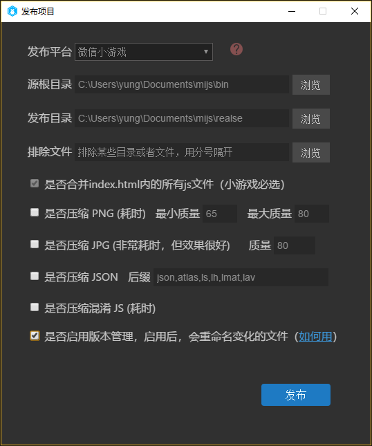
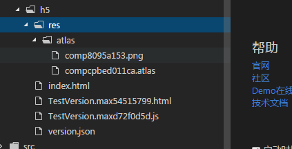

##버전 관리 기능 소개

1.7.15beta부터 게시 인터페이스 열기**버전 관리 활성화 여부**기능

 


버전 관리를 활성화하면 hash 파일의 이름을 생성하고, version.json 의 파일 이름 맵 파일을 생성할 수 있습니다. 항목에서 Resourceversion 종류를 사용하여 버전 컨트롤 컨트롤을 사용하면 자동으로 hash 를 가져올 수 있습니다.

패키지 않은 항목:
 

포장 후 항목:
 


코드 중 Resourceversion 종류 업로드 관리 자원 버전

다음은 구체적인 사용 코드 예제:


```java

package {
	import laya.net.Loader;
	import laya.net.ResourceVersion;
	import laya.utils.Handler;
	import view.TestView;
	
	public class LayaUISample {
		
		public function LayaUISample() {
			//初始化引擎
			Laya.init(600, 400);
			
			//设置版本控制类型为使用文件名映射的方式
			ResourceVersion.type = ResourceVersion.FILENAME_VERSION;
			//加载版本信息文件
			ResourceVersion.enable("version.json", Handler.create(this, beginLoad));		
		}
		
		private function beginLoad():void
		{
			//加载引擎需要的资源
			Laya.loader.load([{url: "res/atlas/comp.atlas", type: Loader.ATLAS}], Handler.create(this, onLoaded));
		}
		
		private function onLoaded():void {
			//实例UI界面
			var testView:TestView = new TestView();
			Laya.stage.addChild(testView);
		}
	}
}
```


프로그램 실행 실제 가재도:
 