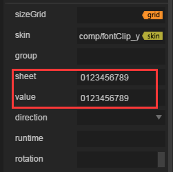

#FontClip 구성 요소 참조


##1, FontClip 구성 요소 알아보기

###1.1 FontClip 작용과 효과 시범

Layaiair 엔진이 새로 증가한 FontClip 기능이 비교적 강해서 한 그룹의 사용자 정의 아이콘, 텍스트, 숫자 등을 빠르게 전환하는 데 사용됩니다.이것은 클립슬라이프와 Bitmapfont 비트맵 글꼴의 기능결합체다.

Clip 구성 요소 중 한 토글 내용만 표시할 수 있습니다. 복잡한 내용을 만나면 여러 개의 Clip 맞춤법이 필요합니다.FontClip 구성 요소를 사용하면, 한 가지 요소만 필요합니다. Value에 대한 "50:46"이면 코드가 적게 될 수 있습니다.

Bitmapfont 비트맵 글꼴은 상대적으로 번거롭기 때문에 제3자 소프트웨어를 사용해야 하고, 제3자 소프트웨어의 글꼴은 기본적으로 만들 수 없고, 글꼴이 단일처럼 보이며 미술에 필요한 효과는 드물다.FontClip, 글꼴, 크기, 색상에서 그림 처리 소프트웨어를 마음대로 수정할 수 있으며, 다양하다.

다음 그림 효과 는 FontClip 제작 (그림 1), 숫자와 중국어를 사용해서 부위를 바꿀 수 있으며, 그것의 글꼴 스타일도 임의로 수정할 수 있다.

​< br / > (그림 1)

​

###1.2 FontClip 구성 피부 (skin) 규범

FontClip 자원 명칭은 fonntClipu를접두두선으로, 이 자원은 1조의 넓고 같은 1조로 구성된 자원 구성도 다음과 같이 그림이 너무 길어도 많이 배열될 수 있다.

​< br >>
(2)

*FontClip 구성 요소의 피부는 구궁격 속성을 사용할 수 없으므로 자원 설계를 할 때 실제 응용 시 크기를 확인하는 것이다.아니면 scaleX, scaley를 통해 축소 제어 *

###1.3 FontClip 구성 요소 API 소개

FontClip API 소개 참고해주세요.[http://layaair.ldc.layabox.com/api/index.html?category=Core&class=laya.ui.FontClip](http://layaair.ldc.layabox.com/api/index.html?category=Core&class=laya.ui.FontClip).


##2. LayairIDE 를 통해 FontClip 구성 요소 만들기

###2.1 FontClip 생성

(2) 중 자원은 FontClip 구성 규칙에 따라 각각 fontClipu num.png, fontClipu year.png, 그림 2중 자원 너비가 너무 길기 때문에 두 줄로 수정되었습니다.IDE 자원 폴더에서 스크린 편집기를 각각 선택하고 배경자원 및 label 구성 요소를 추가하여 이하 효과 (그림 3)

​< br >>
(그림 3)


###2.1 FontClipx 구성 요소 sheet, value 속성 조정

자원 관리자에서 끌어당겨 두 개의 FontClip 구성 요소를 생성한 후 그 중 하나를 선택하면 sheet 속성과 value 속성이 기본값으로 생성되었지만, 그것들은 완전히 정확하지 않으며 다시 수정해야 한다.

​< br >>
(그림 4)

**sheet:** 
sheet 상용 속성 은 구성 요소 의 '비디오 내용 범위' 이다. 내용 을 전시 할 수 있 는 총환, 내용 은 숫자, 마크, 기호 도 중국어 를 기본 숫자 0-9 로 입력 한 내용 과 비디오 자원 을 하나하나 대응 할 수 있 고, 순서 가 같 고, 전체 가 같은 것 을 필요 한 다. 그렇지 않 으면 오류 가 발생할 수 있다.

FontClip 구성 요소의 비디오 자원 자원 배열이나 많은 배열에 따르면, sheet 내용은 해당 자원 도상에서 '공백' 을 합쳐야 한다. 그렇지 않으면 Value 값을 설정할 때 오류가 발생할 수 있다.만약 3 중 중국어 포맷 자원, 샤잇 속에 채워 넣은 내용은 "쥐 호랑이 토끼 용뱀 원숭이, 닭, 개, 개돼지의 해피"를 포함한 뒤 빈 칸을 넣어야 한다.

**value:**
value 상용 속성 구성 요소의 실제 디스플레이 내용은 sheet 총괄 내용 중 일부로 총환 내용의 하위 항목을 마음대로 조합할 수 있습니다.입력한 값을 sheet 내용에서 찾을 수 없다면 표시되지 않을 것입니다.


​< br >>
(그림 5)


##3, 코드 제어 FontClip 구성 요소 전환 디스플레이

위에서 몇 개의 제작 단계에서 IDE 구성 요소를 구성하고, 숫자 연간 변수 변수를 포nClipu num 으로 생초연간 정의 변수를 포nClipu year 라고 합니다.다음은 프로그램 코드를 통해 FontClip 변화를 일으킨다.

페이지 저장, F12 에 따라 페이지를 발표한 후 항목 ui 폴더에서 TestPageUI.as 종류를 생성해서 직접 사용합니다.

아래의 예시 코드를 실행하려면 (그림 1) 의 효과가 완전히 일치하는 것을 볼 수 있다.

**예시 코드:**


```javascript

package {
	import laya.display.Stage;
	import laya.net.Loader;
	import laya.ui.RadioGroup;
	import laya.utils.Handler;
	import laya.webgl.WebGL;
	
	import ui.test.TestPageUI;
	
	import view.TestView;
	
	public class LayaUISample {
		
		/**包含FontClip组件的测试页面**/
		private var testView:TestPageUI;
  		/**公历年数**/
		private var year:int=2017;
		/**12生肖数组**/
		private var yearArr:Array=["鼠","牛","虎","兔","龙","蛇","马","羊","猴","鸡","狗","猪"];
		private var yearIndex:int=9;
		
		public function LayaUISample() 
		{
			// 不支持WebGL时自动切换至Canvas
			Laya.init(1024, 720, WebGL);
			//画布垂直居中对齐
			Laya.stage.alignV = Stage.ALIGN_MIDDLE;
			//画布水平居中对齐
			Laya.stage.alignH = Stage.ALIGN_CENTER;
			//等比缩放
			Laya.stage.scaleMode = Stage.SCALE_SHOWALL;
			//背景颜色
			Laya.stage.bgColor = "#232628";
			//加载引擎需要的资源
			Laya.loader.load("res/atlas/comp.atlas", Handler.create(this, onLoaded));
		}
		
		private function onLoaded():void {
			//实例UI界面
			testView = new TestPageUI();
			//加载到舞台
			Laya.stage.addChild(testView);

          	//年增加帧循环
			Laya.timer.loop(1000,this,onLoop);
		}
		private function onLoop():void
		{
			//公元年增加
			year++;
			
			//“位图字体切片”年更新
			testView.fontClip_num.value=year.toString();
			//农历生肖年增加
			yearIndex++;
			//12年生肖一轮回
			if(yearIndex>11) yearIndex=0;
			//文本切片更新，新年快乐更新
			testView.fontClip_year.value=yearArr[yearIndex]+"年快乐";
			
			//大于2500年时间停止
			if(year>2500)
			{
				Laya.timer.clearAll(this);
			}
		}
	}
}
```


