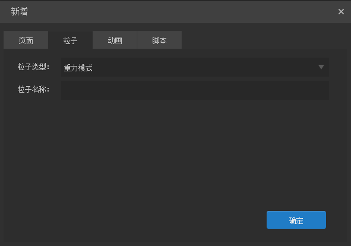

#UI 페이지, 입자, 애니메이션, 스크립트 신규 판넬 상세

프로젝트 관리자에서 UI 페이지, 입자, 애니메이션, 스크립트 1개, 이 기능에 대한 일부 파라메트로 소개할 수 있습니다.

​< br >>
(그림 1)

###새 UI 페이지

**새로 지은 패널에`页面`표시줄에 View 와 Dialog 두 가지 UI 인터페이스를 만들 수 있습니다.그림 2 개**：

​< br >>
(2)

**[인자 설명!]**

**페이지 형식**：

기본 View, 이 형식의 페이지는 닫기 기능이 없습니다. 일반적으로 게임 배경과 계속 켜진 계층 페이지에 사용됩니다.또 다른 옵션은 Dialog, Dialog 이 View 를 계승하고 View의 모든 기능을 제외하고 세션 상자의 탄출, 끌기, 창을 닫는 등 기능으로 게임의 팝업 인터페이스를 사용할 수 있습니다.

**페이지 이름**：

새 페이지 파일 이름, 이 항목은 반드시 기입해야 합니다.

**보기 참조**：

참고보기는 설계 인터페이스의 배경을 통해 미술 설계 원도를 가재해 UI 의 제작 스펠링과 원형 디자인이 일치하는 참조 사진이다.이 옵션은 보기 배경 그림을 참고하여 항목에 내보내지 않고, UI 프로젝트에만 사용되는 참조입니다.

**페이지 폭**：

페이지의 넓이는 설치 후 폭이 계산되지 않고, 체크는 참고너비만 선택하면 실시간 계산 너비가 필요하다. 성능에 대한 초과 압력이 생기므로 선택하지 않을 것을 권장한다.

**페이지 높이**：

페이지의 높이가 높고, 설치된 후 높이가 계산되지 않을 경우 '참고너비로 선택하면 실시간으로 고도를 계산해야 하고, 성능에 대해서는 추가 압력이 생기고, 선택을 건의하지 않는다.

**참고 배경**：

참고배경은 참고보기와 유사한 UI 가 만든 대비 참조만으로 프로젝트에서 효과를 내지 않습니다.옵션입니다.

### **둘째, 새 입자**

새 입자에서 중력모드와 반경 모드를 만들 수 있는 2D 예예 애니메이션도 생성할 수 있다.그림 아래에 제시한 것처럼:

​< br >>
(그림 3)

**[인자 설명!]**

**입자 종류**：

입자 형식은 중력 모드, 반경 모드, 입자 3D 모드, 기본 중력 모드.

중력 패턴의 입자는 다른 방향으로 발사된 입자 효과다.

반경 모드 는 중심 을 둘러싼 반경 의 회전식 입자 효과 다.반경 모드 는 중력 모드 와 근본적 차이 가 없다. 중력 모드 조정 을 통해 반경 모드 를 실현 할 수 있다. 반경 모드 도 중력 모드 의 효과 를 조정 할 수 있다. 구별 은 초기 인자 의 설정 에 다르다.

입자 3D 패턴은 3차원의 입자 효과다.

**입자 이름**：

새로 지은 입자 파일 이름은 반드시 기입해야 한다.

### **새 애니메이션**

새 애니메이션에서 프레임 애니메이션을 만들 수 있다.

​< br >>
(그림 4)

**[인자 설명!]**

**애니메이션 유형**：

애니메이션 종류는 Graphicianimmation과 Efecfection 두 종류다.

GraphicAnimation 은 기본 옵션으로 여러 애니메이션 효과를 포함한 시간축 애니메이션을 만들 수 있습니다.

Effection은 애니메이션 템플릿으로 애니메이션 효과만 생성할 수 있는 템플릿을 만들 수 있으며, 애니메이션 효과를 독립적으로 표시할 수 없습니다.

**애니메이션 이름**：

새로 지은 프레임 애니메이션 파일 이름은 반드시 기입해야 한다.

**애니메이션 너비**：

애니메이션 너비의 설정은 디자인의 배경 너비로 사용하여 게임 실행에 이 설정이 잘못되었습니다.

**애니메이션 높이**：

애니메이션 높이의 설정은 디자인의 배경 높이로 사용되며, 게임 실행에 이 설정이 잘못되었습니다.

**참고 배경**：

참고배경도 애니메이션으로 제작된 배경색 대비 참조만으로 프로젝트에서 효과를 내지 않는다.옵션입니다.

### **새 스크립트**

새 스크립트에서 스크립트와 추가 스크립트를 만들 수 있습니다.그림 아래에 제시한 것처럼:

​< br >>
(그림 5)

**[인자 설명!]**

**스크립트 형식**：

기본값은 스크립트를 확장할 수 있으며, 확장 대상의 속성, 다음 그림 'aa, bb' 등 속성은 확장된 스크립트를 생성하고, 속성 인자를 수정한 후 속성 패널의 확장 속성을 끌어당기는 속성입니다.

​< br >>
(그림 6)

부가스크립트는 상속과 확장 대상이 아니라 부가스크립트를 대상으로 통제한다.

**스크립트 이름**：

새 스크립트의 파일 이름은 반드시 기입해야 합니다.

**유명 실행**：

스크립트를 실행할 때 해당하는 종류: game.view.my Script