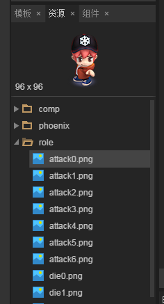

#LayairIDE로 그림 만들기

>> 본문 읽기 전에 2D 애니메이션 기초를 먼저 읽는 그림, 애니메이션 구성 속성 상세해, 기타 IDE 기초 문서.기초 개념 및 조작본 편은 더 이상 자세하게 이야기하지 않는다.

##1. 제작 목표

 


(동도 1)

애니메이션 1개처럼.LayairierIDE에서 그림 애니메이션을 만들고 간단한 UI 패널 및 제어 버튼을 제작합니다.그리고 코드 작성이 제작된 그림 애니메이션에 대한 제어를 한다.

##2. 소재 준비

애니메이션 패널 배경 구성 요소와 버튼 구성 요소, 애니메이션 서열 프레임 자원 복사이 문서의 UI 구성 요소는 comp 디렉토리에서 애니메이션 자원이 role 디렉토리에 있습니다.그림 2 개.

 


(2)

##3. UI 배경 만들기

3.1 구궁격 설정

View 형식의 UI 페이지를 만들기 (* 본례는 animation.ui *) 입니다.그리고 배경 그림 구성 요소를 배경 편집기로 끌어들여 구궁 칸을 설치한 후 그림 3으로 끌어 올리는 효과가 있다.


###3.2 애니메이션 모듈의 생성 및 운용

애니메이션 모듈의 개술에 따라 우리는 코드를 수정하고 애니메이션 모듈 창립 방법 Animation.createFrames () 에 필요한 두 인자가 각각 동작의 그림 서열 url 주소, 동작의 이름과 동작의 이름, 코드:


```java

package
{
	import laya.debug.DebugPanel;
	import laya.display.Animation;
	import laya.display.Stage;
	import laya.events.Event;
	import laya.maths.Rectangle;
	import laya.utils.Handler;
	import laya.webgl.WebGL;
	
	import ui.PlayControlUI;

	public class AtlasAnimation
	{
		/****角色动画****/
		private var roleAni:Animation
		
		public function AtlasAnimation()
		{
			// 不支持WebGL时自动切换至Canvas
			Laya.init(1280,720, WebGL);
			//画布垂直居中对齐
			Laya.stage.alignV = Stage.ALIGN_MIDDLE;
			//画布水平居中对齐
			Laya.stage.alignH = Stage.ALIGN_CENTER;
			//等比缩放
			Laya.stage.scaleMode = Stage.SCALE_SHOWALL;
			//背景颜色
			Laya.stage.bgColor = "#1b2436";
			
			
			//加载角色图集资源
			Laya.loader.load(["res/atlas/role.atlas"], Handler.create(this, createAni));
		}
		
		private function createAni():void 
		{
			
			//实例化角色动画
			roleAni = new Animation();
			// 加载图集动画
			roleAni.loadAtlas("res/atlas/role.atlas");	
			// 设置动画每帧间播放间隔（单位：毫秒）
			roleAni.interval = 100;
			//角色动画放大
			roleAni.scale(1.4,1.4);			
			
			//创建动画模版，以供动作切换控制使用
			Animation.createFrames(actionUrls("stand",7),"stand");    	//站立动画
			Animation.createFrames(actionUrls("move",8),"move");		//移动动画
			Animation.createFrames(actionUrls("die",8),"die");			//死亡动画
			Animation.createFrames(actionUrls("attack",7),"attack");	//攻击动画
			
			//播放某个缓存的动画模版
			roleAni.play(0,true,"attack");	
			
			//动画实例无宽高，需通过getGraphicBounds()或getBounds()获取
			//获取动画的边界信息
			var bounds:Rectangle = roleAni.getGraphicBounds();
			//设置动画轴心点
			roleAni.pivot(bounds.width / 2, bounds.height / 2);
			//设置动画在舞台中心位置
			roleAni.pos(Laya.stage.width / 2-200, Laya.stage.height / 2);
			//加载到舞台
			Laya.stage.addChild(roleAni);

		}
		
		/**
		 * 动作资源的一组url数组（美术资源地址数组）
		 * @param aniName  动作的名称，用于生成url
		 * @param length   动画的帧数
		 */		
		private function actionUrls(aniName:String,length:int):Array
		{
			var urls:Array=[];
			for(var i:int=0;i<length;i++)
			{
				urls.push("role/" + aniName + i + ".png")
			}
			return urls;
		}
	}
}
```


상술한 코드를 번역하려면 기본적으로 모든 애니메이션 서열을 재생하지 않고 캐릭터의 공격 동작만 방영할 수 있습니다.전환 가능`roleAni.play(0,true,"attack");`두 번째 인자'attack'은 다른 애니메이션 모듈 이름 관찰 효과, 다른 애니메이션 모듈이 올바르지 여부.


##4. 애니메이션의 재생 제어

생성된 애니메이션 효과를 더 잘 살피기 위해 동작을 다른 애니메이션 모듈을 바꾸고, 애니메이션 재생 컨트롤을 더 많이 알아볼 수 있다.우리는 IDE 에서 UI 를 제어하고 버튼 이름name, 캐릭터 동작을 제어하는 데 사용합니다.UI 효과도 및 설명 (그림 8):

< br / > (그림 8)

프로그램에서 UI 자원을 불러와 실제 생성된 플래니콜루루이 종류를 불러와 UI CCTV 전환과 재생 컨트롤 코드를 추가합니다.

애니메이션 재생 제어는 애니메이션의 stop () 방법, 애니메이션의 인덱스 현재 재생 색인, count 애니메이션 총길이 속성.

tips:index 재생 색인은 현재 재생 애니메이션 (애니메이션 모듈) 의 프레임 위치를 가리킨다.현재 방영된 애니메이션의 모듈이 애니메이션의 프레임 색인 위치가 아니라 애니메이션의 프레임 색인 위치를 전환합니다.또한 count 속성도 전체 애니메이션의 총 길이를 애니메이션의 총 길이로 전환한다.

코드 참조 다음과 같습니다:


```java

package
{
	import laya.debug.DebugPanel;
	import laya.display.Animation;
	import laya.display.Stage;
	import laya.events.Event;
	import laya.maths.Rectangle;
	import laya.utils.Handler;
	import laya.webgl.WebGL;
	
	import ui.PlayControlUI;

	public class AtlasAnimation
	{
		/****角色动画****/
		private var roleAni:Animation
		/***IDE制作的角色动画控制UI***/
		private var control:PlayControlUI
		
		public function AtlasAnimation()
		{
			// 不支持WebGL时自动切换至Canvas
			Laya.init(1280,720, WebGL);
			//画布垂直居中对齐
			Laya.stage.alignV = Stage.ALIGN_MIDDLE;
			//画布水平居中对齐
			Laya.stage.alignH = Stage.ALIGN_CENTER;
			//等比缩放
			Laya.stage.scaleMode = Stage.SCALE_SHOWALL;
			//背景颜色
			Laya.stage.bgColor = "#1b2436";
			
			//加载角色图集资源
			Laya.loader.load(["res/atlas/role.atlas","res/atlas/comp.atlas"], Handler.create(this, createAni));
		}
		
		private function createAni():void 
		{
			//实例化控制UI,并加载到舞台上
			control=new PlayControlUI();
			Laya.stage.addChild(control);
			
			
			//实例化角色动画
			roleAni = new Animation();
			// 加载图集动画
			roleAni.loadAtlas("res/atlas/role.atlas");	
			// 设置动画每帧间播放间隔（单位：毫秒）
			roleAni.interval = 100;
			//角色动画放大
			roleAni.scale(1.4,1.4)
			//默认会播放全部动画
			roleAni.play();	
			
			//动画实例无宽高，需通过getGraphicBounds()或getBounds获取
			//获取动画的边界信息
			var bounds:Rectangle = roleAni.getGraphicBounds();
			//设置动画轴心点
			roleAni.pivot(bounds.width / 2, bounds.height / 2);
			//设置动画在舞台中心位置
			roleAni.pos(Laya.stage.width / 2-120, Laya.stage.height / 2);
			//加载到舞台
			Laya.stage.addChild(roleAni);
			
			
			//创建动画模版，以供动画切换控制使用
			Animation.createFrames(actionUrls("stand",7),"stand");    	//站立动画
			Animation.createFrames(actionUrls("move",8),"move");		//移动动画
			Animation.createFrames(actionUrls("die",8),"die");			//死亡动画
			Animation.createFrames(actionUrls("attack",7),"attack");	//攻击动画
			
			//动画播放控制按钮组事件监听
			control.box_control.on(Event.MOUSE_DOWN,this,onControl);
			//动作切换按钮组事件监听
			control.box_frames.on(Event.MOUSE_DOWN,this,onChangeFrames);
		}
		
		/****角色动画切换****/
		private function onChangeFrames(e:Event):void
		{
			//根据名字播放动画模版（IDE中设置按钮名字name与动画模版设置名字需相同）
			roleAni.play(0,true,e.target.name);
			//改变标题
			control.title.text="当前播放动画为："+e.target.name
		}
		
		/****角色动画播放控制****/
		private function onControl(e:Event):void
		{
			//获得按钮名字（IDE中设置的按钮名字name）
			var names:String=e.target.name;
			if(names=="stop")
			{
				//动画停止
				roleAni.stop();	
				control.title.text="停止动画";
			}else if(names=="play")
			{
				//播放动画
				roleAni.play();	
				control.title.text="播放动画";
				
			}else if(names=="up")//动画的上一帧
			{
				//动画停止
				roleAni.stop();	
				//当前动画的帧位置减1（如播放动画模版，index、count都会切换为动画模版的帧位置与总帧数）
				roleAni.index--;
				//如果帧位置小于0，则帧位置等于当前动画的帧总数-1
				if(roleAni.index<0) roleAni.index=roleAni.count-1;
				control.title.text="当前帧位置为："+roleAni.index;
				
			}else if(names=="next")//动画的下一帧
			{
				//动画停止
				roleAni.stop();	
				//当前动画的帧位置加1（如播放动画模版，index、count都会切换为动画模版的帧位置与总帧数）
				roleAni.index++;
				//如果帧位置大于动画的帧总数-1，则帧位置等于0
				if(roleAni.index>roleAni.count-1) roleAni.index=0;
				control.title.text="当前帧位置为："+roleAni.index;
			}

		}
		
		/**
		 * 一组动画资源的url数组（美术资源地址数组）
		 * @param aniName  动作的名称，用于生成url
		 * @param length   动画的帧数
		 */		
		private function actionUrls(aniName:String,length:int):Array
		{
			var urls:Array=[];
			for(var i:int=0;i<length;i++)
			{
				urls.push("role/"+aniName+i+".png")
			}
			return urls;
		}
	}
}
```


번역 부호화, 효과도 그림 1개와 같다.우리는 서로 다른 애니메이션 동작과 애니메이션의 정지와 프레임 전환을 눌 수 있다.