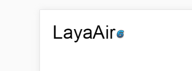

##3, 구성 요소 동적 부호

일반적으로 고정된 값은 IDE 속성 설정기에서 구성 요소를 설정해 놓았지만, 예를 들어 목록 (List) 구성 요소를 구성하려면 구성 요소가 필요합니다.다음은 동적 수정 구성 요소의 속성치를 어떻게 소개합니다.

dataSource 는 Compont 구성 요소 정의 구성 요소 기본 속성 중 하나로, 모든 Compont의 파생 요소 종류가 이 속성을 실현하였고, 우리는 동태부가치를 실현할 것입니다.dataSource 는 기본 속성의 부합 패턴과 지정 속성의 부가가치 모드 두 종류, 다음은 각각 예례를 통해 소개합니다.

###3.1 간단한 UI DEMO 를 만들기

**UI 편집**

우선 하나 만들기`ComponentDemo.ui`UI 페이지와 열기.그리고 저희가...`资源管理器`하나`label`구성 요소와 하나`clip`구성 요소 가져오기`场景编辑器`중 마지막으로 초기 속성을 설정해야 합니다.

`var`반드시 설정해야 할 것입니다. 프로젝트 코드에서 구성 요소에 대한 동적 가치를 실행하려면 통과해야 합니다`var`설정 전역 변수.여기, 우리`label`구성 요소 var 설정`lab`,`clip`구성 요소 var 설정`numb`.

기본`label`글꼴 이 비교적 작으니, 여기 는 시사 하기 위해, 우리들 이 곧 있을 것이다`label`구성 요소의`fontSize`속성 값 설정`50`.

IDE 테이프의`clip`토글 구성 요소`0-9`총 열 개의 숫자로 구성되었기 때문에, 우리는 비디오 절단의 X 축 수량을 ((# 도 할 것이다`clipX`설정`10`,

초기 속성을 설정한 후 IDE (IDE) 의 효과는 그림 4개와 같다.

< br / > (그림 4)

**코드 를 작성하다**

단축키 F12를 내보내는 UI 를 사용하여 프로젝트 인코딩 모드로 전환하고 Compontemontemo.as 입구 (기본 응용 프로그램으로 설정합니다.다음과 같습니다:


```java

package
{
	import laya.ui.Image;
	import laya.utils.Handler;
	import laya.webgl.WebGL;	
	import ui.ComponentDemoUI;

	public class ComponentDemo
	{
		public function ComponentDemo()
		{
			Laya.init(1334,750, WebGL);
			Laya.stage.bgColor = "#ffffff";
			//加载图集成功后，执行onLoad回调方法
			Laya.loader.load("res/atlas/comp.atlas", Handler.create(this, onLoaded));
		}
		
		private function onLoaded():void {
			//创建一个UI实例
			var comp:ComponentDemoUI = new ComponentDemoUI();

			//添加到舞台上显示
			Laya.stage.addChild(comp);
		}
	}
}
```


페이지 중 실행 효과와 IDE 중 하나로, 그림 5개처럼 보이기:

< br / > (그림 5)


####3.1.2 기본 속성 부품 부품 부품

IDE 자체 테이프의 기초 구성 요소 안에 기본 속성이 있습니다. dataSource 를 통해 직접 구성 요소에 대한 기본 속성은 더 이상 지정할 필요가 없습니다. 동적 개정 요소의 기본 속성을 필요로 한다면, 이 설정은 더 편리합니다.

다음으로 우리는 5의 기본 구성 요소를 부과할 것이다.수정 후 코드 다음과 같습니다:


```java

package
{
	import laya.ui.Image;
	import laya.utils.Handler;
	import laya.webgl.WebGL;	
	import ui.ComponentDemoUI;

	public class ComponentDemo
	{
		public function ComponentDemo()
		{
			Laya.init(1334,750, WebGL);
			Laya.stage.bgColor = "#ffffff";
			//加载图集成功后，执行onLoad回调方法
			Laya.loader.load("./res/atlas/comp.atlas", Handler.create(this, onLoaded));
		}
		
		private function onLoaded():void {
			//创建一个UI实例
			var comp:ComponentDemoUI = new ComponentDemoUI();
			
			//为label组件设置组件默认属性值
			comp.lab.dataSource = "LayaAir";
			
			//为clip组件设置组件默认属性值
			comp.numb.dataSource = 6;
			
			//添加到舞台上显示
			Laya.stage.addChild(comp);
		}
	}
}
```


페이지에서 실행 효과는 그림 6개처럼 표시됩니다:

 <br /> (图6)


코드 주석을 통해 간단한 코드를 볼 때 구성 요소에 대한 부치를 완성했습니다.그러나 우리가 세심하게 비교한다면, label 구성의 기본 속성은 text, clip 구성의 기본 속성이 index 입니다.그렇다면 문제가 왔으니 다른 구성 요소는 기본 속성이 무엇일까요?

다음은 구성 요소 기본 속성 목록을 제공합니다

기본 속성
--------------------------------------------------------------------------------------------------------------------------------------------------------------------------------
124타운
Linkbutton
1244 Radiobutton
124대 Label
테xtInput
테xtArea
124커스코보이박스
124대 Tab
124사 Radiogroup
"Stewters" 124대 IndIndeex"
124사 List
124대 Clip
124스바오
124사 스크로ll
124대 Slider
"CheckBox"가 124테레크가 "Sselected"가 124가 "Checkbox"가 있어요.
124사 Image


###3.1.3 지정 속성 구성 요소 구성