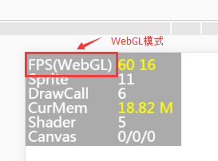

#성능 통계 패널 소개

Layair 엔진 디자인의 초반에 성능을 목표로, 엔진 내에서 대량의 성능을 최적화했다.좋은 엔진을 합리적으로 운용하여 게임 등 엔진 제품을 원생 APPP를 체험할 수 있다.개발자가 엔진의 우세를 발휘할 수 없다면, 게임의 최종 성능체험이나 언급할 수 없다.이에 따라 게임 제작 과정에서 게임 및 엔진의 최적화 기교는 필수적이다.


> 엔진의 성능을 알아야 한다. 우선 성능 통계 패널을 알아야 하며 성능 통계 패널을 자세히 소개한다.


##1, 성능 통계 패널 호출

Layair 엔진 내장 성능 통계 패널은 현재 성능을 실시간으로 검사할 수 있습니다.통계 판넬을 사용하면 언어의 개발에 따라 달라진다.

TS 언어는 직접 코드에 입력한다`Laya.Stat.show(0,0);`성능 통계 패널을 배출할 수 있습니다.

예를 들어 Demo.js 작성 코드 다음과 같습니다:


```typescript

//初始化舞台
Laya.init(1136, 640);
//调用性能统计面板方法，(0,0)为面板位置坐标
Laya.Stat.show(0,0);
```


**Tips**대소문자를 주의해야 한다.


##2, FPS 관련 소개

###2.1 FPS 개요

FPS 는 초당 전송 프레임 (Frames Per Second) 의 축소이다.게임의 프레임 속도가 60FPS라고 가정하면 게임 실행 시 각 프레임의 실행 시간은 1/60초이다.프레임 속도가 높을수록 시각적으로 유창하게 느껴진다.

< br / > (그림 1)

현재 PC 와 휴대전화 등 장치의 만프레임은 60프레임, 그림 1 프레임처럼 보이지만, 어떤 게임은 화면에 대한 유창도가 높지 않고, 엔진의 프레임제한 방법을 채택할 수 있다.`Stage.FRAME_SLOW`FPS 프레임 속도를 최고 30프레임으로 제한한다.

실제 실행 환경은 브라우저에 있어서 성능은 자바스크립트 해방기의 효율에 달려 있기 때문에 같은 게임의 FPS 값은 다른 브라우저에서 차이가 있을 수 있다.이 부분은 개발자가 결정할 수 있는 것이 아니라 개발자가 가능한 한 엔진 및 최적화 항목을 사용하여 저단설비나 저성능 브라우저에서 FPS 프레임 속도를 높이는 것이다.

####2.2 모드 아래 FPS

Layaiair 엔진은 Canvas 와 WebGL 두 가지 렌더를 지원합니다.그래서 FPS 프레임 속도를 볼 때 어느 모드에서 주의를 기울여`FPS(Canvas)`Canvas 모드 내의 프레임 속도를 보여줍니다. 그림 1의 시사회입니다.`FPS(WebGL)`WebGL 모드 내의 프레임 속도는 그림 2개처럼 보여 준다.

<br />	（图2）


####2.3 FPS 수치 설명

그림 1과 2중 FPS 첫 번째 노란색 값`60`현재의**FPS 프레임 속도**높을수록 좋다.

두 번째 노란색 값`16`되다**프레임 보카시 소비 시간**단위는 밀리초, 이는 작아질수록 좋다.

이 두 가치는 만프레임에 유지되지 못하면 제품 조작 과정에서 변화가 생길 수 있으며, 동영상 3개처럼 제시된다.

< br / > (동영상 3)


##3, Sprite 소개

Sprite 통계는 모든 렌더링 노드 (용기 포함) 수를 포함하여 이 숫자의 크기는 엔진 노드 노드, 데이터 조직과 과장의 횟수에 영향을 미친다.숫자가 낮을수록 좋다.그래서 프로젝트에서 디자인을 할 때 최대한 보카시 노드를 줄일 것을 건의한다.


##4, DrawCall 소개


 **DrawCall 횟수는 성능을 결정하는 중요한 지표입니다.**통계 패널의 세 번째 줄에 위치해 있는 것은 그림 4개처럼 보인다.DrawCall 은 Canvas 와 WebGL 에서 대표적인 의미를 물들였지만 적을수록 좋다.**개발자에게 최대한 100에 제한할 것을 건의하다**.

 <br /> (图4)


####4.1 Canvas 아래 DrawCall

Canvas 모드에서 DrawCall 에서 프레임마다 그리는 횟수를 표시하고, 그림, 텍스트, 벡터도 포함합니다.

####4.2 WebGL 의 DrawCall

WebGL 모드에서 DrawCall 렌더를 제출하고 데이터를 준비하면서 GPU 렌더를 알린 과정은 1회 DrawCall, 1회 DrawCall 중 GPU 렌더를 알릴 때 제외하고 재질과 shader 를 교체할 때 사용할 수 있는 작업이다.


##5, 커미 소개

WebGL 모드에서 CurMem 은 메모리와 현존하는 점용을 나타내며 값은 낮을수록 좋다.

Canvas 모드에서 현존하지 않은 개념은 캐롤Mem만이 메모리의 점용상태를 표시할수록 낮은 수치다.


##6、Shader 소개

Shader 는 WebGL 모드에서 특유의 성능 지표로 프레임마다 Shader 제출 횟수가 낮을수록 좋다.


##7, 캔비스 소개

Canvas 는 여기에서 세 개의 수치가 있는데, 그림 5개처럼 보이기 위해 CacheAs 를 설치한 후에만 값어치가 있습니다. 기본값은 기본값입니다.`0/0/0`.왼쪽에서 오른쪽 수치의 의미는 각각:`每帧重绘的画布数量`/`缓存类型为“normal”类型的画布数量`/`缓存类型为“bitmap”类型的画布数量`.


< br / > (그림 5)


**Tips**CacheAs 에 대한 더 많은 최적화 소개, 문서'CacheAs 정적 캐시 최적화'


 