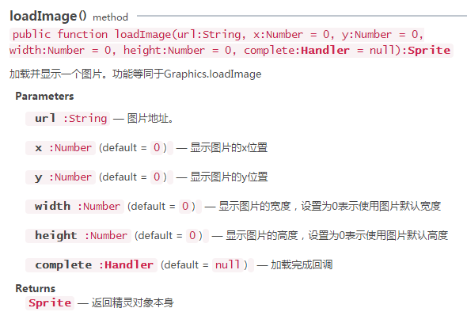

#그림 보이기

>> 그림은 게임 개발 기반이며, 이 편은 API 에서 예례로 Sprite.loadImage 와 Graphics.drawTexture 두 가지 그림을 소개하는 방법입니다.

##1, loadImage 방법으로 그림 전환

###1.1 loadImage API 개요

API 문서에서 laya.display.Sprite 를 검색하면 loadImage () 방법을 찾을 수 있으며, 그림 1에 제시한 대로 이 방법의 인자를 먼저 익혀보자.

 <br /> (图1)


###1.2 loadImage 로 그림 표시

Main.js 입구 클래스를 생성합니다. 다음과 같습니다:


```javascript

//初始化舞台
Laya.init(1334, 750);
//设置舞台背景色
Laya.stage.bgColor = "#ffffff";
var img = new Laya.Sprite();
//加载显示图片，坐标位于100,50
img.loadImage("res/img/monkey1.png",100,50);
//添加到舞台
Laya.stage.addChild(img);
```


예시 코드에서 '(예)`100,50`"그림의 좌표 정보 표시입니다.예시 코드 실행 효과 2-1 시:

< br / > (2-1)

###1.3 loadImage 이미지 전환

그림 전환은 그림의 기초를 나타내는 데 비워진 그림을 추가한 다음 코드 논리를 통해 새로운 그림 자원을 다시 그립니다.구체적인 코드 설명은 코드 주석 및 API, 결합 실행 체험을 참고할 수 있다.

다음과 같습니다:


```javascript

//初始化舞台
Laya.init(1334, 750);

//需要切换的图片资源路径
this.monkey1 = "res/img/monkey1.png";
this.monkey2 = "res/img/monkey2.png";
//切换状态
this.flag = false;

//设置舞台背景色
Laya.stage.bgColor = "#ffffff";
this.img = new Laya.Sprite();
//显示绘制的图片
switchImg();
//侦听switchImg中图片区域的点击事件，触发后执行switchImg切换图片
this.img.on(Laya.Event.CLICK,this,switchImg);
//添加到舞台
Laya.stage.addChild(img);

function switchImg(){
    //清空图片
    this.img.graphics.clear();
    //获得要切换的图片资源路径
    var imgUrl = (this.flag = !this.flag)? this.monkey1:this.monkey2;
    //加载显示图片，坐标位于100,50
    this.img.loadImage(imgUrl, 100, 50);
}
```


실행 코드 효과는 동도 2-2의 표시:

< br / > (동영상 2-2)


##2, drawTexture 방법으로 그림 전환

###2.1 drawTexture API 개요

API 문서에서 laya.display.Graphics 검색하면 drawTexture() 방법을 찾을 수 있습니다. 이 외에도 laya.net.LoaderManager 의 load() 방법과 getRes() 방법, 그리고 laya.utils.Handler 속의 create() 방법을 찾을 수 있습니다. 각 방법의 참수 2, 그림 4, 5, 그림 6 에 제시한:

< br / > (그림 3)

< br / > (그림 4)

< br / > (그림 5)

< br / > (그림 6)


###2.2 drawTexture 불러오기 그림 표시

loadImage () 방법은 외부 그림 자원을 즉석으로 불러올 수 있으며, 완충구에서 그림 자원을 읽을 수도 있고, drawTexture () 방법은 그림을 먼저 다운로드한 후 무대에 첨가해야 하기 때문에, 예시 코드 중 부호화에 사용해야 합니다.`Laya.loader.load()`답조`Handler.create()`# 방법, 간단한 사례 코드를 통해 한 장의 그림을 불러오기, 코드의 주석 부분과 관련 API 설명을 확인하십시오.

Main.js 종류 생성 코드 다음과 같습니다:


```javascript

//初始化舞台
Laya.init(1334, 750);

//需要切换的图片资源路径
this.monkey2 = "res/img/monkey2.png";

//设置舞台背景色
Laya.stage.bgColor = "#ffffff";
//先加载图片资源，在图片资源加载成功后，通过回调方法绘制图片并添加到舞台
Laya.loader.load(this.monkey2,Laya.Handler.create(this,graphicsImg));
function graphicsImg(){
    var img = new Laya.Sprite();
    //获取图片资源，绘制到画布
    img.graphics.drawTexture(Laya.loader.getRes(this.monkey2),100,50);
    //添加到舞台
    Laya.stage.addChild(img);
}
```


코드 실행 효과는 7-1의 시사와 같다.

 <br /> (图7-1)


###2.3 drawTexture 그림 전환

그림 전환은 그림의 기초를 나타내는 데 비워진 그림을 추가한 다음 코드 논리를 통해 새로운 그림 자원을 다시 그립니다.구체적인 코드 설명은 코드 주석 및 API, 결합 실행 체험을 참고할 수 있다.

다음과 같습니다:


```javascript

//初始化舞台
Laya.init(1334, 750);

//需要切换的图片资源路径
this.monkey1 = "res/img/monkey1.png";
this.monkey2 = "res/img/monkey2.png";
//切换状态
this.flag = false;
//设置舞台背景色
Laya.stage.bgColor = "#ffffff";
//加载多张图片，在图片资源加载成功后，通过回调方法绘制图片并添加到舞台
Laya.loader.load([this.monkey1,this.monkey2],Laya.Handler.create(this,graphicsImg));
function graphicsImg(){
    //创建一个实例
    this.img = new Laya.Sprite();
    //添加到舞台
    Laya.stage.addChild(this.img);
    //显示初始化绘制的图片
    switchImg();
    //侦听switchImg中图片区域的点击事件，触发后执行switchImg切换纹理绘制
    this.img.on(Laya.Event.CLICK,this,switchImg);			

    //设置图片坐标s
    this.img.pos(100,50);
}
function switchImg(){
    //清空绘制
    this.img.graphics.clear();
    //获得要切换的图片资源路径
    var imgUrl = (this.flag = !this.flag)? this.monkey2:this.monkey1;
    //获取图片资源
    var texture = Laya.loader.getRes(imgUrl);
    //绘制纹理
    this.img.graphics.drawTexture(texture);                        
    //设置纹理宽高
    this.img.size(texture.width, texture.height);   
}
```


코드 실행 효과는 7-2의 시사와 같다.

< br / > (동영상 7-2)


