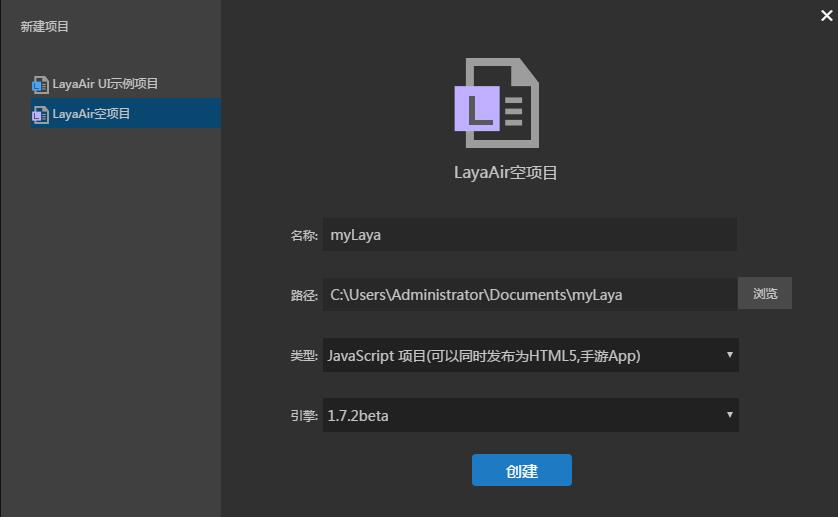

# 创建JS项目并详解目录结构

Layair IDE, IDE '메뉴에서' 새 프로젝트 '기능을 사용합니다.비어있는 항목을 만들 수 있습니다. IDE 는 생성 구조가 뚜렷한 디렉터리 구조를 생성할 수 있습니다. Layair IDE에서 생성된 디렉터리 구조를 소개합니다.


##1, LayairirIDE 프로젝트 만들기

​**단계: 레이어이어이드 열기, 처음 열렸다면 '새 프로젝트' 를 바로 누르기 시작하기 시작하기 시작했습니다.그림 1**

< br / > (그림 1)


​**절차 2: 새 프로젝트 '창구에서 Layaiair 공 항목 만들기**

> 첫 번째 줄`名称`항목 이름 표시
>>
> 두 번째 줄`路径`항목을 저장하는 경로를 표시합니다.
>>
> 세 번째 줄`类型`항목 종류를 선택합니다. Action Script, 자바스크립트, Typescript 항목을 선택하려면 "자바스크립트 프로젝트" 를 선택해야 합니다.
>>
> 제4행`引擎`막대 안에서 엔진 버전을 선택하십시오.안정 버전이나 최신 베타 버전을 선택할 수 있습니다.버전의 구별은 홈페이지의 엔진 버전에서 로그를 다운로드할 수 있다.

< br />

"생성" 을 누르면 IDE 생성 항목 폴더 구조는 다음과 같습니다:

< br / > (그림 3)


##2, 디렉터리 구조 소개

###2.1 프로젝트 프로필 실행 파일 (.laya 폴더)

​`.laya`폴더에 저장된 항목은 개발에 있는 일부 프로필 정보를 개발하고 있습니다.

####2.1.1`.laya/launch.json`파일 설명

　　`launch.json`프로젝트의 디버그 디버그 디버그 디버그 디버그 설정과 chrome 브라우저 디버그 설정을 저장했습니다.쉽게 바꾸지 말고 잘못을 고치면 항목의 디버깅에 영향을 줄 것이다.

　　**`launch.json`중요 속성 설명:**

　　`"name": "layaAir"`레이어이더로 내장된 디버그 방식을 나타낸다.

　　`"name": "chrome调试"`chrome 브라우저로 디버깅을 하다.

　　`"file": "${workspaceRoot}/bin/index.html"`프로젝트를 실행하는 입구 파일 경로 표시합니다.

　　`"runtimeExecutable": "C:/Program Files (x86)/Google/Chrome/Application/chrome.exe"`chrome 브라우저 경로를 나타내며 개발자는 자신의 필요에 따라 이 경로를 설정한다.

　　`"userDataDir": "${tmpdir}"`chrome 디버깅 캐시 디렉터리를 표시합니다. 기본 사용자의 임시 디렉터리로 설정을 변경할 수 있습니다. 예를 들어 현재 항목 루트 디렉터리에 설정된 cache 디렉토리:`"userDataDir": "${workspaceRoot}/cache"`.

####2, 1, 2.`.laya/tasks.json`파일 설명

　　`tasks.json`TS 번역기 관련 일부 프로필 정보가 저장되어 있으며, 인자에 대한 의미는 Typescript 홈페이지에 접근할 수 있습니다.


그림의 랜치.json 문제는 개발자가 닿을 수 있다.이 문제에 부딪히면 코nfigurations의 URL 경로가 문제가 있는지 검사해야 합니다.만약 '/' 경로자 '' 으로 바꾸어야 합니다.


### 

###2.2 항목의 출력 디렉터리 (bin)

​`bin`디렉토리에 저장된 것은 현재 항목의 출력 파일, 그림 4.

​`bin/index.html`프로젝트의 입구 파일입니다. 모든 Layaia 엔진 라이브러리나 제3부 라이브러리의 JS 는 여기에 도입해야 합니다.

​*Tips:index.html 속 script 주석은 각 라이브러리의 관련 기능을 주석하고 개발자는 항목에 따라 라이브러리를 삭제하고 항목 발표 버튼을 누르면 index.html 안에 있는 js 파일을 압축시켜 네트워크 전송을 줄일 수 있습니다.제3부 라이브러리를 인용한다면, 레이야아 엔진 라이브러리를 인용하기 전에.*

​`bin/libs`폴더는 Layair 엔진 각 모듈의 JS 파일을 저장하고 있으며, 그림 4개 항목 중 어떤 모듈을 사용하면 index.html 참조 모듈 JS 파일이 필요합니다.

< br / > (그림 4)

**여기는 Layair 엔진 모듈의 주요 부분을 소개합니다:**

　　`laya.core.js `핵심 패키지, 디스플레이, 이벤트, 시간 관리, 시간축 애니메이션, 느릿느릿, 메시지 교호, socket, 로컬 메모리, 마우스 터치, 소리, 가재, 색상 필터, 비디오 글꼴 등이다.

　　`laya.webgl.js`webgl 렌더라인을 재봉했습니다. Webgl 렌더를 사용하면 초기화 시 호출 가능합니다`Laya.init(1136,640,laya.webgl.WebGL);` 

　　`laya.ani.js`애니메이션 모듈, swf 애니메이션, 골격 애니메이션 등이 포함되어 있다.

　　`laya.filter.js`더 많은 webgl 필터 포함, 예를 들면 외부 발광, 음영, 모호하고 더 많습니다.

　　`laya.html.js`html 동적 조판 기능을 봉쇄했다.

　　`laya.ui.js`UI 의 다양한 구성 요소를 제공했습니다.

　　`laya.tilemap.js`tileMap 해상 지원을 제공합니다.


###2.3 UI 프로젝트 디렉터리 (laya)

예.`laya`"LayairIDE 현재 UI 프로젝트를 저장하는 데 사용됩니다.

예.`laya/assets`"UI 페이지, 입자 등 구성 요소에 필요한 그림 자원을 저장합니다.

예.`laya/pages`LayairierIDE 페이지 레이아웃을 생성하는 파일을 저장하기 위해 디렉터리에 저장합니다.

예.`laya/.laya`"파일은 LayairIDE UI 프로젝트 프로필 파일입니다.


###2.4`.d.ts`코드 파일 디렉터리 제공 (libs)


 `libs`디렉토리 아래에는 layair 엔진 Layaiaiair.d.ts 파일입니다.이 디렉터리를 사용하면 디렉터리에 세 개의 라이브러리를 사용합니다.


###2.5 프로젝트 코드 디렉터리 (src)

프로젝트 코드 파일은 기본적으로 src 디렉토리에 보관합니다.


 


###2.6 프로젝트 프로필

​`项目名.laya`프로젝트 프로필입니다. 현재 프로젝트의 항목 명칭, 사용된 라이브러리 번호와 프로젝트 형식을 파일에 기록했습니다.


```json

{"proName":"studyLayaAirJS","version":"1.5.5","proType":2}
```

​`tsconfig.json`파일은 ts 프로필 파일이니 삭제하지 마세요.