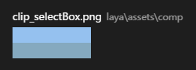
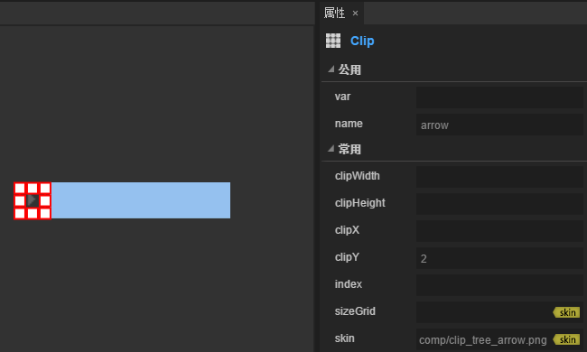
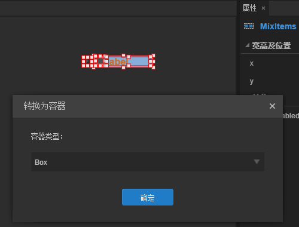

# Tree 组件参考


##하나, LayairIDE를 통해 Tree 구성 요소 만들기

트리 구성 요소는 나무의 구조를 나타내는 데 사용합니다.사용자는 확장할 수 있는 트리의 차원 구조 데이터를 볼 수 있다.
Tree 구성 요소의 스크립트 인터페이스 참고해주세요.[Tree API](http://layaair.ldc.layabox.com/api/index.html?category=Core&class=laya.ui.Tree).


 


###1.1 Tree 구성 요소는 주로 두 부분으로 구성되어 있습니다:

##- 항목 목록 (Box, 페이지 View, 사용자 정의 페이지);세로 스크롤 VScrollbar;


###1.2 Tree 구성 요소의 단원격은 보통 4부분으로 구성됩니다:

##- 단원격 선택 상태 토글 애니메이션 Clip;접는 화살표 애니메이션 Clip;
##- 파일 상태 토글 애니메이션 Clip;단원격 기타 내용 요소;


###1.3 Tree 구성의 그림 자원 예제

1. 단원격 상태 토글 애니메이션 Clip 자원:
절편 숫자는 2, 절편 색인이 0 부터 순차적으로 대표된다: 단원격은 선택되지 않은 상태도, 단원격 선택이나 현정정지 상태도이다.
​< br >>
(도)
2. 접는 화살표 토글 애니메이션 Clip 자원:
슬라이드 숫자는 2, 슬라이드 인덱스 (0) 부터 순차적으로 대표: 폴더 노드 접기 상태도, 폴더 노드 노드 노드 (폴더 노드)
​< br >>
(도)
3. 파일 상태 토글 애니메이션 Clip 자원:
슬라이딩이 3이라면 슬라이드 인덱스는 0 부터 순차적으로 대표한다: 폴더 노드 접기 상태 그림, 폴더 노드 노드 전개 상태 그림, 비폴더 노드 상태
재킷 숫자가 2면 슬라이드 인덱스는 0 부터 순차적으로 대표한다: 폴더 노드 상태도 비폴더 노드 상태
​< br >>
(도)


###1.4 Tree 구성 요소 만들기


 ####1. Tree 구성 요소의 목록을 편집합니다.

목록 항목은 Box 형식, View (페이지) 타입이나 사용자 정의 페이지 종류입니다.여기에서 박스 형식을 예로 합니다.
a. 자원 판넬에서 단일 요소 선택 상태를 선택한 토글 애니메이션 (Clip 구성 요소) 을 설정하는 name 속성 값은 selectbox, 속성 clipY 값을 2.
   *주의: 이 곳에서 선택한 상태 토글 애니메이션 (Clip 구성 요소) 의 name 속성값은 selectbox 를 설정해야 그것을 인식할 수 있으며, 이 Clip 구성 요소 대상의 디스플레이 상태는 단원 항목의 선택에 따라 변한 기능을 수행할 수 있습니다. 그렇지 않으면 이 단원항의 일반 디스플레이 대상을 인식할 수 있습니다.*

​< br >>
(도)


b. 자원 판넬에서 단원격자를 끌어당기는 화살표 토글 애니메이션 (Clip 구성 요소) 을 설정하는 name 속성 값은 arrow, 속성 clipY 값을 2.
   *주의: 이 곳에서 접는 화살표 토글 애니메이션 (Clip 구성 요소) name 속성값은 아로우로 설정되어야 합니다. 이 프로그램만이 그것을 인식할 수 있으며, 이 Clip 대상이 열거나 접는 노드를 누르는 기능을 실현합니다.그렇지 않으면 이 Clip 대상은 이 단원 항목의 일반 디스플레이 대상으로 인식된다.*
​< br >>
(도)
c. 자원 판넬에서 단일자 형식의 파일 상태를 끌어당기기 (Clip 구성 요소), 이 Clip 구성 요소를 설정하는 name 속성값은 folder, 속성 clipY 값을 3;
   *주의: 여기에 있는 파일 상태 토글 애니메이션 (Clip 구성 요소) name 속성값은 folder, 이 프로그램에서만 인식할 수 있으며, 이 Clip 구성 요소의 디스플레이 상태는 단원 항목의 접기, 전개, 노드 종류 (글자 노드) 에 따라 변경된 기능을 설정해야 합니다.그렇지 않으면 이 Clip 대상은 이 단원 항목의 일반 디스플레이 대상으로 인식된다.*
​< br >>
(도)

d. 이 단원 항목을 끌어오는 일반 디스플레이 대상입니다.
이 곳에서 Label 형식으로 자원 패널에서 Label 구성 요소를 선택하고, 이 곳에서 Label 상대에 속성 name 값을 label 설정하기 위해 스크립트에서 부합하기 편리하고, 이 name 속성 값을 자정할 수 있습니다.Label 대상에 대한 속성을 보여 더 아름답게 보이게 한다.


​        < br >>
(도)
e. 이상 편집된 모든 구성 요소 대상, 단축키 Ctrl + B 또는 선택 * * 메뉴 표시줄 - > 편집기 ***옵션, 용기 설정 판넬로 전환하고 용기 종류를 박스로 선택하고, 단추를 누르면 박스 용기의 추가를 완성합니다.****
​< br >>
​    （图）

​

####2. Tree 용기로 전환한다.
****목록 보카시 대상 선택, 단축키 Ctrl + B 또는 선택**메뉴 표시줄-> 편집-> 용기 *** 설정으로 전환하고 용기 설정을 열 때 용기 형식을 Tree 형식으로 누르고 Tree 용기 용기 용기의 추가를 누르십시오.
​< br >>
(도)

####3. Tree 구성 요소의 목록을 지정합니다.
Tree 구성 대상을 쌍으로 누르고, Tree 대상 내부에서 편집을 진행하고, Tree 구성의 목록을 설정하는 속성 name 값은 render 입니다.
   *주의: 이 목록 보카시 속성 name 의 값은 render, 그렇지 않으면 프로그램이 인식할 수 없습니다.*

   ​        < br >>
(도)

####4. Tree 구성 요소에 롤러를 추가합니다.
자원 패널에서 VScrollbar 구성 요소를 선택하여 VScrollbar 구성된 자원 주소 (skin 속성값) 을 Tree 구성 요소 속성 scrollbarSkin 값으로 설정합니다.
​< br >>
(도)

####5. Tree 너비 조절.
Tree 대상의 속성 var (전역 인용명) 의 값은 mu tree, 이 이름을 사용자로 정의할 수 있습니다. 스크립트에서 Tree 구성 요소 구성 요소를 설정합니다.
​< br >>
(도)

####6. 코드에 Tree 대상 부과를 준다


```javascript

var xmlString = "<data>"+
                        "<dir label='box1' isOpen='true'>"+
                            "<file label='child1 ' isOpen='true'/>"+
                            "<file label='child2 ' isOpen='true'/>"+
                            "<file label='child3 ' isOpen='true'/>"+
                            "<file label='child4 ' isOpen='true'/>"+
                            "<file label='child5 ' isOpen='true'/>"+
                        "</dir>"+
                        "<dir label='box2' isOpen='true'>"+
                            "<file label='child1 ' isOpen='true'/>"+
                            "<file label='child2 ' isOpen='true'/>"+
                            "<file label='child3 ' isOpen='true'/>"+
                            "<file label='child4 ' isOpen='true'/>"+
                            "<file label='child5 ' isOpen='true'/>"+
                        "</dir>"+
  					"</data>";
//解析xml字符。 
var xml = domParser.parseFromString(xmlString, "text/xml");
//设置 m_tree 的数据源。
m_tree.xml =xml;
```

####7. 프로그램에서 모니터링을 실행합니다.


​           < br >>
(도)

###1.5 Tree 구성 속성

​< br >>
(도)

124대**속성**124대**기능 설명**124대
--------------------------------------------------------------------------------------------------------------------------------------------------------------------------------------------
스크롤바스킨 124스킨.124대
1.124타오 사이의 간격.단위는 픽셀이다.124대
124테네스paceft단위는 픽셀이다.124대


##둘째, 코드 로 Tree 구성 요소 만들기

우리가 작성 코드를 쓸 때, 코드 제어 UI, UI, u Tree 종류를 만들 수 없습니다`laya.ui.Tree`가방은 코드를 통해 Tree 관련 속성을 설정합니다.

**실행 실례 효과:**

​	< br >>
(그림 5) 코드를 통해 Tree 만들기

Tree 의 다른 속성 도 코드 를 통해 설치 할 수 있 고, 다음 사례 코드 코드 를 통해 어떻게 다른 피부 (스타일)의 Tree

흥미가 있는 독자들은 자신이 코드 설정을 통해 Tree 를 설정하고 필요한 폴더를 만들 수 있다.

**예시 코드:**


```javascript

(function()
{

     var Box = Laya.Box;
     var Clip = Laya.Clip;
     var Label = Laya.Label;
     var Utils = Laya.Utils;
     // 此类对应的json对象：
     // {"child": [{"type": "Clip", "props": {"x": "13", "y": "0", "left": "12", "height": "24", "name": "selectBox", "skin": "ui/clip_selectBox.png", "right": "0", "clipY": "2"}}, {"type": "Clip", "props": {"y": "4", "x": "14", "name": "folder", "clipX": "1", "skin": "ui/clip_tree_folder.png", "clipY": "3"}}, {"type": "Label", "props": {"y": "1", "text": "treeItem", "width": "150", "left": "33", "height": "22", "name": "label", "color": "#ffff00", "right": "0", "x": "33"}}, {"type": "Clip", "props": {"x": "0", "name": "arrow", "y": "5", "skin": "ui/clip_tree_arrow.png", "clipY": "2"}}], "type": "Box", "props": {"name": "render", "right": "0", "left": "0"}};
     function Item()
     {
          Item.__super.call(this);

          this.right = 0;
          this.left = 0;

          var selectBox = new Clip("../../res/ui/tree/clip_selectBox.png", 1, 2);
          selectBox.name = "selectBox"; //设置 selectBox 的name 为“selectBox”时，将被识别为树结构的项的背景。2帧：悬停时背景、选中时背景。  
          selectBox.height = 32;
          selectBox.x = 13;
          selectBox.left = 12;
          this.addChild(selectBox);

          var folder = new Clip("../../res/ui/tree/clip_tree_folder.png", 1, 3);
          folder.name = "folder"; //设置 folder 的name 为“folder”时，将被识别为树结构的文件夹开启状态图表。2帧：折叠状态、打开状态。
          folder.x = 14;
          folder.y = 4;
          this.addChild(folder);

          var label = new Label("treeItem");
          label.name = "label"; //设置 label 的name 为“label”时，此值将用于树结构数据赋值。
          label.fontSize = 20;
          label.color = "#FFFFFF";
          label.padding = "6,0,0,13";
          label.width = 150;
          label.height = 30;
          label.x = 33;
          label.y = 1;
          label.left = 33;
          label.right = 0;
          this.addChild(label);

          var arrow = new Clip("../../res/ui/tree/clip_tree_arrow.png", 1, 2);
          arrow.name = "arrow"; //设置 arrow 的name 为“arrow”时，将被识别为树结构的文件夹开启状态图表。2帧：折叠状态、打开状态。
          arrow.x = 0;
          arrow.y = 5;
          this.addChild(arrow);
     }
     Laya.class(Item, "Item", Box);


     var Stage = Laya.Stage;
     var Tree = Laya.Tree;
     var Browser = Laya.Browser;
     var Handler = Laya.Handler;
     var WebGL = Laya.WebGL;

     (function()
     {
          // 不支持WebGL时自动切换至Canvas
          Laya.init(550, 400, WebGL);

          Laya.stage.alignV = Stage.ALIGN_MIDDLE;
          Laya.stage.alignH = Stage.ALIGN_CENTER;

          Laya.stage.scaleMode = Stage.SCALE_SHOWALL;
          Laya.stage.bgColor = "#232628";

          var res = [
               "../../res/ui/vscroll.png",
               "../../res/ui/vscroll$bar.png",
               "../../res/ui/vscroll$down.png",
               "../../res/ui/vscroll$up.png",
               "../../res/ui/tree/clip_selectBox.png",
               "../../res/ui/tree/clip_tree_folder.png",
               "../../res/ui/tree/clip_tree_arrow.png"
          ];

          Laya.loader.load(res, new Handler(this, onLoadComplete));
     })();


     function onLoadComplete()
     {
          // 组装tree的数据
          var treeData = "<data>";
          for (var i = 0; i < 5; ++i)
          {
               treeData += "<item label='Directory " + (i + 1) + "' isOpen='true'>";
               for (var j = 0; j < 5; ++j)
               {
                    treeData += "<leaf label='File " + (j + 1) + "'/>";
               }
               treeData += "</item>";
          }
          treeData += "</data>";
          // 解析tree的数据
          var xml = Utils.parseXMLFromString(treeData);

          var tree = new Tree();
          tree.scrollBarSkin = "../../res/ui/vscroll.png";
          tree.itemRender = Item;
          tree.xml = xml;
          tree.size(300, 300);
          tree.x = (Laya.stage.width - tree.width) / 2;
          tree.y = (Laya.stage.height - tree.height) / 2;
          Laya.stage.addChild(tree);
     }
})();
```


 