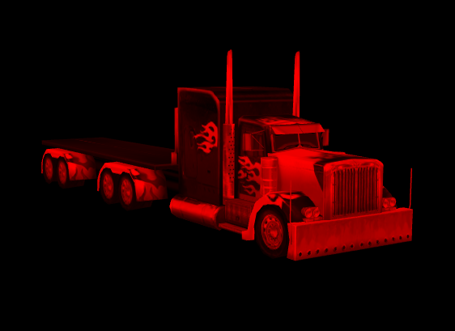

#Layaiar3D 소재 개요

###재질 개술

소재는 물체의 소재감.예를 들면 나무, 금속, 유리, 모발, 물 등, 그들의 거친 도량, 광택도, 반사, 투명, 색깔, 무늬 등 소재 속성이 다르다.

대부분의 3D 엔진 중에는 독립적인 소재가 프로그램 코드 제어에 쓰여 3차원 제작 소프트웨어의 재질처리도 가장 중요한 부분이다.게임 미술 개발자들은 항상 3D 게임 장면에서 3점 모델, 7점 소재.

소재의 종류도 많아 3차원 제작 소프트웨어에 표준 소재, 다차원 소재, 합성 소재, 양면 소재, 광선 추적 소재 등이 있다.Layaiar3D 엔진에서 현재 주요 지지하는 재질 StandardMatrial.


###표준 재질 만들기

코드에 있는 모형이 재질이 없다면 3D 보기에서 모형의 무늬, 질감 등을 표시할 수 없을 정도로 기본적으로 순백색이다.

'3D의 여행'과정을 빠른 속도로 개설한 코드에서 표준 소재를 만들었고, 만반사 스티커에 무늬 그림을 추가해 모형에 부여했다.


```typescript

//创建标准材质
var material:Laya.StandardMaterial = new Laya.StandardMaterial();
//创建漫反射二维纹理贴图
material.diffuseTexture = Laya.Texture2D.load("res/layabox.png");
//为box模型赋材质
box.meshRender.material = material;
```


물론 이것은 단순한 용법일 뿐, 우리는 당분간 가장 중요한 만반사 스티커만 운용할 뿐, 개발자는 재질의 빛과 스티커 속성을 알아야 한다.


###재질의 가재

"Layaiar3D의 모형"이라는 문서에서 모형 격격격격과 재질 두 부분을 포함해 ls, lh 데이터를 가재할 때 자동으로 모형이 적용되는 소재를 가재했다.

최신 엔진 버전에서 모형 격격격과 재질이 분리되어 유닛이 플러그인을 내보내는 도구는 재질과 내보내지 않는 lm 모형 파일을 바인딩했다.따라서 Lm 형식 자원을 가재할 경우 재재재구성을 완료할 수 있으며, 그렇지 않으면 백모만 나타낸다.

이때 내보내기 후 생기는 lmat 소재 파일을 사용하여 표준 소재를 가재해 모형에 부여해 모형과 유사하다.


```typescript

//异步加载材质文件创建标准材质（也可以预加载）
var material:Laya.StandardMaterial = Laya.StandardMaterial.load("truck/Assets/Materials/t0200.lmat");
//为box模型赋材质
box.meshRender.material = material;
```


###가재된 모형에서 재질 가져오기

위에 있는 예를 들어 표준 소재를 만들었지만 실제 항목 운용에서 모형 부품을 주는 방식으로 직접 3D 소프트웨어를 만들거나 유닛에 재질 창출한 후 리야아 형식을 사용하여 사용하지 않습니다.

사용시 엔진은 자동으로 모형에 재질 을 가재할 수 있으며, 여러 모형에 여러 가지 표준 소재가 생길 수 있으며 자동적인 방식으로 개발 시간을 절약한다.그러나 이런 상황에서 우리가 변화하고 재질 교체가 필요하다면 어떻게 하지?우선 모형에서 현재 소재를 가져야 합니다.

Layaiair 3D 엔진은 네일 칸 렌더와 복피 애니메이션 샘플렉터 SkinedMershRender, 시시시모형에 대한 실례를 제공해 모형 소재를 얻을 수 있습니다.

Tips: Misprite3D 모형에서 메쉬렌더로 SkinedMesprite3D 모형에서 SkinedMeshRender.

가져오는 재질은 두 종류, 한 가지 소재 마리엘, 자체 소재가 수정되면 자체 모델에 따라 달라진다. 일종은 공유 소재 SharedMaterial. 소재가 상대적으로 독립되어 여러 모형이 같은 소재를 사용할 수 있기 때문에, 공유 소재를 공유하고 수정하면, 자체 모델이 달라진다. 다른 모델은 이 소재로 사용된다.질의 부분도 달라진다.이에 따라 개발자들은 상황에 따라 선택해야 한다.


###자체 재질 수정하기


```typescript

......
//加载导出的卡车模型
this.role3D = Laya.Sprite3D.load("LayaScene_truck/truck.lh");
//模型与材质加载完成监听与回调
this.role3D.on(Laya.Event.HIERARCHY_LOADED,this,this.onLoadComplete);
this.scene.addChild(this.role3D);
//模型与材质加载完成后回调
private onLoadComplete():void{
  //获取车身模型（查看.lh文件，模型中两个对象，车头“head”与车身“body”，它们都用同一个材质）
  var meshSprite3D:Laya.MeshSprite3D = this.role3D.getChildAt(0).getChildAt(0) as Laya.MeshSprite3D;
  //从模型上获取自身材质
  var material:Laya.StandardMaterial = meshSprite3D.meshRender.material as Laya.StandardMaterial;
  //修改材质的反射颜色，让模型偏红
  material.albedo = new Laya.Vector4(1,0,1,1);
}
```


번역 후 다음과 같이 차체와 선두모형은 같은 소재를 썼지만 차체의 소재만 고쳤고 선두에 영향을 주지 않는다.

(图1)</br>


###공유 재질 수정하기


```typescript

//加载导出的卡车模型
this.role3D = Laya.Sprite3D.load("LayaScene_truck/truck.lh");
//模型与材质加载完成监听与回调
this.role3D.on(Laya.Event.HIERARCHY_LOADED,this,this.onLoadComplete);
this.scene.addChild(this.role3D);
//模型与材质加载完成后回调
private onLoadComplete():void{
  //获取车身模型（查看.lh文件，模型中两个对象，车头“head”与车身“body”，它们都用同一个材质）
  var meshSprite3D:Laya.MeshSprite3D = this.role3D.getChildAt(0).getChildAt(0) as Laya.MeshSprite3D;
  //从模型上获取共享材质
  var shareMaterial:Laya.StandardMaterial = meshSprite3D.meshRender.shareMaterial as Laya.StandardMaterial;
  //修改材质的反射颜色，让模型偏红
  shareMaterial.albedo = new Laya.Vector4(1,0,0,1);
}
```


번역 효과가 아래와 같이 공유 소재를 수정한 후, 차머리와 차체 모델이 모두 사용되었기 때문에 그들의 소재가 달라졌다(2)

(图2)</br>


###재질 목록 가져오기

3D 제작 소프트웨어 중에는 여러 가지 소재가 있는 경우가 많기 때문에 다차원 소재라고 부른다.그러나 도구 내보내기 데이터를 다운로드한 후 엔진은 자동으로 모형으로 만든 재질 목록 리스트 materials 또는 sharedmaterials 때문에 재질을 수정할 때 for 순환 또는 귀환 방식으로 진행할 수 있다.

다음 코드 는 모델 또는 모형 용기 대상 을 취득해 재질 을 수정 하는 방법 을 제공 해 모든 장면 대상 을 직접 재질 수정 했 다.


```typescript

......
//加载场景
this.scene = Laya.Scene.load("LayaScene_loveScene/loveScene.ls");
Laya.stage.addChild(this.scene);
//场景模型与材质加载完成监听与回调
this.scene.on(Laya.Event.HIERARCHY_LOADED,this,function():void{
	this.setModelMaterial(this.scene);
});
//修改模型材质(场景或模型)
private setModelMaterial(model:any):void{
  //如果是模型网格显示对象
  if(model instanceof Laya.MeshSprite3D){
  //获取模型网格对象
  var meshSprite3D:Laya.MeshSprite3D = model as Laya.MeshSprite3D;
  //获取材质列表数组
  var materials:Array<any> = meshSprite3D.meshRender.materials;
  //对模型网格中的所有材质进行修改
  for(var m:number = 0;m < materials.length;m++){
  //获取共享材质
  var mat:Laya.StandardMaterial = materials[m] as Laya.StandardMaterial;
  //修改材质反射颜色
  mat.albedo = new Laya.Vector4(0.5,0.5,1,1);
  }
  }
  //如果是蒙皮模型网格显示对象
  if(model instanceof Laya.SkinnedMeshSprite3D){
  //获取蒙皮模型网格显示对象
  var skinnedMeshSprite3D:Laya.SkinnedMeshSprite3D = model as Laya.SkinnedMeshSprite3D;
  //获取材质列表数组
  var materials1:Array<any> = skinnedMeshSprite3D.skinnedMeshRender.materials;
  //对蒙皮模型网格中的所有材质进行修改
  for(var n:number = 0;n < materials1.length;n++){
  //获取共享材质
  var mat1:Laya.StandardMaterial = materials1[n] as Laya.StandardMaterial;
  //修改材质反射颜色
  mat1.albedo = new Laya.Vector4(0.5,0.5,1,1);
  }
  }
  //递归方法获取子对象
  for(var i:number = 0;i < model._childs.length;i++){
  	this.setModelMaterial(model._childs[i]);
  }
}
```


번역 후 효과는 아래와 같다.

(2)</br>>