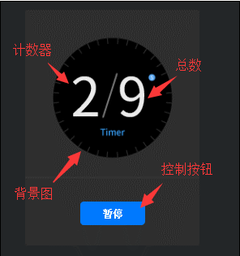

#Clip 구성 요소 참조


##하나, LayairirIDE를 통해 Clip 구성 요소 만들기

###1.1 Clip 만들기
Clip 구성 요소는 비트맵 필름 애니메이션에 사용할 수 있습니다.Clip 은 가로 분리된 수량 clipX, 세로 분리 수량 clipy, 가로 분할할 수 있는 크기의 clipwidth, 세로 분할할 수 있는 크기의 clipHeight, 왼쪽으로 오른쪽으로 오른쪽으로 오른쪽으로, 아래로 분할 할 수 있습니다.

Clip 구성 요소는 슬라이스 애니메이션과 스크립트 애니메이션 을 보여 주는 한 프레임 그림입니다.
자원 패널에 있는 Clip 구성 요소를 누르면 페이지 편집 영역에 끌려 Tab 구성 요소를 페이지에 추가할 수 있습니다.
Clip 스크립트 인터페이스 참조[Clip API](http://layaair.ldc.layabox.com/api/index.html?category=Core&class=laya.ui.Clip)

Clip 구성 요소의 자원 예제:

​< br >>
(그림 1)

clipX 속성의 값을 10 후 디스플레이 효과:

​< br >>
(2)

index 속성의 값을 1 후 표시 효과:

​< br >>
(그림 3)

###1.2 Clip 구성의 상용 속성

​< br >>
(그림 4)

124대**속성**124대**기능 설명**124대
------------------------------------------------------------------------------------------------------------------------------------------------------------------------------------------
현재 커뮤니티 애니메이션 자동으로 재생 여부를 표시합니다.124대
사진 자원을 가로 분할할 때 각 부분의 넓이가 있다.124대
124사 클리pHeet 124테가 사진을 분할할 때, 각 절단의 높이입니다.124대
124대 clipX 124대 가로획 사진 자원을 분할할 때, 넓게 절단하는 몫이다.124대
사진 자원을 124테로 분할할 때 높은 절단된 몫.124대
현재 애니메이션 프레임 인덱스124대
124테르val (124타) 커뮤니티 애니메이션 시간 간격.124대
테크릭 (구글) 의 유효한 인터넷 네티즌 데이터 (구궁 칸 데이터) 다.124대
124사 스킨은 선항소 버튼124대


##둘째, 코드 로 Clip 구성 요소 만들기

우리가 쓴 코드를 쓸 때, 코드 제어 UI, 생성할 수 없다`UI_Clip`클래스를 통해 Clip 관련 속성을 설정합니다.

**실행 실례 효과:**

​	<br/>

(그림 5) 코드를 통해 카운터 만들기

​< br >>
(그림 6)

Clip 의 다른 속성도 코드 를 통해 설정할 수 있으며, 이 같은 예례는 시간기 를 통해 1초당 clip.clipX 절편을 갱신하고, 1초당 숫자를 업데이트하는 디자이너 기능을 통해 흥미가 있는 독자들은 코드 설정을 통해 Clip 을 만들어 자기 프로젝트에 맞게 필요한 Clip 을 만들 수 있다.

**예시 코드:**


```typescript

module laya {
    import Stage = Laya.Stage;
    import Button = Laya.Button;
    import Clip = Laya.Clip;
    import Image = Laya.Image;
    import Handler = Laya.Handler;
    import WebGL = Laya.WebGL;

    export class UI_Clip {
        private buttonSkin: string = "res/ui/button-7.png";
        private clipSkin: string = "res/ui/num0-9.png";
        private bgSkin: string = "res/ui/coutDown.png";

        private counter: Clip;
        private currFrame: number;
        private controller: Button;

        constructor() {
            // 不支持WebGL时自动切换至Canvas
            Laya.init(800, 600, WebGL);

            Laya.stage.alignV = Stage.ALIGN_MIDDLE;
            Laya.stage.alignH = Stage.ALIGN_CENTER;

            Laya.stage.scaleMode = Stage.SCALE_SHOWALL;
            Laya.stage.bgColor = "#232628";
			//预加载资源
            Laya.loader.load([this.buttonSkin, this.clipSkin, this.bgSkin], Laya.Handler.create(this, this.onSkinLoaded));
        }

        private onSkinLoaded(): void {
            this.showBg();
            this.createTimerAnimation();
            this.showTotalSeconds();
            this.createController();
        }

        private showBg(): void {
            var bg: Image = new Image(this.bgSkin);
            bg.size(224, 302);
            bg.pos(Laya.stage.width - bg.width >> 1, Laya.stage.height - bg.height >> 1);
            Laya.stage.addChild(bg);
        }

        private createTimerAnimation(): void {
            this.counter = new Clip(this.clipSkin, 10, 1);
            this.counter.autoPlay = true;
            this.counter.interval = 1000;

            this.counter.x = (Laya.stage.width - this.counter.width) / 2 - 35;
            this.counter.y = (Laya.stage.height - this.counter.height) / 2 - 40;

            Laya.stage.addChild(this.counter);
        }

        private showTotalSeconds(): void {
            var clip: Clip = new Clip(this.clipSkin, 10, 1);
            clip.index = clip.clipX - 1;
            clip.pos(this.counter.x + 60, this.counter.y);
            Laya.stage.addChild(clip);
        }

        private createController(): void {
            this.controller = new Button(this.buttonSkin, "暂停");
            this.controller.labelBold = true;
            this.controller.labelColors = "#FFFFFF,#FFFFFF,#FFFFFF,#FFFFFF";
            this.controller.size(84, 30);

            this.controller.on('click', this, this.onClipSwitchState);

            this.controller.x = (Laya.stage.width - this.controller.width) / 2;
            this.controller.y = (Laya.stage.height - this.controller.height) / 2 + 110;
            Laya.stage.addChild(this.controller);
        }

        private onClipSwitchState(): void {
            if (this.counter.isPlaying) {
                this.counter.stop();
                this.currFrame = this.counter.index;
                this.controller.label = "播放";
            }
            else {
                this.counter.play();
                this.counter.index = this.currFrame;
                this.controller.label = "暂停";
            }
        }
    }
}
new laya.UI_Clip();
```


 