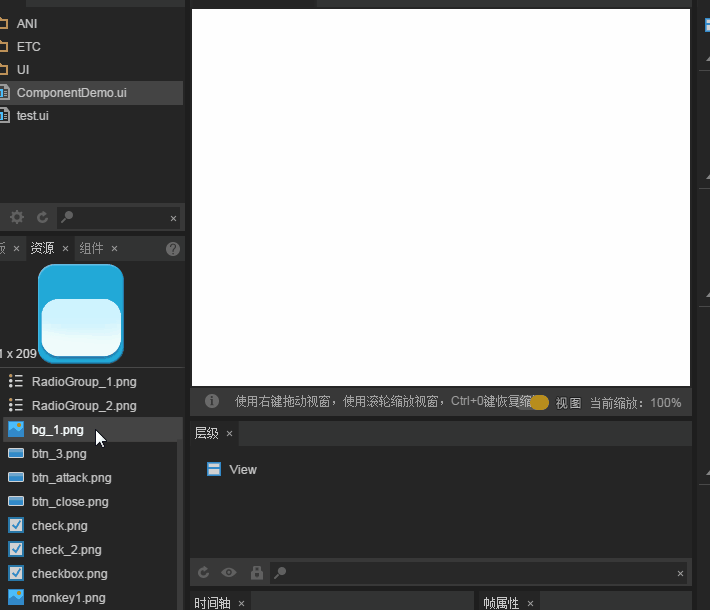

#Viewstack 구성 요소 설명

>> 많은 구성 속성은 통용적이기 때문에 상용 및 통용 구성 요소 속성이 있습니다.`属性设置器`문서 중 이미 소개되었습니다.본 내용을 읽기 전에 우선 속성 설정기를 읽으십시오.또 이 편에는 Tab 구성 요소 지식을 포함해 Tab 구성 요소 상세한 문서를 읽어 보세요.

##1, Viewstack 구성 요소 알아보기

###1.1 Viewstack 구성 요소의 역할

Viewstack 구성 요소는 대부분 페이지 보기 전환에 사용됩니다.여러 개의 키의 페이지를 포함하지만 기본값은 한 개만 표시할 수 있으며, 서브 페이지 색인으로 전환할 수 있습니다.일반적인 상황은 Tab 라벨 조합으로 탭을 만들어 페이지를 바꾸어 줍니다.동도 1개.

< br / > (동영상 1)

###1.2 Viewstack 구성 요소 자원 (skin) 규범

Viewstack 구성 요소는 통과입니다.`Ctrl+B`변환된 용기 종류 구성 요소는 독립된 구성 요소 자원 규범이 없습니다.이 사례에서 직접 사용하는 것은 아이메이지 구성 요소 자원이며 실제 게임 개발에서 실제 개발 수요에 따라 각종 UI 구성 요소를 사용할 수 있다.

###1.3 Viewstack 구성 요소 API 소개

Viewstack 구성 요소의 API 사용은 참고해주세요.[http://layaair.ldc.layabox.com/api/index.html?category=Core&class=laya.ui.ViewStack](http://layaair.ldc.layabox.com/api/index.html?category=Core&class=laya.ui.ViewStack).


##2, LayairID를 통해 Viewstack 구성 요소 만들기

###2.1 Viewstack 페이지 만들기

####2.1 미술자원 준비

페이지 배경도 및 전환된 페이지 미술 자원을 준비해 Layairide 자원 관리자에 대한 항목 디렉터리에 저장합니다.

####2.1.2 페이지 배경 그림 구궁격 설정

상자의 페이지 배경은 일반적으로 구궁 칸을 채택할 수 있습니다. 이곳은 우선 배경의 구궁 칸 속성을 설정합니다.동도 2-1 시범.

< br / > (동영상 2-1)

####2.1.3 페이지 배경 만들기

방금 구궁칸을 설치한 배경도를 장면 편집기에 끌어당겼다.동도 2-2가 제시한 것처럼.

 <br />(动图2-2)


####2.1.4 Viewstack 페이지 만들기

페이지에 관련된 UI 기초 구성 요소를 유i 파일로 끌어당긴다`场景编辑器`그리고 단축키`Ctrl+B`전환`ViewStack`용기 구성 요소.동도 3-1이 제시한 것처럼.

< br / > (동영상 3-1)


####2.1.5 ViewStack 구성 요소를 설정하는 자 페이지name 속성

Viewstack 페이지 name 속성 이름의 이름은 item0, item1, item2....... "이 페이지를 더 이상 추측하면, 이 규칙에 따라 name 속성을 높이지 않고, 생성된 Viewstack 구성 요소는 잘못된 구성으로 실행할 수 없습니다.

< br / > (동영상 3-2)

**Tips**：*name 속성 거기의 문자는 item, 다른 것으로 바꿀 수 없습니다.Viewstack 페이지를 수정한 후 기본값은 item0 이 정상으로 표시됩니다. 그렇지 않으면 Viewstack 구성 요소가 활성화되지 않습니다.*


####2.1.6 페이지의 UI 레이아웃

name 속성을 설정한 후, Viwstack 구성 요소에 투샷을 누르면 우선 페이지의 UI 레이아웃을 조정할 수 있습니다.이 예에서 우리는 각각 페이지에 사용된 자원 크기, 위치를 조정하고, 세 개의 페이지를 정렬시켰다.효과는 3-3의 시사와 같다.


​        < br /> (그림 3-3)


###2.2 Viewstack 페이지 인덱스

Viewstack 구성 요소는 기본값으로 IDem0의 그림을 표시합니다. 기본 색인의 속성 selectedIndIndex 기본값은 0 입니다.selectedIndIndeex 속성치를 조정하여 Viewstack 구성 요소의 기본 표시 페이지를 바꿀 수 있습니다.효과는 동도 4소와 같다.

< br / > (동영상 4)

**Tips**：

**Viewstack 구성 요소의 Var 값을 설정해야 합니다. 편집 코드를 사용할 때 Var 이름의 전역 변수를 통해 Viewstack 구성 요소를 제어하여 selectedIndIndIndIDex 속성을 변경하여 페이지의 전환을 실현합니다.본례에서 사용하는 것은 Viewstack, 동영상 4 오른쪽 좌우에 표시된 것과 같이 개발자도 다른 이름을 찾을 수 있다.**


###2.3 제어용 Tab 태그 만들기

일반적으로 ViewStack 구성 요소는 해당 제어 탭이 필요합니다. Viewstack 페이지 전환을 위한 Tab 태그를 생성합니다.

자원 패널에 있는 Tab 구성 요소를 누르고 UI 페이지로 끌어당기는 장면을 편집기 생성합니다.Tab 구성 요소의 미술자원은 그림 5개와 같이 보여집니다.


​        < br >>
(그림 5)

Tab 구성 요소를 편집기로 끌어당겨 위치와 배경도를 맞추어 맞추어 줍니다.공유 속성 var 를 tab 로 설정하여 프로그램 호출 제어에 사용합니다.상용 속성 labels' 눈사람, 캔, 녹수 '를 설정합니다. 선택한 단추 색인 selectex 0 입니다.다른 속성 중 글꼴 크기, 굵기, 글꼴 상태 등을 설정합니다.

그림 여섯 개 표시 효과 보이기:

​< br >>
(그림 6)


##3, 코드 제어 Viewstack 구성 요소 전환 디스플레이

위에서 몇몇 제작 절차에서 IDE 구성 요소를 작성하고 그룹을 만들었습니다. 다음은 프로그램 코드를 통해 Tab 탭과 ViewStack 쪽 페이지를 바꾸어 연결됩니다.

페이지를 저장하고 F12 게시 페이지에 따라 발표한 후 레이어이메이스.all.ts 파일에서 직접 사용합니다.


ComponentDemo.ts 생성 기본 프로그램을 설정하고, 작성 코드 다음과 같습니다:


```typescript

// 程序入口
class ComponentDemo{
    /**包含tab与viewStack组件的测试页面**/
    private comp:ui.ComponentDemoUI;
    constructor()
    {
        Laya.init(1334,750, Laya.WebGL);
        Laya.stage.scaleMode = "full";
        Laya.stage.bgColor = "#ffffff";
        //加载图集成功后，执行onLoaded回调方法
        Laya.loader.load("res/atlas/comp.atlas",Laya.Handler.create(this,this.onLoaded));
    }
    private onLoaded():void{
        //创建一个UI实例
        this.comp = new ui.ComponentDemoUI();
        //添加到舞台上显示
        Laya.stage.addChild(this.comp);
        //点击Tab选择按钮的处理
        this.comp.tab.selectHandler = new Laya.Handler(this,this.onSelecte);
    }
    /**根据选择tab的索引切换页面**/
    private onSelecte(index:number):void{
        //切换ViewStack子页面
		this.comp.viewStack.selectedIndex=index;
    }
}
new ComponentDemo();
```


실행 실례 코드, 효과는 동도 10개와 같다.

< br / > (동영상 10)